#### 背景
目前我们实现的 raft 算法是单个 group 的，每次客户端过来的写请求，都需要在 leader 上处理并广播给集群中的 follower 节点，这个设计导致了 Leader 节点成为整个系统的瓶颈。

#### 架构

为此，我们接下来将要实现 multi raft




上图是架构，我们将整个集群分成多个 Store 节点，Store 部署在一台独立的机器上，同时我们将 Store 分成了多个 region，每个 region 就是前面已经实现的一个 raft group。我们将用户请求过来的数据按 key 进行 range 分区，这样每个 region 负责单独的一部分数据。

protobuf 中 Region 的定义如下

```
message RegionEpoch {
    // Conf change version, auto increment when add or remove peer
    uint64 conf_ver = 1;
    // Region version, auto increment when split or merge
    uint64 version = 2;
}

message Region {
    uint64 id = 1;
    // Region key range [start_key, end_key).
    bytes start_key = 2;
    bytes end_key = 3;
    RegionEpoch region_epoch = 4;
    repeated Peer peers = 5;
}

message Peer {      
    uint64 id = 1;
    uint64 store_id = 2;
    string addr = 3;
}
```

Region 的定义的关键信息主要有该 region 负责的 key 范围 [start_key, end_key)

存储 region 版本信息的 RegionEpoch 配置版本 conf_ver, 当这个 region 中增加或者删除一个 peer 的时候 conf_ver 会自增，version 则用于在 region 分裂和合并的时候进行自增。

#### split region 细节

主要的思想和 conf change 一样，我们会提交一个 Split Region 的提案到当前 region 对应的 raft group 中。当集群中大多数节点 commit 这个提案之后，我们在 HandleRaftReady 中去 process 实际的 Split 操作。这个操作流程如下

- 检查提案里面消息的 region epoch 和当前的 region 是否一致
- 获取 split_key,  split_key 就是 [start_key, end_key) -> [start_key, split_key), [split_key, end_key)
- 更新 StoreMeta 里面 region 分区信息，这里操作还挺多，主要是 StoreMeta 删除之前的 regionRanges，然后更新老的 region 的 endkey，之后将分裂好的 newRegion 信息以及老的 region 信息插入到 regionRanges 中。
- 将两个 region 的状态信息写到 kvDB 中。
- 调用 createPeer 创建 peer。
- 注册 peer 到路由中，这里注意我们 raft worker 中。
- 启动新的 region。

#### tips

- RaftWorker 处理消息的时候会根据 regionID 取出相应的 peer 对象，构建 peerMsgHandler 处理消息。
- router 里面有个 peers Map，它是并发安全的，用来存储 regionID 到 region peerState 的映射。
- StoreMeta 里面有个 B 树，用来存储 region end key 到 region ID 的映射。
