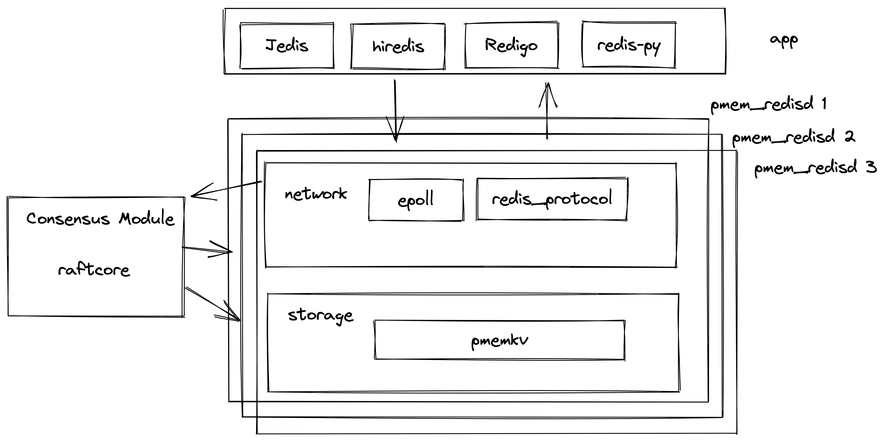

### Overview

Raft is a protocol with which a cluster of nodes can maintain a replicated state machine. The state machine is kept in sync through the use of a replicated log. For more details on Raft, see "In Search of an Understandable Consensus Algorithm" (https://raft.github.io/raft.pdf) by Diego Ongaro and John Ousterhout.


### Features

- Leader election 
- Log replication 
- Log compaction
- Membership changes
- Leadership transfer extension


### Build
```
make image
make build-dev
```

### Run test
```
make test
```

### How to build a kv store with eraft

- example




##### Leader election and log replication


##### Membership changes


#### Code Style
https://google.github.io/styleguide/cppguide.html

#### Join Us on discussions

https://github.com/eraft-io/eraft/discussions

### Scan QR code and follow our Zhihu account


Our webiste
[https://eraft.cn](https://eraft.cn)

### Project

Follow these projects to learn how to build a distributed key value system on Persistent memory device。


#### project 1 Implement a persistent memory kv engine based on pmemkv

#### project 2 Implement a concurrent web server based on epoll and multithreading technology

#### project 3 Implement a distributed consistency protocol : raft algorithm library

#### project 4 Implement a distributed kv storage system based on above project modules.

