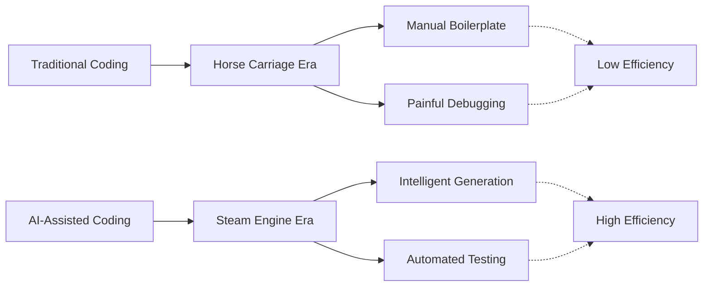

[](https://golang.org/)
[](https://opensource.org/licenses/MIT)

[中文](README_cn.md) | English

# eRaft: A Distributed Sharded KV Storage System

eRaft is a high-performance distributed key-value storage system implemented in Go. It features:
- **Consensus**: Raft algorithm for consistency and high availability.
- **Transport**: gRPC for efficient inter-node and client-server communication.
- **Storage**: RocksDB as the persistent storage engine.
- **Sharding**: Dynamic sharding with a dedicated configuration cluster.

## Installation

See [INSTALL.md](INSTALL.md) for detailed installation and build instructions for macOS and Linux.

## Documentation (Wiki)

Detailed information about the system design and implementation can be found in our project Wiki:
- [Architecture Overview](wiki/Architecture.md)
- [Raft Consensus Implementation](wiki/Raft-Consensus.md)
- [Sharding & Migration Mechanism](wiki/Sharding-Mechanism.md)
- [Storage & RPC Layer](wiki/Storage-and-RPC.md)
- [Benchmark & Performance](wiki/Benchmark.md)

## AI-Powered Development

This project was built with the assistance of AI, representing a paradigm shift in software engineering efficiency:



## Build

For detailed installation instructions, see [INSTALL.md](INSTALL.md).

To build all components, run:
```bash
make build
```
Binaries will be generated in the `output/` directory.

**Note**: eRaft uses RocksDB as the storage engine. Please ensure RocksDB is installed on your system before building. See [INSTALL.md](INSTALL.md) for platform-specific instructions.

## Quick Start Guide

### Step 1: Start the Configuration Cluster (ShardCtrler)

The configuration cluster manages shard assignments. Start 3 nodes:

```bash
# Terminal 1
./output/shardctrlerserver -id 0 -cluster "localhost:50051,localhost:50052,localhost:50053" -db "data/sc0"

# Terminal 2
./output/shardctrlerserver -id 1 -cluster "localhost:50051,localhost:50052,localhost:50053" -db "data/sc1"

# Terminal 3
./output/shardctrlerserver -id 2 -cluster "localhost:50051,localhost:50052,localhost:50053" -db "data/sc2"
```

### Step 2: Start ShardKV Groups

A ShardKV group stores the actual data. We will start two groups (GID 100 and GID 101) to demonstrate sharding.

#### Group 100 (3 nodes):
```bash
# Terminal 4, 5, 6
./output/shardkvserver -id 0 -gid 100 -cluster "localhost:6001,localhost:6002,localhost:6003" -ctrlers "localhost:50051,localhost:50052,localhost:50053" -db "data/skv100_0"
./output/shardkvserver -id 1 -gid 100 -cluster "localhost:6001,localhost:6002,localhost:6003" -ctrlers "localhost:50051,localhost:50052,localhost:50053" -db "data/skv100_1"
./output/shardkvserver -id 2 -gid 100 -cluster "localhost:6001,localhost:6002,localhost:6003" -ctrlers "localhost:50051,localhost:50052,localhost:50053" -db "data/skv100_2"
```

#### Group 101 (3 nodes):
```bash
# Terminal 7, 8, 9
./output/shardkvserver -id 0 -gid 101 -cluster "localhost:7001,localhost:7002,localhost:7003" -ctrlers "localhost:50051,localhost:50052,localhost:50053" -db "data/skv101_0"
./output/shardkvserver -id 1 -gid 101 -cluster "localhost:7001,localhost:7002,localhost:7003" -ctrlers "localhost:50051,localhost:50052,localhost:50053" -db "data/skv101_1"
./output/shardkvserver -id 2 -gid 101 -cluster "localhost:7001,localhost:7002,localhost:7003" -ctrlers "localhost:50051,localhost:50052,localhost:50053" -db "data/skv101_2"
```

### Step 3: Register the ShardKV Groups

Use the `shardctrlerclient` to register both groups to the configuration cluster:

```bash
# Register Group 100
./output/shardctrlerclient join 100=localhost:6001,localhost:6002,localhost:6003

# Register Group 101
./output/shardctrlerclient join 101=localhost:7001,localhost:7002,localhost:7003
```

### Step 4: Data Operations

Now you can read and write data using the `shardkvclient`:

```bash
# Write data
./output/shardkvclient put mykey myvalue

# Read data
./output/shardkvclient get mykey

# Append data
./output/shardkvclient append mykey " extra"

# Run benchmark
./output/shardkvclient bench 1000
```

### Cluster Monitoring

Check the status of all nodes in the cluster:

```bash
# ShardKV status
./output/shardkvclient status

# ShardCtrler status
./output/shardctrlerclient status
```

### Dashboard Visualization

The Dashboard provides a web interface for real-time monitoring of cluster status, topology, and performance metrics.

#### Building the Dashboard

```bash
# Build backend server
make builddashboard

# Build frontend (first time requires dependency installation)
cd dashboard/frontend
npm install  # Pre-configured with Taobao mirror for users in China
npm run build
```

#### Starting the Dashboard

```bash
# Start the Dashboard server (run after completing Steps 1-3)
./output/dashboard-server \
  -port=8080 \
  -config-addrs="localhost:50051,localhost:50052,localhost:50053" \
  -update-interval=5s
```

Then access in your browser: `http://localhost:8080`

The Dashboard provides the following features:
- **Cluster Topology**: Visualize config cluster and shard group node status, roles (Leader/Follower)
- **Shard Status**: Real-time display of each shard's health status, assigned group, and key count
- **Performance Metrics**: Monitor total nodes, healthy nodes, storage capacity, average load, and other key metrics
- **Auto Refresh**: Automatically updates cluster status every 5 seconds
- **Dynamic Discovery**: Automatically queries the latest configuration from ShardCtrler, no manual shard group specification needed

## Shard Migration Process

When you use the `move` command or when the configuration changes (due to `join`/`leave`), the system performs an automatic data migration:

1.  **Config Update**: The `shardctrler` updates the shard-to-group mapping.
2.  **Detection**: Each `shardkv` group leader periodically polls the controller for configuration changes.
3.  **Pulling**: If a group finds it is now responsible for a shard it didn't own before, it switches that shard's status to `Pulling` and starts fetching data from the previous owner.
4.  **Integration**: Once the data is received, it is appended to the new group's Raft log and applied to its LevelDB storage.
5.  **Garbage Collection**: After the migration is confirmed, the new owner notifies the previous owner to delete the stale data (GC), ensuring data consistency and freeing up space.
