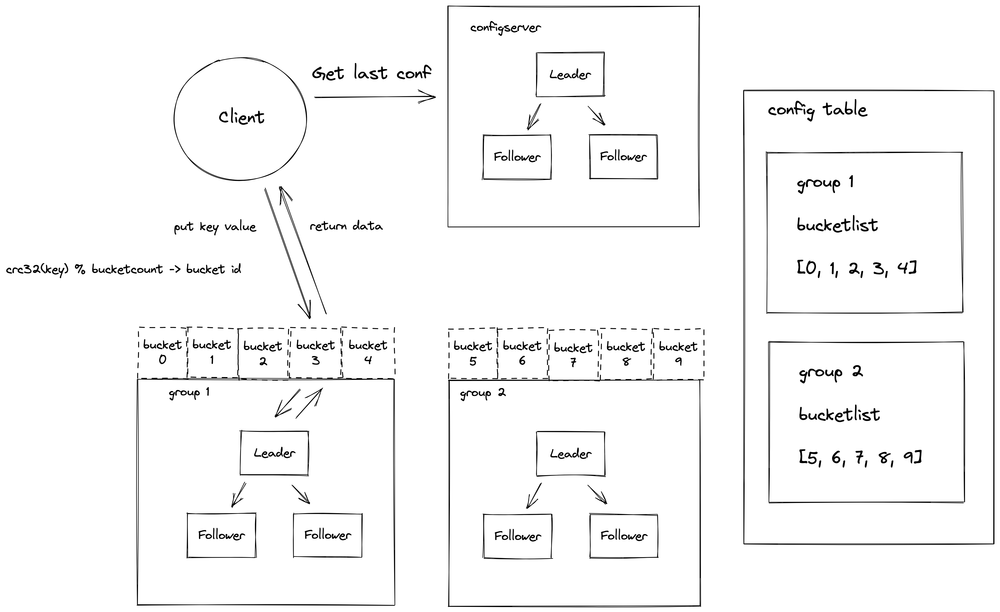

[](https://golang.org/)
[](https://opensource.org/licenses/MIT)

中文 | [English](README_en.md)

### 概述

eraft 项目的是将 mit6.824 lab 大作业工业化成一个分布式存储系统，我们会用全网最简单，直白的语言介绍分布式系统的原理，并带着你设计和实现一个工业化的分布式存储系统。

### 最新的文档
如果你想查看最新的文档，请访问 [eraft 官网](https://eraft.cn)

### 为什么需要分布式?

首先我们看传统的单节点 C/S 或者 B/S 系统有啥缺点：
单节点意味着只用一台机器，机器的性能是有上限的，而且性能越好的机器价格越贵，想 IBM 的大型机，价格是很贵的。同时，这台机器如果挂掉或者因为写的代码有 bug 导致进程异常，就无法容错，系统直接不可用。

我们分析完单节点系统的缺点后，可以总结一下分布式系统的设计目标

#### 1.可扩展性（Scalability）
我们设计的分布式系统要具有可扩展性，这里的可扩展其实就是我们可以通过使用更多的机器来获取更高的系统总吞吐以及更好的性能，当然也不是机器越多性能越好，针对一些复杂的计算场景，节点越多性能并不一定会更好。

#### 2.可用性（Availability）
分布式系统不会因为系统中的某台机器故障而直接停止服务，某台机器故障后，系统可以快速切换流量到正常的机器上，继续提供服务。

#### 3.一致性 (Consistency)
我们要实现这一点，最重要的一个算法就是复制算法（replication），我们需要一种复制算法来保证挂掉的机器和切上去顶替它的机器数据是一致的，通常在分布式系统领域有专门一致性算法去保证复制的顺利进行。


### 一致性算法

建议先看 [raft 小论文](https://raft.github.io/raft.pdf)

带着下面的问题去看：

##### 什么是分布式系统中的闹裂？

##### 面对闹裂，我们的解决办法是什么？

##### 为什么多数派选举协议可以避免脑裂？

##### 为什么 raft 需要使用日志？

##### 为什么 raft 协议中只允许一个 leader?

##### 怎么保证在一个任期内只有一个 leader 的？

##### 集群中的节点怎么知道一个新的 leader 节点被选出了？

##### 如果选举失败了，会发生什么？

##### 如果两个节点都拿到了同样的票数，怎么选 leader？

##### 如果老任期的 leader 不知道集群中新 leader 出现了怎么办？

##### 随机的选举超时时间作用，如果去选取它的值？

##### 节点中的日志什么时候会出现不一致？Raft 怎么去保证最终日志会一致的？

##### 为什么不选择日志最长的服务器作为 leader？

##### 在服务器突然崩溃的时候，会发生什么事情？

##### 如果 raft 服务奔溃后重启了，raft 会记住哪些东西？

##### 什么是 raft 系统中常见的性能瓶颈？

##### 基于 raft 的服务崩溃重启后，是如何恢复的？

##### 哪些日志条目 raft 节点不能删除？

##### raft 日志是无限制增长的吗？如果不是，那么大规模的日志是怎么存储的？


再看 [大论文](https://github.com/ongardie/dissertation) 


### 数据分片

好的，通过 Raft 基本算法，我们可以实现一个高可用的 raft 服务器组。我们已经解决了前面可用性和一致性的问题，但是问题还是存在的。一个 raft 服务器组中只有一个 leader 来接收读写流量，当然你可以用 follower 分担部分读流量提高性能（这里会涉及到事务的一些问题，我们会在后面讨论）。
但是系统能提供的能力还是有上限的。

这时候我们就要思考，将客户端写入过来的请求进行分片处理，就像  map reduce，map 的阶段一下，先把超大的数据集切割成一个个小的去处理。

eraft 中使用了 hash 分片的方法，我们将数据通过哈希算法映射到一个个桶 (bucket) 里面，然后不同的 raft 组负责一部分桶，一个 raft 组可以负责多少个桶，是可以调整的。


### 集群架构



首先我们先介绍下架构介绍

#### 概念介绍

##### bucket

它是集群做数据管理的逻辑单元，一个分组的服务可以负责多个 bucket 的数据

##### config table

集群配置表，它主要维护了集群服务分组与 bucket 的映射关系，客户端访问集群数据之前需要先到这个表查询要访问 bucket 所在的服务分组列表

#### 服务模块

##### configserver

它主要负责集群配置表版本管理，它内部维护了一个集群配置表的版本链，可以记录集群配置的变更。

##### shardserver

它主要负责集群数据存储，一般有三台机器组成一个 raft 组，对外提供高可用的服务。

### 在 k8s 中体验 eraft_kv

#### 1.安装 minikube 

[安装方法点我](https://minikube.sigs.k8s.io/docs/start/)

```
minikube start --image-mirror-country='cn'
```

输出一下说明成功启动：

```
colin@colindeMacBook-Pro ~ % minikube start --image-mirror-country='cn'
😄  Darwin 11.6 上的 minikube v1.25.2
✨  自动选择 docker 驱动
✅  正在使用镜像存储库 registry.cn-hangzhou.aliyuncs.com/google_containers
👍  Starting control plane node minikube in cluster minikube
🚜  Pulling base image ...
    > registry.cn-hangzhou.aliyun...: 379.06 MiB / 379.06 MiB  100.00% 5.77 MiB
🔥  Creating docker container (CPUs=2, Memory=1986MB) ...
🐳  正在 Docker 20.10.12 中准备 Kubernetes v1.23.3…
    ▪ kubelet.housekeeping-interval=5m
    ▪ Generating certificates and keys ...
    ▪ Booting up control plane ...
    ▪ Configuring RBAC rules ...
🔎  Verifying Kubernetes components...
    ▪ Using image registry.cn-hangzhou.aliyuncs.com/google_containers/storage-provisioner:v5
🌟  Enabled addons: storage-provisioner, default-storageclass
🏄  Done! kubectl is now configured to use "minikube" cluster and "default" namespace by default
```

#### 2.部署 eraft services

```
kubectl apply -f k8s/eraft-services.yaml
```

#### 3.部署 StorageClass 动态存储卷

```
kubectl apply -f k8s/eraft-storage-class.yaml
```

#### 4.部署 kv_server 分组服务的 StatefulSet

```
kubectl apply -f k8s/eraft-statefulset.yaml
```

成功启动之后 kubectl get pods 可以看到集群的状态

```
colin@colindeMacBook-Pro eraft % kubectl get pods
NAME               READY   STATUS    RESTARTS   AGE
eraft-kvserver-0   1/1     Running   0          85s
eraft-kvserver-1   1/1     Running   0          82s
eraft-kvserver-2   1/1     Running   0          79s
```

#### 5.验证启动状态

还可以通过 kubectl logs eraft-kvserver-0  1  2  来查看 Raft 节点运行的日志信息

```
kubectl logs eraft-kvserver-2 | less
```

在我的机器上 2 号节点被成功的选为了 Leader
```
2022-06-09 16:44:41 get last log with id -> 0 
2022-06-09 16:44:41 send request vote to eraft-kvserver-1.eraft-kvserver:8089 term:4 candidate_id:2
 
2022-06-09 16:44:41 send request vote to eraft-kvserver-0.eraft-kvserver:8088 term:4 candidate_id:2
 
2022-06-09 16:44:41 send request vote to eraft-kvserver-0.eraft-kvserver:8088 recive -> term:4 vote_granted:true, curterm 4, req term 4 
2022-06-09 16:44:41 I grant vote 
2022-06-09 16:44:41 node 2 get majority votes int term 4  
note change state to -> Leader 
2022-06-09 16:44:41 get last log with id -> 0 
2022-06-09 16:44:41 send heart beat to eraft-kvserver-0.eraft-kvserver:8088 
2022-06-09 16:44:41 send heart beat to eraft-kvserver-1.eraft-kvserver:8089 
2022-06-09 16:44:41 leader prevLogIndex 0 
2022-06-09 16:44:41 get first log with id -> 0 
2022-06-09 16:44:41 get first log with id -> 0 
2022-06-09 16:44:41 first log index 0 
2022-06-09 16:44:41 leader prevLogIndex 0 
2022-06-09 16:44:41 get first log with id -> 0 
2022-06-09 16:44:41 get first log with id -> 0 
```

#### 6.使用 kvcli 测试写入

```
kubectl run eraft-client --image=eraft/eraft_stale_v1:v3 -i -t --rm --restart=Never -- kvcli eraft-kvserver-2.eraft-kvserver:8090 10
```

kubectl logs eraft-kvserver-2

可以看到我们操作成功写入，日志同步也正常

```
22-06-09 16:55:26 leader prevLogIndex 9
2022-06-09 16:55:26 get first log with id -> 5
2022-06-09 16:55:26 get first log with id -> 5
2022-06-09 16:55:26 first log index 5
2022-06-09 16:55:26 send heart beat to eraft-kvserver-1.eraft-kvserver:8089 success
2022-06-09 16:55:26 get last log with id -> 10
2022-06-09 16:55:26 get first log with id -> 5
2022-06-09 16:55:26 peer 2 advance commit index 9 at term 4
2022-06-09 16:55:26 peer id wait for replicating...
2022-06-09 16:55:26 get last log with id -> 10
2022-06-09 16:55:26 get first log with id -> 5
2022-06-09 16:55:26 send heart beat to eraft-kvserver-0.eraft-kvserver:8088 success
2022-06-09 16:55:26 peer id wait for replicating...
2022-06-09 16:55:26 get last log with id -> 10
2022-06-09 16:55:26 2, applies entries 9-10 in term 4
2022-06-09 16:55:26 applier ...
2022-06-09 16:55:26 del log with id 5 success
2022-06-09 16:55:26 del log with id 6 success
2022-06-09 16:55:26 del log with id 7 success
2022-06-09 16:55:26 del log with id 8 success
2022-06-09 16:55:26 del log with id 9 success
2022-06-09 16:55:26 del log entry before idx 10
2022-06-09 16:55:27 send heart beat to eraft-kvserver-0.eraft-kvserver:8088
2022-06-09 16:55:27 send heart beat to eraft-kvserver-1.eraft-kvserver:8089
2022-06-09 16:55:27 leader prevLogIndex 10
2022-06-09 16:55:27 leader prevLogIndex 10
2022-06-09 16:55:27 get first log with id -> 10
2022-06-09 16:55:27 get first log with id -> 10
2022-06-09 16:55:27 first log index 10
2022-06-09 16:55:27 get first log with id -> 10
2022-06-09 16:55:27 get first log with id -> 10
2022-06-09 16:55:27 first log index 10
2022-06-09 16:55:27 send heart beat to eraft-kvserver-1.eraft-kvserver:8089 success
2022-06-09 16:55:27 send heart beat to eraft-kvserver-0.eraft-kvserver:8088 success
```

### 从源码编译

准备工作

- go version >= go1.17.6
- 开启 go mod 包管理模式

**下载代码编译**

```
git clone https://github.com/eraft-io/eraft.git

cd eraft
make
```

产出的 bin 文件在 output 目录下

### 快速上手 eraft，体验分布式系统

1.启动一组配置服务

```
# 8088 leader
./cfgserver 0 127.0.0.1:8088,127.0.0.1:8089,127.0.0.1:8090

# 8089
./cfgserver 1 127.0.0.1:8088,127.0.0.1:8089,127.0.0.1:8090

# 8090
./cfgserver 2 127.0.0.1:8088,127.0.0.1:8089,127.0.0.1:8090

```

2.添加一个初始化的集群分组

```
# join 初始的 server 分组，这里第一个参数不一定是 127.0.0.1:8088，要对应具体的配置服务 leader 地址

./cfgcli 127.0.0.1:8088,127.0.0.1:8089,127.0.0.1:8090 join 1 127.0.0.1:6088,127.0.0.1:6089,127.0.0.1:6090
./cfgcli 127.0.0.1:8088,127.0.0.1:8089,127.0.0.1:8090 join 2 127.0.0.1:7088,127.0.0.1:7089,127.0.0.1:7090

```

3.启动集群分组

```
./shardserver 0 1 127.0.0.1:8088,127.0.0.1:8089,127.0.0.1:8090 127.0.0.1:6088,127.0.0.1:6089,127.0.0.1:6090

./shardserver 1 1 127.0.0.1:8088,127.0.0.1:8089,127.0.0.1:8090 127.0.0.1:6088,127.0.0.1:6089,127.0.0.1:6090

./shardserver 2 1 127.0.0.1:8088,127.0.0.1:8089,127.0.0.1:8090 127.0.0.1:6088,127.0.0.1:6089,127.0.0.1:6090
```

4.再次添加并启动一个分组

```

// 再加入一个分组

./shardserver 0 2 127.0.0.1:8088,127.0.0.1:8089,127.0.0.1:8090 127.0.0.1:7088,127.0.0.1:7089,127.0.0.1:7090

./shardserver 1 2 127.0.0.1:8088,127.0.0.1:8089,127.0.0.1:8090 127.0.0.1:7088,127.0.0.1:7089,127.0.0.1:7090

./shardserver 2 2 127.0.0.1:8088,127.0.0.1:8089,127.0.0.1:8090 127.0.0.1:7088,127.0.0.1:7089,127.0.0.1:7090
```

5.查询分组状态
```
./cfgcli 127.0.0.1:8088,127.0.0.1:8089,127.0.0.1:8090 query
```

6.设置流量到分片

```
./cfgcli 127.0.0.1:8088,127.0.0.1:8089,127.0.0.1:8090 move 0-4 1

./cfgcli 127.0.0.1:8088,127.0.0.1:8089,127.0.0.1:8090 move 5-9 2
```

7.读写数据
```
./shardcli 127.0.0.1:8088,127.0.0.1:8089,127.0.0.1:8090 put testkey testvalue
./shardcli 127.0.0.1:8088,127.0.0.1:8089,127.0.0.1:8090 get testkey
```

8.运行基准测试
```
./bench_cli 127.0.0.1:8088,127.0.0.1:8089,127.0.0.1:8090 100 put
```

我们团队致力于解读国外优秀的分布式存储相关开源课程，我们始终坚信优秀的本科教学不应该是照本宣科以及应付考试，一门优秀的课程，应该具备让学生学会思考、动手实践、找到问题、反复试错、并解决问题的能力，同时应该尽量用最直白，最简单的语言传达关键的知识点。作为计算机工业界的工作者，我相信做课程和做技术一样，并不是越复杂越好，应该尽量的让设计出来的东西简单化。

https://www.zhihu.com/people/liu-jie-84-52

### 如果你想要找到之前 C++ 版本，请访问
[https://github.com/eraft-io/eraft/tree/eraft_with_rocksdb](https://github.com/eraft-io/eraft/tree/eraft_with_rocksdb)
