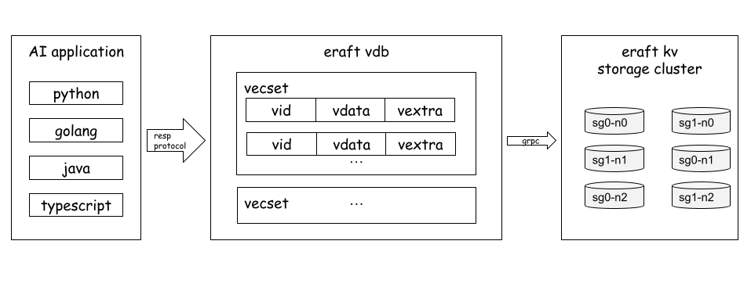

# ERaftVDB

ERaftVDB is a distributed vector database that supports the RESP protocol for vector operations, and uses ERaftKV as the distributed storage layer.



## ERaftKV

ERaftKV is a persistent distributed KV storage system, uses the Raft protocol to ensure data consistency, At the same time, it supports sharding to form multi shard large-scale data storage clusters.

## ERaftKV Features
- Strong and consistent data storage ensures secure and reliable data persistence in distributed systems.
- Support KV data type operations, including PUT, GET, DEL, and SCAN operations on keys. When users operate on cluster data, they must ensure the persistence of the operation and the sequential consistency of reading and writing.
- Dynamically configure the cluster, including adding and deleting nodes, adding and deleting cluster sharding configurations, including which keyrange the cluster sharding is responsible for.
- Support for snapshot taking with the raft to compress and merge logs. During the snapshot, it is required to not block data read and write.
- Support switching to a specifying leader.
- Raft elections support PreVote, and newly added nodes do not participate in the election by tracking data to avoid triggering unnecessary elections.
- Raft read optimization: adding a read queue ensures that the leader node returns a read request after submitting it, and unnecessary logs are not written.
- Support data migration, multi-shard scale out.

# Getting Started

## Run demo in docker

- step 1, create docker sub net

```
sudo make create-net
```

command output
```
docker network create --subnet=172.18.0.0/16 mytestnetwork
f57ad3d454f27f4b84efca3ce61bf4764bd30ce3d4971b85477daf05c6ae28a3
```

- step 2, run cluster

```
sudo make run-demo
```
command output
```
docker run --name kvserver-node1 --network mytestnetwork --ip 172.18.0.2 -d --rm -v /home/colin/eraft:/eraft eraft/eraftkv:v0.0.6 /eraft/build/eraftkv 0 /tmp/kv_db0 /tmp/log_db0 172.18.0.2:8088,172.18.0.3:8089,172.18.0.4:8090
b11928b1281d6693a1fb12d12ab6fbc1f4b13c509d983fb3f04551fdcdff5d32
sleep 4s
docker run --name kvserver-node2 --network mytestnetwork --ip 172.18.0.3 -d --rm -v /home/colin/eraft:/eraft eraft/eraftkv:v0.0.6 /eraft/build/eraftkv 1 /tmp/kv_db1 /tmp/log_db1 172.18.0.2:8088,172.18.0.3:8089,172.18.0.4:8090
7588f7ab8176a518ef6100157cfa6cc966ce719401b6f1909f7944230ef4266b
docker run --name kvserver-node3 --network mytestnetwork --ip 172.18.0.4 -d --rm -v /home/colin/eraft:/eraft eraft/eraftkv:v0.0.6 /eraft/build/eraftkv 2 /tmp/kv_db2 /tmp/log_db2 172.18.0.2:8088,172.18.0.3:8089,172.18.0.4:8090
8192b50bfc5f00ab0ce43fe95013fa1c80b40a5383ed260333c3032bf7e62203
sleep 10s
docker run --name vdbserver-node --network mytestnetwork --ip 172.18.0.6 -d --rm -v /home/colin/eraft:/eraft eraft/eraftkv:v0.0.6 /eraft/build/eraft-vdb 172.18.0.6:12306 172.18.0.2:8088,172.18.0.3:8089,172.18.0.4:8090
32064172894ca5afb6bc20546121817da8c75438e36c54550b373d8236690653
```

- step 3, run eraft vdb tests

```
sudo make run-vdb-tests
```
command output
```
chmod +x utils/run-vdb-tests.sh
docker run --name vdbserver-node-tests --network mytestnetwork --ip 172.18.0.8 -it --rm -v /home/colin/eraft:/eraft eraft/eraftkv:v0.0.6 /eraft/utils/run-vdb-tests.sh
+ redis-cli -h 172.18.0.6 -p 12306 info
server_id: 0,server_address: 172.18.0.2:8088,status: Running,Role: Leader
server_id: 1,server_address: 172.18.0.3:8089,status: Running,Role: Follower
server_id: 2,server_address: 172.18.0.4:8090,status: Running,Role: Follower
```

- step 4, clean all
```
sudo make run stop-demo
sudo make rm-net
```

## Building and run test using [GitHub Actions](https://github.com/features/actions)

All you need to do is submit a Pull Request to our repository, and all compile, build, and testing will be automatically executed.

You can check the [ERatfKVGitHubActions](https://github.com/eraft-io/eraft/actions) See the execution process of code build tests.

## Building on your local machine.

To compile eraftkv, you will need:
- Docker

To build:
```
make gen-protocol-code
make build-dev
```

Run test:
```
make tests
```

If you want to build image youtself
```
make image
```

# Documentation

## Run ERaftKV server group demo in physical machine

- how to set up demo cluster?

```
./build/eraftkv 0 /tmp/kv_db0 /tmp/log_db0 127.0.0.1:8088,127.0.0.1:8089,127.0.0.1:8090
./build/eraftkv 1 /tmp/kv_db1 /tmp/log_db1 127.0.0.1:8088,127.0.0.1:8089,127.0.0.1:8090
./build/eraftkv 2 /tmp/kv_db2 /tmp/log_db2 127.0.0.1:8088,127.0.0.1:8089,127.0.0.1:8090

```

- how to join an new node?

```
./build/eraftkv 3 /tmp/kv_db4 /tmp/log_db4 127.0.0.1:8088,127.0.0.1:8089,127.0.0.1:8090,127.0.0.1:8091

./build/eraftkv-ctl addnode 3 127.0.0.1:8091
```

## example usage

- put kv
```
./eraftkv-ctl [leader_address] put [key] [value]
```
- get kv
```
./eraftkv-ctl [leader_address] get [key]
```

- addnode to raft group
```
./eraftkv-ctl [leader_address] addnode [node id] [node address]
```
- remove node from raft group
```
./eraftkv-ctl [leader_address] removenode [node id]
```

- run kv benchmark
```
./eraftkv-ctl [leader_address] bench [key size] [value size] [op count]
```

# Contributing

You can quickly participate in development by following the instructions in [CONTROLUTING.md](https://github.com/eraft-io/eraft/blob/master/CONTRIBUTING.md)
