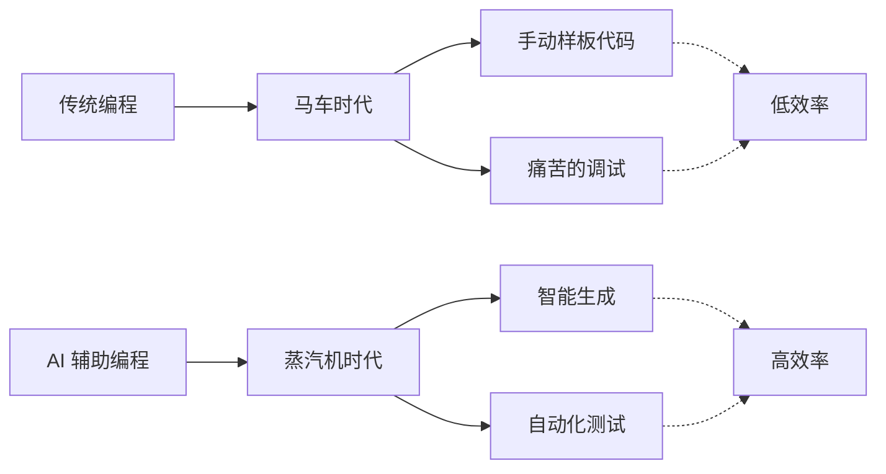

[](https://golang.org/)
[](https://opensource.org/licenses/MIT)

中文 | [English](README.md)

# eRaft: 分布式分片 KV 存储系统

eRaft 是一个使用 Go 实现的高性能分布式键值存储系统。其特性包括：
- **一致性**：使用 Raft 算法保证一致性和高可用性。
- **传输层**：使用 gRPC 进行高效的节点间及客户端与服务器通信。
- **存储引擎**：使用 RocksDB 作为持久化存储引擎。
- **分片**：通过专门的配置集群实现动态分片。

## 安装指南

请参阅 [INSTALL.md](INSTALL.md) 获取 macOS 和 Linux 的详细安装和编译说明。

## 项目文档 (Wiki)

有关系统设计和实现的详细信息，请参阅我们的项目 Wiki：
- [系统架构概览](wiki/Architecture.md)
- [Raft 共识算法实现](wiki/Raft-Consensus.md)
- [分片与迁移机制](wiki/Sharding-Mechanism.md)
- [存储与 RPC 层](wiki/Storage-and-RPC.md)
- [性能测试与压测](wiki/Benchmark.md)

## AI 驱动的开发

本项目在 AI 的辅助下构建，代表了软件工程效率的范式转移：



## 构建

详细安装说明请参考 [INSTALL.md](INSTALL.md)。

执行以下命令构建所有组件：
```bash
make build
```
二进制文件将生成在 `output/` 目录中。

**注意**：eRaft 使用 RocksDB 作为存储引擎。请在构建前确保系统已安装 RocksDB。详见 [INSTALL.md](INSTALL.md) 中的平台特定说明。

## 快速入门指南

### 步骤 1：启动配置集群 (ShardCtrler)

配置集群管理分片分配。启动 3 个节点：

```bash
# 终端 1
./output/shardctrlerserver -id 0 -cluster "localhost:50051,localhost:50052,localhost:50053" -db "data/sc0"

# 终端 2
./output/shardctrlerserver -id 1 -cluster "localhost:50051,localhost:50052,localhost:50053" -db "data/sc1"

# 终端 3
./output/shardctrlerserver -id 2 -cluster "localhost:50051,localhost:50052,localhost:50053" -db "data/sc2"
```

### 步骤 2：启动 ShardKV 分片组

ShardKV 组存储实际数据。我们将启动两个组（GID 100 和 GID 101）来演示分片功能。

#### 分片组 100 (3 个节点):
```bash
# 终端 4, 5, 6
./output/shardkvserver -id 0 -gid 100 -cluster "localhost:6001,localhost:6002,localhost:6003" -ctrlers "localhost:50051,localhost:50052,localhost:50053" -db "data/skv100_0"
./output/shardkvserver -id 1 -gid 100 -cluster "localhost:6001,localhost:6002,localhost:6003" -ctrlers "localhost:50051,localhost:50052,localhost:50053" -db "data/skv100_1"
./output/shardkvserver -id 2 -gid 100 -cluster "localhost:6001,localhost:6002,localhost:6003" -ctrlers "localhost:50051,localhost:50052,localhost:50053" -db "data/skv100_2"
```

#### 分片组 101 (3 个节点):
```bash
# 终端 7, 8, 9
./output/shardkvserver -id 0 -gid 101 -cluster "localhost:7001,localhost:7002,localhost:7003" -ctrlers "localhost:50051,localhost:50052,localhost:50053" -db "data/skv101_0"
./output/shardkvserver -id 1 -gid 101 -cluster "localhost:7001,localhost:7002,localhost:7003" -ctrlers "localhost:50051,localhost:50052,localhost:50053" -db "data/skv101_1"
./output/shardkvserver -id 2 -gid 101 -cluster "localhost:7001,localhost:7002,localhost:7003" -ctrlers "localhost:50051,localhost:50052,localhost:50053" -db "data/skv101_2"
```

### 步骤 3：注册 ShardKV 分片组

使用 `shardctrlerclient` 将两个分片组注册到配置集群：

```bash
# 注册分片组 100
./output/shardctrlerclient join 100=localhost:6001,localhost:6002,localhost:6003

# 注册分片组 101
./output/shardctrlerclient join 101=localhost:7001,localhost:7002,localhost:7003
```

### 步骤 4：数据操作

现在你可以使用 `shardkvclient` 进行读写操作：

```bash
# 写入数据
./output/shardkvclient put mykey myvalue

# 读取数据
./output/shardkvclient get mykey

# 追加数据
./output/shardkvclient append mykey " extra"

# 运行性能压测
./output/shardkvclient bench 1000
```

### 集群监控

检查集群中所有节点的状态：

```bash
# 查看 ShardKV 状态
./output/shardkvclient status

# 查看 ShardCtrler 状态
./output/shardctrlerclient status
```

### Dashboard 可视化监控

Dashboard 提供了 Web 界面来实时监控集群状态、拓扑结构和性能指标。

#### 构建 Dashboard

```bash
# 构建后端服务器
make builddashboard

# 构建前端（首次需要安装依赖）
cd dashboard/frontend
npm install  # 已配置淘宝镜像源，国内用户无需额外配置
npm run build
```

#### 启动 Dashboard

```bash
# 启动 Dashboard 服务器（在完成步骤 1-3 后运行）
./output/dashboard-server \
  -port=8080 \
  -config-addrs="localhost:50051,localhost:50052,localhost:50053" \
  -update-interval=5s
```

然后在浏览器中访问：`http://localhost:8080`

Dashboard 提供以下功能：
- **集群拓扑**：可视化展示配置集群和分片组的节点状态、角色（Leader/Follower）
- **分片状态**：实时显示各分片的健康状态、所属分片组、键值对数量
- **性能指标**：监控总节点数、健康节点数、存储容量、平均负载等关键指标
- **自动刷新**：每 5 秒自动更新集群状态
- **动态发现**：自动从 ShardCtrler 查询最新配置，无需手动指定分片组

## 分片迁移流程

当你使用 `move` 指令或由于 `join`/`leave` 导致配置变更时，系统会自动执行数据迁移：

1.  **配置更新**：`shardctrler` 更新分片到分片组的映射关系。
2.  **变更检测**：每个 `shardkv` 组的 Leader 会定期轮询配置集群以获取最新配置。
3.  **数据拉取 (Pulling)**：如果一个组发现自己成了某个分片的新负责人，它会将该分片状态设为 `Pulling`，并开始从原持有组拉取数据。
4.  **数据集成**：数据拉取完成后，会通过 Raft 日志同步到组内所有节点，并应用到 LevelDB 存储中。
5.  **垃圾回收 (GC)**：迁移确认完成后，新持有组会通知原持有组删除过期数据，以保证数据一致性并释放空间。
