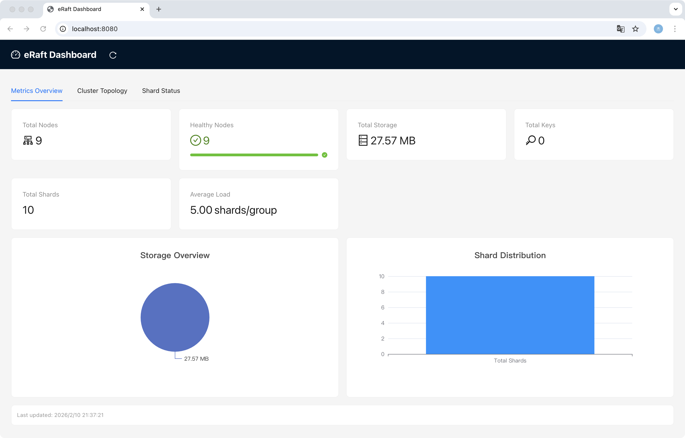
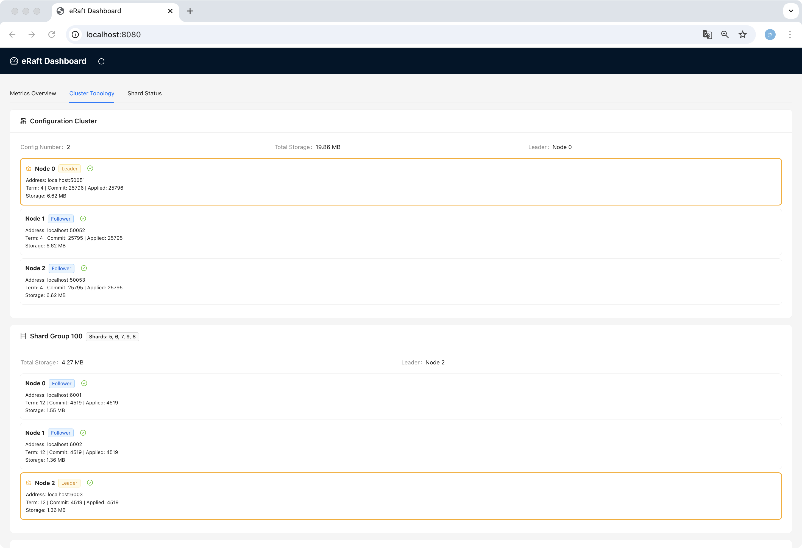

# eRaft Dashboard

eRaft Dashboard 是一个实时可视化的集群监控面板，用于展示 eRaft 分布式键值存储系统的实时状态、拓扑结构和性能指标。

## 功能特性

- **实时集群拓扑可视化**：显示配置集群和分片组的节点状态、角色（Leader/Follower/Candidate）
- **分片状态展示**：展示所有分片的分配情况、状态（Serving/Pulling/BePulling/GCing）和存储统计
- **性能指标监控**：实时显示总节点数、健康节点数、存储容量、键值对数量等指标
- **图表可视化**：使用 ECharts 展示存储分布和分片分配情况
- **自动刷新**：每 5 秒自动更新一次集群状态

## 架构

Dashboard 包含两个主要部分：

### 后端 (backend/)
- **语言**：Go
- **功能**：
  - 通过 gRPC 从各节点收集状态信息
  - 提供 RESTful API 接口供前端调用
  - 定时刷新集群数据并缓存
- **API 端点**：
  - `GET /api/dashboard` - 获取完整的 Dashboard 数据
  - `GET /api/topology` - 获取集群拓扑信息
  - `GET /api/metrics` - 获取集群指标

### 前端 (frontend/)
- **技术栈**：React + TypeScript + Ant Design + ECharts
- **功能**：
  - 集群拓扑可视化展示
  - 分片状态表格和图表
  - 实时指标监控面板

## 安装和运行

### 前置条件
- Go 1.24+
- Node.js 16+
- npm 或 yarn

### 后端运行

```bash
# 进入后端目录
cd dashboard/backend

# 下载依赖
go mod download

# 构建
go build -o dashboard-server main.go collector.go types.go

# 运行
./dashboard-server \
  -port=8080 \
  -config-addrs="localhost:50051,localhost:50052,localhost:50053" \
  -update-interval=5s
```

**参数说明**：
- `-port`: Dashboard HTTP 服务监听端口（默认 8080）
- `-config-addrs`: 配置集群（ShardCtrler）节点地址列表，逗号分隔
- `-update-interval`: 状态更新间隔（默认 5s）

**注意**：Dashboard 会自动从 ShardCtrler 查询最新配置，动态发现所有分片组，无需手动指定 `-shard-groups` 参数。

### 前端运行

**注意**：项目已预配置淘宝 npm 镜像源，国内用户无需额外配置。

```bash
# 进入前端目录
cd dashboard/frontend

# 安装依赖（自动使用淘宝镜像 https://registry.npmmirror.com）
npm install

# 开发模式运行
npm start

# 构建生产版本
npm run build
```

前端默认在 `http://localhost:3000` 运行。

### 完整部署

生产环境中，可以使用后端服务器同时提供前端静态文件：

```bash
# 1. 构建前端
cd dashboard/frontend
npm run build

# 2. 运行后端（会自动服务 frontend/build 目录）
cd ../backend
go build -o dashboard-server *.go
./dashboard-server \
  -port=8080 \
  -config-addrs="localhost:50051,localhost:50052,localhost:50053" \
  -update-interval=5s
```

然后访问 `http://localhost:8080` 即可看到 Dashboard 界面。

## 界面展示

### 集群拓扑视图



集群拓扑视图展示了：
- **配置集群**：ShardCtrler 节点的状态、角色（Leader/Follower）、任期、提交索引等
- **分片组**：每个 ShardKV 分片组的节点信息和分配的分片列表
- **节点详情**：包括 ID、地址、角色、Term、CommitIndex、LastApplied、存储大小

### 性能指标和分片状态



性能监控面板展示了：
- **关键指标**：总节点数、健康节点数、总存储容量、总键值对数
- **存储分布**：ECharts 饼图展示存储容量分布
- **分片状态**：详细表格展示每个分片的 ID、所属组、状态、键数量等
- **分片分配**：柱状图展示各分片组的分片分配情况

## 界面说明

Dashboard 包含三个主要标签页：

### 1. Metrics Overview（指标概览）
- **关键指标卡片**：显示总节点数、健康节点数、总存储容量、总键值对数量
- **存储容量图表**：饼图展示存储使用情况
- **分片分布图表**：柱状图展示分片分配情况

### 2. Cluster Topology（集群拓扑）
- **配置集群**：显示 ShardCtrler 集群的所有节点状态
- **分片组**：显示每个 ShardKV 分片组的节点状态和分配的分片
- **节点信息**：每个节点显示 ID、地址、角色、任期、提交索引、应用索引、存储大小和健康状态

### 3. Shard Status（分片状态）
- **分片分布**：标签形式展示每个分片组拥有的分片数量
- **分片详情表格**：列出所有分片的 ID、所属组、状态、键数量和存储大小
- **可排序和过滤**：支持按各列排序，支持按状态过滤

## 配置

### 环境变量

创建 `dashboard/frontend/.env` 文件配置 API 地址：

```env
REACT_APP_API_BASE_URL=http://localhost:8080/api
```

## 扩展 Proto 定义

当前的 Dashboard 依赖于 `shardkvpb.GetStatusResponse` 和 `shardctrlerpb.GetStatusResponse`。如需显示更多分片详情，可以扩展 proto 定义：

```protobuf
// shardkvpb/shardkv.proto
message ShardInfo {
    int32 shard_id = 1;
    string state = 2;
    int64 keys = 3;
    int64 storage = 4;
}

message GetStatusResponse {
    // ... 现有字段
    map<int32, ShardInfo> shards = 9; // 添加分片详情
}
```

然后重新生成代码：
```bash
./proto_gen.sh
```

## 故障排查

### 后端无法连接到节点
检查节点地址是否正确，确保节点的 gRPC 服务已启动。

### 前端无法连接到后端
检查 CORS 设置，后端已默认添加 `Access-Control-Allow-Origin: *`。

### 数据不更新
检查后端日志，确认是否能成功调用节点的 GetStatus 接口。

## 开发

### 添加新的可视化组件

1. 在 `frontend/src/components/` 创建新组件
2. 在 `frontend/src/pages/Dashboard.tsx` 中引入并添加到相应标签页
3. 如需新的 API 端点，在 `backend/main.go` 中添加处理函数

### 添加新的指标

1. 在 `backend/types.go` 中扩展数据结构
2. 在 `backend/collector.go` 中实现数据收集逻辑
3. 在 `frontend/src/types/index.ts` 中添加对应的 TypeScript 类型
4. 在前端组件中展示新指标

## License

MIT License - 同 eRaft 主项目
