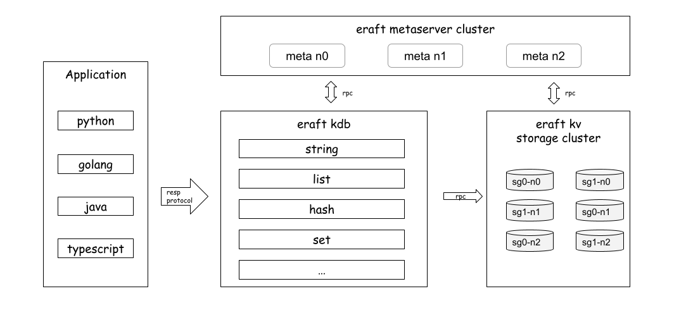

# ERaftKDB

ERaftKDB is a distributed database that supports the Redis RESP protocol, and uses ERaftKV as the distributed storage layer.



## ERaftKV

ERaftKV is a persistent distributed KV storage system, uses the Raft protocol to ensure data consistency, At the same time, it supports sharding to form multi shard large-scale data storage clusters.

## ERaftKV Features
- Strong and consistent data storage ensures secure and reliable data persistence in distributed systems.
- Support KV data type operations, including PUT, GET, DEL, and SCAN operations on keys. When users operate on cluster data, they must ensure the persistence of the operation and the sequential consistency of reading and writing.
- Dynamically configure the cluster, including adding and deleting nodes, adding and deleting cluster sharding configurations, including which keyrange the cluster sharding is responsible for.
- Support for snapshot taking with the raft to compress and merge logs. During the snapshot, it is required to not block data read and write.
- Support switching to a specifying leader.
- Raft elections support PreVote, and newly added nodes do not participate in the election by tracking data to avoid triggering unnecessary elections.
- Raft read optimization: adding a read queue ensures that the leader node returns a read request after submitting it, and unnecessary logs are not written.
- Support data migration, multi-shard scale out.

# Getting Started

## Build 

Execute follower build command on the machine with docker installed.

```
sudo make build-dev
```

## Run demo in docker

- step 1, create docker sub net

```
sudo make create-net
```

command output
```
docker network create --subnet=172.18.0.0/16 mytestnetwork
f57ad3d454f27f4b84efca3ce61bf4764bd30ce3d4971b85477daf05c6ae28a3
```

- step 2, run cluster in shard mode

```
sudo make run-demo
```
command output
```
docker run --name kvserver-node1 --network mytestnetwork --ip 172.18.0.10 -d --rm -v /home/colin/eraft:/eraft eraft/eraftkv:v0.0.6 /eraft/build/eraftkv 0 /tmp/kv_db0 /tmp/log_db0 172.18.0.10:8088,172.18.0.11:8089,172.18.0.12:8090
eca081a545a9eb8dbf9b05c2a307f38c74b4fea2910776e85c806c1b70cedf20
sleep 2
docker run --name kvserver-node2 --network mytestnetwork --ip 172.18.0.11 -d --rm -v /home/colin/eraft:/eraft eraft/eraftkv:v0.0.6 /eraft/build/eraftkv 1 /tmp/kv_db1 /tmp/log_db1 172.18.0.10:8088,172.18.0.11:8089,172.18.0.12:8090
74d14edf114f47889b50f0ed20ea810af7cd383de26ebdd3d1e36078290674e7
docker run --name kvserver-node3 --network mytestnetwork --ip 172.18.0.12 -d --rm -v /home/colin/eraft:/eraft eraft/eraftkv:v0.0.6 /eraft/build/eraftkv 2 /tmp/kv_db2 /tmp/log_db2 172.18.0.10:8088,172.18.0.11:8089,172.18.0.12:8090
36bd437e67d00f019732e95e31b7f7ab9c19739a0f10676f31e9c0a7fad98a6c
sleep 1
docker run --name metaserver-node1 --network mytestnetwork --ip 172.18.0.2 -d --rm -v /home/colin/eraft:/eraft eraft/eraftkv:v0.0.6 /eraft/build/eraftmeta 0 /tmp/meta_db0 /tmp/log_db0 172.18.0.2:8088,172.18.0.3:8089,172.18.0.4:8090
f8a1382542f41d14e645ddeb285e8b93afc4367b8537e5bc4030487116d8f5cd
sleep 3
docker run --name metaserver-node2 --network mytestnetwork --ip 172.18.0.3 -d --rm -v /home/colin/eraft:/eraft eraft/eraftkv:v0.0.6 /eraft/build/eraftmeta 1 /tmp/meta_db1 /tmp/log_db1 172.18.0.2:8088,172.18.0.3:8089,172.18.0.4:8090
7f5385341bc1f990f50020bd09526eaba3eeec56ab3c67fab325d313ab4ceaea
docker run --name metaserver-node3 --network mytestnetwork --ip 172.18.0.4 -d --rm -v /home/colin/eraft:/eraft eraft/eraftkv:v0.0.6 /eraft/build/eraftmeta 2 /tmp/meta_db2 /tmp/log_db2 172.18.0.2:8088,172.18.0.3:8089,172.18.0.4:8090
666732b5a9b10cd828e9c0829bd97159b3ac9a7d39d1d3f2dcbbc2e5af654373
sleep 16
docker run --name metaserver-tests --network mytestnetwork --ip 172.18.0.8 -it --rm -v /home/colin/eraft:/eraft eraft/eraftkv:v0.0.6 /eraft/build/eraftmeta_server_test
[==========] Running 1 test from 1 test suite.
[----------] Global test environment set-up.
[----------] 1 test from EraftMetaServerTests
[ RUN      ] EraftMetaServerTests.TestMetaBasicOp
DEBUG: cluster config resp -> success: true
shard_group {
  id: 1
  servers {
    address: "172.18.0.10:8088"
  }
  servers {
    id: 1
    address: "172.18.0.11:8089"
  }
  servers {
    id: 2
    address: "172.18.0.12:8090"
  }
}

[       OK ] EraftMetaServerTests.TestMetaBasicOp (4028 ms)
[----------] 1 test from EraftMetaServerTests (4028 ms total)

[----------] Global test environment tear-down
[==========] 1 test from 1 test suite ran. (4028 ms total)
[  PASSED  ] 1 test.
sleep 2
docker run --name vdbserver-node --network mytestnetwork --ip 172.18.0.6 -it --rm -v /home/colin/eraft:/eraft eraft/eraftkv:v0.0.6 /eraft/build/eraft-vdb 172.18.0.6:12306 172.18.0.2:8088,172.18.0.3:8089,172.18.0.4:8090
run server success!
```

- step 3, run eraft vdb tests

```
sudo make run-vdb-tests
```
command output
```
chmod +x utils/run-vdb-tests.sh
docker run --name vdbserver-node-tests --network mytestnetwork --ip 172.18.0.9 -it --rm -v /home/colin/eraft:/eraft eraft/eraftkv:v0.0.6 /eraft/utils/run-vdb-tests.sh
+ redis-cli -h 172.18.0.6 -p 12306 info
server_id: 0,server_address: 172.18.0.10:8088,status: Running,Role: Leader
server_id: 1,server_address: 172.18.0.11:8089,status: Running,Role: Follower
server_id: 2,server_address: 172.18.0.12:8090,status: Running,Role: Follower
+ redis-cli -h 172.18.0.6 -p 12306 set a h
OK
+ redis-cli -h 172.18.0.6 -p 12306 set b e
OK
+ redis-cli -h 172.18.0.6 -p 12306 set c l
OK
+ redis-cli -h 172.18.0.6 -p 12306 set d l
OK
+ redis-cli -h 172.18.0.6 -p 12306 set e o
OK
+ sleep 1
+ redis-cli -h 172.18.0.6 -p 12306 get a
"h"
+ redis-cli -h 172.18.0.6 -p 12306 get b
"e"
+ redis-cli -h 172.18.0.6 -p 12306 get c
"l"
+ redis-cli -h 172.18.0.6 -p 12306 get d
"l"
+ redis-cli -h 172.18.0.6 -p 12306 get e
"o"
```

- step 4, clean all
```
sudo make stop-demo
sudo make rm-net
```

## Building and run test using [GitHub Actions](https://github.com/features/actions)

All you need to do is submit a Pull Request to our repository, and all compile, build, and testing will be automatically executed.

You can check the [ERatfKVGitHubActions](https://github.com/eraft-io/eraft/actions) See the execution process of code build tests.

## Building on your local machine.

To compile eraftkv, you will need:
- Docker

To build:
```
make gen-protocol-code
make build-dev
```

Run test:
```
make tests
```

If you want to build image youtself
```
make image
```
