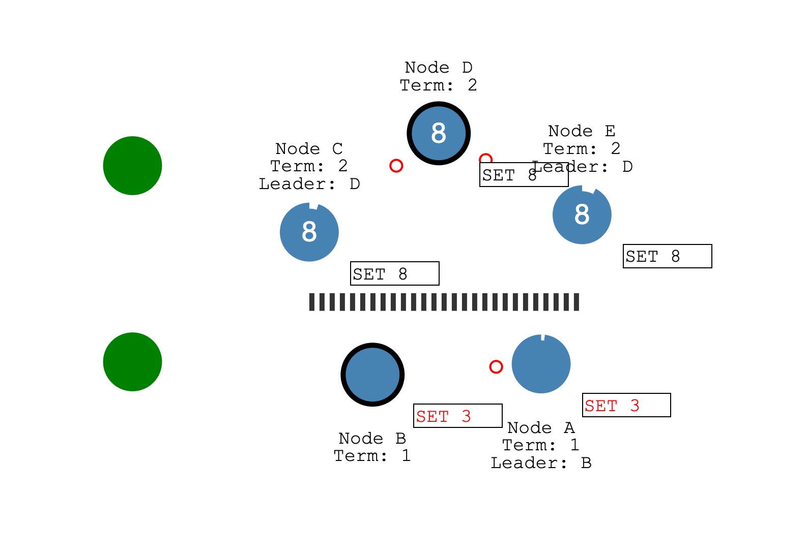

### 脑裂

脑裂是大脑分裂开的意思，大脑是控制中心，如果分裂开了，整个系统就会出现紊乱。对应到分布式系统里面，一般就是集群中的节点由于网络故障或者其他故障被分成多个分区，这时候系统不出现不同分区状态不一致的情况。

如果一个分布式系统中只有两个节点，当分区发生的时候，系统中的节点是对称的。这时候如果没有第三个节点来做仲裁，系统就会因为脑裂无法确定接下来的服务状态，导致系统出现紊乱，无法继续正常服务。
