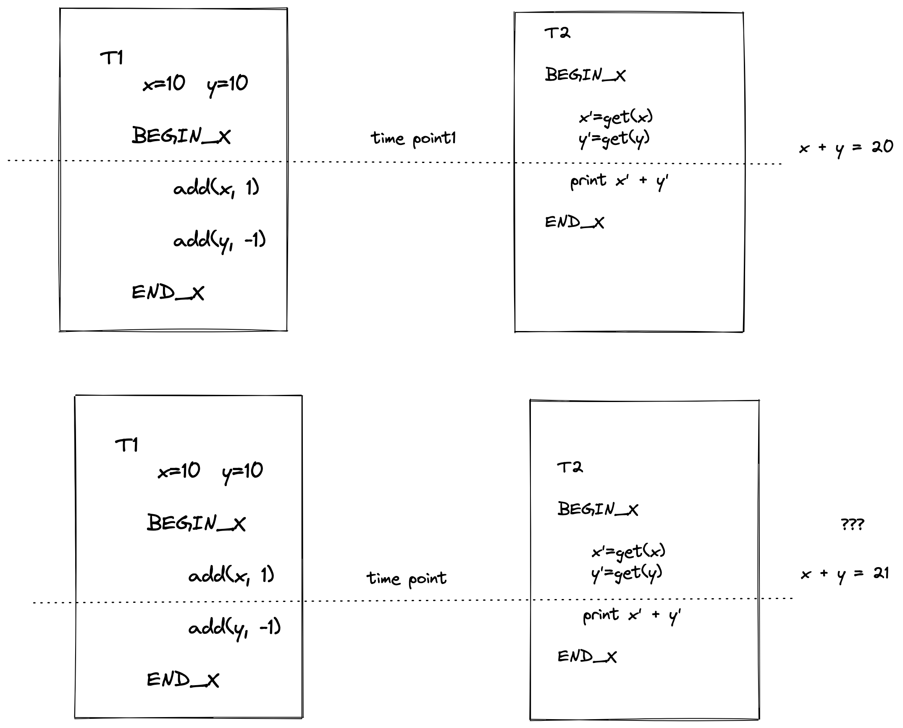
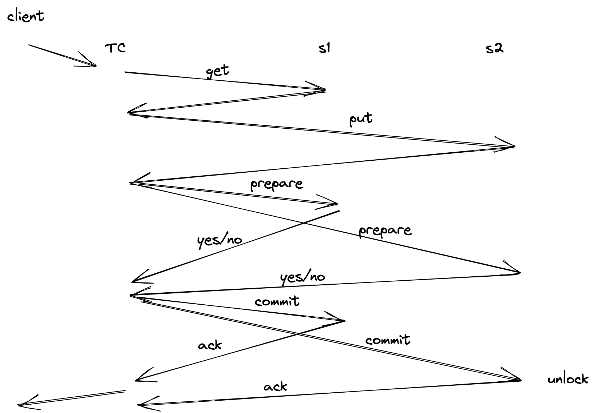

### 分布式事务组成

- 并发控制
- 原子提交

### 我们首先以如果没有事务保证，会出现什么问题？

开始讨论我们系统中可能发生的事情，首先我们重新说一下事务的定义，事务是对数据库的一系列操作，这些操作满足 ACID 的属性。

我们看到上图的例子，假设现在用户对我们实现的分布式存储系统存储了银行账户数据

T1 表示储蓄用户的账户为 Y，他有 10 块钱，然后他给 X 转账 1 块钱，那么对应的数据操作就是对 x + 1, 对 Y - 1 。用户提交这个转账后，系统就开始修改数据库中的值了。

T2 表示银行对账人员她需要统计下用户 X, Y 的账户总和，如果 T2 在 T1 开始且还没有操作的时候执行 x', y' 值得获取，那么能拿到 20 块的总和，这是符合预期的。

但是，因为两个用户使用系统的时候，他们访问的顺序是随机的，我们无法保证，一旦 T2 在 T1 执行 add(x, 1) 之后读取 x', y' 的值。我们将得到 X + Y = 21，统计莫名的多出了一块钱（似乎银行亏1块钱也没啥问题），如果这笔转账金额很大呢，比如一个小目标 1个亿，那就是绝对不能容忍的错误了。

这时候就需要我们的事务保障了。

### ACID 代表什么?

- atomic 数据库管理系统保证事务是原子的，事务要么执行其所有操作，要么不执行任何操作。

- cosistent 这个表示数据库是一致的。应用程序访问的有关数据的所有查询都将返回正确的结果。

- isolated 数据库管理系统提供了事务在系统中单独运行的假象。他们看不到并发事务的影响。这等同于事务的执行是以串行的顺序的。但是为了更好的性能，数据库管理系统必须交错并发的执行事务操作。

- durable 在系统崩溃和重启之后，提交事务的所有更改都必须是持久化的。数据库管理系统可以使用日志记录或者影子页面来确保所有的更改都是持久化的。

### 支撑事务特性的算法有哪些？

#### 悲观的 Two-Phase Locking

https://github.com/eraft-io/eraft-io.github.io/blob/gitbook/cmu15455/LEC17.md

#### 乐观的 Timestamp Ordering Concurrency Control 

https://github.com/eraft-io/eraft-io.github.io/blob/gitbook/cmu15455/LEC18.md

#### 多版本并发控制 Multi-Version Concurrency Control

https://github.com/eraft-io/eraft-io.github.io/blob/gitbook/cmu15455/LEC19.md

### 两阶段提交 Two-Phase Commit

在一个分布式系统中，数据被分割存储在不同的机器上，例如我们 eraft 中将数据按哈希规则分布到不同的 bucket，然后有不同的机器去负责这个 bucket 数据的存取。

现在我们把前面那个转账的例子带入分布式的场景

涉及到账户数据存储在 S1, S2 两台不同的机器上，当 T1 执行到对 Y 减 1 操作的时候服务 S2 奔溃掉了。那么这时候这个操作返回用户失败，但是 S1 上的账户已经脏了，这时候对账人员去对账也会得到错误的数据。

面对这种场景分布式系统是如何去解决的呢？

这个是否就需要一个节点作为事务协调者（Transaction Coordinator），来协调事务的执行了，S1，S2 负责执行事务，他们被称为事务参与者（Participants)。

我们首先概览以下两阶段提交时如何工作的

