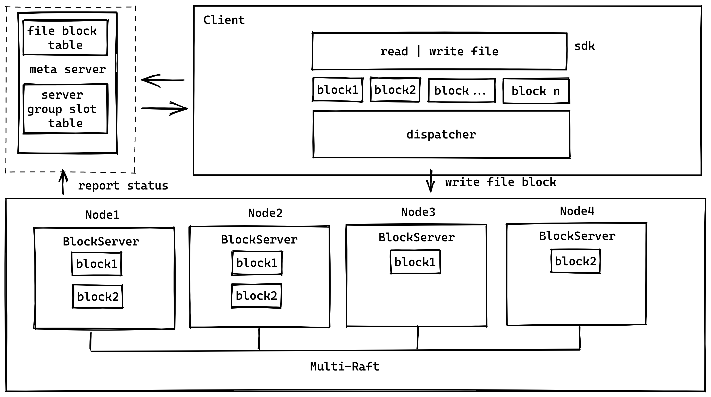

## 整体设计

三个模块

### meta server

元数据服务器，负责存储文件快到不同服务器分组的映射信息，以及收集所有块节点的状态信息，以及 raft 分组的信息。

### block server
存储文件块，多个 block server 组成 multi-raft 来共同存储文件的分块数据

### client sdk
接受客户端的文件读写请求，切分成文件块，和 meta sever 交互，注册文件分块信息到 meta server，按这个分块规则，将文件块分发写入到不同的  BlockServer 组 (raft group)。

## 详细设计

### meta server 细节

file block table

