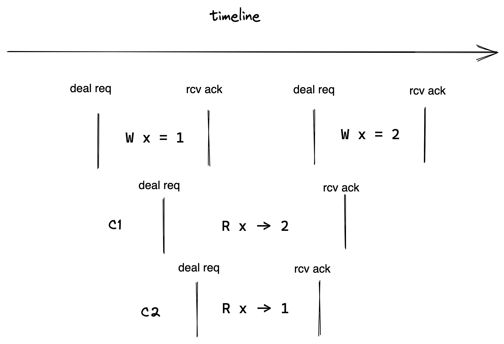
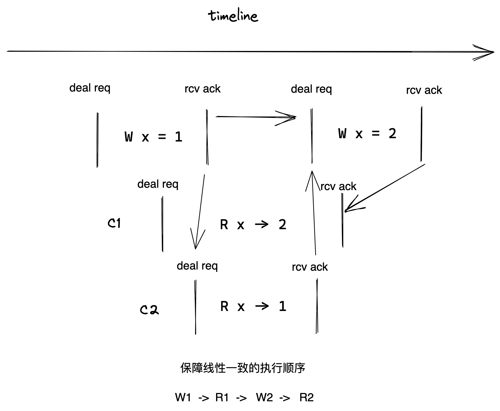
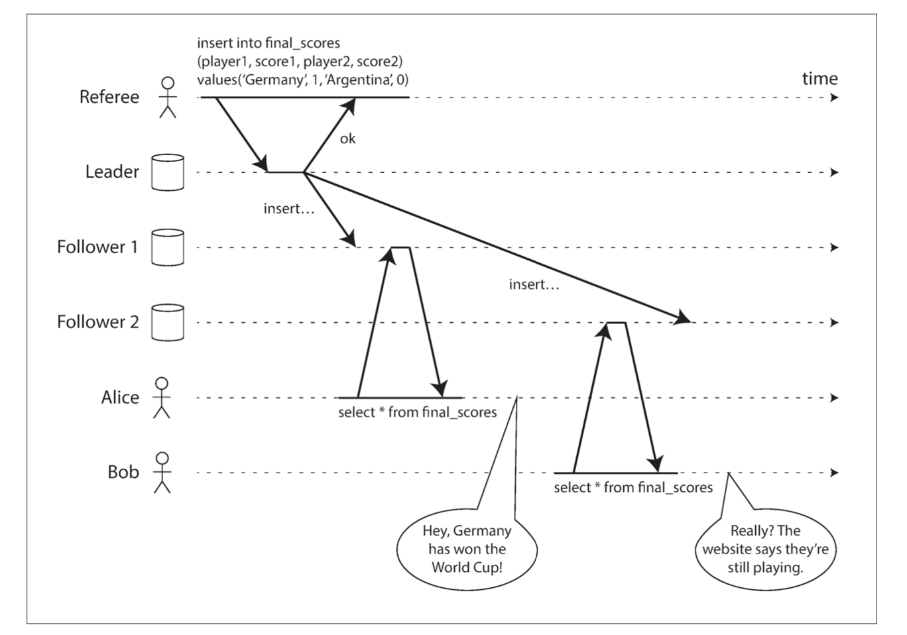

定义：

一个系统的执行历史是一系列的客户请求，或许这是来自读个客户端的多个请求。如果执行历史整体可以按照一个顺序排序，并且排列的顺序与客户端请求的时间完全符合，那么系统就是现行一致的。

概念优点难以理解，我们来看一个具体的问题：

我们看到图中这样一个例子，首先从左往右代表时间顺序。最开始有个客户端发送了对 X 写 1 的请求，并在一段时间之后得到写入成功的回复。过了一段时间，这个客户端或者其他客户端再发送一个请求要将 x 写成 2，并收到了相应的回复。

**同时**，某个客户端 C1 发送了一个读 X 的请求，它得到了值是 2 的响应，同时还有一个 C2也有读 X 的请求，但是它得到的值是 1。

那么这里是线性一致的吗？

答案是不是的：C1,C2 可能会困惑，它们为什么读到 X C2 比 C1 后发起，为啥读到的确实旧的值。

要达到线性一致的，这里我们必须要给这 4 个操作生成一个线性一致的顺序。对于整个顺序，我们有两个限制条件：

1.如果一个操作在另一个操作开始前就结束了，那么这个操作必须在执行历史中出现在另一个操作的前面。

2.对于执行历史中的读操作，必须在相应 key 的写操作之后。

我们按这个限制对图中的操作排顺序来决定我们系统实例执行这些操作来保证线性一致性的顺序。

第一个读操作读到的值是 2，那么在总的顺序中，这个读必须在第二个写操作后面，这意味着在总的顺序中，我们必须写 2 成功之后，才能处理客户端读 X 返回 2 的请求。图中处理 C1 的请求必须排在 W x = 2 之后。

要保证线性一致性，系统执行这些客户端请求按照 W1->R1->W2->R2 的顺序来处理，这样整个系统就像只有一个服务器在执行，客户端并没有什么奇怪的事情发生。

实际对应到 Raft 系统中的例子，如果读操作读了从节点，可能会出现以下的情况。

在最开始裁判公布了裁决结果，并且我们的系统在复制半数节点以上之后给裁判响应的 OK。
这时候 Alice 发起了一个读请求到达 Follower1 节点，它读到了比赛结果。Bob 发起的请求达到了 Follower2 节点，他读到的是结果还没出来。
