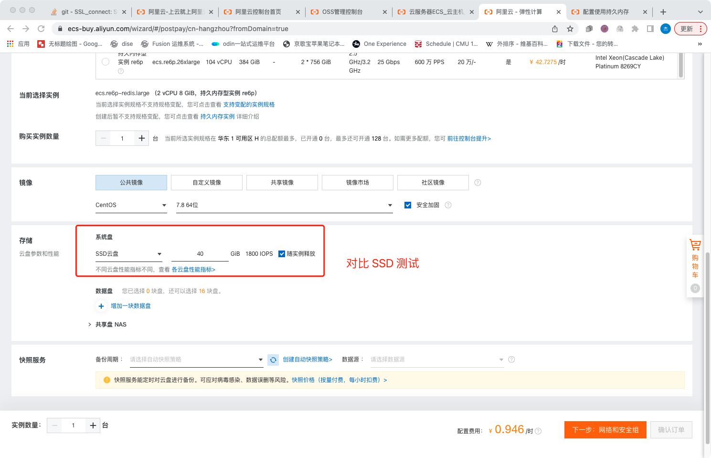
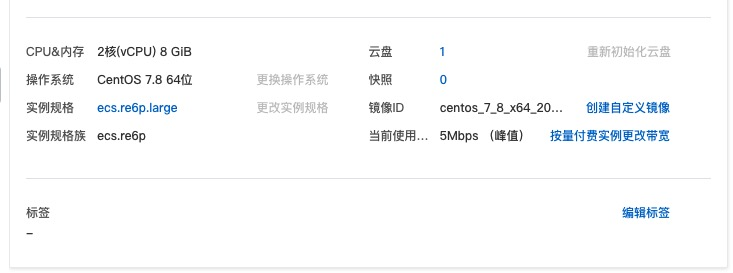

# pmem 测试可以到阿里云购买按时租用的持久化存储

## 申请实例

https://ecs-buy.aliyun.com/wizard/#/prepay/cn-hangzhou?fromDomain=true

规格选择 ecs.re6p.large


用 SSD 盘对比



## 配置持久化内存

https://help.aliyun.com/document_detail/188251.html

我们这里将持久内存配置为一块本地盘

安装持久内存管理工具并将使用模式配置为fsdax。

```
yum install -y ndctl daxctl && \
ndctl create-namespace -f -e namespace0.0 --mode=fsdax
```

格式化并挂载磁盘。

```
mkfs -t ext4 /dev/pmem0 && \
mkdir /mnt/sdb && \
mount -o dax,noatime /dev/pmem0 /mnt/sdb
```

查看已挂载的磁盘。

```
df -h
```

## 测试的库

go-redis-pmem - Golang - 持久化内存 30GiB

pmem-redis - C - 持久化内存 30GiB

kvrocks - C++ - SSD云盘 40GiB (3000 IOPS) 

redis - C - 8GiB 内存

## 测试环境



## 测试命令

测试 GET，SET 不用 SIZE 的 key 的 qps, -d 参数设置测试 k,v 大小，单位为 bytes

```
[root@iZbp1gqpip163xihy2oh56Z ~]# redis-benchmark -t set,get -d 128 -n 100000

[root@iZbp1gqpip163xihy2oh56Z ~]# redis-benchmark -t set,get -d 512 -n 100000

[root@iZbp1gqpip163xihy2oh56Z ~]# redis-benchmark -t set,get -d 1024 -n 100000

[root@iZbp1gqpip163xihy2oh56Z ~]# redis-benchmark -t set,get -d 4096 -n 100000

[root@iZbp1gqpip163xihy2oh56Z ~]# redis-benchmark -t set,get -d 8192 -n 100000

[root@iZbp1gqpip163xihy2oh56Z ~]# redis-benchmark -t set,get -d 10240 -n 100000

```

## 测试结果

### 128 bytes kv set


### 128 bytes kv get


### 10240 bytes kv set


### 10240 bytes kv get


