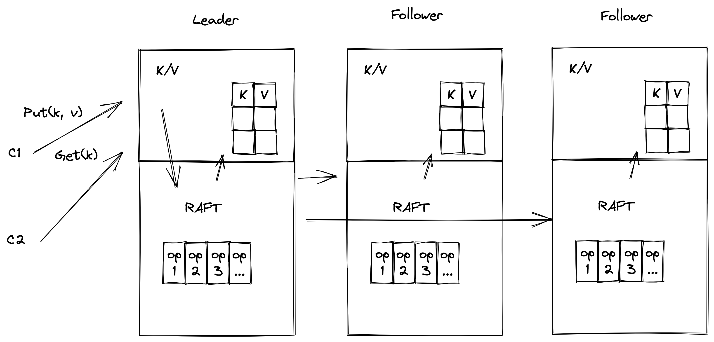
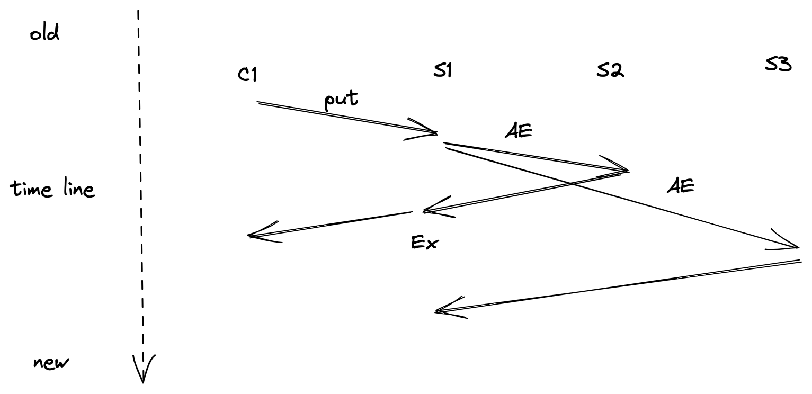

### Raft 算法概览

这一小节我们不深入 Raft 算法细节，而是带着大家概览一下 Raft 算法在一个实际的应用系统中的应用。

我们看到上图的系统，这是一个使用 Raft 算法实现的一个分布式 KV 系统。我们这个系统的设计目标是保证集群中所有节点状态一致，也就是每个节点中 KV 表（这里使用通俗的“表”的概念描述，实际这些数据会存储到一个存储引擎里面）里面的数据状态最终是一致的。

我们先不考虑故障的场景，来看看系统在正常的情况下是怎么运行的。

我们来分析一下 Put 操作经过这个系统的流程，首先客户端会将 Put 请求发送给当前 Raft 集群中的 Leader 节点对应的 K/V 应用层。这个操作会被 Leader 包装成一个操作给 Raft 层，Raft 对这个 Put 请求生成一条日志存储到自己的日志序列中，同时会把这的操作日志，复制给集群中的 Follower 节点，当集群中的半数以上节点都复制这个日志并返回响应之后，Leader 会提交这条日志，并应用这条日志，写入数据到 KV 表，并通知应用层。这个操作成功执行，这时候 K/V 层会响应客户端，同时 Leader 会把 Commit 信息在下一次复制请求带给 Follwer，Follower 也会应用这条日志，写入数据到 KV 表中，最终集群中所有节点的状态一致。

这就是应用 Raft 实现一个能保证一致性状态系统的例子，乍一看，像是很简单。但是当你深入到算法细节里面的时候，这个系统就不见了，例如日志复制的时候会有很多约束条件来保证提交日志的一致性，以及故障的时候如何正确的选出下一个 leader？多次故障之后，日志状态一致性如何能够安全的保证？当然，这些细节也是我们后续分析的重点，我们会结合具体代码，尽量简单，让你系统的理解 raft 在处理这些问题时候的解决办法。
