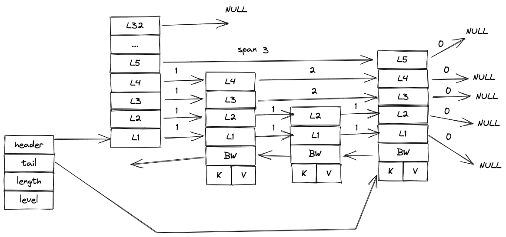

### 概述

我们基于 [ATC go-pmem: Native Support for Programming Persistent Memory in Go](https://www.usenix.org/system/files/atc20-george.pdf)

设计和实现了新的存储引擎用来加速 raft group 日志以及持久化 kv 数据的存储

### 设计概要

#### 引擎接口设计

```
OpenDB()

Put()

Get()

PutBatch()

Status()

```

#### skiplist 引擎




#### btree 引擎

TODO

#### 构建指导

- 修改后的 golang 编译器源码

https://github.com/jerrinsg/go-pmem

- 从源码构建 golang 编译器的方法

https://forum.golangbridge.org/t/gophersource-building-go-from-source/9722/12

#### 性能测试
