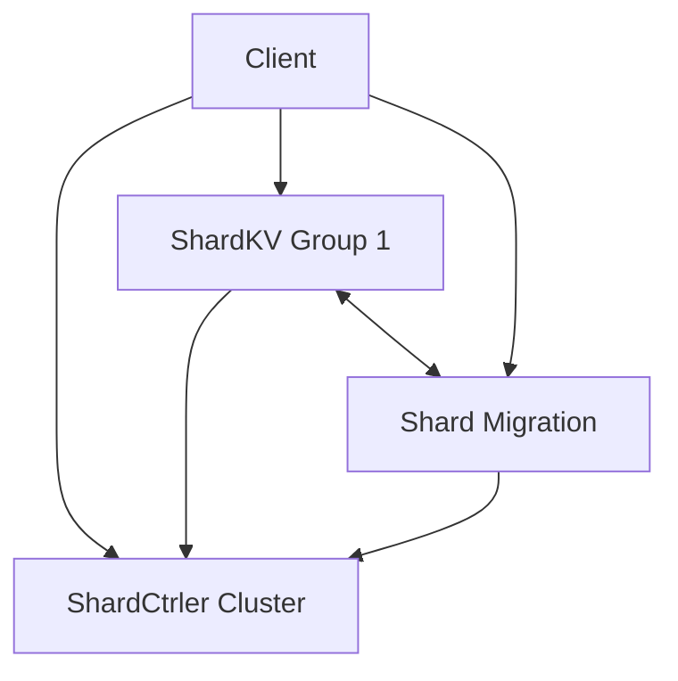

# Architecture Overview

eRaft is composed of three main layers that work together to provide a consistent and scalable storage service.

## 1. Consensus Layer (Raft)
The core of eRaft is the Raft consensus algorithm. It ensures that all nodes in a cluster (or "shard group") agree on the same sequence of operations, providing strong consistency even in the face of network partitions or node failures.

## 2. Configuration Layer (ShardCtrler)
The `ShardCtrler` cluster manages the "shard map". It decides which `ShardKV` group is responsible for which subset of the data (shards). It supports:
- **Join**: Adding new replica groups.
- **Leave**: Removing existing replica groups.
- **Move**: Manually reassigning a shard to a group.
- **Query**: Retrieving the current or historical configuration.

## 3. Storage Layer (ShardKV)
The `ShardKV` groups store the actual key-value data. Each group consists of multiple replicas running Raft. Data is partitioned into 10 shards (default). 

### High-Level Component Diagram

