# KV 存储系统


## 目录
1. [简介](#简介)
2. [项目结构](#项目结构)
3. [核心组件](#核心组件)
4. [架构概览](#架构概览)
5. [详细组件分析](#详细组件分析)
6. [依赖关系分析](#依赖关系分析)
7. [性能考虑](#性能考虑)
8. [故障排除指南](#故障排除指南)
9. [结论](#结论)
10. [附录](#附录)

## 简介

eRaft 是一个基于 Raft 共识算法的分布式键值存储系统。本项目专注于单机 KV 存储服务的实现，提供了完整的状态机复制、幂等性处理和重复请求检测机制。系统采用 LevelDB 作为持久化存储引擎，通过 gRPC 提供高效的客户端通信接口，并实现了完整的日志压缩和快照恢复机制。

该 KV 存储系统的核心目标是：
- 实现强一致性的分布式键值存储
- 提供高性能的状态机复制
- 确保操作的幂等性和重复请求检测
- 支持数据持久化和快速恢复
- 提供简洁易用的客户端 API

## 项目结构

eRaft 项目采用模块化的组织方式，主要包含以下核心目录：

```mermaid
graph TB
subgraph "KV 存储层"
KV[kvraft/] KV 存储核心
KVCommon[kvraft/common.go] 基础类型定义
KVServer[kvraft/server.go] KV 服务器实现
KVClient[kvraft/client.go] 客户端实现
KVGrpc[kvraft/grpc_server.go] gRPC 服务端
end
subgraph "共识算法层"
Raft[raft/] Raft 实现
RaftGo[raft/raft.go] 核心共识逻辑
RaftPersister[raft/persister.go] 持久化管理
RaftRPC[raft/rpc.go] RPC 接口定义
end
subgraph "客户端工具"
CmdKVServer[cmd/kvserver/] KV 服务器命令行
CmdKVClient[cmd/kvclient/] KV 客户端命令行
end
subgraph "协议定义"
Proto[kvraftpb/] 协议定义
KVProto[kvraftpb/kvraft.proto] KV 协议
end
subgraph "模型验证"
Models[models/] 线性化模型
KVModel[models/kv.go] KV 模型
end
KV --> Raft
KVClient --> KVProto
KVGrpc --> KV
CmdKVServer --> KV
CmdKVClient --> KVProto
KV --> Proto
```

**图表来源**
- [kvraft/server.go](file://kvraft/server.go#L1-L342)
- [raft/raft.go](file://raft/raft.go#L1-L726)
- [cmd/kvserver/main.go](file://cmd/kvserver/main.go#L1-L48)

**章节来源**
- [kvraft/server.go](file://kvraft/server.go#L1-L342)
- [raft/raft.go](file://raft/raft.go#L1-L726)
- [cmd/kvserver/main.go](file://cmd/kvserver/main.go#L1-L48)

## 核心组件

### KV 状态机接口

系统定义了统一的 KV 状态机接口，用于抽象不同的存储后端：

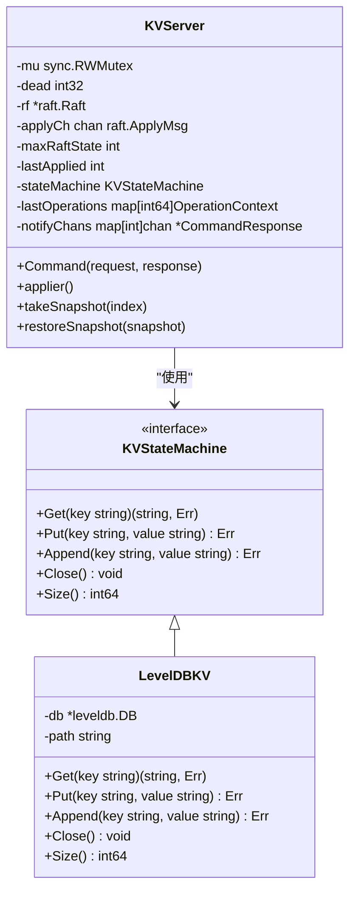

**图表来源**
- [kvraft/server.go](file://kvraft/server.go#L17-L86)
- [kvraft/server.go](file://kvraft/server.go#L88-L174)

### 客户端 API 设计

客户端提供了简洁的 API 接口，支持基本的键值操作：

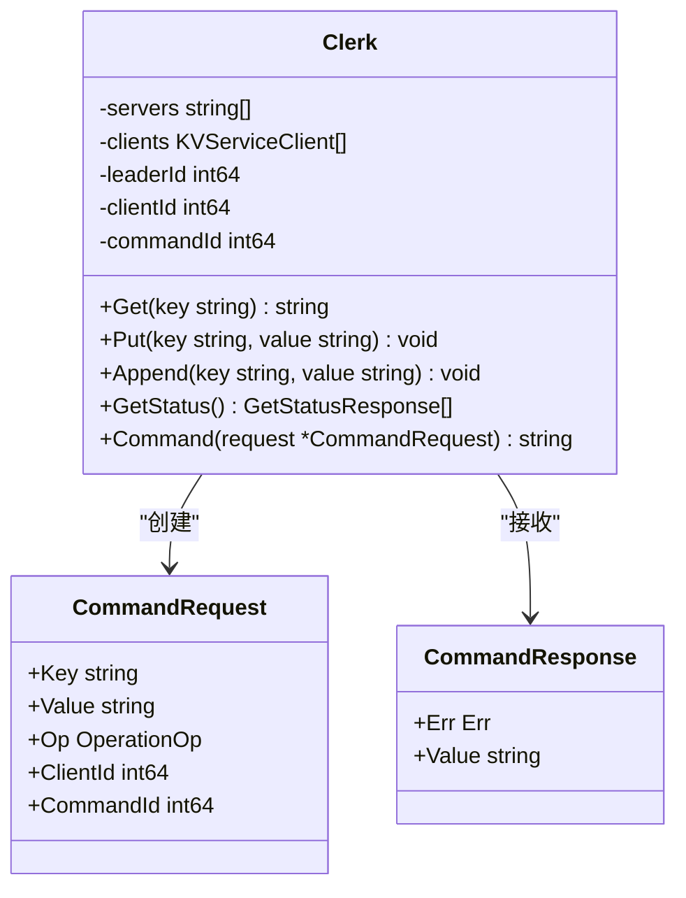

**图表来源**
- [kvraft/client.go](file://kvraft/client.go#L16-L22)
- [kvraft/common.go](file://kvraft/common.go#L72-L91)

**章节来源**
- [kvraft/server.go](file://kvraft/server.go#L17-L86)
- [kvraft/client.go](file://kvraft/client.go#L16-L46)
- [kvraft/common.go](file://kvraft/common.go#L20-L91)

## 架构概览

eRaft 的整体架构采用了分层设计，确保了良好的可维护性和扩展性：

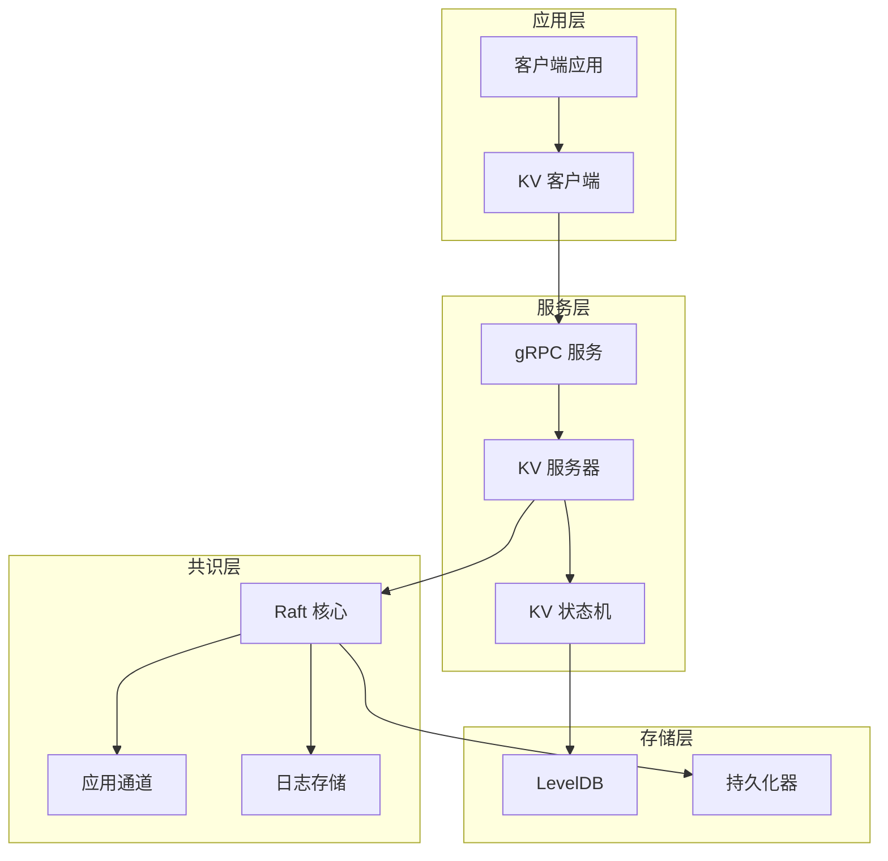

**图表来源**
- [kvraft/server.go](file://kvraft/server.go#L88-L174)
- [raft/raft.go](file://raft/raft.go#L36-L60)

系统的关键特性包括：

1. **状态机复制**: 通过 Raft 算法确保多个副本的一致性
2. **幂等性保证**: 通过客户端 ID 和命令 ID 实现重复请求检测
3. **持久化存储**: LevelDB 提供可靠的键值存储
4. **快照机制**: 支持日志压缩和快速恢复
5. **gRPC 通信**: 提供高效的跨网络通信

## 详细组件分析

### 状态机复制实现

KV 服务器实现了完整的状态机复制机制，确保所有操作都通过 Raft 日志进行复制：

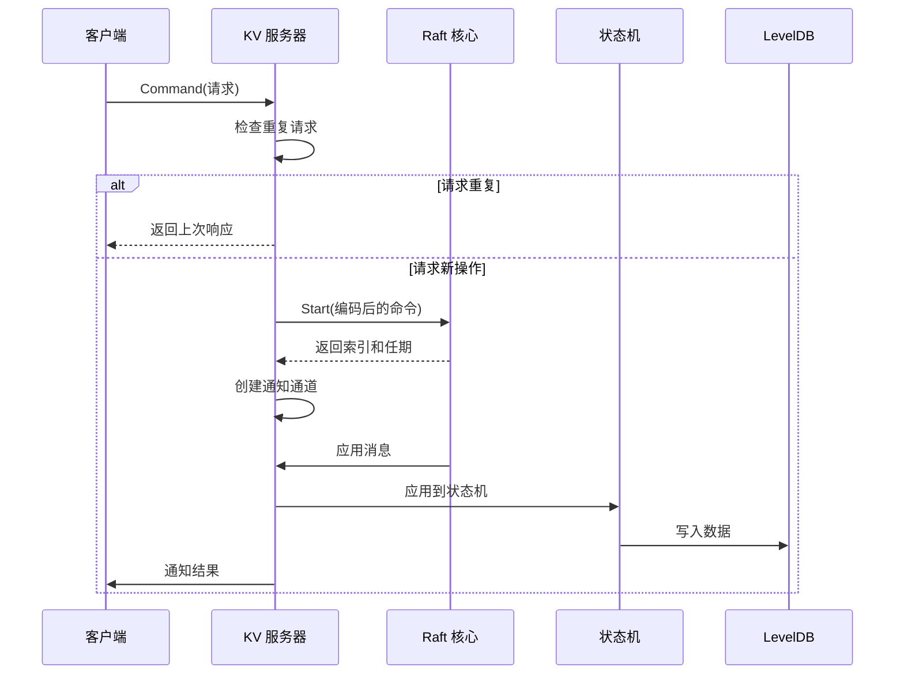

**图表来源**
- [kvraft/server.go](file://kvraft/server.go#L102-L139)
- [kvraft/server.go](file://kvraft/server.go#L177-L236)

**章节来源**
- [kvraft/server.go](file://kvraft/server.go#L102-L139)
- [kvraft/server.go](file://kvraft/server.go#L177-L236)

### 幂等性处理机制

系统通过客户端标识符和命令序列号实现幂等性保证：

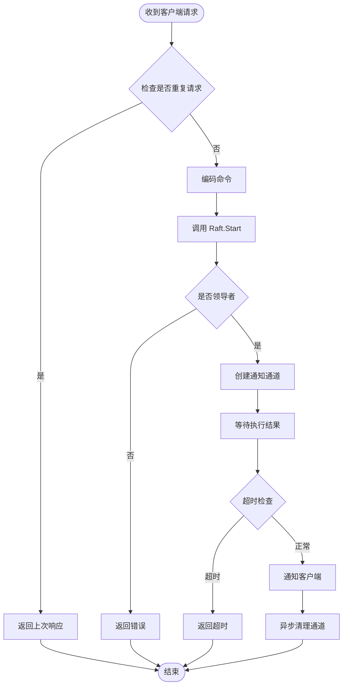

**图表来源**
- [kvraft/server.go](file://kvraft/server.go#L102-L139)
- [kvraft/server.go](file://kvraft/server.go#L143-L146)

**章节来源**
- [kvraft/server.go](file://kvraft/server.go#L143-L146)

### 重复请求检测机制

系统使用 `lastOperations` 映射表跟踪每个客户端的最新操作：

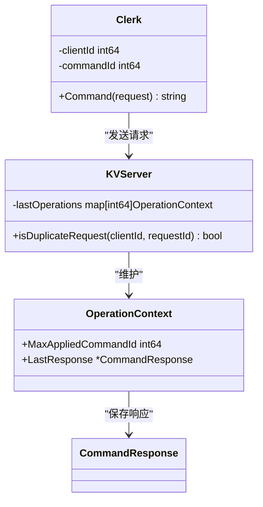

**图表来源**
- [kvraft/server.go](file://kvraft/server.go#L98-L99)
- [kvraft/server.go](file://kvraft/server.go#L143-L146)
- [kvraft/common.go](file://kvraft/common.go#L24-L27)

**章节来源**
- [kvraft/server.go](file://kvraft/server.go#L98-L99)
- [kvraft/server.go](file://kvraft/server.go#L143-L146)

### LevelDB 集成方案

系统使用 LevelDB 作为底层存储引擎，提供了高效的数据持久化：

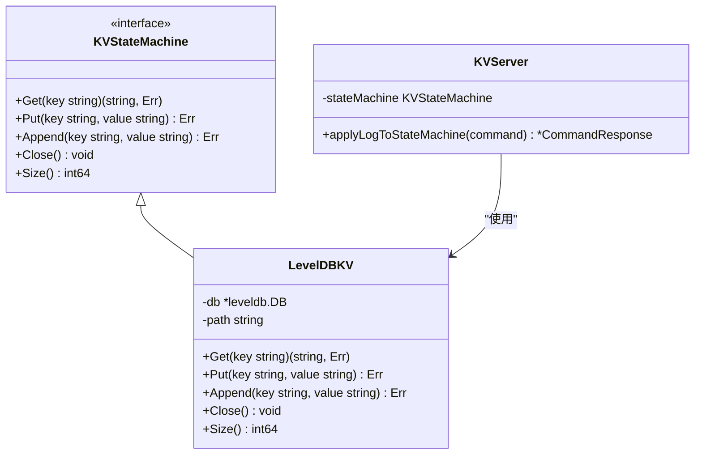

**图表来源**
- [kvraft/server.go](file://kvraft/server.go#L25-L86)
- [kvraft/server.go](file://kvraft/server.go#L292-L304)

**章节来源**
- [kvraft/server.go](file://kvraft/server.go#L25-L86)
- [kvraft/server.go](file://kvraft/server.go#L292-L304)

### 数据持久化策略

系统采用两阶段持久化策略，确保数据安全：

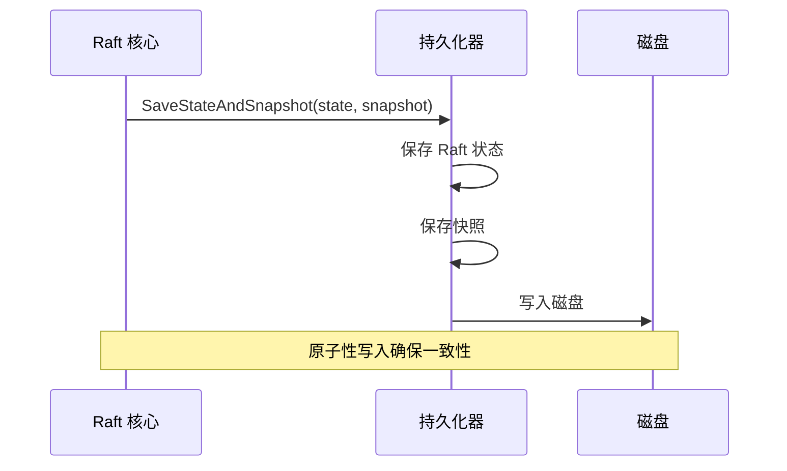

**图表来源**
- [raft/persister.go](file://raft/persister.go#L90-L98)
- [raft/raft.go](file://raft/raft.go#L150-L164)

**章节来源**
- [raft/persister.go](file://raft/persister.go#L90-L98)
- [raft/raft.go](file://raft/raft.go#L150-L164)

### 性能优化技巧

系统实现了多项性能优化措施：

1. **无锁读取**: 在重复请求检测中使用只读锁
2. **异步清理**: 异步清理过期的通知通道
3. **批量应用**: Raft 应用器批量处理已提交的日志
4. **内存池**: 复用缓冲区减少内存分配

**章节来源**
- [kvraft/server.go](file://kvraft/server.go#L113-L139)
- [raft/raft.go](file://raft/raft.go#L638-L664)

### 客户端 API 使用方法

客户端提供了简单易用的 API 接口：

```mermaid
flowchart TD
CreateClerk[创建客户端] --> MakeClerk[初始化连接]
MakeClerk --> Operations[执行操作]
Operations --> GetOp[Get(key)]
Operations --> PutOp[Put(key, value)]
Operations --> AppendOp[Append(key, value)]
GetOp --> HandleResult[处理结果]
PutOp --> HandleResult
AppendOp --> HandleResult
HandleResult --> Retry{需要重试?}
Retry --> |是| SwitchLeader[切换领导者]
Retry --> |否| End([完成])
SwitchLeader --> Operations
```

**图表来源**
- [kvraft/client.go](file://kvraft/client.go#L121-L143)

**章节来源**
- [kvraft/client.go](file://kvraft/client.go#L121-L143)

### 错误处理和重试机制

系统实现了完善的错误处理和重试机制：

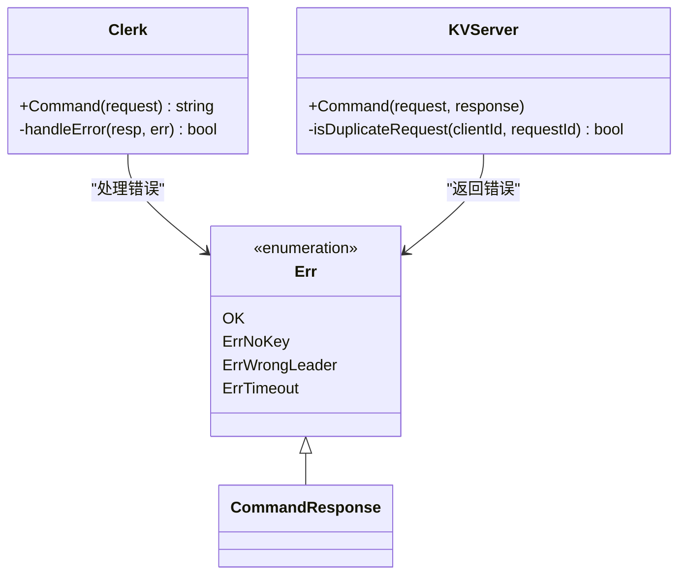

**图表来源**
- [kvraft/common.go](file://kvraft/common.go#L49-L70)
- [kvraft/client.go](file://kvraft/client.go#L135-L139)

**章节来源**
- [kvraft/common.go](file://kvraft/common.go#L49-L70)
- [kvraft/client.go](file://kvraft/client.go#L135-L139)

### 状态机应用流程

状态机应用流程确保了操作的正确执行和幂等性：

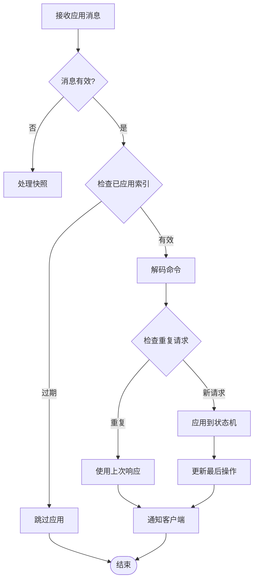

**图表来源**
- [kvraft/server.go](file://kvraft/server.go#L177-L236)

**章节来源**
- [kvraft/server.go](file://kvraft/server.go#L177-L236)

### 日志压缩和快照恢复机制

系统实现了高效的日志压缩和快照恢复机制：

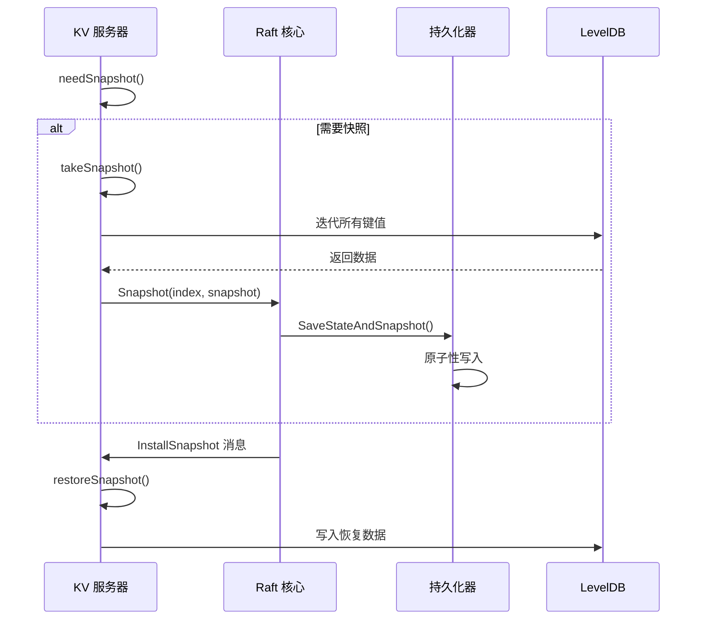

**图表来源**
- [kvraft/server.go](file://kvraft/server.go#L238-L258)
- [kvraft/server.go](file://kvraft/server.go#L260-L279)
- [raft/raft.go](file://raft/raft.go#L120-L144)

**章节来源**
- [kvraft/server.go](file://kvraft/server.go#L238-L258)
- [kvraft/server.go](file://kvraft/server.go#L260-L279)
- [raft/raft.go](file://raft/raft.go#L120-L144)

## 依赖关系分析

系统各组件之间的依赖关系如下：

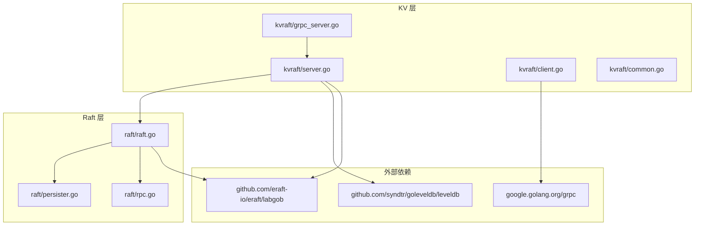

**图表来源**
- [kvraft/server.go](file://kvraft/server.go#L3-L15)
- [raft/raft.go](file://raft/raft.go#L20-L27)

**章节来源**
- [kvraft/server.go](file://kvraft/server.go#L3-L15)
- [raft/raft.go](file://raft/raft.go#L20-L27)

## 性能考虑

### 并发控制策略

系统采用了多层并发控制机制：

1. **读写分离**: 使用 RWMutex 实现读写分离
2. **无锁优化**: 在重复请求检测中使用只读锁
3. **异步处理**: 异步清理过期资源

### 内存管理

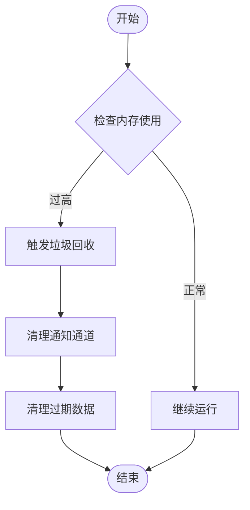

### 网络通信优化

系统通过以下方式优化网络通信：
- 使用 gRPC 提供高效的二进制协议
- 实现连接池避免频繁建立连接
- 支持批量请求处理

## 故障排除指南

### 常见问题诊断

1. **连接失败**: 检查 gRPC 服务器是否启动
2. **超时错误**: 调整 ExecuteTimeout 参数
3. **重复请求**: 检查客户端 ID 是否唯一
4. **快照异常**: 验证磁盘空间和权限

### 调试信息

系统提供了详细的调试输出，可以通过设置 Debug 变量启用：

**章节来源**
- [kvraft/common.go](file://kvraft/common.go#L13-L18)

## 结论

eRaft 的 KV 存储系统是一个设计精良的分布式键值存储解决方案。系统通过以下关键特性确保了可靠性、性能和易用性：

1. **强一致性保证**: 基于 Raft 算法的状态机复制
2. **幂等性处理**: 完善的重复请求检测机制
3. **高性能存储**: LevelDB 提供的高效持久化
4. **简洁 API**: 易于使用的客户端接口
5. **完整监控**: 详细的运行状态报告

该系统为开发者提供了良好的扩展基础，可以轻松集成到更大的分布式系统中。

## 附录

### 使用示例

#### 启动 KV 服务器
```bash
./output/kvserver -id 0 -addrs "localhost:5001,localhost:5002,localhost:5003" -db "kvserver-data"
```

#### 客户端操作示例
```bash
# 获取数据
./output/kvclient -addrs "localhost:5001,localhost:5002,localhost:5003" -op get -key "test"

# 写入数据
./output/kvclient -addrs "localhost:5001,localhost:5002,localhost:5003" -op put -key "test" -value "hello"

# 追加数据
./output/kvclient -addrs "localhost:5001,localhost:5002,localhost:5003" -op append -key "test" -value " world"
```

### 扩展指南

开发者可以按照以下方式进行扩展：

1. **自定义存储后端**: 实现 KVStateMachine 接口
2. **添加新操作类型**: 扩展 OperationOp 枚举
3. **性能优化**: 添加缓存层或批量处理
4. **监控增强**: 添加指标收集和告警