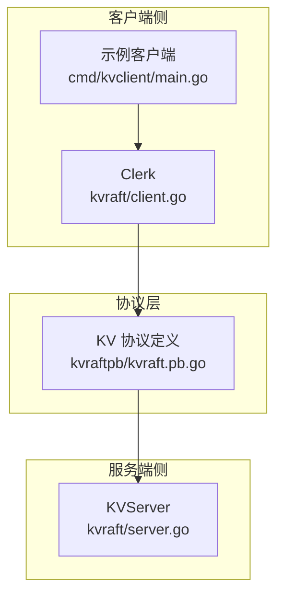
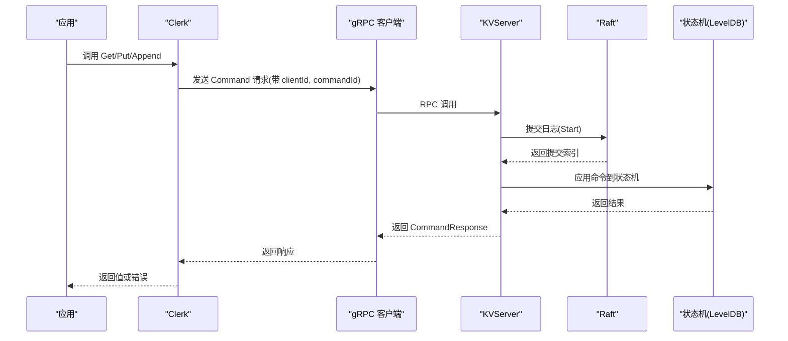
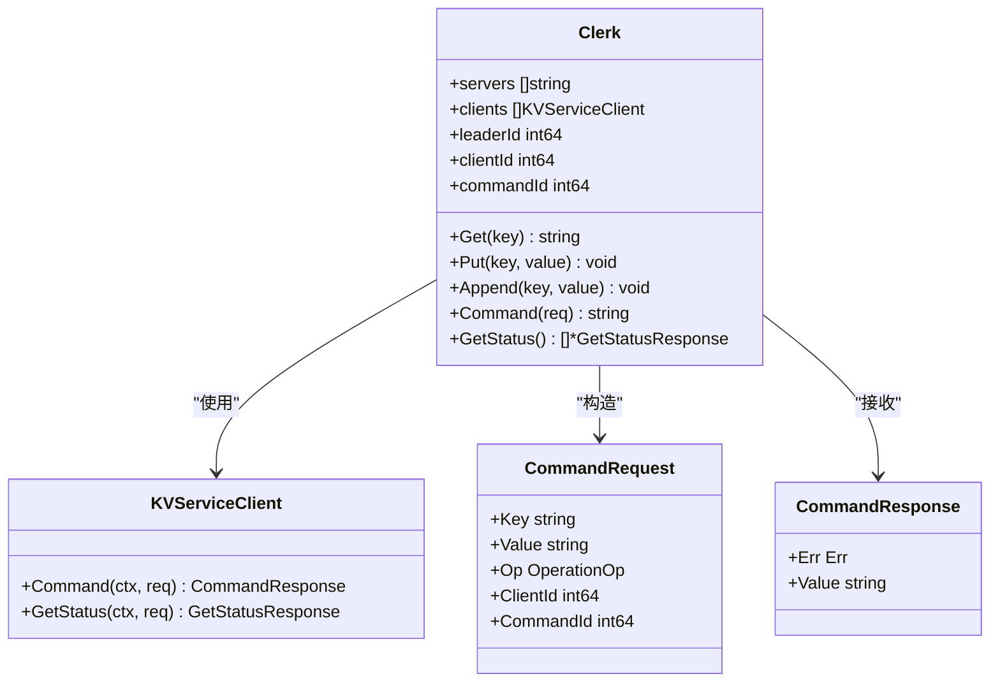

# KV 客户端 API

## 目录
1. [简介](#简介)
2. [项目结构](#项目结构)
3. [核心组件](#核心组件)
4. [架构总览](#架构总览)
5. [组件详解](#组件详解)
6. [依赖关系分析](#依赖关系分析)
7. [性能与可扩展性](#性能与可扩展性)
8. [故障排查指南](#故障排查指南)
9. [结论](#结论)
10. [附录：常用示例与最佳实践](#附录常用示例与最佳实践)

## 简介
本文件面向开发者，系统化介绍 eRaft 中 KV 客户端 API（Clerk）的设计与使用。内容覆盖：
- Clerk 结构体设计与生命周期
- 初始化、连接管理与状态查询
- 核心 API：Get、Put、Append 的使用模式与参数说明
- 错误处理与重试策略（网络异常、领导者变更、超时）
- 配置项与调优建议（超时、重试、连接池）
- 并发与线程安全特性
- 扩展与自定义指南

## 项目结构
KV 客户端位于 kvraft 包中，通过 gRPC 与 KV 服务端交互；命令协议由 kvraftpb 定义；示例客户端在 cmd/kvclient 中。

图表来源
- [kvraft/client.go](file://kvraft/client.go#L16-L46)
- [cmd/kvclient/main.go](file://cmd/kvclient/main.go#L11-L46)
- [kvraftpb/kvraft.pb.go](file://kvraftpb/kvraft.pb.go#L72-L149)
- [kvraft/server.go](file://kvraft/server.go#L88-L100)

章节来源
- [kvraft/client.go](file://kvraft/client.go#L1-L144)
- [cmd/kvclient/main.go](file://cmd/kvclient/main.go#L1-L47)
- [kvraftpb/kvraft.pb.go](file://kvraftpb/kvraft.pb.go#L1-L200)
- [kvraft/server.go](file://kvraft/server.go#L1-L200)

## 核心组件
- Clerk：客户端主体，封装服务器地址列表、gRPC 客户端集合、当前领导者索引、客户端唯一标识与请求序号等。
- 命令类型与错误枚举：统一的请求/响应模型与错误码。
- 示例客户端：演示如何初始化 Clerk 并执行 Get/Put/Append/status。

章节来源
- [kvraft/client.go](file://kvraft/client.go#L16-L46)
- [kvraft/common.go](file://kvraft/common.go#L20-L92)
- [cmd/kvclient/main.go](file://cmd/kvclient/main.go#L11-L46)

## 架构总览
Clerk 通过 gRPC 与 KVServer 通信，采用“领导者轮询”的简单重试策略。服务端基于 Raft 实现一致性，应用日志后更新状态机并返回结果。

图表来源
- [kvraft/client.go](file://kvraft/client.go#L121-L143)
- [kvraft/server.go](file://kvraft/server.go#L102-L139)
- [kvraftpb/kvraft.pb.go](file://kvraftpb/kvraft.pb.go#L72-L149)

## 组件详解

### Clerk 结构体与初始化
- 字段
  - servers：服务端地址列表
  - clients：对应地址的 gRPC 客户端集合
  - leaderId：当前尝试的领导者索引
  - clientId：客户端唯一标识（随机生成）
  - commandId：请求序号（每个客户端自增）
- 初始化
  - MakeClerk：建立与各服务器的 gRPC 连接，构造 Clerk
  - MakeLabrpcClerk：在测试环境中使用 labrpc 适配器

章节来源
- [kvraft/client.go](file://kvraft/client.go#L16-L46)
- [kvraft/client.go](file://kvraft/client.go#L74-L87)

### 核心 API 使用说明
- Get(key)
  - 参数：键名
  - 行为：内部构造 OpGet 请求并调用 Command
- Put(key, value)
  - 参数：键名、值
  - 行为：内部构造 OpPut 请求并调用 Command
- Append(key, value)
  - 参数：键名、值
  - 行为：内部构造 OpAppend 请求并调用 Command
- Command(request)
  - 内部流程：填充 clientId/commandId，按 leaderId 发送 RPC，若返回错误或超时则轮询下一个服务器，成功后自增 commandId
- GetStatus()
  - 对每个客户端发起短超时查询，聚合状态或标记离线

章节来源
- [kvraft/client.go](file://kvraft/client.go#L89-L113)
- [kvraft/client.go](file://kvraft/client.go#L121-L143)

### 错误处理与重试机制
- 错误类型
  - OK、ErrNoKey、ErrWrongLeader、ErrTimeout
- 重试策略
  - 当收到 ErrWrongLeader 或 ErrTimeout，或 RPC 失败时，切换到下一个服务器（轮询），并短暂休眠避免忙循环
- 超时控制
  - 客户端侧：每次 RPC 使用固定超时常量
  - 服务端侧：等待应用结果的超时时间与客户端一致

章节来源
- [kvraft/common.go](file://kvraft/common.go#L49-L70)
- [kvraft/common.go](file://kvraft/common.go#L9)
- [kvraft/client.go](file://kvraft/client.go#L134-L139)
- [kvraft/server.go](file://kvraft/server.go#L128-L131)

### 状态查询与监控
- GetStatus：对每个 gRPC 客户端发起短超时查询，聚合返回状态或标记离线
- 用途：运维监控、健康检查

章节来源
- [kvraft/client.go](file://kvraft/client.go#L100-L113)

### 线程安全与并发访问
- Clerk 内部字段（clientId、commandId、leaderId）在单个 Clerk 实例内被修改，但未见显式锁保护
- 测试中多协程并发调用 Clerk 的 Get/Put/Append 是通过独立 Clerk 实例实现的
- 建议：若需要在多协程共享同一 Clerk，请自行加锁或为每个协程创建独立 Clerk 实例

章节来源
- [kvraft/test_test.go](file://kvraft/test_test.go#L102-L126)
- [kvraft/test_test.go](file://kvraft/test_test.go#L44-L92)

### 配置与调优
- 超时设置
  - ExecuteTimeout：客户端侧 RPC 超时常量
- 重试次数
  - 默认无上限重试，直到成功或遍历完所有服务器
- 连接池管理
  - MakeClerk 为每个服务器地址建立一个 gRPC 连接；未实现连接复用或自动重连逻辑
- 测试环境下的客户端连接
  - MakeLabrpcClerk：在测试网络中使用 labrpc 适配器

章节来源
- [kvraft/common.go](file://kvraft/common.go#L9)
- [kvraft/client.go](file://kvraft/client.go#L30-L46)
- [kvraft/config.go](file://kvraft/config.go#L197-L215)

### 数据模型与线性化验证
- 模型定义：KvModel 将操作按键分区，支持线性化检查
- 测试中使用该模型对并发操作进行正确性验证

章节来源
- [models/kv.go](file://models/kv.go#L10-L73)
- [kvraft/test_test.go](file://kvraft/test_test.go#L24-L42)

## 依赖关系分析

图表来源
- [kvraft/client.go](file://kvraft/client.go#L16-L46)
- [kvraftpb/kvraft.pb.go](file://kvraftpb/kvraft.pb.go#L72-L149)
- [kvraftpb/kvraft.pb.go](file://kvraftpb/kvraft.pb.go#L151-L200)

章节来源
- [kvraft/client.go](file://kvraft/client.go#L16-L46)
- [kvraftpb/kvraft.pb.go](file://kvraftpb/kvraft.pb.go#L72-L200)

## 性能与可扩展性
- 超时与重试
  - 固定超时与轮询重试简单可靠，但在高延迟或大规模集群下可能增加尾延迟
- 连接数
  - 每个服务器一个连接，连接数随副本数线性增长
- 建议
  - 在高并发场景下考虑引入连接池、重试上限、指数退避与背压策略
  - 为不同操作设置差异化超时（如 Get 可更短）

[本节为通用性能讨论，不直接分析具体文件]

## 故障排查指南
- 常见问题
  - ErrWrongLeader：当前节点非领导者，客户端会自动轮询下一个节点
  - ErrTimeout：RPC 超时或服务端等待超时，建议检查网络与服务端负载
  - 离线节点：GetStatus 显示 Offline，检查服务端是否启动或防火墙
- 排查步骤
  - 使用 GetStatus 查看各节点状态
  - 检查客户端与服务端之间的网络连通性
  - 关注服务端日志与 Raft 状态
- 重试与幂等
  - 客户端通过 commandId 保证幂等，避免重复提交导致副作用

章节来源
- [kvraft/client.go](file://kvraft/client.go#L100-L113)
- [kvraft/server.go](file://kvraft/server.go#L102-L139)
- [kvraft/common.go](file://kvraft/common.go#L49-L70)

## 结论
KV 客户端 API 设计简洁，通过 gRPC 与 Raft 支持的 KVServer 交互，具备基本的领导者轮询重试与超时控制。对于生产环境，建议结合连接池、重试上限、指数退避与线性化验证工具进一步提升稳定性与可观测性。

[本节为总结性内容，不直接分析具体文件]

## 附录：常用示例与最佳实践

### 快速开始：示例客户端
- 启动方式：通过命令行参数指定服务器地址、操作类型与键值
- 典型用法：Get/Put/Append/status

章节来源
- [cmd/kvclient/main.go](file://cmd/kvclient/main.go#L11-L46)

### 幂等与并发
- 幂等保障：客户端通过 (clientId, commandId) 标识请求，服务端去重
- 并发建议：每个协程使用独立 Clerk 实例，避免共享状态竞争

章节来源
- [kvraft/client.go](file://kvraft/client.go#L121-L143)
- [kvraft/server.go](file://kvraft/server.go#L102-L146)
- [kvraft/test_test.go](file://kvraft/test_test.go#L102-L126)

### 自定义与扩展
- 自定义重试策略：在 Clerk.Command 中加入最大重试次数、指数退避与背压
- 连接池：为每个服务器维护多个连接，按需选择空闲连接
- 监控指标：采集 Get/Put/Append 的延迟、错误分布与领导者切换频率
- 线性化验证：使用 models/KvModel 对历史操作进行线性化检查

章节来源
- [kvraft/client.go](file://kvraft/client.go#L121-L143)
- [models/kv.go](file://models/kv.go#L20-L73)