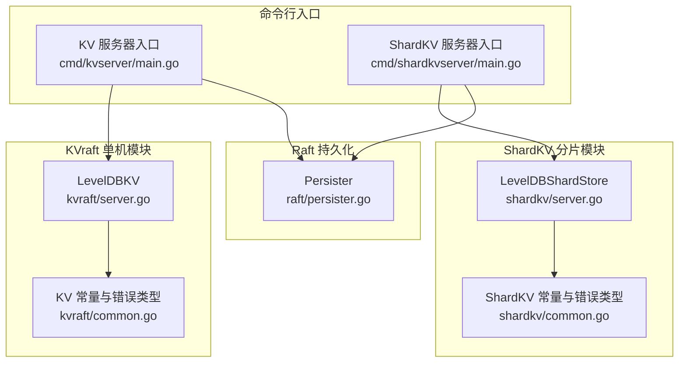
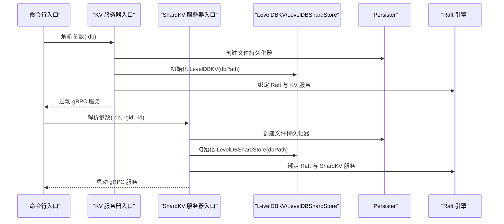
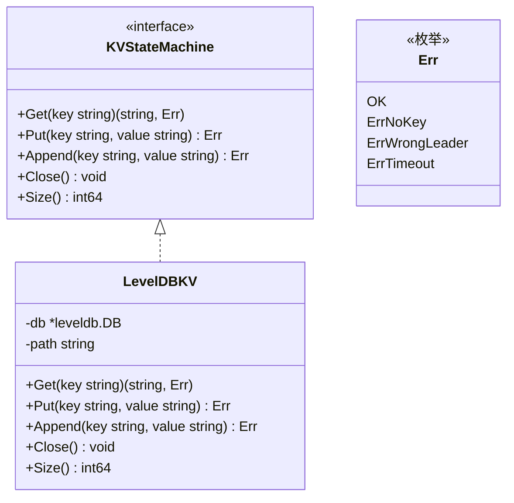
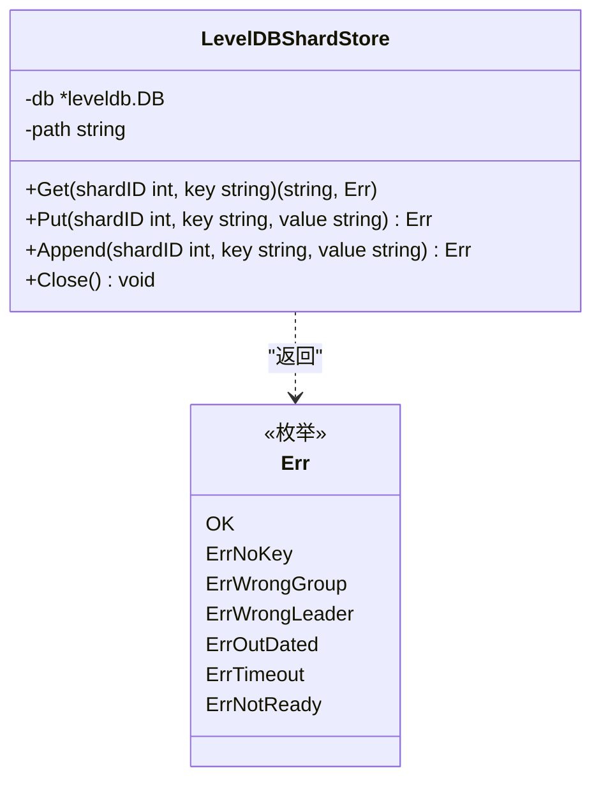
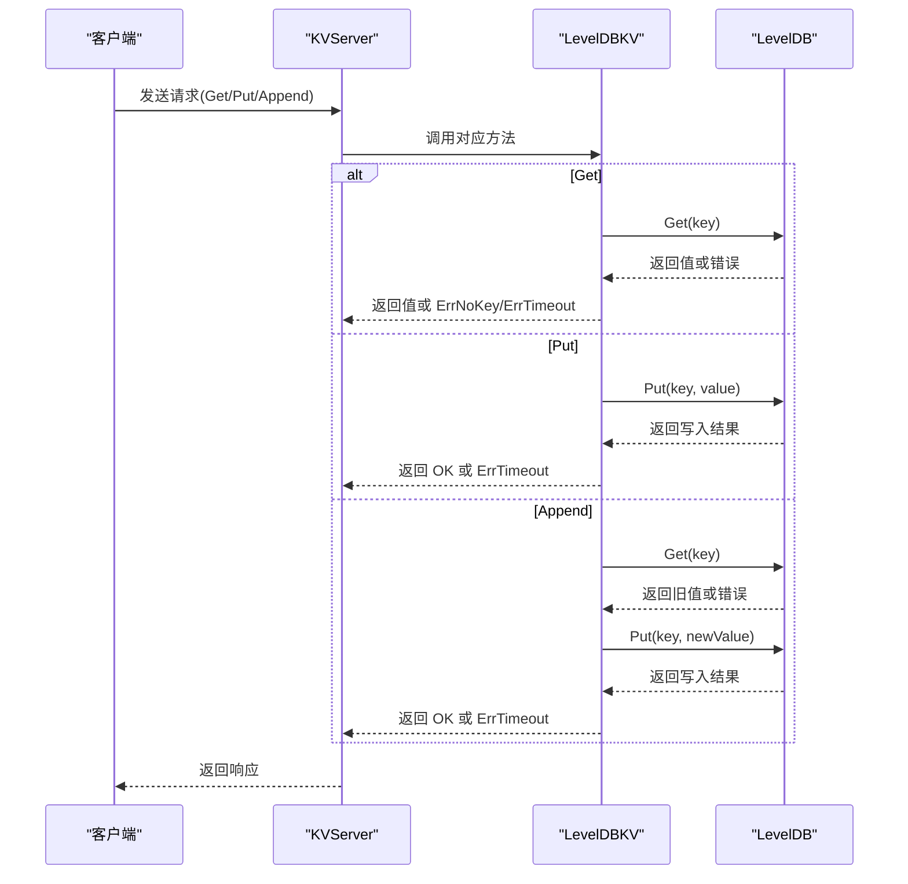
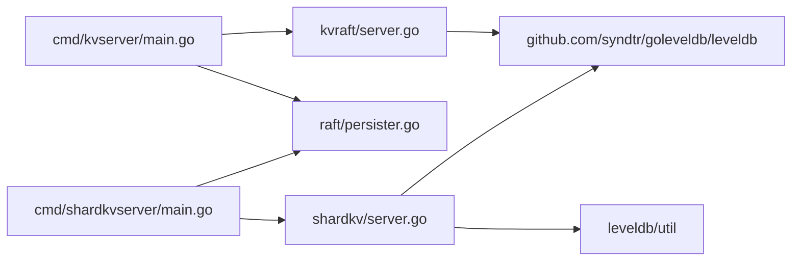
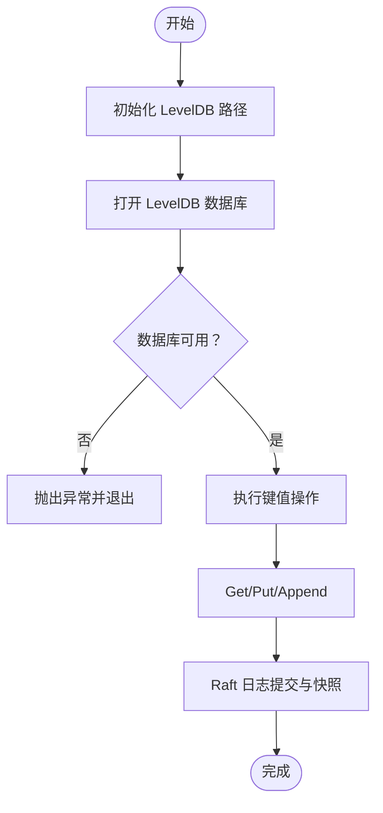

# LevelDB 存储集成

<cite>
**本文档引用的文件**
- [kvraft/server.go](file://kvraft/server.go)
- [shardkv/server.go](file://shardkv/server.go)
- [kvraft/common.go](file://kvraft/common.go)
- [shardkv/common.go](file://shardkv/common.go)
- [raft/persister.go](file://raft/persister.go)
- [cmd/kvserver/main.go](file://cmd/kvserver/main.go)
- [cmd/shardkvserver/main.go](file://cmd/shardkvserver/main.go)
- [models/kv.go](file://models/kv.go)
- [README.md](file://README.md)
</cite>

## 目录
1. [简介](#简介)
2. [项目结构](#项目结构)
3. [核心组件](#核心组件)
4. [架构总览](#架构总览)
5. [详细组件分析](#详细组件分析)
6. [依赖关系分析](#依赖关系分析)
7. [性能考量](#性能考量)
8. [故障排查指南](#故障排查指南)
9. [结论](#结论)
10. [附录](#附录)

## 简介
本文件聚焦于 eRaft 中基于 LevelDB 的存储集成，系统性阐述 LevelDBKV 与 LevelDBShardStore 的实现细节，包括数据库初始化、连接管理、资源清理；键值操作（Get/Put/Append）的底层实现；数据持久化策略（写入优化与事务处理）；存储引擎的性能特征与调优参数；存储路径管理、数据库文件组织与磁盘空间监控最佳实践；以及错误处理机制与故障恢复策略，并提供扩展与定制指南。

## 项目结构
eRaft 在 kvraft 与 shardkv 模块中分别实现了两套基于 LevelDB 的存储后端：
- kvraft：单机 KV 存储，使用 LevelDBKV 实现
- shardkv：分片 KV 存储，使用 LevelDBShardStore 实现

此外，raft 层提供通用的持久化器 Persister，用于 Raft 日志与快照的持久化；命令行入口通过 main.go 启动服务时指定 LevelDB 路径。

图表来源
- [kvraft/server.go](file://kvraft/server.go#L25-L86)
- [shardkv/server.go](file://shardkv/server.go#L25-L60)
- [raft/persister.go](file://raft/persister.go#L17-L111)
- [cmd/kvserver/main.go](file://cmd/kvserver/main.go#L16-L47)
- [cmd/shardkvserver/main.go](file://cmd/shardkvserver/main.go#L18-L58)

章节来源
- [kvraft/server.go](file://kvraft/server.go#L1-L100)
- [shardkv/server.go](file://shardkv/server.go#L1-L60)
- [raft/persister.go](file://raft/persister.go#L1-L111)
- [cmd/kvserver/main.go](file://cmd/kvserver/main.go#L1-L48)
- [cmd/shardkvserver/main.go](file://cmd/shardkvserver/main.go#L1-L59)

## 核心组件
- LevelDBKV：单机 KV 存储实现，提供 Get/Put/Append 接口与 Close/Size 能力
- LevelDBShardStore：分片 KV 存储实现，按 shardID 前缀化键进行隔离
- KV 错误类型：统一的 Err 枚举，区分无键、错误领导者、超时等
- Persister：Raft 状态与快照的文件持久化器

章节来源
- [kvraft/server.go](file://kvraft/server.go#L17-L86)
- [shardkv/server.go](file://shardkv/server.go#L25-L60)
- [kvraft/common.go](file://kvraft/common.go#L49-L70)
- [raft/persister.go](file://raft/persister.go#L17-L111)

## 架构总览
下图展示了 KVraft 与 ShardKV 的存储层与上层协作关系，以及命令行入口如何初始化 LevelDB 路径与持久化器。

图表来源
- [cmd/kvserver/main.go](file://cmd/kvserver/main.go#L16-L47)
- [cmd/shardkvserver/main.go](file://cmd/shardkvserver/main.go#L18-L58)
- [kvraft/server.go](file://kvraft/server.go#L30-L36)
- [shardkv/server.go](file://shardkv/server.go#L30-L36)
- [raft/persister.go](file://raft/persister.go#L28-L32)

## 详细组件分析

### LevelDBKV 组件分析
LevelDBKV 是 kvraft 模块中的单机 KV 存储实现，负责键值读取、写入与追加，以及资源清理与大小统计。

图表来源
- [kvraft/server.go](file://kvraft/server.go#L17-L28)
- [kvraft/server.go](file://kvraft/server.go#L38-L86)
- [kvraft/common.go](file://kvraft/common.go#L49-L70)

关键实现要点
- 数据库初始化：通过 OpenFile 打开指定路径的 LevelDB，失败直接 panic
- 连接管理：持有 leveldb.DB 句柄，生命周期由 KVServer 控制
- 资源清理：Close 调用 leveldb.DB.Close
- 键值操作：
  - Get：查询键，不存在返回 ErrNoKey，其他错误返回 ErrTimeout
  - Put：直接写入键值
  - Append：先读旧值，再拼接新值后写回
- 大小统计：遍历存储目录累加文件大小

章节来源
- [kvraft/server.go](file://kvraft/server.go#L25-L86)
- [kvraft/common.go](file://kvraft/common.go#L49-L70)

### LevelDBShardStore 组件分析
LevelDBShardStore 是 shardkv 模块中的分片存储实现，通过在键前添加 "s_<shardID>_" 前缀实现逻辑隔离。

图表来源
- [shardkv/server.go](file://shardkv/server.go#L25-L60)
- [shardkv/common.go](file://shardkv/common.go#L38-L68)

关键实现要点
- 数据库初始化：OpenFile 打开指定路径
- 键命名规范：使用 "s_<shardID>_<key>" 前缀
- 键值操作：Get/Put/Append 基于前缀化键进行读写
- 资源清理：Close 关闭数据库

章节来源
- [shardkv/server.go](file://shardkv/server.go#L25-L60)
- [shardkv/common.go](file://shardkv/common.go#L38-L68)

### 键值操作底层实现流程
以下序列图展示 KVraft 中 Get/Put/Append 的调用链与错误处理。

图表来源
- [kvraft/server.go](file://kvraft/server.go#L38-L68)
- [kvraft/common.go](file://kvraft/common.go#L49-L70)

章节来源
- [kvraft/server.go](file://kvraft/server.go#L38-L68)
- [kvraft/common.go](file://kvraft/common.go#L49-L70)

### 数据持久化策略与事务处理
- 写入优化
  - 使用 leveldb 默认写入路径，未显式启用批量写入或自定义写选项
  - Append 操作采用“读-拼接-写”模式，非原子性，存在并发竞争风险
- 事务处理
  - 代码未使用 leveldb Batch 或 WriteOptions 事务封装
  - Raft 层通过日志复制保证最终一致性，存储层不承担分布式事务语义
- 快照与持久化
  - Persister 提供 Raft 状态与快照的文件持久化，支持 SaveStateAndSnapshot 原子写入

章节来源
- [raft/persister.go](file://raft/persister.go#L90-L98)
- [kvraft/server.go](file://kvraft/server.go#L57-L68)

### 存储路径管理与文件组织
- kvserver：通过命令行参数 -db 指定 LevelDB 路径，默认 "kvserver-data"
- shardkvserver：根据 -gid 与 -id 生成唯一路径前缀，如 "data/skv100_0"
- 文件组织：LevelDB 自动维护 SSTable、WAL、MANIFEST 等文件，无需应用层干预

章节来源
- [cmd/kvserver/main.go](file://cmd/kvserver/main.go#L19-L32)
- [cmd/shardkvserver/main.go](file://cmd/shardkvserver/main.go#L23-L43)

### 磁盘空间监控与最佳实践
- Size 方法：遍历存储目录累加文件大小，可用于监控
- 最佳实践
  - 定期检查存储目录大小，设置阈值告警
  - 配置合适的磁盘空间与 IO 性能，避免 WAL 写入瓶颈
  - 对高并发 Append 场景，建议在应用层合并写入或引入批处理

章节来源
- [kvraft/server.go](file://kvraft/server.go#L74-L86)
- [shardkv/server.go](file://shardkv/server.go#L58-L60)

### 错误处理机制与故障恢复
- 错误类型
  - KVraft：OK、ErrNoKey、ErrWrongLeader、ErrTimeout
  - ShardKV：在 KVraft 基础上增加 ErrWrongGroup、ErrOutDated、ErrNotReady
- 故障恢复
  - LevelDB 打开失败直接 panic，需确保路径可写且权限正确
  - 通过 Raft 快照与日志重放恢复状态机，存储层仅负责数据可用性

章节来源
- [kvraft/common.go](file://kvraft/common.go#L49-L70)
- [shardkv/common.go](file://shardkv/common.go#L38-L68)

## 依赖关系分析
- kvraft/server.go 依赖 goleveldb/leveldb
- shardkv/server.go 依赖 goleveldb/leveldb 并使用 util 包（用于范围扫描）
- 两者均依赖各自模块的 Err 类型与公共常量
- 入口 main.go 通过 MakeFilePersister 与 OpenFile 初始化存储与持久化

图表来源
- [cmd/kvserver/main.go](file://cmd/kvserver/main.go#L16-L47)
- [cmd/shardkvserver/main.go](file://cmd/shardkvserver/main.go#L18-L58)
- [kvraft/server.go](file://kvraft/server.go#L14-L14)
- [shardkv/server.go](file://shardkv/server.go#L19-L22)

章节来源
- [cmd/kvserver/main.go](file://cmd/kvserver/main.go#L1-L48)
- [cmd/shardkvserver/main.go](file://cmd/shardkvserver/main.go#L1-L59)
- [kvraft/server.go](file://kvraft/server.go#L1-L15)
- [shardkv/server.go](file://shardkv/server.go#L1-L23)

## 性能考量
- LevelDB 默认配置已满足大多数场景，但可根据工作负载调整：
  - 写入吞吐：增大 write_buffer，启用压缩（leveldb 默认 Snappy）
  - 读放大：合理设置 level_size_multiplier 与 block_cache_size
  - 追加写：考虑在应用层合并多次 Append，减少读-写往返
- 当前实现未使用 leveldb Batch，若对写入延迟敏感，可在存储层引入 WriteBatch
- Raft 快照与日志压缩可显著降低存储占用，建议结合 Persister 的原子写入策略

[本节为通用性能指导，不直接分析具体文件]

## 故障排查指南
- 打不开数据库
  - 检查 -db 路径是否存在、权限是否正确
  - 确认同一时间只有一个进程打开该路径
- 查询返回 ErrNoKey
  - 确认键是否存在，或在应用层进行幂等处理
- 写入返回 ErrTimeout
  - 检查磁盘 IO、空间与文件句柄限制
  - 观察 LevelDB 是否频繁触发 Compaction
- Append 并发问题
  - 当前实现非原子，可能出现竞态；建议在应用层去重或合并
- 磁盘空间不足
  - 使用 Size 方法监控，及时清理或扩容

章节来源
- [kvraft/server.go](file://kvraft/server.go#L38-L68)
- [kvraft/common.go](file://kvraft/common.go#L49-L70)

## 结论
eRaft 的 LevelDB 存储集成简洁可靠，通过 LevelDBKV 与 LevelDBShardStore 提供了基础的键值存取能力。其设计遵循“存储层只负责数据可用性”的原则，一致性与容错由 Raft 保障。对于高并发与低延迟场景，建议在应用层引入批处理与合并策略，并在存储层评估是否启用 WriteBatch 与更细粒度的压缩策略。

[本节为总结性内容，不直接分析具体文件]

## 附录

### API 定义与行为
- LevelDBKV
  - Get(key) -> (string, Err)
  - Put(key, value) -> Err
  - Append(key, value) -> Err
  - Close() -> void
  - Size() -> int64
- LevelDBShardStore
  - Get(shardID, key) -> (string, Err)
  - Put(shardID, key, value) -> Err
  - Append(shardID, key, value) -> Err
  - Close() -> void

章节来源
- [kvraft/server.go](file://kvraft/server.go#L17-L28)
- [shardkv/server.go](file://shardkv/server.go#L25-L28)

### 概念性工作流（概念图）

[本图为概念性流程示意，不映射到具体源码文件]