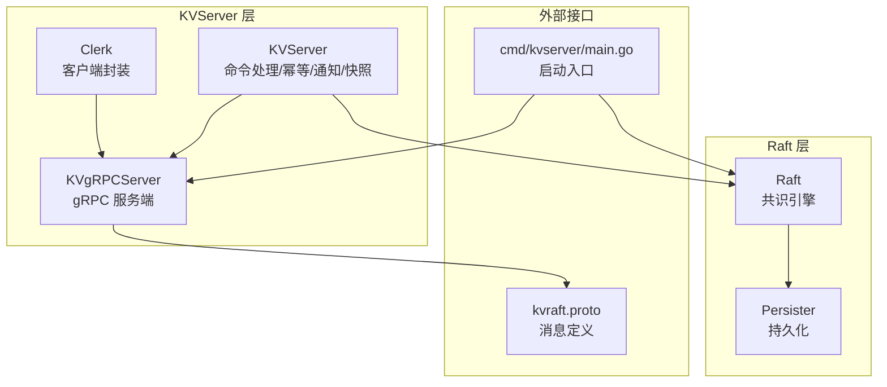
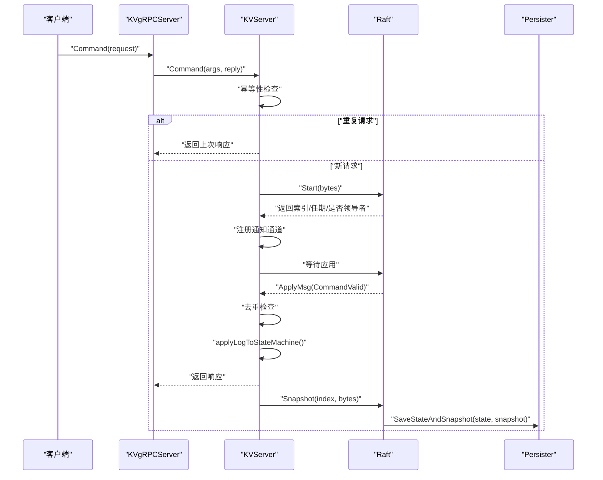
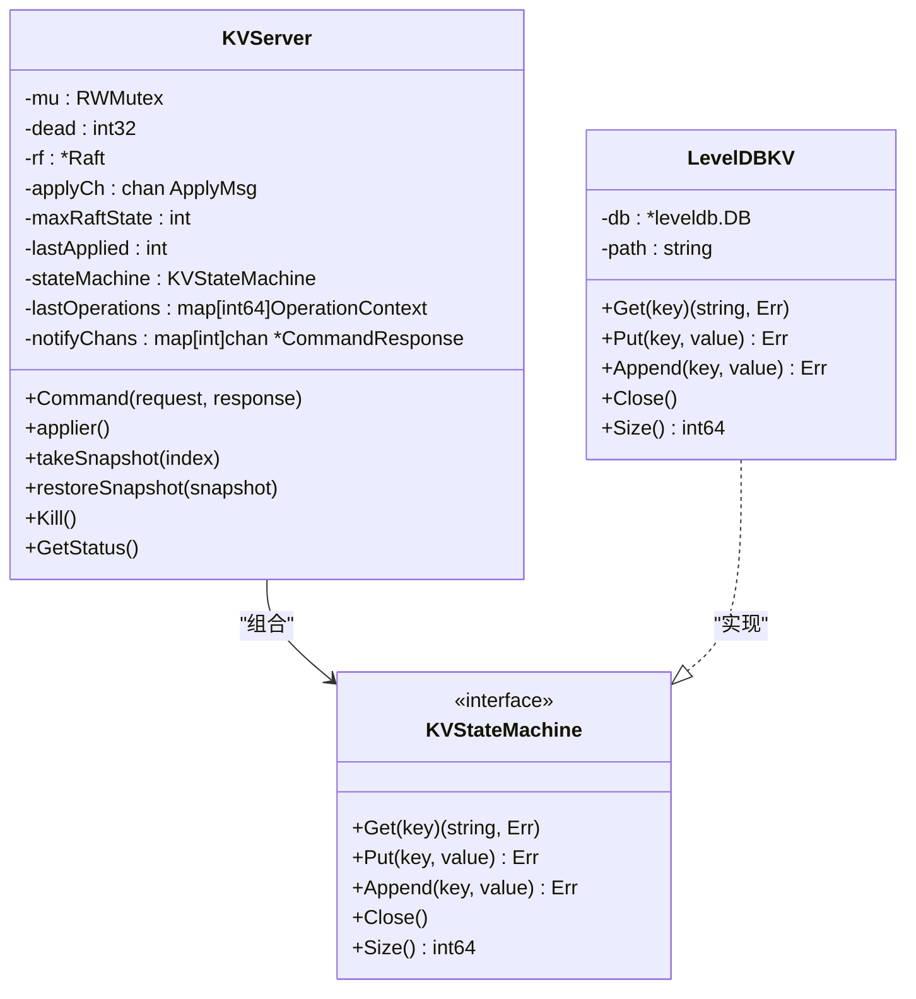
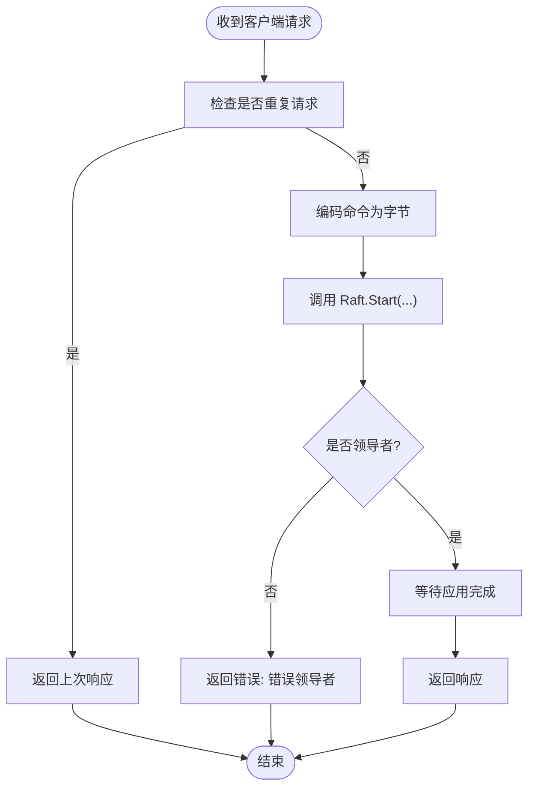
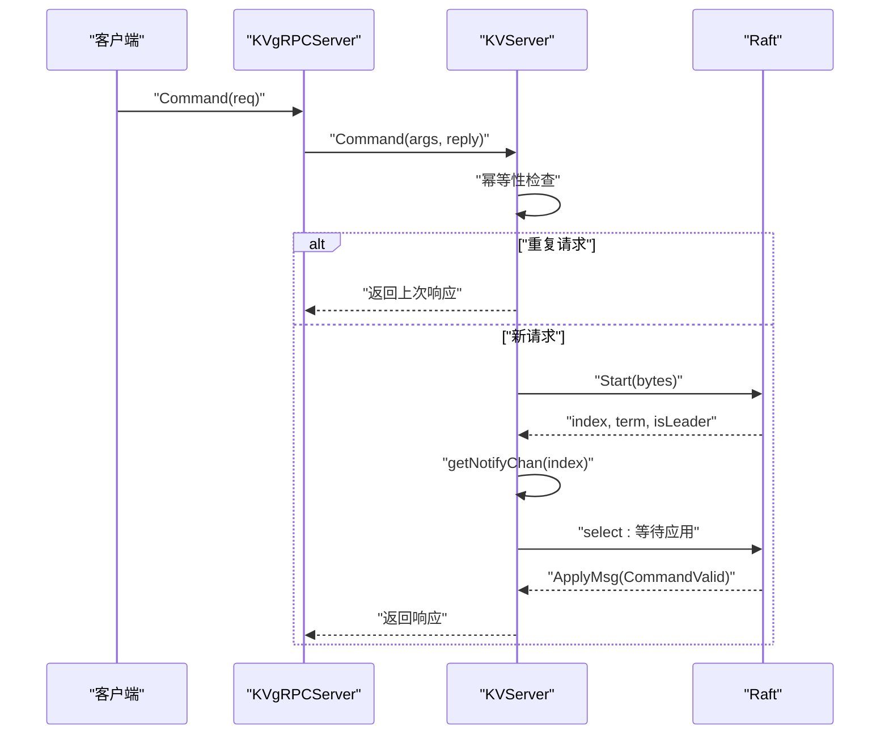
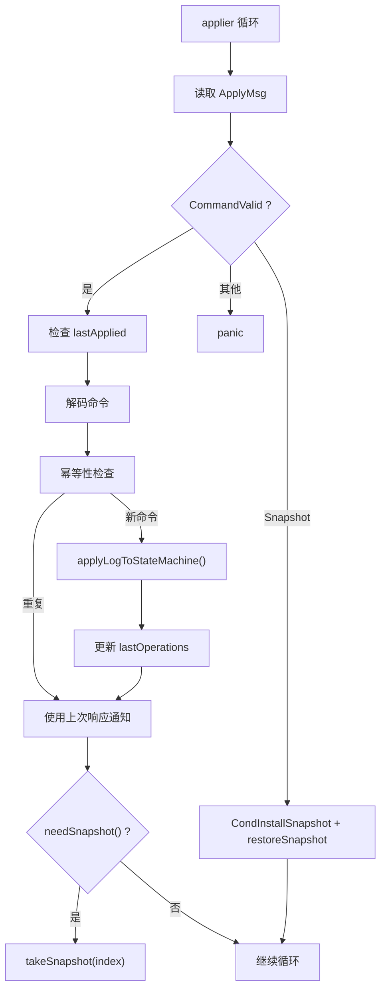
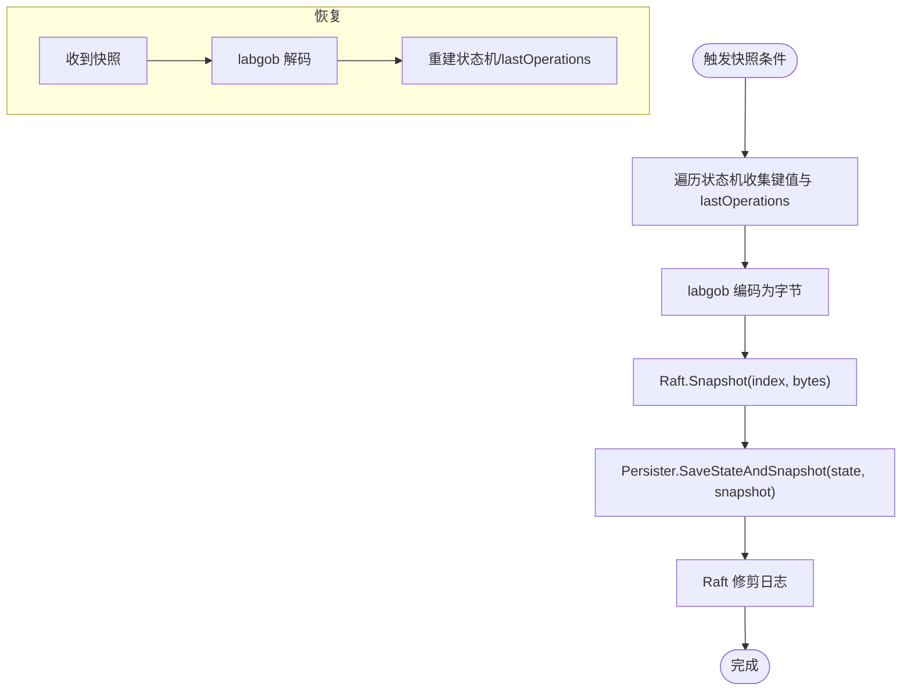
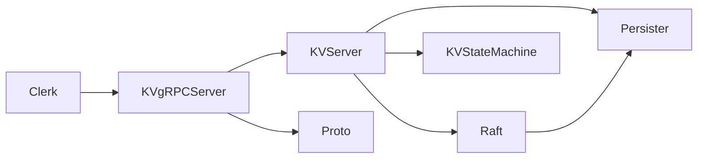

# 单机 KV 服务器

<cite>
**本文引用的文件列表**
- [kvraft/server.go](file://kvraft/server.go)
- [kvraft/common.go](file://kvraft/common.go)
- [kvraft/grpc_server.go](file://kvraft/grpc_server.go)
- [kvraft/client.go](file://kvraft/client.go)
- [cmd/kvserver/main.go](file://cmd/kvserver/main.go)
- [raft/raft.go](file://raft/raft.go)
- [raft/persister.go](file://raft/persister.go)
- [kvraftpb/kvraft.proto](file://kvraftpb/kvraft.proto)
- [models/kv.go](file://models/kv.go)
- [kvraft/test_test.go](file://kvraft/test_test.go)
</cite>

## 目录
1. [简介](#简介)
2. [项目结构](#项目结构)
3. [核心组件](#核心组件)
4. [架构总览](#架构总览)
5. [详细组件分析](#详细组件分析)
6. [依赖关系分析](#依赖关系分析)
7. [性能考量](#性能考量)
8. [故障排查指南](#故障排查指南)
9. [结论](#结论)
10. [附录：API 使用示例路径](#附录api-使用示例路径)

## 简介
本文件面向 eRaft 项目中的单机 KV 服务器（KVServer），系统性阐述其结构设计、状态机复制机制、并发控制策略、内存管理、命令处理链路、幂等性保障、快照机制（创建、恢复、垃圾回收）、与 Raft 共识的集成方式以及数据一致性保证。文档同时提供可直接定位到源码的路径，便于读者在仓库中快速查阅具体实现。

## 项目结构
KVServer 所在模块位于 kvraft 目录，配合 raft 模块提供共识能力；通过 kvraftpb 定义 gRPC 接口；cmd/kvserver 提供启动入口；models 提供线性化模型用于验证；test_test.go 提供完整的测试用例与场景覆盖。

图表来源
- [kvraft/server.go](file://kvraft/server.go#L88-L100)
- [raft/raft.go](file://raft/raft.go#L36-L60)
- [raft/persister.go](file://raft/persister.go#L17-L22)
- [kvraft/grpc_server.go](file://kvraft/grpc_server.go#L9-L16)
- [kvraftpb/kvraft.proto](file://kvraftpb/kvraft.proto#L13-L24)
- [cmd/kvserver/main.go](file://cmd/kvserver/main.go#L16-L47)

章节来源
- [kvraft/server.go](file://kvraft/server.go#L1-L342)
- [raft/raft.go](file://raft/raft.go#L1-L726)
- [raft/persister.go](file://raft/persister.go#L1-L111)
- [kvraft/grpc_server.go](file://kvraft/grpc_server.go#L1-L45)
- [kvraftpb/kvraft.proto](file://kvraftpb/kvraft.proto#L1-L41)
- [cmd/kvserver/main.go](file://cmd/kvserver/main.go#L1-L48)

## 核心组件
- KVServer：负责接收客户端请求、进行幂等性判断、通过 Raft 同步日志、在应用阶段调用状态机执行、维护通知通道、触发快照与恢复。
- KVStateMachine：抽象的状态机接口，当前实现为 LevelDBKV，提供 Get/Put/Append/Close/Size。
- LevelDBKV：基于 LevelDB 的键值存储，支持读写与大小统计。
- KVgRPCServer：gRPC 服务端，桥接 KVServer 的 Command/GetStatus。
- Clerk：客户端封装，负责生成唯一 clientId/commandId，重试与领导者切换。
- Raft：共识引擎，提供 Start、ApplyMsg、Snapshot/CondInstallSnapshot 等能力。
- Persister：Raft 与 KV 快照的持久化载体。
- kvraft.proto：定义 gRPC 请求/响应与枚举。

章节来源
- [kvraft/server.go](file://kvraft/server.go#L17-L23)
- [kvraft/server.go](file://kvraft/server.go#L25-L86)
- [kvraft/server.go](file://kvraft/server.go#L88-L100)
- [kvraft/grpc_server.go](file://kvraft/grpc_server.go#L9-L16)
- [kvraft/common.go](file://kvraft/common.go#L20-L91)
- [raft/raft.go](file://raft/raft.go#L36-L60)
- [raft/persister.go](file://raft/persister.go#L17-L22)
- [kvraftpb/kvraft.proto](file://kvraftpb/kvraft.proto#L7-L40)

## 架构总览
KVServer 以 Raft 为核心，将客户端命令编码后交由 Raft 同步，应用阶段再在 KVServer 中执行状态机操作。KVServer 维护一个专用的应用协程，负责：
- 将已提交的日志应用到状态机
- 去重（基于 clientId 与 commandId）
- 通知等待的客户端
- 触发快照与恢复

图表来源
- [kvraft/grpc_server.go](file://kvraft/grpc_server.go#L18-L32)
- [kvraft/server.go](file://kvraft/server.go#L102-L139)
- [raft/raft.go](file://raft/raft.go#L581-L591)
- [raft/raft.go](file://raft/raft.go#L638-L664)
- [raft/raft.go](file://raft/raft.go#L150-L164)
- [raft/persister.go](file://raft/persister.go#L90-L98)

## 详细组件分析

### KVServer 结构体与职责
- 字段与锁：读写锁保护状态；原子标志位表示死亡；持有 Raft 实例与 applyCh。
- 关键状态：maxRaftState 控制快照阈值；lastApplied 防止回滚；stateMachine 抽象状态机；lastOperations 记录每个客户端的最大已应用 commandId 与最后响应；notifyChans 为每个日志索引维护通知通道。
- 并发策略：RPC 处理不持锁，仅在需要时加锁；应用协程独占锁；通知通道异步释放以降低内存占用。

图表来源
- [kvraft/server.go](file://kvraft/server.go#L88-L100)
- [kvraft/server.go](file://kvraft/server.go#L17-L23)
- [kvraft/server.go](file://kvraft/server.go#L25-L86)

章节来源
- [kvraft/server.go](file://kvraft/server.go#L88-L100)
- [kvraft/server.go](file://kvraft/server.go#L176-L236)

### 幂等性处理机制
- 客户端唯一标识：每个客户端拥有唯一 clientId，每次操作携带自增的 commandId。
- 重复请求检测：KVServer 维护 lastOperations[clientId]，记录该客户端最大已应用的 commandId 与最后响应；若请求的 commandId 不大于该值，则判定为重复请求。
- 应用阶段去重：应用协程同样基于 clientId/commandId 去重，避免重复执行状态机操作。
- 返回路径：重复请求直接返回上次响应，不进入 Raft 日志。

图表来源
- [kvraft/server.go](file://kvraft/server.go#L102-L139)
- [kvraft/server.go](file://kvraft/server.go#L143-L146)
- [kvraft/server.go](file://kvraft/server.go#L202-L210)

章节来源
- [kvraft/server.go](file://kvraft/server.go#L102-L146)
- [kvraft/server.go](file://kvraft/server.go#L202-L210)

### 命令处理流程（从客户端到状态机）
- gRPC 入口：KVgRPCServer.Command 将 kvraftpb.CommandRequest 转换为内部 CommandRequest，调用 KVServer.Command。
- 幂等性检查：读锁下检查重复，命中则直接返回。
- Raft 同步：将命令编码为字节，调用 Raft.Start，得到索引/任期/是否领导者。
- 通知通道：为该索引创建通知通道，等待应用协程推送响应。
- 超时控制：若超过执行超时未返回，标记为超时错误。
- 异步清理：异步删除过期通知通道，降低内存占用。

图表来源
- [kvraft/grpc_server.go](file://kvraft/grpc_server.go#L18-L32)
- [kvraft/server.go](file://kvraft/server.go#L102-L139)
- [raft/raft.go](file://raft/raft.go#L581-L591)

章节来源
- [kvraft/grpc_server.go](file://kvraft/grpc_server.go#L18-L32)
- [kvraft/server.go](file://kvraft/server.go#L102-L139)

### 应用协程与状态机执行
- 专用协程：applier 循环从 applyCh 读取 ApplyMsg。
- 去重与执行：若消息有效且索引未落后于 lastApplied，则解码命令，再次进行幂等性检查，然后调用 applyLogToStateMachine 执行状态机。
- 通知发送：仅当当前任期与消息任期一致且节点为领导者时，才向对应索引的通知通道发送响应。
- 快照触发：根据 maxRaftState 与 Raft 状态大小决定是否需要快照。

图表来源
- [kvraft/server.go](file://kvraft/server.go#L177-L236)
- [kvraft/server.go](file://kvraft/server.go#L238-L258)
- [kvraft/server.go](file://kvraft/server.go#L260-L279)

章节来源
- [kvraft/server.go](file://kvraft/server.go#L177-L236)
- [kvraft/server.go](file://kvraft/server.go#L238-L279)

### 快照机制（创建、恢复、垃圾回收）
- 创建快照：当 Raft 状态大小达到阈值时，KVServer 采集当前状态机数据（键值映射）与 lastOperations，序列化后调用 Raft.Snapshot(index, bytes)，由 Persister 原子保存状态与快照。
- 恢复快照：当收到 InstallSnapshot 请求或应用协程收到 SnapshotValid 消息时，KVServer 解码快照并重建状态机与 lastOperations。
- 垃圾回收：Raft 在 CondInstallSnapshot 成功后会修剪日志，丢弃已包含在快照之前的条目，从而回收磁盘空间。

图表来源
- [kvraft/server.go](file://kvraft/server.go#L242-L258)
- [kvraft/server.go](file://kvraft/server.go#L260-L279)
- [raft/raft.go](file://raft/raft.go#L150-L164)
- [raft/raft.go](file://raft/raft.go#L120-L144)
- [raft/persister.go](file://raft/persister.go#L90-L98)

章节来源
- [kvraft/server.go](file://kvraft/server.go#L242-L279)
- [raft/raft.go](file://raft/raft.go#L120-L164)
- [raft/persister.go](file://raft/persister.go#L90-L98)

### 与 Raft 的集成与一致性保证
- 一致性：所有非 Get 操作通过 Raft 同步，确保日志顺序与多数派确认；Get 操作无需共识，但可能读到过时值。
- 数据一致性：KVServer 在应用阶段严格按提交顺序执行，结合幂等性避免重复执行；快照与日志修剪保证长期一致性与空间回收。
- 线性化验证：models/kv.go 提供线性化模型，test_test.go 使用该模型对历史操作进行线性化检查，确保实现正确。

章节来源
- [raft/raft.go](file://raft/raft.go#L581-L591)
- [raft/raft.go](file://raft/raft.go#L638-L664)
- [models/kv.go](file://models/kv.go#L20-L72)
- [kvraft/test_test.go](file://kvraft/test_test.go#L366-L382)

## 依赖关系分析
- KVServer 依赖 Raft 提供共识与日志提交；依赖 Persister 进行状态与快照持久化。
- KVgRPCServer 依赖 kvraftpb 定义的消息类型；KVServer 依赖 labgob 进行命令编码。
- Clerk 依赖 gRPC 或 labrpc 与 KVServer 交互；客户端维护 clientId/commandId 以实现幂等。

图表来源
- [kvraft/server.go](file://kvraft/server.go#L318-L341)
- [raft/raft.go](file://raft/raft.go#L689-L725)
- [raft/persister.go](file://raft/persister.go#L28-L32)
- [kvraft/grpc_server.go](file://kvraft/grpc_server.go#L18-L32)
- [kvraftpb/kvraft.proto](file://kvraftpb/kvraft.proto#L13-L24)
- [kvraft/client.go](file://kvraft/client.go#L16-L22)

章节来源
- [kvraft/server.go](file://kvraft/server.go#L318-L341)
- [raft/raft.go](file://raft/raft.go#L689-L725)
- [raft/persister.go](file://raft/persister.go#L28-L32)
- [kvraft/grpc_server.go](file://kvraft/grpc_server.go#L18-L32)
- [kvraftpb/kvraft.proto](file://kvraftpb/kvraft.proto#L13-L24)
- [kvraft/client.go](file://kvraft/client.go#L16-L22)

## 性能考量
- 并发优化：RPC 处理不持锁，仅在需要时加锁；应用协程独占锁；通知通道异步清理，减少阻塞。
- 快照阈值：通过 maxRaftState 控制触发快照的时机，平衡内存与 IO。
- 通知通道复用：为每个索引分配单通道，避免过多并发对象。
- 线性化模型：通过模型驱动的线性化检查，确保高并发下的正确性与性能表现。

[本节为通用性能讨论，不直接分析具体文件]

## 故障排查指南
- 重复请求导致的异常：若客户端频繁重试，KVServer 会直接返回上次响应；检查客户端 commandId 是否正确递增。
- 超时问题：客户端执行超时可能由于网络延迟或领导者变更；检查领导者切换与心跳配置。
- 快照失败：快照恢复失败时会打印调试信息；检查快照数据完整性与磁盘权限。
- 线性化失败：使用 models/kv.go 的模型与 test_test.go 的检查逻辑定位问题。

章节来源
- [kvraft/server.go](file://kvraft/server.go#L102-L139)
- [kvraft/server.go](file://kvraft/server.go#L260-L279)
- [models/kv.go](file://models/kv.go#L20-L72)
- [kvraft/test_test.go](file://kvraft/test_test.go#L366-L382)

## 结论
KVServer 通过与 Raft 的深度集成，实现了强一致性的键值存储服务。其设计重点在于：
- 幂等性保障：基于 clientId/commandId 的重复请求检测与去重。
- 并发与内存：读写锁、通知通道异步清理与快照阈值控制。
- 快照与回收：状态机数据与元数据的快照、恢复与日志修剪。
- 一致性与验证：严格的日志顺序与线性化模型验证。

这些特性共同确保了在复杂网络与故障场景下的可用性与正确性。

[本节为总结性内容，不直接分析具体文件]

## 附录：API 使用示例路径
以下示例均来自仓库中的测试与启动代码，可作为使用 KVServer API 的参考路径：

- 启动单机 KV 服务器
  - [cmd/kvserver/main.go](file://cmd/kvserver/main.go#L16-L47)

- 客户端调用示例（Get/Put/Append）
  - [kvraft/client.go](file://kvraft/client.go#L89-L98)
  - [kvraft/client.go](file://kvraft/client.go#L121-L143)

- gRPC 服务端桥接
  - [kvraft/grpc_server.go](file://kvraft/grpc_server.go#L18-L32)

- 获取节点状态
  - [kvraft/grpc_server.go](file://kvraft/grpc_server.go#L34-L44)
  - [kvraft/server.go](file://kvraft/server.go#L171-L174)

- 线性化模型与测试
  - [models/kv.go](file://models/kv.go#L20-L72)
  - [kvraft/test_test.go](file://kvraft/test_test.go#L420-L432)