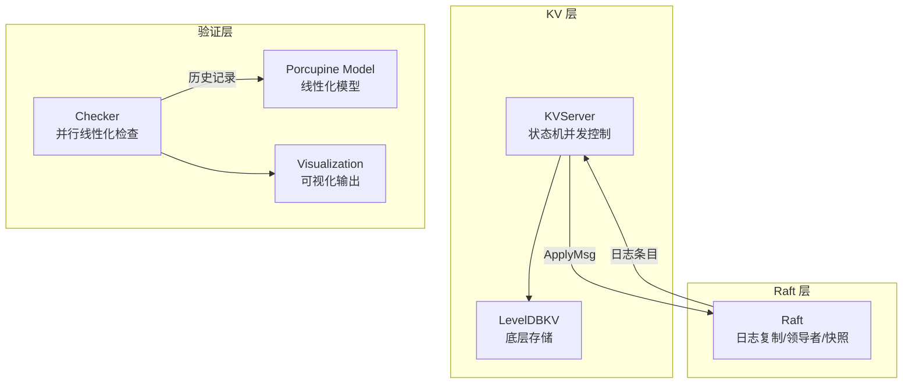
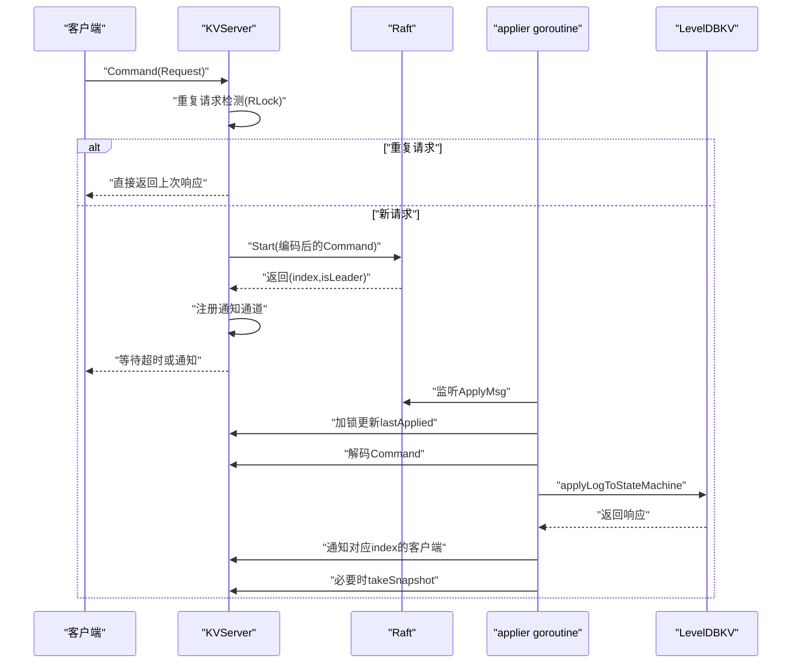
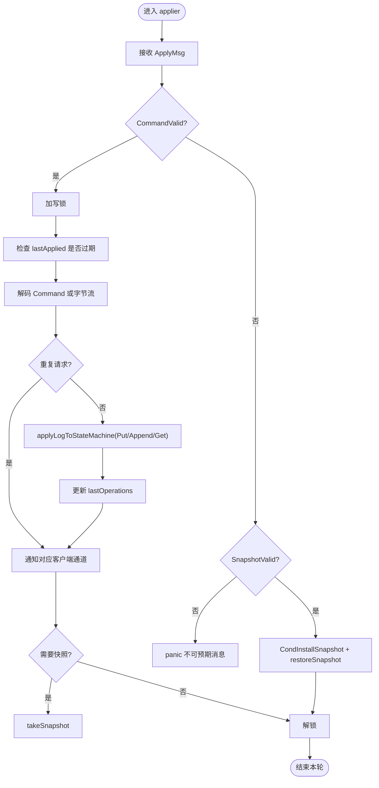
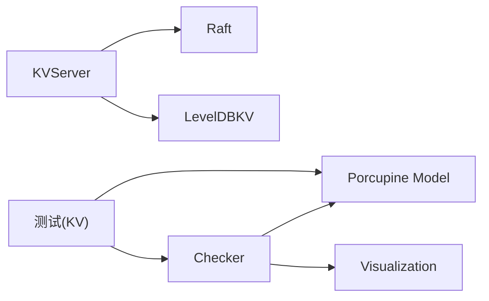

# 并发模型验证

<cite>
**本文档引用的文件**
- [kvraft/server.go](file://kvraft/server.go)
- [models/kv.go](file://models/kv.go)
- [porcupine/model.go](file://porcupine/model.go)
- [porcupine/checker.go](file://porcupine/checker.go)
- [porcupine/bitset.go](file://porcupine/bitset.go)
- [porcupine/visualization.go](file://porcupine/visualization.go)
- [kvraft/common.go](file://kvraft/common.go)
- [kvraft/test_test.go](file://kvraft/test_test.go)
- [raft/raft.go](file://raft/raft.go)
</cite>

## 目录
1. [引言](#引言)
2. [项目结构](#项目结构)
3. [核心组件](#核心组件)
4. [架构总览](#架构总览)
5. [详细组件分析](#详细组件分析)
6. [依赖关系分析](#依赖关系分析)
7. [性能考量](#性能考量)
8. [故障排查指南](#故障排查指南)
9. [结论](#结论)
10. [附录](#附录)

## 引言
本文件针对 eRaft 的 KV 存储系统并发模型进行系统化验证与说明，重点覆盖：
- 状态机并发访问控制与数据一致性约束
- 模型检查器（线性化验证）的实现与使用
- 并发操作规范、读写冲突检测与死锁预防
- 数学上的线性化定义与形式化验证方法
- 实际代码中的并发问题案例与解决方案
- 性能分析与瓶颈识别
- 开发者最佳实践与常见陷阱

## 项目结构
eRaft 将 KV 存储与 Raft 共识结合，形成“日志复制 + 状态机”的两层并发模型：
- 上层：Raft 层负责日志复制、领导者选举、快照与提交索引管理
- 下层：KV 层通过状态机执行日志命令，保证线性一致的读写语义



图表来源
- [kvraft/server.go](file://kvraft/server.go#L88-L100)
- [raft/raft.go](file://raft/raft.go#L37-L60)
- [porcupine/model.go](file://porcupine/model.go#L27-L49)
- [porcupine/checker.go](file://porcupine/checker.go#L360-L368)

章节来源
- [kvraft/server.go](file://kvraft/server.go#L1-L342)
- [raft/raft.go](file://raft/raft.go#L1-L200)

## 核心组件
- KVServer：KV 服务端，协调客户端请求、Raft 日志提交、状态机应用与通知通道
- LevelDBKV：基于 LevelDB 的状态机实现，提供 Get/Put/Append 原子操作
- Raft：共识引擎，提供日志复制、领导者身份、快照与提交索引
- Porcupine Model/Checker：线性化模型与并行检查器，用于验证历史记录是否满足线性化
- 测试框架：记录客户端调用时间戳，构造历史并进行线性化检查

章节来源
- [kvraft/server.go](file://kvraft/server.go#L88-L100)
- [kvraft/server.go](file://kvraft/server.go#L25-L86)
- [raft/raft.go](file://raft/raft.go#L37-L60)
- [porcupine/model.go](file://porcupine/model.go#L27-L49)
- [porcupine/checker.go](file://porcupine/checker.go#L360-L368)
- [kvraft/test_test.go](file://kvraft/test_test.go#L24-L41)

## 架构总览
KV 并发模型遵循“单领导者 + 顺序日志 + 单状态机应用”的设计原则，确保：
- 客户端请求在领导者处按序提交，避免跨节点并发冲突
- 应用阶段仅由一个 goroutine 执行，避免状态机并发竞争
- 快照与恢复保证持久化一致性



图表来源
- [kvraft/server.go](file://kvraft/server.go#L102-L139)
- [kvraft/server.go](file://kvraft/server.go#L177-L236)
- [kvraft/server.go](file://kvraft/server.go#L292-L304)

## 详细组件分析

### KVServer 并发控制与一致性
- 读写分离与锁策略
  - 请求去重与快速返回：在读锁下检查重复请求，避免不必要的日志提交
  - 提交阶段持有写锁，防止快照与应用过程中的竞态
  - 通知通道异步清理，降低锁持有时间
- 应用器 goroutine
  - 串行应用已提交日志，严格按索引顺序更新 lastApplied
  - 领导者校验与 term 对齐，仅向当前 term 的日志发送通知
  - 快照触发条件与恢复逻辑，保证状态机与日志边界一致
- 通知通道管理
  - 以索引为键的映射，避免内存泄漏
  - 异步清理，提升吞吐



图表来源
- [kvraft/server.go](file://kvraft/server.go#L177-L236)
- [kvraft/server.go](file://kvraft/server.go#L242-L279)
- [kvraft/server.go](file://kvraft/server.go#L292-L304)

章节来源
- [kvraft/server.go](file://kvraft/server.go#L88-L100)
- [kvraft/server.go](file://kvraft/server.go#L102-L139)
- [kvraft/server.go](file://kvraft/server.go#L177-L236)
- [kvraft/server.go](file://kvraft/server.go#L242-L279)
- [kvraft/server.go](file://kvraft/server.go#L292-L304)

### LevelDBKV 状态机
- Get/Put/Append 原子性：基于底层存储的原子操作封装
- Append 语义：先读取旧值，再拼接新值后写回，保证最终一致性
- 关闭与大小统计：关闭数据库与遍历目录统计磁盘占用

章节来源
- [kvraft/server.go](file://kvraft/server.go#L25-L86)

### Raft 层一致性保障
- 日志复制与提交：通过 ApplyMsg 将已提交的日志传递给 KV 层
- 快照机制：CondInstallSnapshot 与 Snapshot 保证日志裁剪与状态恢复
- 线程安全：内部使用互斥锁保护共享状态

章节来源
- [raft/raft.go](file://raft/raft.go#L120-L164)
- [raft/raft.go](file://raft/raft.go#L166-L200)

### 线性化模型与检查器
- 模型定义
  - 输入/输出：KvInput/KvOutput
  - 分区函数：按 key 划分历史，独立线性化验证
  - 初始状态：空字符串
  - 步函数：get 返回值匹配；put/append 更新状态
- 检查器算法
  - 并行子历史检查，每个分区独立搜索线性化序列
  - 使用位集缓存已访问的状态与线性化集合，避免重复搜索
  - 支持超时与部分线性化结果收集

```mermaid
classDiagram
class Model {
+Partition(history) [][]Operation
+PartitionEvent(history) [][]Event
+Init() interface{}
+Step(state,input,output) (bool,interface{})
+Equal(state1,state2) bool
+DescribeOperation(input,output) string
+DescribeState(state) string
}
class Checker {
+checkOperations(model,history,verbose,timeout) (CheckResult,linearizationInfo)
+checkEvents(model,history,verbose,timeout) (CheckResult,linearizationInfo)
}
class Bitset {
+clone() bitset
+set(pos) bitset
+clear(pos) bitset
+hash() uint64
+equals(bitset) bool
}
Model <.. Checker : "使用"
Checker --> Bitset : "缓存键"
```

图表来源
- [porcupine/model.go](file://porcupine/model.go#L27-L49)
- [porcupine/checker.go](file://porcupine/checker.go#L174-L248)
- [porcupine/bitset.go](file://porcupine/bitset.go#L5-L73)

章节来源
- [models/kv.go](file://models/kv.go#L10-L72)
- [porcupine/model.go](file://porcupine/model.go#L27-L49)
- [porcupine/checker.go](file://porcupine/checker.go#L174-L248)
- [porcupine/checker.go](file://porcupine/checker.go#L269-L348)
- [porcupine/bitset.go](file://porcupine/bitset.go#L5-L73)

### 测试与可视化
- OpLog 记录：客户端操作的输入/输出与时间戳
- 线性化检查：在测试中调用 CheckOperationsVerbose，失败时生成可视化 HTML
- 可视化：展示历史事件、部分线性化与最大线性化序列

章节来源
- [kvraft/test_test.go](file://kvraft/test_test.go#L24-L41)
- [kvraft/test_test.go](file://kvraft/test_test.go#L366-L382)
- [porcupine/visualization.go](file://porcupine/visualization.go#L33-L86)

## 依赖关系分析
- KVServer 依赖 Raft 提供的日志提交与 ApplyMsg
- KVServer 依赖 LevelDBKV 提供状态机操作
- 测试依赖 OpLog 记录历史，依赖 Porcupine 进行线性化验证
- Porcupine 检查器依赖模型定义与位集缓存



图表来源
- [kvraft/server.go](file://kvraft/server.go#L88-L100)
- [kvraft/server.go](file://kvraft/server.go#L25-L86)
- [kvraft/test_test.go](file://kvraft/test_test.go#L366-L382)
- [porcupine/checker.go](file://porcupine/checker.go#L360-L368)

章节来源
- [kvraft/server.go](file://kvraft/server.go#L88-L100)
- [kvraft/server.go](file://kvraft/server.go#L25-L86)
- [kvraft/test_test.go](file://kvraft/test_test.go#L366-L382)
- [porcupine/checker.go](file://porcupine/checker.go#L360-L368)

## 性能考量
- 锁粒度与持有时间
  - 请求去重阶段使用读锁，减少锁竞争
  - 提交阶段短暂持有写锁，避免长时间阻塞
  - 通知通道异步清理，降低锁持有时间
- 并行检查
  - 检查器对每个分区并行验证，提高大规模历史的验证效率
  - 位集缓存避免重复状态探索，降低指数级搜索复杂度
- 快照与日志裁剪
  - 基于 Raft 状态大小阈值触发快照，减少日志长度，提升提交与应用效率

章节来源
- [kvraft/server.go](file://kvraft/server.go#L102-L139)
- [kvraft/server.go](file://kvraft/server.go#L177-L236)
- [porcupine/checker.go](file://porcupine/checker.go#L269-L348)
- [raft/raft.go](file://raft/raft.go#L150-L164)

## 故障排查指南
- 线性化失败
  - 现象：测试报告非法（Illegal），并生成可视化文件
  - 排查：查看可视化中“非法下一步”标记，定位违反线性化的事件序列
  - 解决：检查状态机步骤函数与分区策略，确保 get/put/append 的语义正确
- 超时与死锁
  - 现象：客户端等待超时或通知通道未释放
  - 排查：确认 applier 是否正确通知对应 index 的通道；检查异步清理逻辑
  - 解决：确保 removeOutdatedNotifyChan 在合适时机被调用
- 快照不生效
  - 现象：日志未裁剪或快照恢复异常
  - 排查：确认 CondInstallSnapshot 条件判断与日志边界更新
  - 解决：确保 lastIncludedIndex 大于 commitIndex 且小于等于最新日志索引

章节来源
- [kvraft/test_test.go](file://kvraft/test_test.go#L366-L382)
- [porcupine/visualization.go](file://porcupine/visualization.go#L640-L700)
- [kvraft/server.go](file://kvraft/server.go#L126-L138)
- [kvraft/server.go](file://kvraft/server.go#L288-L290)
- [raft/raft.go](file://raft/raft.go#L120-L164)

## 结论
eRaft 的 KV 并发模型通过“领导者顺序提交 + 单状态机应用 + 快照裁剪”的组合，实现了强一致性的线性化语义。配合 Porcupine 的线性化模型与并行检查器，能够系统性地验证历史记录的正确性，并通过可视化直观定位问题。实践中应关注锁粒度、通知通道生命周期与快照边界，以获得更好的性能与可靠性。

## 附录

### 并发规范与约束
- 读写冲突检测
  - 同一 key 的并发操作按顺序日志执行，避免竞态
  - 读操作不参与日志提交，仅在状态机层面保证一致性
- 死锁预防
  - 严格的锁顺序：请求去重使用读锁，提交与应用使用写锁
  - 通知通道按索引管理，避免跨通道依赖
- 线性化定义
  - 历史在每个分区上存在与真实系统等价的全序执行序列
  - 检查器通过位集缓存与并行搜索，判定是否存在合法线性化

章节来源
- [models/kv.go](file://models/kv.go#L20-L72)
- [porcupine/checker.go](file://porcupine/checker.go#L174-L248)
- [porcupine/checker.go](file://porcupine/checker.go#L269-L348)

### 形式化验证方法
- 模型化
  - 将系统抽象为状态、输入、输出与步函数
  - 使用分区函数将全局历史分解为可独立验证的子历史
- 搜索与缓存
  - 采用回溯搜索寻找线性化序列
  - 位集缓存线性化集合与状态，避免重复探索
- 可视化与调试
  - 输出部分线性化与最大线性化序列，辅助定位矛盾点

章节来源
- [porcupine/model.go](file://porcupine/model.go#L27-L49)
- [porcupine/checker.go](file://porcupine/checker.go#L174-L248)
- [porcupine/visualization.go](file://porcupine/visualization.go#L33-L86)

### 最佳实践与常见陷阱
- 最佳实践
  - 使用读锁进行快速路径（重复请求检测）
  - 将耗时操作（如快照）放在写锁范围内，但尽量缩短持有时间
  - 为每个索引维护独立的通知通道，及时清理
  - 在状态机步骤函数中严格匹配语义（get 返回值、put/append 更新状态）
- 常见陷阱
  - 忘记清理通知通道导致内存泄漏
  - 快照边界错误导致日志裁剪或恢复失败
  - 分区函数不当导致跨 key 的并发被错误合并

章节来源
- [kvraft/server.go](file://kvraft/server.go#L102-L139)
- [kvraft/server.go](file://kvraft/server.go#L126-L138)
- [kvraft/server.go](file://kvraft/server.go#L288-L290)
- [raft/raft.go](file://raft/raft.go#L120-L164)
- [models/kv.go](file://models/kv.go#L20-L72)