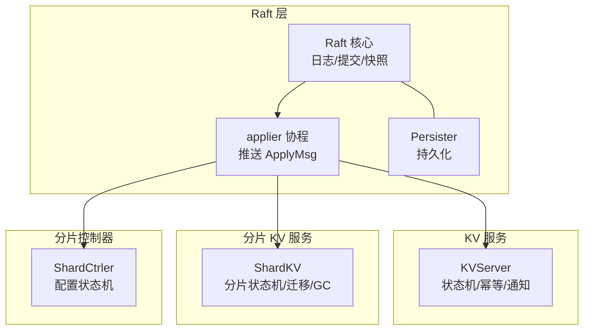
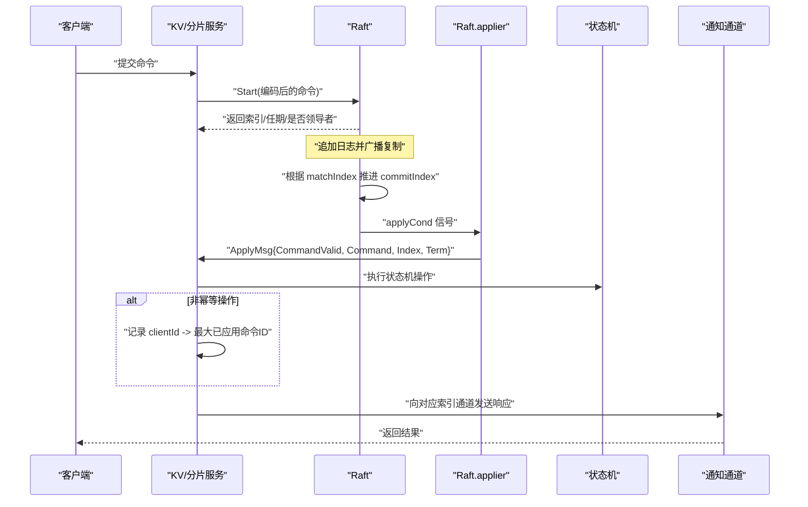
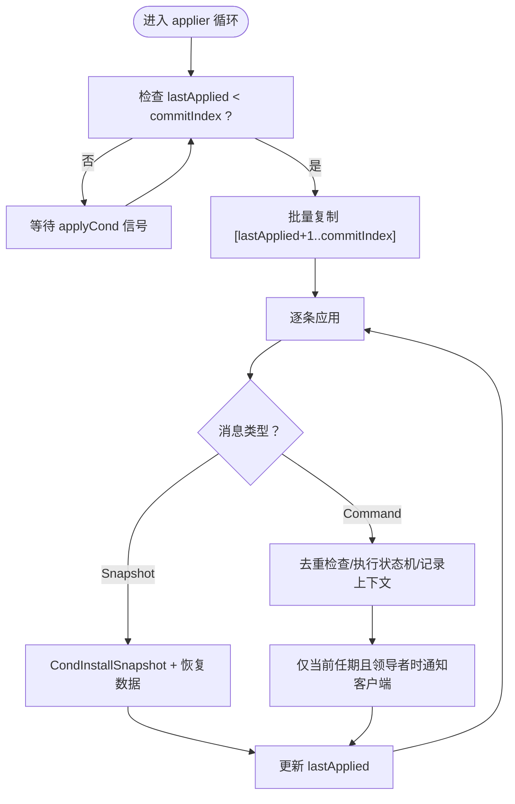
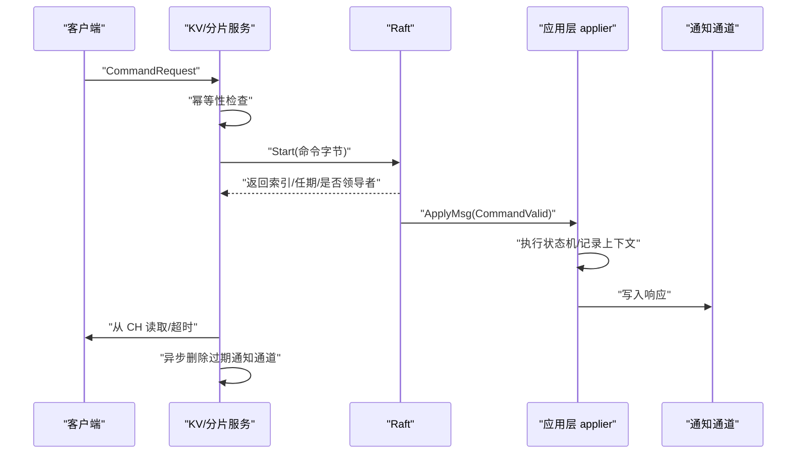
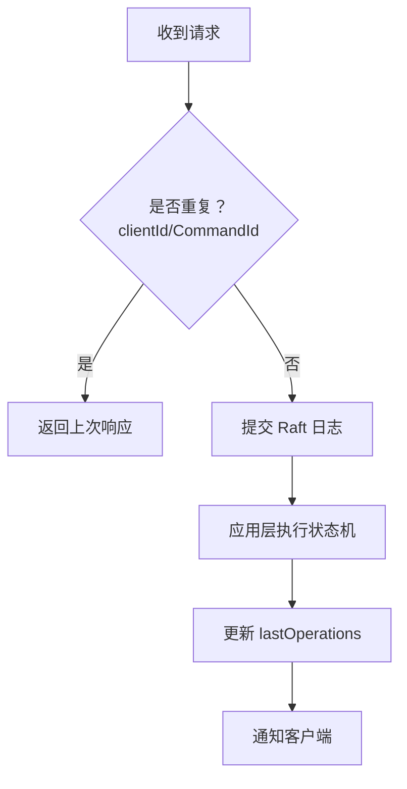
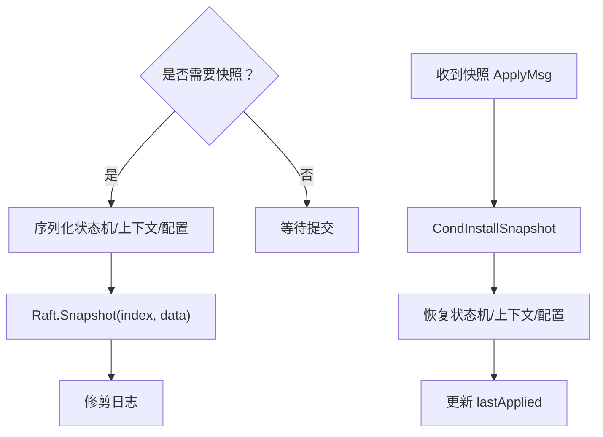
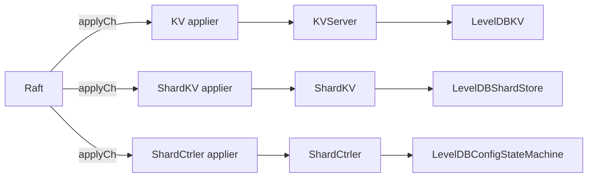

# 状态机应用机制

<cite>
**本文引用的文件列表**
- [raft.go](file://raft/raft.go)
- [util.go](file://raft/util.go)
- [persister.go](file://raft/persister.go)
- [server.go（KV）](file://kvraft/server.go)
- [common.go（KV）](file://kvraft/common.go)
- [server.go（ShardKV）](file://shardkv/server.go)
- [common.go（ShardKV）](file://shardkv/common.go)
- [server.go（ShardCtrler）](file://shardctrler/server.go)
- [common.go（ShardCtrler）](file://shardctrler/common.go)
</cite>

## 目录
1. [简介](#简介)
2. [项目结构与角色分工](#项目结构与角色分工)
3. [核心组件与职责](#核心组件与职责)
4. [架构总览](#架构总览)
5. [详细组件分析](#详细组件分析)
6. [依赖关系分析](#依赖关系分析)
7. [性能考量与优化建议](#性能考量与优化建议)
8. [故障排查指南](#故障排查指南)
9. [结论](#结论)
10. [附录：扩展与自定义指南](#附录扩展与自定义指南)

## 简介
本文件系统化阐述 eRaft 的状态机应用机制，重点围绕 applier 协程的工作原理、日志应用流程与状态机更新机制，以及从日志提交到状态机应用再到客户端响应的完整生命周期。同时覆盖幂等性保障（客户端 ID 与命令 ID 跟踪）、通知通道管理（goroutine 同步与内存泄漏防护）、快照应用与数据恢复流程，并给出性能优化与并发控制策略，最后提供状态机扩展与自定义应用逻辑的实践指导。

## 项目结构与角色分工
- Raft 层：负责共识、日志复制、提交推进与快照管理，通过 ApplyMsg 将已提交的日志项推送到上层服务。
- KV 服务（kvraft）：单键值状态机，基于 LevelDB 实现，提供 Get/Put/Append 操作，支持快照与幂等性。
- 分片控制器（shardctrler）：维护分片配置，提供 Join/Leave/Move/Query 接口，作为 ShardKV 的配置源。
- 分片 KV 服务（shardkv）：按分片维度的状态机，支持配置变更、分片迁移与回收，内部维护分片状态机与跨组数据迁移。

图表来源
- [raft.go](file://raft/raft.go#L637-L664)
- [server.go（KV）](file://kvraft/server.go#L318-L341)
- [server.go（ShardKV）](file://shardkv/server.go#L759-L799)
- [server.go（ShardCtrler）](file://shardctrler/server.go#L324-L343)

章节来源
- [raft.go](file://raft/raft.go#L637-L664)
- [server.go（KV）](file://kvraft/server.go#L318-L341)
- [server.go（ShardKV）](file://shardkv/server.go#L759-L799)
- [server.go（ShardCtrler）](file://shardctrler/server.go#L324-L343)

## 核心组件与职责
- Raft 核心（raft.Raft）
  - 维护日志、提交索引、最后应用索引、领导者任期等状态。
  - 提供 Start 增加新日志条目；推进 commitIndex 并通过条件变量唤醒 applier。
  - 通过 InstallSnapshot RPC 触发快照应用。
- Applier 协程（Raft.applier）
  - 在未达到提交索引时阻塞等待；达到后批量取出待应用条目，逐条发送 ApplyMsg 到上层。
  - 更新 lastApplied，确保每条日志仅应用一次。
- 上层服务（KVServer/ShardKV/ShardCtrler）
  - 专用 applier 协程接收 ApplyMsg，执行状态机操作，处理幂等性，通知客户端，必要时触发快照。
  - 维护通知通道映射，避免内存泄漏。

章节来源
- [raft.go](file://raft/raft.go#L44-L60)
- [raft.go](file://raft/raft.go#L496-L524)
- [raft.go](file://raft/raft.go#L637-L664)
- [util.go](file://raft/util.go#L21-L41)

## 架构总览
下图展示从客户端请求到状态机应用与响应的端到端流程，以及快照应用路径。

图表来源
- [raft.go](file://raft/raft.go#L576-L591)
- [raft.go](file://raft/raft.go#L496-L524)
- [raft.go](file://raft/raft.go#L637-L664)
- [server.go（KV）](file://kvraft/server.go#L102-L139)
- [server.go（ShardKV）](file://shardkv/server.go#L110-L157)

## 详细组件分析

### Applier 协程工作原理与日志应用流程
- Raft.applier
  - 当 lastApplied < commitIndex 时，批量取出 [lastApplied+1..commitIndex] 的日志条目，逐条封装为 ApplyMsg 发送至 applyCh。
  - 使用 commitIndex 的旧值更新 lastApplied，避免在 Unlock/再 Lock 期间被并发 InstallSnapshot 导致回退。
  - 通过 applyCond 条件变量阻塞/唤醒，实现“提交即应用”的顺序推进。
- 上层服务 applier
  - 从 applyCh 接收 ApplyMsg：
    - 命令消息：去重检查、执行状态机、记录幂等上下文、通知客户端。
    - 快照消息：调用 Raft.CondInstallSnapshot 安装并恢复状态机数据。
  - 仅对当前任期的命令进行通知，避免跨任期响应。
  - 达到阈值时触发快照，保存状态机与元数据。

图表来源
- [raft.go](file://raft/raft.go#L637-L664)
- [server.go（KV）](file://kvraft/server.go#L176-L236)
- [server.go（ShardKV）](file://shardkv/server.go#L247-L326)

章节来源
- [raft.go](file://raft/raft.go#L637-L664)
- [server.go（KV）](file://kvraft/server.go#L176-L236)
- [server.go（ShardKV）](file://shardkv/server.go#L247-L326)

### 命令执行生命周期（从提交到响应）
- 客户端侧
  - 服务端在 Command 处理中先做幂等性检查，若重复则直接返回上次响应。
  - 通过 Raft.Start 提交命令，随后在通知通道上等待响应或超时。
- Raft 层
  - 追加日志、复制给追随者、推进 commitIndex、唤醒 applier。
- 应用层
  - 专用 applier 接收 ApplyMsg，执行状态机操作，写入通知通道。
  - 异步释放通知通道，防止内存泄漏。

图表来源
- [server.go（KV）](file://kvraft/server.go#L102-L139)
- [server.go（ShardKV）](file://shardkv/server.go#L110-L157)
- [raft.go](file://raft/raft.go#L576-L591)

章节来源
- [server.go（KV）](file://kvraft/server.go#L102-L139)
- [server.go（ShardKV）](file://shardkv/server.go#L110-L157)
- [raft.go](file://raft/raft.go#L576-L591)

### 幂等性保证机制
- 客户端 ID 与命令 ID
  - 服务端维护 map[clientId]OperationContext，记录每个客户端的最大已应用命令 ID 与最后一次响应。
  - 对非 Get 操作，若请求的 CommandId 不大于最大已应用命令 ID，则判定为重复请求，直接返回缓存响应。
- Raft 层幂等
  - 由于 ApplyMsg 严格按索引顺序推送，且 lastApplied 仅向前推进，天然避免重复应用。
- 注意事项
  - 仅对当前任期的命令进行通知，避免跨任期响应导致的错误去重判断。

图表来源
- [server.go（KV）](file://kvraft/server.go#L102-L139)
- [server.go（ShardKV）](file://shardkv/server.go#L110-L157)
- [common.go（KV）](file://kvraft/common.go#L24-L27)
- [common.go（ShardKV）](file://shardkv/common.go#L93-L100)

章节来源
- [server.go（KV）](file://kvraft/server.go#L102-L139)
- [server.go（ShardKV）](file://shardkv/server.go#L110-L157)
- [common.go（KV）](file://kvraft/common.go#L24-L27)
- [common.go（ShardKV）](file://shardkv/common.go#L93-L100)

### 通知通道管理与内存泄漏防护
- 通知通道映射
  - 以命令索引为键，建立单元素缓冲通道，用于将响应从应用层传递给等待的客户端。
- 生命周期管理
  - 客户端收到响应后，服务端异步删除该索引对应的通道，避免长期占用内存。
- 并发与安全
  - 仅在当前领导者且命令处于当前任期时才通知，避免跨任期竞争与乱序响应。

章节来源
- [server.go（KV）](file://kvraft/server.go#L123-L139)
- [server.go（ShardKV）](file://shardkv/server.go#L140-L157)
- [server.go（KV）](file://kvraft/server.go#L281-L290)
- [server.go（ShardKV）](file://shardkv/server.go#L524-L533)

### 快照应用与数据恢复
- 触发条件
  - 当 Raft 层状态大小超过阈值时，服务端决定快照。
- 快照内容
  - KV：状态机数据（如 LevelDB 中的键值对）与 lastOperations 映射。
  - ShardKV：全部键值对、分片状态、lastOperations、当前配置与上一配置。
  - ShardCtrler：配置历史与最新配置。
- 快照写入
  - 通过 Raft.Snapshot(index, data) 写入持久化存储，同时修剪日志。
- 快照安装与恢复
  - 收到快照 ApplyMsg 时，调用 Raft.CondInstallSnapshot 安装并更新 lastApplied。
  - 服务端恢复状态机数据与元数据，确保后续日志应用不会回退。

图表来源
- [server.go（KV）](file://kvraft/server.go#L238-L258)
- [server.go（ShardKV）](file://shardkv/server.go#L463-L484)
- [server.go（ShardCtrler）](file://shardctrler/server.go#L324-L343)
- [raft.go](file://raft/raft.go#L118-L164)

章节来源
- [server.go（KV）](file://kvraft/server.go#L238-L258)
- [server.go（ShardKV）](file://shardkv/server.go#L463-L484)
- [server.go（ShardCtrler）](file://shardctrler/server.go#L324-L343)
- [raft.go](file://raft/raft.go#L118-L164)

### 并发控制与性能优化
- 并发模型
  - Raft.applier 串行应用，保证日志顺序与一致性。
  - 服务端 applier 并发处理不同索引的消息，但对同一索引的响应只写一次。
- 性能优化点
  - 批量应用：Raft.applier 一次性取出多条日志，减少锁竞争与通道发送次数。
  - 通知通道复用：使用单元素缓冲通道，降低内存占用。
  - 异步清理：客户端收到响应后异步删除通知通道，避免阻塞请求处理。
  - 快照阈值：合理设置 maxraftstate，平衡日志长度与快照频率。
  - 仅当前任期通知：避免跨任期响应带来的额外判断成本。

章节来源
- [raft.go](file://raft/raft.go#L637-L664)
- [server.go（KV）](file://kvraft/server.go#L123-L139)
- [server.go（ShardKV）](file://shardkv/server.go#L140-L157)

## 依赖关系分析
- Raft 与上层服务
  - Raft 通过 applyCh 输出 ApplyMsg，上层服务各自启动专用 applier 协程消费。
  - 上层服务通过 Raft.Start 提交命令，通过 Raft.Snapshot/CondInstallSnapshot 管理快照。
- 状态机实现
  - KV：LevelDBKV 实现 Get/Put/Append/Size/Close。
  - ShardKV：LevelDBShardStore 实现按分片键空间的 Get/Put/Append/Size/Close。
  - ShardCtrler：LevelDBConfigStateMachine 实现配置的保存/查询/统计。
- 共享数据结构
  - OperationContext：记录客户端幂等上下文。
  - Command/CommandRequest/CommandResponse：统一的命令与响应格式。

图表来源
- [raft.go](file://raft/raft.go#L689-L725)
- [server.go（KV）](file://kvraft/server.go#L318-L341)
- [server.go（ShardKV）](file://shardkv/server.go#L759-L799)
- [server.go（ShardCtrler）](file://shardctrler/server.go#L324-L343)

章节来源
- [raft.go](file://raft/raft.go#L689-L725)
- [server.go（KV）](file://kvraft/server.go#L318-L341)
- [server.go（ShardKV）](file://shardkv/server.go#L759-L799)
- [server.go（ShardCtrler）](file://shardctrler/server.go#L324-L343)

## 性能考量与优化建议
- 减少锁持有时间
  - 服务端 Command 处理中尽量缩短持有锁的时间段，仅在需要访问共享状态时加锁。
- 批量与流水线
  - 利用 Raft.applier 的批量特性，避免频繁小批量发送。
- 快照策略
  - 根据数据规模与日志增长速率调整 maxraftstate，避免快照过于频繁或日志过长。
- 通知通道容量
  - 保持单元素缓冲通道，避免阻塞；如需更高吞吐，可评估无缓冲通道与背压策略。
- I/O 优化
  - 状态机实现中尽量使用批处理写入（如 LevelDB 的 Batch），减少随机写放大。

## 故障排查指南
- 未收到响应或超时
  - 检查通知通道是否正确创建与释放，确认客户端等待逻辑与超时时间。
  - 确认服务端 applier 是否仍在运行，以及是否仅对当前任期进行通知。
- 重复请求未命中缓存
  - 核对客户端 ID 与命令 ID 是否正确传递，确认 lastOperations 映射是否更新。
- 快照安装失败
  - 检查 CondInstallSnapshot 返回值与 commitIndex 比较逻辑，确保快照索引有效。
  - 确认快照数据完整性与恢复逻辑。
- 并发问题
  - 检查是否存在跨任期通知或回退导致的异常行为。

章节来源
- [server.go（KV）](file://kvraft/server.go#L123-L139)
- [server.go（ShardKV）](file://shardkv/server.go#L140-L157)
- [raft.go](file://raft/raft.go#L118-L164)

## 结论
eRaft 的状态机应用机制通过 Raft.applier 与上层服务专用 applier 的协作，实现了严格的日志顺序、幂等性保障与高效的通知机制。结合快照与日志修剪，系统在高吞吐场景下仍能维持良好的性能与可靠性。开发者在扩展状态机时，应遵循幂等性设计、谨慎管理通知通道生命周期，并根据业务特征选择合适的快照策略。

## 附录：扩展与自定义指南
- 自定义状态机
  - 实现 KVStateMachine 接口（Get/Put/Append/Close/Size），并在服务启动时注入。
  - 在 applier 中根据命令类型分派到具体状态机操作。
- 幂等性扩展
  - 为新的命令类型增加幂等上下文字段，确保跨节点一致性。
- 快照策略
  - 根据数据热点与访问模式，定制快照内容与触发条件。
- 监控与可观测性
  - 记录 ApplyMsg 的处理耗时、通知通道积压与快照频率，辅助性能调优。

章节来源
- [server.go（KV）](file://kvraft/server.go#L17-L23)
- [server.go（ShardKV）](file://shardkv/server.go#L76-L99)
- [server.go（ShardCtrler）](file://shardctrler/server.go#L17-L26)