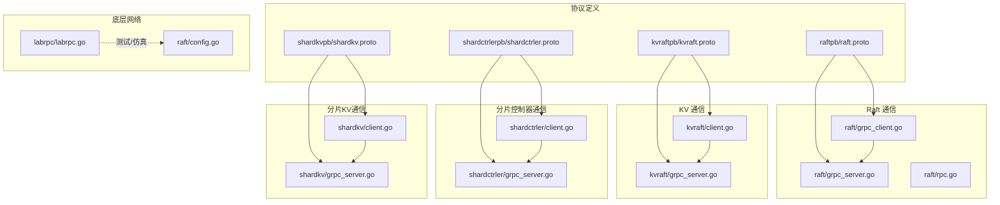
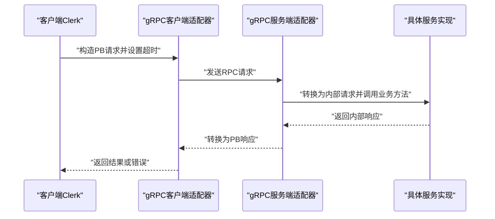
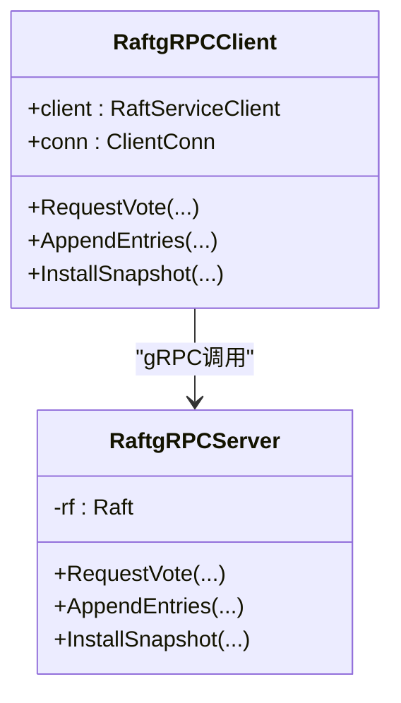
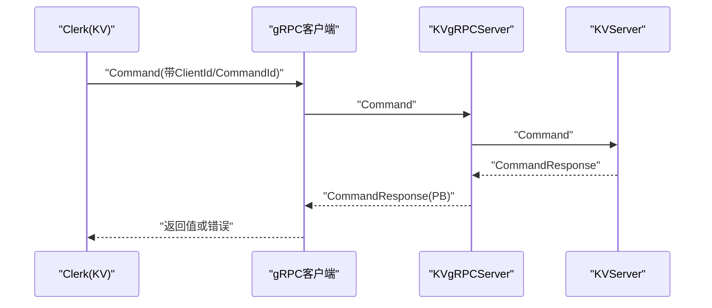
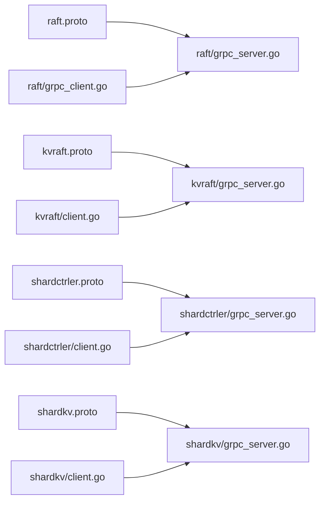

# RPC 通信层

<cite>
**本文引用的文件**
- [raft.proto](file://raftpb/raft.proto)
- [kvraft.proto](file://kvraftpb/kvraft.proto)
- [shardctrler.proto](file://shardctrlerpb/shardctrler.proto)
- [shardkv.proto](file://shardkvpb/shardkv.proto)
- [raft/grpc_client.go](file://raft/grpc_client.go)
- [raft/grpc_server.go](file://raft/grpc_server.go)
- [raft/rpc.go](file://raft/rpc.go)
- [kvraft/grpc_server.go](file://kvraft/grpc_server.go)
- [shardctrler/grpc_server.go](file://shardctrler/grpc_server.go)
- [shardkv/grpc_server.go](file://shardkv/grpc_server.go)
- [kvraft/client.go](file://kvraft/client.go)
- [shardctrler/client.go](file://shardctrler/client.go)
- [shardkv/client.go](file://shardkv/client.go)
- [labrpc/labrpc.go](file://labrpc/labrpc.go)
- [raft/config.go](file://raft/config.go)
</cite>

## 目录
1. [简介](#简介)
2. [项目结构](#项目结构)
3. [核心组件](#核心组件)
4. [架构总览](#架构总览)
5. [详细组件分析](#详细组件分析)
6. [依赖关系分析](#依赖关系分析)
7. [性能考量](#性能考量)
8. [故障排查指南](#故障排查指南)
9. [结论](#结论)
10. [附录](#附录)

## 简介
本文件面向 eRaft 的 RPC 通信层，系统性阐述基于 gRPC 的服务定义、Protocol Buffers 协议设计与消息序列化机制；解释客户端实现、连接管理与负载均衡策略；覆盖服务发现、故障转移与超时处理；给出 API 规范、请求/响应格式与错误语义；并提供性能优化、连接池与并发控制建议，以及与底层网络传输（labrpc）的集成方式与安全机制说明。文档同时提供客户端集成指南与最佳实践，并补充调试工具与监控指标。

## 项目结构
eRaft 将 RPC 通信层按功能域拆分：Raft 共识协议、KV 基础键值服务、分片控制器与分片键值服务。每个域均提供独立的 Protocol Buffers 定义与对应的 gRPC 服务端与客户端适配器。此外，项目保留了 labrpc 通道仿真网络，用于测试与教学目的。

图表来源
- [raft.proto](file://raftpb/raft.proto#L1-L58)
- [kvraft.proto](file://kvraftpb/kvraft.proto#L1-L41)
- [shardctrler.proto](file://shardctrlerpb/shardctrler.proto#L1-L55)
- [shardkv.proto](file://shardkvpb/shardkv.proto#L1-L66)
- [raft/grpc_server.go](file://raft/grpc_server.go#L1-L74)
- [raft/grpc_client.go](file://raft/grpc_client.go#L1-L107)
- [raft/rpc.go](file://raft/rpc.go#L1-L68)
- [kvraft/grpc_server.go](file://kvraft/grpc_server.go#L1-L45)
- [shardctrler/grpc_server.go](file://shardctrler/grpc_server.go#L1-L71)
- [shardkv/grpc_server.go](file://shardkv/grpc_server.go#L1-L98)
- [kvraft/client.go](file://kvraft/client.go#L1-L144)
- [shardctrler/client.go](file://shardctrler/client.go#L1-L215)
- [shardkv/client.go](file://shardkv/client.go#L1-L310)
- [labrpc/labrpc.go](file://labrpc/labrpc.go#L1-L515)
- [raft/config.go](file://raft/config.go#L1-L594)

章节来源
- [raft.proto](file://raftpb/raft.proto#L1-L58)
- [kvraft.proto](file://kvraftpb/kvraft.proto#L1-L41)
- [shardctrler.proto](file://shardctrlerpb/shardctrler.proto#L1-L55)
- [shardkv.proto](file://shardkvpb/shardkv.proto#L1-L66)
- [raft/grpc_server.go](file://raft/grpc_server.go#L1-L74)
- [raft/grpc_client.go](file://raft/grpc_client.go#L1-L107)
- [raft/rpc.go](file://raft/rpc.go#L1-L68)
- [kvraft/grpc_server.go](file://kvraft/grpc_server.go#L1-L45)
- [shardctrler/grpc_server.go](file://shardctrler/grpc_server.go#L1-L71)
- [shardkv/grpc_server.go](file://shardkv/grpc_server.go#L1-L98)
- [kvraft/client.go](file://kvraft/client.go#L1-L144)
- [shardctrler/client.go](file://shardctrler/client.go#L1-L215)
- [shardkv/client.go](file://shardkv/client.go#L1-L310)
- [labrpc/labrpc.go](file://labrpc/labrpc.go#L1-L515)
- [raft/config.go](file://raft/config.go#L1-L594)

## 核心组件
- gRPC 服务定义与消息模型
  - RaftService：RequestVote、AppendEntries、InstallSnapshot
  - KVService：Command、GetStatus
  - ShardCtrlerService：Command、GetStatus
  - ShardKVService：Command、GetShardsData、DeleteShardsData、GetStatus
- gRPC 服务端适配器
  - 将内部请求/响应结构转换为 PB 结构，调用对应模块的业务逻辑
- gRPC 客户端适配器
  - 将内部请求/响应结构转换为 PB 结构，发起 RPC 调用
- 客户端 Clerk
  - 维护多后端连接与领导者选择，实现故障转移与重试
- 底层网络仿真（labrpc）
  - 提供通道式 RPC，支持丢包、延迟、乱序与断开，便于测试

章节来源
- [raft.proto](file://raftpb/raft.proto#L53-L57)
- [kvraft.proto](file://kvraftpb/kvraft.proto#L37-L40)
- [shardctrler.proto](file://shardctrlerpb/shardctrler.proto#L51-L54)
- [shardkv.proto](file://shardkvpb/shardkv.proto#L60-L65)
- [raft/grpc_server.go](file://raft/grpc_server.go#L18-L73)
- [raft/grpc_client.go](file://raft/grpc_client.go#L28-L106)
- [kvraft/client.go](file://kvraft/client.go#L16-L46)
- [shardctrler/client.go](file://shardctrler/client.go#L21-L54)
- [shardkv/client.go](file://shardkv/client.go#L151-L188)
- [labrpc/labrpc.go](file://labrpc/labrpc.go#L78-L126)

## 架构总览
eRaft 的 RPC 采用“PB 定义 + gRPC 服务端适配器 + gRPC 客户端适配器”的三层结构。服务端适配器负责类型转换与调用链衔接；客户端适配器负责超时控制与错误语义映射；Clerk 在应用层实现领导者选择与故障转移；labrpc 作为测试期的替代网络，保证一致性行为。

图表来源
- [raft/grpc_client.go](file://raft/grpc_client.go#L28-L87)
- [raft/grpc_server.go](file://raft/grpc_server.go#L18-L57)
- [kvraft/client.go](file://kvraft/client.go#L121-L143)
- [shardctrler/client.go](file://shardctrler/client.go#L159-L196)
- [shardkv/client.go](file://shardkv/client.go#L206-L264)

## 详细组件分析

### Raft RPC 通信
- 服务定义与消息模型
  - RequestVoteRequest/Response：投票请求与响应
  - AppendEntriesRequest/Response：日志复制请求与响应（含冲突项信息）
  - InstallSnapshotRequest/Response：快照安装请求与响应
- 服务端适配器
  - 将 PB 请求转换为内部结构，调用 Raft 模块对应方法；将内部响应转换为 PB 返回
- 客户端适配器
  - 设置短超时（投票与心跳类），在 AppendEntries 中对命令字节进行兼容编码（支持旧版日志存储）

图表来源
- [raft/grpc_client.go](file://raft/grpc_client.go#L14-L26)
- [raft/grpc_server.go](file://raft/grpc_server.go#L9-L16)

章节来源
- [raft.proto](file://raftpb/raft.proto#L13-L51)
- [raft/grpc_server.go](file://raft/grpc_server.go#L18-L73)
- [raft/grpc_client.go](file://raft/grpc_client.go#L28-L106)
- [raft/rpc.go](file://raft/rpc.go#L5-L67)

### KV 基础键值服务 RPC
- 服务定义与消息模型
  - CommandRequest/Response：键值操作请求与响应（含错误字符串与返回值）
  - GetStatusRequest/Response：节点状态查询
- 服务端适配器
  - 将 PB 请求转换为内部结构，调用 KVServer.Command；GetStatus 返回聚合状态
- 客户端适配器
  - Clerk 维护多连接，使用短超时轮询领导者；错误语义映射为“错误领导者”或“超时”，触发切换

图表来源
- [kvraft/grpc_server.go](file://kvraft/grpc_server.go#L18-L32)
- [kvraft/client.go](file://kvraft/client.go#L121-L143)

章节来源
- [kvraft.proto](file://kvraftpb/kvraft.proto#L13-L35)
- [kvraft/grpc_server.go](file://kvraft/grpc_server.go#L18-L44)
- [kvraft/client.go](file://kvraft/client.go#L16-L46)

### 分片控制器 RPC
- 服务定义与消息模型
  - CommandRequest/Response：加入/离开/迁移/查询等配置变更请求与响应（含 Config）
  - GetStatusRequest/Response：控制器状态
- 服务端适配器
  - 处理多字段映射（map/repeated），返回 PB Config
- 客户端适配器
  - Clerk 支持 labrpc 与 gRPC 双栈；错误语义驱动领导者切换

章节来源
- [shardctrler.proto](file://shardctrlerpb/shardctrler.proto#L24-L49)
- [shardctrler/grpc_server.go](file://shardctrler/grpc_server.go#L18-L57)
- [shardctrler/client.go](file://shardctrler/client.go#L21-L54)

### 分片键值服务 RPC
- 服务定义与消息模型
  - CommandRequest/Response：键值操作
  - ShardOperationRequest/Response：分片数据获取/删除与上下文
  - GetStatusRequest/Response：节点状态（含组ID与地址）
- 服务端适配器
  - 处理分片ID映射与上下文封装
- 客户端适配器
  - 基于 key2shard 计算分片，按组内领导者轮询；若返回“错误分组”，重新拉取配置并重试

章节来源
- [shardkv.proto](file://shardkvpb/shardkv.proto#L13-L65)
- [shardkv/grpc_server.go](file://shardkv/grpc_server.go#L18-L97)
- [shardkv/client.go](file://shardkv/client.go#L206-L264)

### 底层网络仿真（labrpc）
- 特性
  - 基于通道的 RPC，可模拟丢包、延迟、乱序与断开
  - 使用 labgob 编解码，确保不携带程序对象引用
- 在测试中的作用
  - 通过 config.go 驱动，统一管理网络、服务器与客户端端点
  - 提供 RPC 总数与字节数统计，便于性能评估

章节来源
- [labrpc/labrpc.go](file://labrpc/labrpc.go#L78-L126)
- [labrpc/labrpc.go](file://labrpc/labrpc.go#L221-L312)
- [raft/config.go](file://raft/config.go#L67-L107)

## 依赖关系分析
- 协议到服务端适配器
  - 各 PB 文件定义的服务接口由对应 gRPC 服务端适配器实现
- 服务端适配器到业务模块
  - 服务端适配器将 PB 结构转换为内部结构，调用具体模块（Raft/KV/ShardCtrler/ShardKV）
- 客户端适配器到服务端
  - 客户端适配器将内部结构转换为 PB 并发起 RPC，处理超时与错误语义
- 客户端 Clerk 到后端
  - Clerk 维护多后端连接，按领导者策略轮询；在错误或超时时切换

图表来源
- [raft.proto](file://raftpb/raft.proto#L53-L57)
- [kvraft.proto](file://kvraftpb/kvraft.proto#L37-L40)
- [shardctrler.proto](file://shardctrlerpb/shardctrler.proto#L51-L54)
- [shardkv.proto](file://shardkvpb/shardkv.proto#L60-L65)
- [raft/grpc_server.go](file://raft/grpc_server.go#L18-L73)
- [kvraft/grpc_server.go](file://kvraft/grpc_server.go#L18-L44)
- [shardctrler/grpc_server.go](file://shardctrler/grpc_server.go#L18-L70)
- [shardkv/grpc_server.go](file://shardkv/grpc_server.go#L18-L97)
- [raft/grpc_client.go](file://raft/grpc_client.go#L28-L106)
- [kvraft/client.go](file://kvraft/client.go#L121-L143)
- [shardctrler/client.go](file://shardctrler/client.go#L159-L196)
- [shardkv/client.go](file://shardkv/client.go#L206-L264)

## 性能考量
- 连接与超时
  - Raft 客户端对投票/心跳类 RPC 设置短超时，AppendEntries 设置更长超时以承载快照传输
  - KV/ShardCtrler/ShardKV 客户端在 Command 上使用执行超时，避免阻塞
- 序列化与兼容
  - AppendEntries 中对命令字节进行兼容编码，兼容旧版日志存储
- 并发与重试
  - Clerk 在领导者失败或返回“错误领导者/超时”时进行轮询切换，避免单点阻塞
- 监控与统计
  - labrpc 提供 RPC 总数与字节统计；raft/config.go 提供测试期性能输出

章节来源
- [raft/grpc_client.go](file://raft/grpc_client.go#L29-L91)
- [kvraft/client.go](file://kvraft/client.go#L131-L139)
- [shardctrler/client.go](file://shardctrler/client.go#L182-L193)
- [shardkv/client.go](file://shardkv/client.go#L242-L257)
- [labrpc/labrpc.go](file://labrpc/labrpc.go#L367-L383)
- [raft/config.go](file://raft/config.go#L554-L581)

## 故障排查指南
- 常见错误与处理
  - “错误领导者”：客户端切换到下一个后端重试
  - “超时”：等待后重试，必要时增加延迟避免紧循环
  - “离线”：客户端记录状态并继续探测其他后端
- 调试工具
  - 使用 GetStatus 接口检查各节点状态
  - labrpc 网络统计 RPC 数量与字节数，辅助定位异常
- 最佳实践
  - 为不同 RPC 类型设置合理超时
  - 对可能失败的 RPC 实施指数回退与最大重试次数
  - 在客户端侧缓存配置并定期刷新，避免频繁拉取

章节来源
- [kvraft/client.go](file://kvraft/client.go#L100-L113)
- [shardkv/client.go](file://shardkv/client.go#L267-L309)
- [labrpc/labrpc.go](file://labrpc/labrpc.go#L367-L383)
- [raft/config.go](file://raft/config.go#L554-L581)

## 结论
eRaft 的 RPC 通信层以 Protocol Buffers 为契约，结合 gRPC 服务端/客户端适配器与应用层 Clerk，实现了清晰的职责分离与良好的可测试性。通过 labrpc 仿真网络，项目在测试阶段具备强大的网络行为模拟能力。生产环境建议引入连接池、健康检查与熔断策略，进一步提升稳定性与可观测性。

## 附录

### API 规范与请求/响应格式

- RaftService
  - RequestVote
    - 请求：term、candidateId、lastLogIndex、lastLogTerm
    - 响应：term、voteGranted
  - AppendEntries
    - 请求：term、leaderId、prevLogIndex、prevLogTerm、leaderCommit、entries（含 index、term、command）
    - 响应：term、success、conflictIndex、conflictTerm
  - InstallSnapshot
    - 请求：term、leaderId、lastIncludedIndex、lastIncludedTerm、data
    - 响应：term

- KVService
  - Command
    - 请求：key、value、op（PUT/APPEND/GET）、clientId、commandId
    - 响应：err（字符串）、value
  - GetStatus
    - 请求：空
    - 响应：id、state、term、lastApplied、commitIndex、storageSize

- ShardCtrlerService
  - Command
    - 请求：servers（map）、gids（切片）、shard、gid、num、op（JOIN/LEAVE/MOVE/QUERY）、clientId、commandId
    - 响应：err（字符串）、config（num、shards、groups）
  - GetStatus
    - 请求：空
    - 响应：id、state、term、lastApplied、commitIndex、storageSize

- ShardKVService
  - Command
    - 请求：key、value、op（PUT/APPEND/GET）、clientId、commandId
    - 响应：err（字符串）、value
  - GetShardsData
    - 请求：configNum、shardIds
    - 响应：err（字符串）、configNum、shards（map）、lastOperations（map）
  - DeleteShardsData
    - 请求：configNum、shardIds
    - 响应：err（字符串）
  - GetStatus
    - 请求：空
    - 响应：id、state、term、lastApplied、commitIndex、storageSize、address、gid

章节来源
- [raft.proto](file://raftpb/raft.proto#L13-L51)
- [kvraft.proto](file://kvraftpb/kvraft.proto#L13-L35)
- [shardctrler.proto](file://shardctrlerpb/shardctrler.proto#L24-L49)
- [shardkv.proto](file://shardkvpb/shardkv.proto#L13-L65)

### 错误码与语义
- 错误字符串
  - 错误领导者：客户端切换领导者
  - 超时：等待后重试
  - 离线：记录节点状态并继续探测
- 建议
  - 将错误字符串映射为统一的错误枚举，便于上层处理与日志分析

章节来源
- [kvraft/client.go](file://kvraft/client.go#L135-L139)
- [shardkv/client.go](file://shardkv/client.go#L246-L257)

### 安全机制
- 当前实现
  - 使用明文 gRPC（insecure credentials）
- 生产建议
  - 引入 TLS/证书校验、mTLS、认证与授权（如基于令牌的鉴权）

章节来源
- [raft/grpc_client.go](file://raft/grpc_client.go#L20)
- [kvraft/client.go](file://kvraft/client.go#L33)
- [shardctrler/client.go](file://shardctrler/client.go#L40)
- [shardkv/client.go](file://shardkv/client.go#L220)

### 客户端集成指南与最佳实践
- 初始化
  - 为每个后端地址创建 gRPC 连接并生成对应客户端
- 调用
  - 为不同 RPC 设置合理超时；对可能失败的调用实施重试与切换
- 状态监控
  - 使用 GetStatus 接口定期检查节点状态
- 性能优化
  - 合理复用连接；对高频 RPC 使用连接池；限制并发度避免拥塞
- 测试
  - 在测试中可切换至 labrpc 仿真网络，验证网络异常场景下的行为

章节来源
- [kvraft/client.go](file://kvraft/client.go#L30-L46)
- [shardctrler/client.go](file://shardctrler/client.go#L36-L54)
- [shardkv/client.go](file://shardkv/client.go#L215-L230)
- [labrpc/labrpc.go](file://labrpc/labrpc.go#L78-L126)