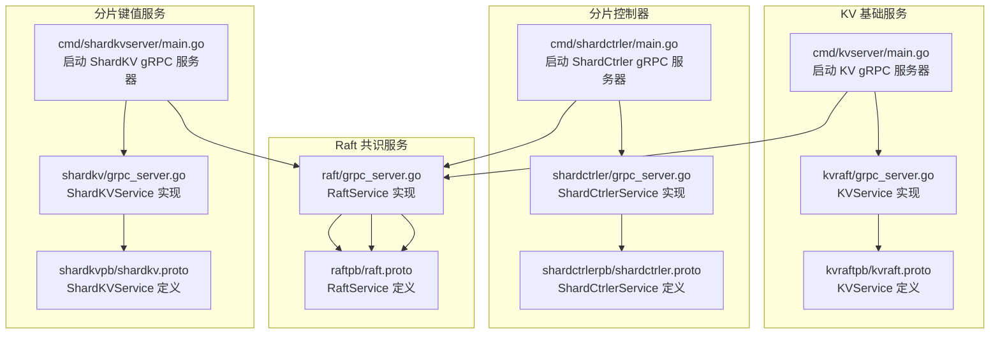
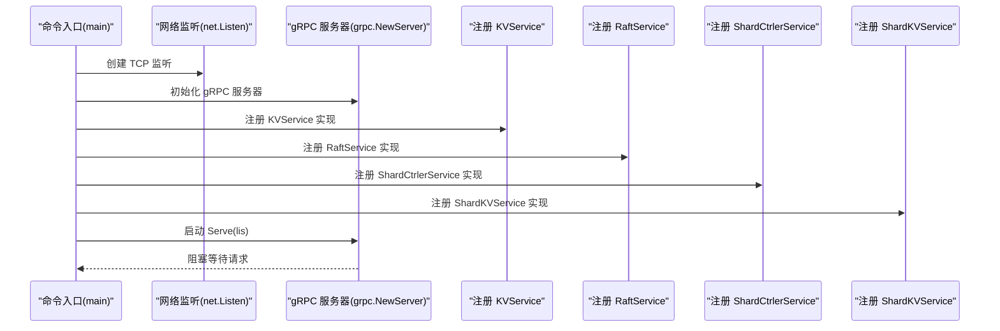
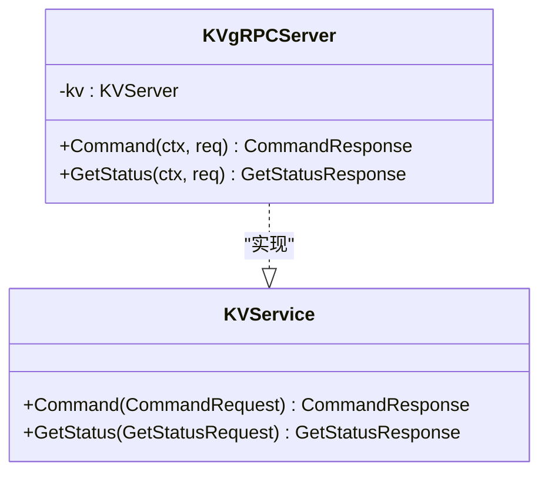
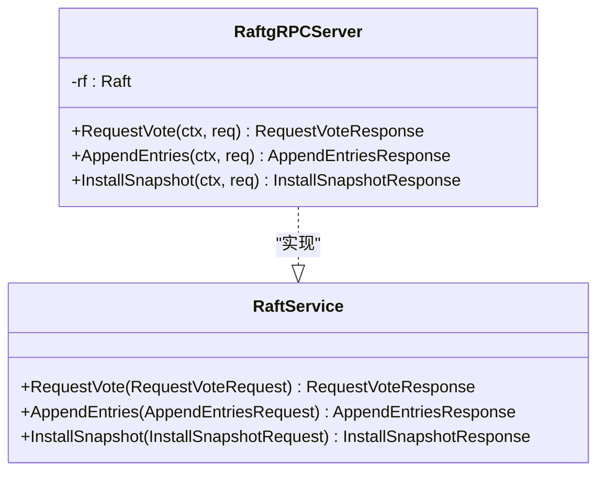
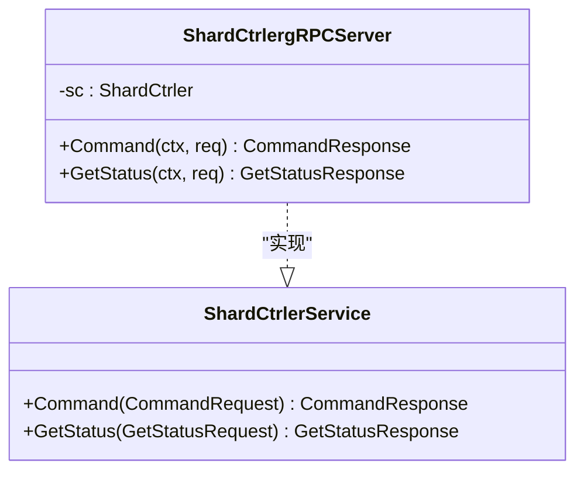
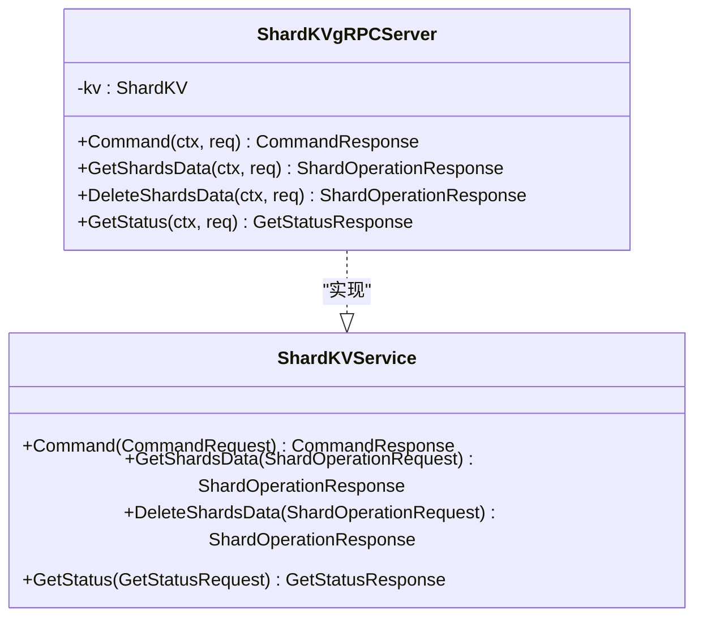
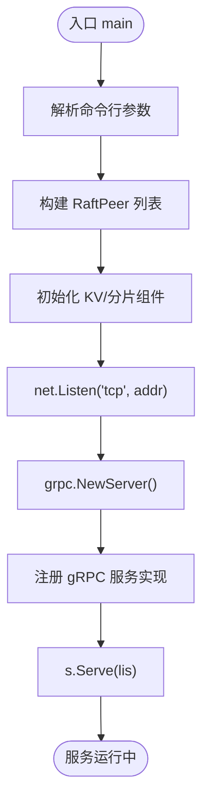
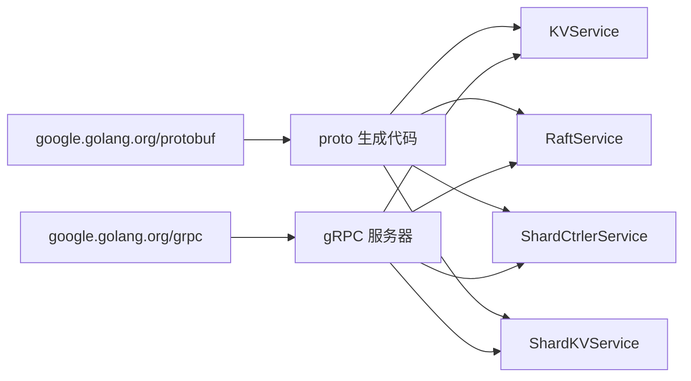

# gRPC 服务器实现

## 目录
1. [简介](#简介)
2. [项目结构](#项目结构)
3. [核心组件](#核心组件)
4. [架构总览](#架构总览)
5. [详细组件分析](#详细组件分析)
6. [依赖关系分析](#依赖关系分析)
7. [性能考虑](#性能考虑)
8. [故障排查指南](#故障排查指南)
9. [结论](#结论)
10. [附录](#附录)

## 简介
本文件面向 eRaft 项目的 gRPC 服务器实现，系统性梳理各服务的 gRPC 服务器启动流程、监听配置与生命周期管理；解释服务注册机制、拦截器与中间件配置现状；覆盖连接管理、并发处理与资源控制策略；给出服务器配置选项、性能调优参数与监控指标建议；并提供错误处理、异常恢复与优雅关闭流程说明，以及部署与运维最佳实践。

## 项目结构
eRaft 将 gRPC 服务按功能模块拆分：KV 基础键值服务、分片控制器（ShardCtrler）、分片键值服务（ShardKV），以及底层 Raft 共识协议服务。每个服务在独立命令入口中启动 gRPC 服务器，并注册对应的服务实现。

图表来源
- [cmd/kvserver/main.go](file://cmd/kvserver/main.go#L16-L47)
- [cmd/shardkvserver/main.go](file://cmd/shardkvserver/main.go#L18-L58)
- [cmd/shardctrler/main.go](file://cmd/shardctrler/main.go#L18-L56)
- [kvraft/grpc_server.go](file://kvraft/grpc_server.go#L9-L44)
- [raft/grpc_server.go](file://raft/grpc_server.go#L9-L74)
- [shardctrler/grpc_server.go](file://shardctrler/grpc_server.go#L9-L71)
- [shardkv/grpc_server.go](file://shardkv/grpc_server.go#L9-L98)
- [kvraftpb/kvraft.proto](file://kvraftpb/kvraft.proto#L37-L40)
- [raftpb/raft.proto](file://raftpb/raft.proto#L53-L57)
- [shardkvpb/shardkv.proto](file://shardkvpb/shardkv.proto#L60-L65)
- [shardctrlerpb/shardctrler.proto](file://shardctrlerpb/shardctrler.proto#L51-L54)

章节来源
- [cmd/kvserver/main.go](file://cmd/kvserver/main.go#L16-L47)
- [cmd/shardkvserver/main.go](file://cmd/shardkvserver/main.go#L18-L58)
- [cmd/shardctrler/main.go](file://cmd/shardctrler/main.go#L18-L56)

## 核心组件
- KVService gRPC 服务器：提供基础键值操作与状态查询，注册于 KV 服务器入口。
- RaftService gRPC 服务器：提供投票、日志复制与快照安装接口，注册于所有需要共识通信的入口。
- ShardCtrlerService gRPC 服务器：提供分片配置变更与查询，注册于分片控制器入口。
- ShardKVService gRPC 服务器：提供键值操作、分片数据迁移与状态查询，注册于分片键值服务入口。

章节来源
- [kvraft/grpc_server.go](file://kvraft/grpc_server.go#L9-L44)
- [raft/grpc_server.go](file://raft/grpc_server.go#L9-L74)
- [shardctrler/grpc_server.go](file://shardctrler/grpc_server.go#L9-L71)
- [shardkv/grpc_server.go](file://shardkv/grpc_server.go#L9-L98)

## 架构总览
下图展示各入口如何创建 gRPC 服务器、监听端口并注册服务：

图表来源
- [cmd/kvserver/main.go](file://cmd/kvserver/main.go#L34-L46)
- [cmd/shardkvserver/main.go](file://cmd/shardkvserver/main.go#L44-L57)
- [cmd/shardctrler/main.go](file://cmd/shardctrler/main.go#L41-L55)

## 详细组件分析

### KVService gRPC 服务器
- 服务器实现：KVgRPCServer 包装 KVServer，提供 Command 与 GetStatus 两个方法。
- 请求映射：将 KVService 的请求/响应类型转换为内部 CommandRequest/CommandResponse。
- 生命周期：由 KV 服务器入口创建并注册，随后通过 Serve(lis) 提供服务。

图表来源
- [kvraft/grpc_server.go](file://kvraft/grpc_server.go#L9-L44)
- [kvraftpb/kvraft.proto](file://kvraftpb/kvraft.proto#L37-L40)

章节来源
- [kvraft/grpc_server.go](file://kvraft/grpc_server.go#L18-L44)

### RaftService gRPC 服务器
- 服务器实现：RaftgRPCServer 包装 Raft，提供 RequestVote、AppendEntries、InstallSnapshot。
- 请求映射：将 RaftService 的请求/响应类型转换为内部请求/响应结构体。
- 作用：用于节点间共识通信，被 KV、ShardKV、ShardCtrler 入口复用注册。

图表来源
- [raft/grpc_server.go](file://raft/grpc_server.go#L9-L74)
- [raftpb/raft.proto](file://raftpb/raft.proto#L53-L57)

章节来源
- [raft/grpc_server.go](file://raft/grpc_server.go#L18-L74)

### ShardCtrlerService gRPC 服务器
- 服务器实现：ShardCtrlergRPCServer 包装 ShardCtrler，提供 Command 与 GetStatus。
- 请求映射：将分片配置相关字段从 proto 转换为内部结构，返回 Config 类型。
- 作用：对外暴露分片配置变更与查询能力。

图表来源
- [shardctrler/grpc_server.go](file://shardctrler/grpc_server.go#L9-L71)
- [shardctrlerpb/shardctrler.proto](file://shardctrlerpb/shardctrler.proto#L51-L54)

章节来源
- [shardctrler/grpc_server.go](file://shardctrler/grpc_server.go#L18-L71)

### ShardKVService gRPC 服务器
- 服务器实现：ShardKVgRPCServer 包装 ShardKV，提供 Command、GetShardsData、DeleteShardsData、GetStatus。
- 请求映射：对分片 ID、配置号、最后操作上下文等进行类型转换。
- 作用：支持分片数据迁移与状态查询。

图表来源
- [shardkv/grpc_server.go](file://shardkv/grpc_server.go#L9-L98)
- [shardkvpb/shardkv.proto](file://shardkvpb/shardkv.proto#L60-L65)

章节来源
- [shardkv/grpc_server.go](file://shardkv/grpc_server.go#L18-L98)

### 服务器启动流程与监听配置
- 监听创建：使用 net.Listen("tcp", addr) 在指定地址上创建监听。
- 服务器初始化：grpc.NewServer() 创建 gRPC 服务器实例。
- 服务注册：根据入口需求注册 KVService、RaftService、ShardCtrlerService、ShardKVService。
- 启动服务：s.Serve(lis) 开始接受连接，阻塞运行。

图表来源
- [cmd/kvserver/main.go](file://cmd/kvserver/main.go#L16-L47)
- [cmd/shardkvserver/main.go](file://cmd/shardkvserver/main.go#L18-L58)
- [cmd/shardctrler/main.go](file://cmd/shardctrler/main.go#L18-L56)

章节来源
- [cmd/kvserver/main.go](file://cmd/kvserver/main.go#L34-L46)
- [cmd/shardkvserver/main.go](file://cmd/shardkvserver/main.go#L44-L57)
- [cmd/shardctrler/main.go](file://cmd/shardctrler/main.go#L41-L55)

### 生命周期管理
- 启动阶段：解析参数、初始化持久化、构建 RaftPeer、创建 gRPC 服务器并注册服务。
- 运行阶段：Serve 阻塞等待请求；内部通过 Raft 组件处理共识与日志应用。
- 关闭阶段：当前入口未显式实现优雅关闭逻辑，建议在生产环境增加信号处理与优雅停机。

章节来源
- [cmd/kvserver/main.go](file://cmd/kvserver/main.go#L34-L46)
- [cmd/shardkvserver/main.go](file://cmd/shardkvserver/main.go#L44-L57)
- [cmd/shardctrler/main.go](file://cmd/shardctrler/main.go#L41-L55)

### 服务注册机制与中间件
- 注册方式：通过 gRPC 生成的 RegisterXxxServer 函数将实现注入到同一 gRPC 服务器实例。
- 中间件：仓库未发现自定义拦截器或中间件配置；如需链路追踪、限流、认证等功能，可在 grpc.NewServer(...) 处添加拦截器。

章节来源
- [cmd/kvserver/main.go](file://cmd/kvserver/main.go#L39-L41)
- [cmd/shardkvserver/main.go](file://cmd/shardkvserver/main.go#L50-L52)
- [cmd/shardctrler/main.go](file://cmd/shardctrler/main.go#L46-L50)

### 连接管理、并发处理与资源控制
- 并发模型：gRPC 默认多路复用单连接上的多请求；具体并发度受 gRPC 服务器配置与客户端并发影响。
- 资源控制：仓库未见显式的 gRPC 服务器选项（如最大并发、接收大小限制）设置；建议在生产环境补充相应参数以避免资源耗尽。

章节来源
- [go.mod](file://go.mod#L7-L21)

### 错误处理机制与异常恢复
- 错误传播：gRPC 方法返回 error，调用方可据此判断失败原因。
- 异常恢复：当前入口未实现统一错误处理与重试策略；建议在客户端与服务端增加统一错误包装与幂等处理。

章节来源
- [kvraft/grpc_server.go](file://kvraft/grpc_server.go#L18-L32)
- [raft/grpc_server.go](file://raft/grpc_server.go#L18-L74)
- [shardctrler/grpc_server.go](file://shardctrler/grpc_server.go#L18-L71)
- [shardkv/grpc_server.go](file://shardkv/grpc_server.go#L18-L98)

### 性能调优参数与监控指标
- gRPC 服务器参数建议：最大并发、接收大小、压缩策略、连接池大小等。
- 监控指标建议：QPS、P99 延迟、错误率、连接数、内存占用、磁盘 IO、Raft 日志长度与快照大小。
- 存储与快照：结合持久化组件与快照策略优化吞吐与延迟。

章节来源
- [raft/persister.go](file://raft/persister.go#L71-L98)
- [raft/util.go](file://raft/util.go#L84-L95)

## 依赖关系分析
- gRPC 依赖：使用 google.golang.org/grpc 与 google.golang.org/protobuf。
- 服务接口：各服务均基于 proto 定义的服务接口生成代码。
- 服务器耦合：KV、ShardKV、ShardCtrler 入口均复用 RaftService，降低节点间通信复杂度。

图表来源
- [go.mod](file://go.mod#L7-L21)
- [kvraftpb/kvraft.proto](file://kvraftpb/kvraft.proto#L37-L40)
- [raftpb/raft.proto](file://raftpb/raft.proto#L53-L57)
- [shardctrlerpb/shardctrler.proto](file://shardctrlerpb/shardctrler.proto#L51-L54)
- [shardkvpb/shardkv.proto](file://shardkvpb/shardkv.proto#L60-L65)

章节来源
- [go.mod](file://go.mod#L7-L21)

## 性能考虑
- 并发与资源：在 grpc.NewServer() 中配置合适的并发与接收大小限制，避免突发流量导致 OOM。
- 压缩与序列化：根据负载特征选择合适的压缩算法与消息大小阈值。
- 磁盘与快照：定期快照与日志截断，降低日志长度对性能的影响。
- 网络与连接：合理设置 KeepAlive、超时与背压策略，提升网络鲁棒性。

## 故障排查指南
- 启动失败：检查监听地址是否被占用、权限是否正确、参数是否合法。
- 服务不可达：确认 gRPC 服务已注册且 Serve 正常运行；检查防火墙与网络连通性。
- 数据不一致：核对 Raft 日志与快照一致性，关注 ApplyMsg 流程与快照安装逻辑。
- 性能退化：观察日志长度、快照大小、磁盘 IO 与内存占用，必要时调整快照策略与服务器参数。

章节来源
- [raft/persister.go](file://raft/persister.go#L34-L54)
- [raft/util.go](file://raft/util.go#L21-L41)

## 结论
eRaft 的 gRPC 服务器实现采用“按模块分离”的设计，入口负责监听与注册，服务实现专注于业务逻辑与共识交互。当前仓库未包含拦截器与中间件配置、显式的资源控制参数与优雅关闭流程，建议在生产环境中补充这些能力以提升稳定性与可观测性。

## 附录
- 部署建议
  - 使用 systemd 或容器编排平台管理进程生命周期与健康检查。
  - 为每个节点分配独立的数据目录与持久化路径。
  - 在网关层启用 TLS 与访问控制，避免直接暴露 gRPC 端口。
- 运维最佳实践
  - 持续监控 QPS、延迟分布、错误率与资源使用情况。
  - 定期备份持久化数据与快照，验证恢复流程。
  - 对关键路径进行压力测试，评估不同参数组合下的性能表现。