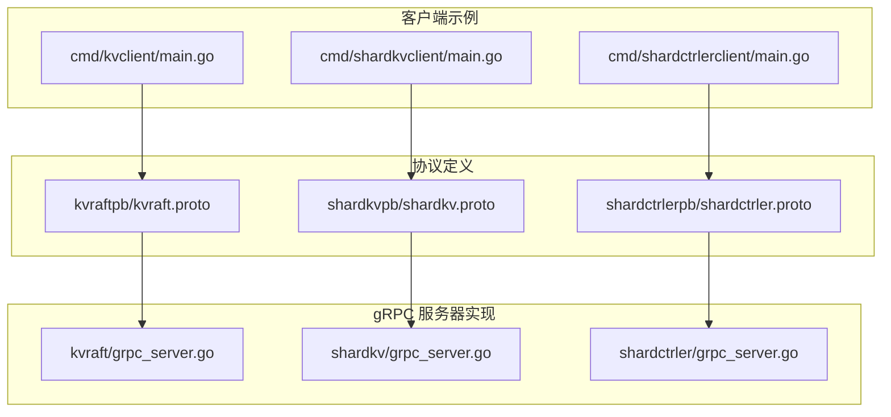
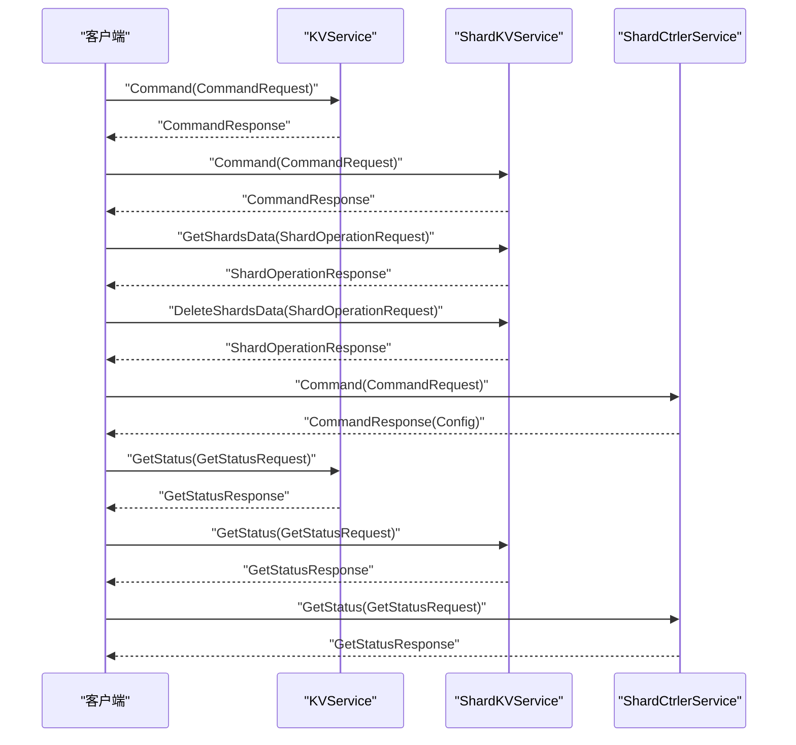
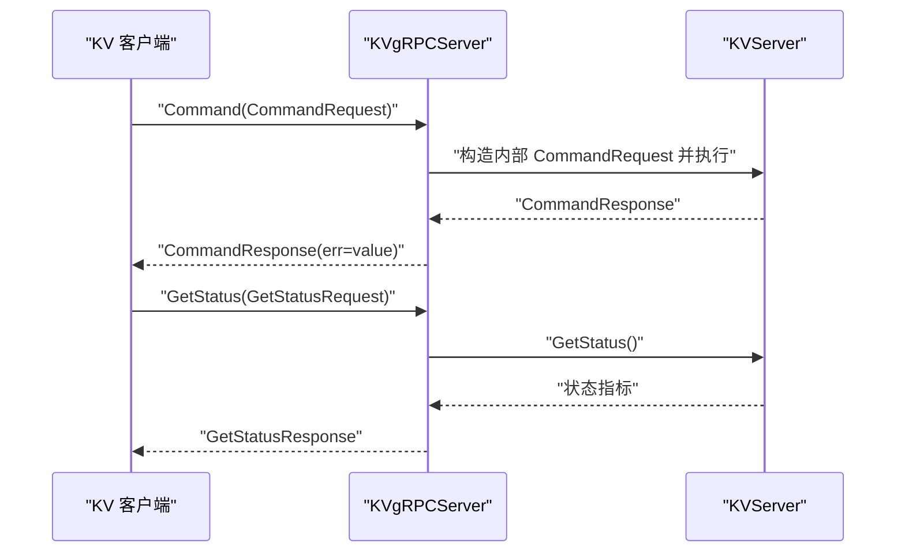
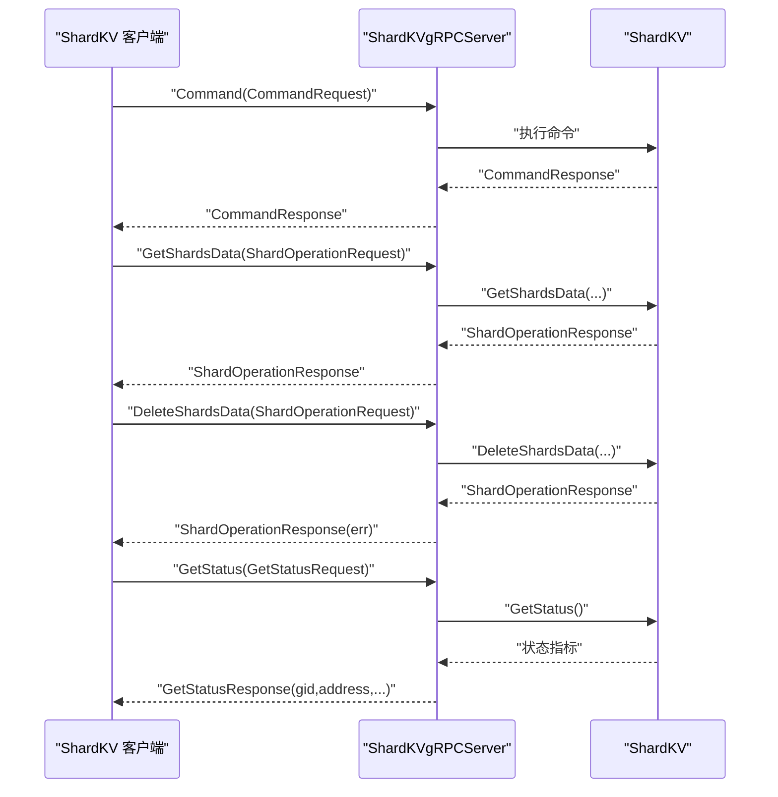
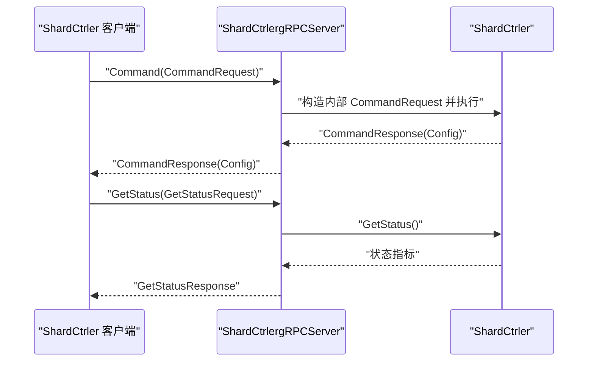
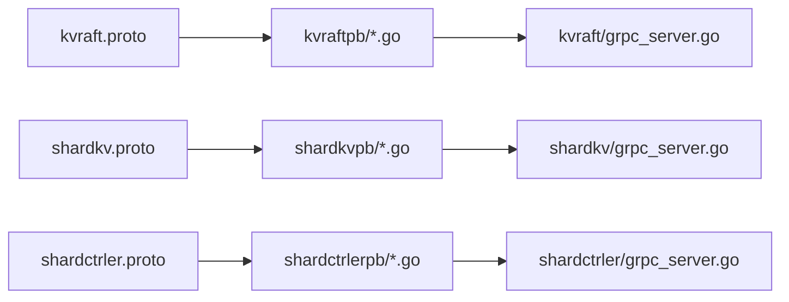

# gRPC 服务定义

## 目录
1. [简介](#简介)
2. [项目结构](#项目结构)
3. [核心组件](#核心组件)
4. [架构总览](#架构总览)
5. [详细组件分析](#详细组件分析)
6. [依赖关系分析](#依赖关系分析)
7. [性能与序列化](#性能与序列化)
8. [故障排查指南](#故障排查指南)
9. [结论](#结论)
10. [附录：接口规范与集成指南](#附录接口规范与集成指南)

## 简介
本文件面向开发者，系统性梳理 eRaft 中基于 gRPC 的三类服务定义与实现：KVService（单机键值）、ShardKVService（分片键值集群）与 ShardCtrlerService（配置控制器）。文档覆盖以下要点：
- 三类服务的 Protocol Buffers 定义与消息结构
- 关键消息如 CommandRequest、CommandResponse、GetStatusRequest/Response 的字段说明
- 枚举类型 Op 的业务语义与使用场景
- 消息序列化机制、版本兼容性与向后兼容策略
- 服务接口规范与集成实践

## 项目结构
围绕 gRPC 服务定义与实现的关键目录与文件如下：
- kvraftpb：KVService 的 proto 定义与生成代码
- shardkvpb：ShardKVService 的 proto 定义与生成代码
- shardctrlerpb：ShardCtrlerService 的 proto 定义与生成代码
- 对应的 gRPC 服务器实现位于 kvraft、shardkv、shardctrler 子包中
- 客户端示例位于 cmd/*client 目录，用于演示如何调用各服务

图表来源
- [kvraft.proto](file://kvraftpb/kvraft.proto#L1-L41)
- [shardkv.proto](file://shardkvpb/shardkv.proto#L1-L66)
- [shardctrler.proto](file://shardctrlerpb/shardctrler.proto#L1-L55)
- [grpc_server.go（KV）](file://kvraft/grpc_server.go#L1-L45)
- [grpc_server.go（ShardKV）](file://shardkv/grpc_server.go#L1-L98)
- [grpc_server.go（ShardCtrler）](file://shardctrler/grpc_server.go#L1-L71)
- [main.go（KV 客户端）](file://cmd/kvclient/main.go#L1-L47)
- [main.go（ShardKV 客户端）](file://cmd/shardkvclient/main.go#L1-L106)
- [main.go（ShardCtrler 客户端）](file://cmd/shardctrlerclient/main.go#L1-L103)

章节来源
- [README.md](file://README.md#L1-L139)

## 核心组件
本节概述三大服务的职责与消息契约。

- KVService（单机键值）
  - 提供基础的键值操作与节点状态查询
  - 主要 RPC：Command、GetStatus
  - 关键消息：CommandRequest、CommandResponse、GetStatusRequest、GetStatusResponse

- ShardKVService（分片键值集群）
  - 在 KV 基础上扩展分片能力，支持跨分片的数据迁移与清理
  - 主要 RPC：Command、GetShardsData、DeleteShardsData、GetStatus
  - 关键消息：CommandRequest、CommandResponse、ShardOperationRequest、ShardOperationResponse、GetStatusResponse（含 gid、address）

- ShardCtrlerService（配置控制器）
  - 负责维护分片到副本组的映射，支持动态加入、离开、移动分片与查询配置
  - 主要 RPC：Command、GetStatus
  - 关键消息：Config、Servers、CommandRequest、CommandResponse、GetStatusResponse

章节来源
- [kvraft.proto](file://kvraftpb/kvraft.proto#L37-L40)
- [shardkv.proto](file://shardkvpb/shardkv.proto#L60-L65)
- [shardctrler.proto](file://shardctrlerpb/shardctrler.proto#L51-L54)

## 架构总览
下图展示客户端、gRPC 服务器与内部状态之间的交互关系。

图表来源
- [grpc_server.go（KV）](file://kvraft/grpc_server.go#L18-L44)
- [grpc_server.go（ShardKV）](file://shardkv/grpc_server.go#L18-L97)
- [grpc_server.go（ShardCtrler）](file://shardctrler/grpc_server.go#L18-L70)
- [kvraft.proto](file://kvraftpb/kvraft.proto#L37-L40)
- [shardkv.proto](file://shardkvpb/shardkv.proto#L60-L65)
- [shardctrler.proto](file://shardctrlerpb/shardctrler.proto#L51-L54)

## 详细组件分析

### KVService（单机键值）
- 服务定义与消息
  - 服务：KVService
  - 方法：
    - Command(CommandRequest) → CommandResponse
    - GetStatus(GetStatusRequest) → GetStatusResponse
  - 请求/响应消息：
    - CommandRequest：包含 key、value、Op、client_id、command_id
    - CommandResponse：包含 err、value
    - GetStatusRequest：空
    - GetStatusResponse：包含 id、state、term、last_applied、commit_index、storage_size

- 枚举 Op 的业务含义
  - Op = PUT：设置键值
  - Op = APPEND：对现有值追加
  - Op = GET：读取值

- gRPC 实现要点
  - gRPC 服务器将 proto 层的 Op 映射为内部 OperationOp，并将内部 Err 转换为字符串返回
  - GetStatus 返回内部状态指标，便于运维监控

图表来源
- [grpc_server.go（KV）](file://kvraft/grpc_server.go#L18-L44)
- [kvraft.proto](file://kvraftpb/kvraft.proto#L13-L24)
- [kvraft.proto](file://kvraftpb/kvraft.proto#L26-L35)
- [kvraft.proto](file://kvraftpb/kvraft.proto#L37-L40)

章节来源
- [kvraft.proto](file://kvraftpb/kvraft.proto#L7-L11)
- [kvraft.proto](file://kvraftpb/kvraft.proto#L13-L24)
- [kvraft.proto](file://kvraftpb/kvraft.proto#L26-L35)
- [grpc_server.go（KV）](file://kvraft/grpc_server.go#L18-L44)
- [common.go（KV）](file://kvraft/common.go#L29-L47)
- [common.go（KV）](file://kvraft/common.go#L49-L70)

### ShardKVService（分片键值集群）
- 服务定义与消息
  - 服务：ShardKVService
  - 方法：
    - Command(CommandRequest) → CommandResponse
    - GetShardsData(ShardOperationRequest) → ShardOperationResponse
    - DeleteShardsData(ShardOperationRequest) → ShardOperationResponse
    - GetStatus(GetStatusRequest) → GetStatusResponse（新增 gid、address 字段）
  - 关键消息：
    - ShardOperationRequest：config_num、shard_ids 列表
    - ShardOperationResponse：err、config_num、shards（分片到键值映射）、last_operations（分片最后操作上下文）
    - ShardData：map<string,string> kv
    - OperationContext：max_applied_command_id、last_response

- 枚举 Op 的业务含义
  - 与 KVService 一致：PUT、APPEND、GET

- 迁移与清理流程
  - GetShardsData：拉取目标分片数据与最后操作上下文
  - DeleteShardsData：删除已迁移的旧数据，触发垃圾回收

图表来源
- [grpc_server.go（ShardKV）](file://shardkv/grpc_server.go#L18-L97)
- [shardkv.proto](file://shardkvpb/shardkv.proto#L13-L24)
- [shardkv.proto](file://shardkvpb/shardkv.proto#L26-L45)
- [shardkv.proto](file://shardkvpb/shardkv.proto#L47-L58)
- [shardkv.proto](file://shardkvpb/shardkv.proto#L60-L65)

章节来源
- [shardkv.proto](file://shardkvpb/shardkv.proto#L7-L11)
- [shardkv.proto](file://shardkvpb/shardkv.proto#L13-L24)
- [shardkv.proto](file://shardkvpb/shardkv.proto#L26-L45)
- [shardkv.proto](file://shardkvpb/shardkv.proto#L47-L58)
- [grpc_server.go（ShardKV）](file://shardkv/grpc_server.go#L18-L97)
- [common.go（ShardKV）](file://shardkv/common.go#L169-L187)
- [common.go（ShardKV）](file://shardkv/common.go#L189-L208)
- [common.go（ShardKV）](file://shardkv/common.go#L210-L228)

### ShardCtrlerService（配置控制器）
- 服务定义与消息
  - 服务：ShardCtrlerService
  - 方法：
    - Command(CommandRequest) → CommandResponse(Config)
    - GetStatus(GetStatusRequest) → GetStatusResponse
  - 关键消息：
    - Config：num、shards[NShards]、groups（gid→servers）
    - Servers：servers 列表
    - CommandRequest：根据 Op 选择性字段（servers/gids/shard/gid/num），以及 client_id、command_id
    - CommandResponse：err、config

- 枚举 Op 的业务含义
  - Op = JOIN：加入新的副本组（servers 字段）
  - Op = LEAVE：移除副本组（gids 字段）
  - Op = MOVE：移动某个分片到指定组（shard、gid 字段）
  - Op = QUERY：查询配置（num 字段）

图表来源
- [grpc_server.go（ShardCtrler）](file://shardctrler/grpc_server.go#L18-L70)
- [shardctrler.proto](file://shardctrlerpb/shardctrler.proto#L7-L11)
- [shardctrler.proto](file://shardctrlerpb/shardctrler.proto#L17-L22)
- [shardctrler.proto](file://shardctrlerpb/shardctrler.proto#L24-L33)
- [shardctrler.proto](file://shardctrlerpb/shardctrler.proto#L35-L38)
- [shardctrler.proto](file://shardctrlerpb/shardctrler.proto#L40-L49)
- [shardctrler.proto](file://shardctrlerpb/shardctrler.proto#L51-L54)

章节来源
- [shardctrler.proto](file://shardctrlerpb/shardctrler.proto#L7-L11)
- [shardctrler.proto](file://shardctrlerpb/shardctrler.proto#L17-L22)
- [shardctrler.proto](file://shardctrlerpb/shardctrler.proto#L24-L33)
- [shardctrler.proto](file://shardctrlerpb/shardctrler.proto#L35-L38)
- [shardctrler.proto](file://shardctrlerpb/shardctrler.proto#L40-L49)
- [grpc_server.go（ShardCtrler）](file://shardctrler/grpc_server.go#L18-L70)
- [common.go（ShardCtrler）](file://shardctrler/common.go#L65-L86)
- [common.go（ShardCtrler）](file://shardctrler/common.go#L108-L131)

## 依赖关系分析
- 协议与实现解耦
  - proto 文件仅定义消息与服务；gRPC 服务器实现负责将 proto 层对象转换为内部类型并调用对应服务逻辑
- 生成脚本
  - 使用 protoc 与 protoc-gen-go、protoc-gen-go-grpc 插件生成 Go 代码，确保 proto 与运行时绑定一致

图表来源
- [proto_gen.sh](file://proto_gen.sh#L7-L10)
- [kvraft.proto](file://kvraftpb/kvraft.proto#L1-L41)
- [shardkv.proto](file://shardkvpb/shardkv.proto#L1-L66)
- [shardctrler.proto](file://shardctrlerpb/shardctrler.proto#L1-L55)
- [grpc_server.go（KV）](file://kvraft/grpc_server.go#L1-L16)
- [grpc_server.go（ShardKV）](file://shardkv/grpc_server.go#L1-L16)
- [grpc_server.go（ShardCtrler）](file://shardctrler/grpc_server.go#L1-L16)

章节来源
- [proto_gen.sh](file://proto_gen.sh#L1-L10)

## 性能与序列化
- 序列化机制
  - proto3 使用二进制编码，具有高效、紧凑的特点
  - gRPC 默认使用 HTTP/2，具备多路复用、头部压缩等优势
- 版本兼容与向后兼容
  - 字段编号保持稳定，新增字段建议使用可选字段（不破坏旧客户端解析）
  - 枚举默认包含未知值处理，避免因新枚举值导致解析失败
  - 服务方法扩展遵循“新增方法不破坏现有客户端”的原则
- 内部命令序列化
  - ShardKV 在内部使用 labgob 编码配置与迁移数据，保证一致性日志中的复杂结构可持久化与传输

章节来源
- [shardkv/common.go](file://shardkv/common.go#L118-L141)

## 故障排查指南
- 常见错误码（Err）
  - KV/通用：OK、ErrNoKey、ErrWrongLeader、ErrTimeout
  - ShardKV：在通用基础上增加 ErrWrongGroup、ErrOutDated、ErrNotReady
  - ShardCtrler：OK、ErrWrongLeader、ErrTimeout
- 排查步骤
  - 检查 GetStatus 返回的状态指标（id、state、term、last_applied、commit_index、storage_size）
  - 对于 ShardKV，确认 gid 与 address 字段是否正确，定位具体分片归属
  - 若出现 ErrWrongLeader/ErrOutDated，检查当前 leader 是否变更或配置版本落后
- 客户端验证
  - 使用命令行客户端进行基本读写与状态查询，快速定位问题范围

章节来源
- [common.go（KV）](file://kvraft/common.go#L49-L70)
- [common.go（ShardKV）](file://shardkv/common.go#L38-L68)
- [common.go（ShardCtrler）](file://shardctrler/common.go#L88-L106)
- [grpc_server.go（KV）](file://kvraft/grpc_server.go#L34-L44)
- [grpc_server.go（ShardKV）](file://shardkv/grpc_server.go#L86-L97)
- [grpc_server.go（ShardCtrler）](file://shardctrler/grpc_server.go#L60-L70)

## 结论
- KVService 提供最小可用的键值操作与状态查询
- ShardKVService 在 KV 基础上引入分片、迁移与清理能力，满足水平扩展需求
- ShardCtrlerService 提供配置管理与动态调度
- 通过清晰的 proto 定义与 gRPC 服务器实现，系统实现了良好的可维护性与可扩展性

## 附录：接口规范与集成指南

### 通用消息与字段说明
- CommandRequest
  - key：字符串，键名
  - value：字符串，值（对 PUT/APPEND 有效）
  - op：枚举，操作类型（PUT/APPEND/GET 或 JOIN/LEAVE/MOVE/QUERY）
  - client_id：整数，客户端标识
  - command_id：整数，客户端侧单调递增的命令序号
- CommandResponse
  - err：字符串，错误码文本
  - value：字符串，GET 返回的值或空
- GetStatusRequest
  - 空
- GetStatusResponse
  - id：整数，节点 ID
  - state：字符串，节点角色/状态
  - term：整数，任期
  - last_applied：整数，最后应用的日志索引
  - commit_index：整数，已提交的日志索引
  - storage_size：整数，存储大小（字节）
  - ShardKVService 额外字段：address（地址）、gid（分组 ID）

章节来源
- [kvraft.proto](file://kvraftpb/kvraft.proto#L13-L24)
- [kvraft.proto](file://kvraftpb/kvraft.proto#L26-L35)
- [shardkv.proto](file://shardkvpb/shardkv.proto#L13-L24)
- [shardkv.proto](file://shardkvpb/shardkv.proto#L47-L58)
- [shardctrler.proto](file://shardctrlerpb/shardctrler.proto#L24-L38)
- [shardctrler.proto](file://shardctrlerpb/shardctrler.proto#L40-L49)

### 服务接口规范
- KVService
  - Command：执行键值操作
  - GetStatus：查询节点状态
- ShardKVService
  - Command：执行键值操作（按分片路由）
  - GetShardsData：拉取分片数据与最后操作上下文
  - DeleteShardsData：删除已迁移分片数据
  - GetStatus：查询节点状态（含 gid、address）
- ShardCtrlerService
  - Command：执行配置变更（JOIN/LEAVE/MOVE/QUERY）
  - GetStatus：查询控制器状态

章节来源
- [kvraft.proto](file://kvraftpb/kvraft.proto#L37-L40)
- [shardkv.proto](file://shardkvpb/shardkv.proto#L60-L65)
- [shardctrler.proto](file://shardctrlerpb/shardctrler.proto#L51-L54)

### 集成指南
- 生成与编译
  - 使用提供的脚本生成 proto 代码并编译
- 客户端调用
  - 参考命令行示例，构建连接列表，调用相应 RPC
- 运维监控
  - 使用 GetStatus 获取节点状态，结合 address 与 gid 定位问题

章节来源
- [proto_gen.sh](file://proto_gen.sh#L1-L10)
- [main.go（KV 客户端）](file://cmd/kvclient/main.go#L11-L46)
- [main.go（ShardKV 客户端）](file://cmd/shardkvclient/main.go#L14-L95)
- [main.go（ShardCtrler 客户端）](file://cmd/shardctrlerclient/main.go#L12-L92)