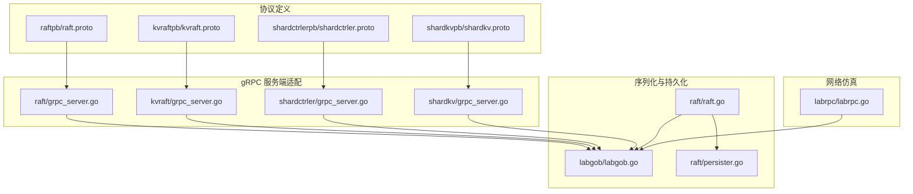
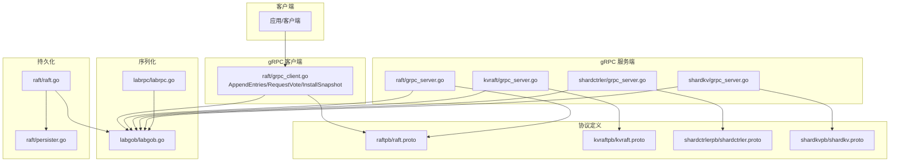
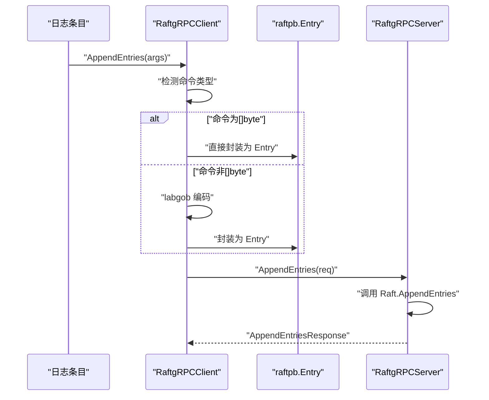
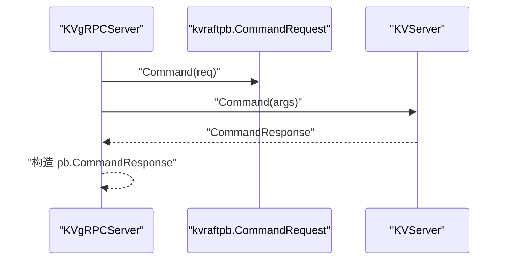
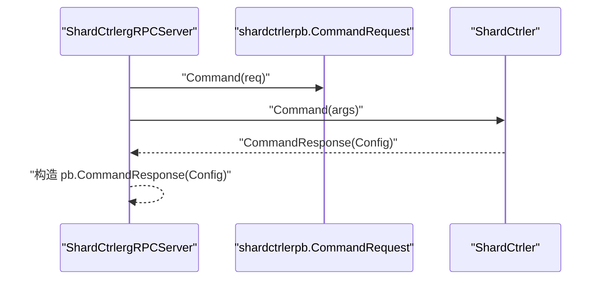
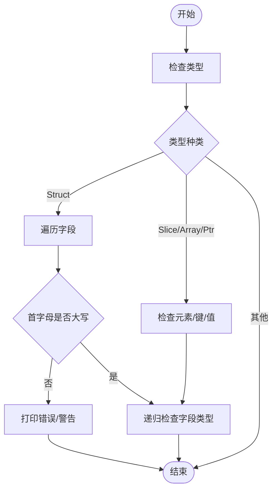
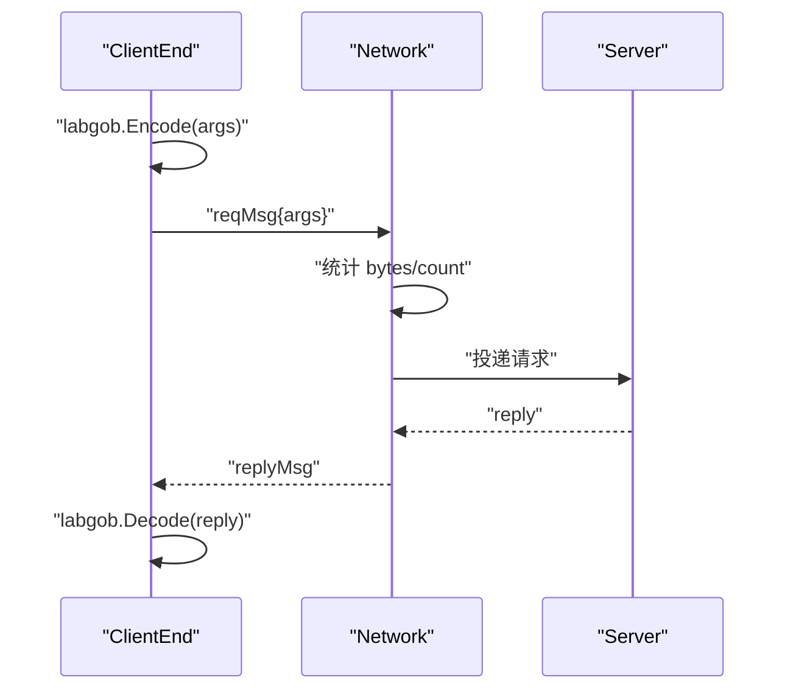
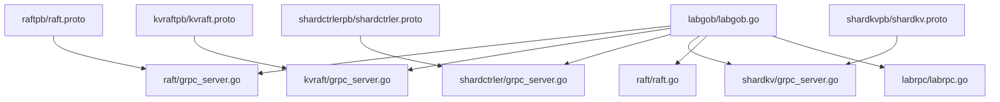

# 协议设计与消息序列化

<cite>
**本文引用的文件**
- [raftpb/raft.proto](file://raftpb/raft.proto)
- [kvraftpb/kvraft.proto](file://kvraftpb/kvraft.proto)
- [shardctrlerpb/shardctrler.proto](file://shardctrlerpb/shardctrler.proto)
- [shardkvpb/shardkv.proto](file://shardkvpb/shardkv.proto)
- [raft/grpc_server.go](file://raft/grpc_server.go)
- [raft/grpc_client.go](file://raft/grpc_client.go)
- [kvraft/grpc_server.go](file://kvraft/grpc_server.go)
- [shardctrler/grpc_server.go](file://shardctrler/grpc_server.go)
- [shardkv/grpc_server.go](file://shardkv/grpc_server.go)
- [labgob/labgob.go](file://labgob/labgob.go)
- [raft/persister.go](file://raft/persister.go)
- [raft/raft.go](file://raft/raft.go)
- [labrpc/labrpc.go](file://labrpc/labrpc.go)
- [proto_gen.sh](file://proto_gen.sh)
- [raft/test_test.go](file://raft/test_test.go)
</cite>

## 目录
1. [引言](#引言)
2. [项目结构](#项目结构)
3. [核心组件](#核心组件)
4. [架构总览](#架构总览)
5. [详细组件分析](#详细组件分析)
6. [依赖关系分析](#依赖关系分析)
7. [性能考量](#性能考量)
8. [故障排查指南](#故障排查指南)
9. [结论](#结论)
10. [附录](#附录)

## 引言
本文件面向 eRaft 的协议设计与消息序列化，系统性阐述以下主题：
- Protocol Buffers 协议设计原则与消息结构优化
- 消息版本管理、向后兼容性与协议演进策略
- 序列化性能优化、压缩与传输效率提升
- 自定义序列化器 labgob 的实现原理与使用场景
- 协议调试工具、消息追踪与性能分析方法
- 安全性考虑、数据完整性验证与传输加密机制
- 协议扩展指南与最佳实践建议

## 项目结构
eRaft 将不同子系统的协议与服务分别置于独立目录中，采用“按功能域分层”的组织方式：
- 协议定义：各子系统在各自 pb 目录下维护 proto 文件（raftpb、kvraftpb、shardctrlerpb、shardkvpb）
- gRPC 服务端适配：每个子系统提供 gRPC 服务端包装器，负责将内部请求/响应转换为 pb 类型
- 序列化与持久化：labgob 提供自定义 Gob 编解码器；raft 的 Persister 负责状态与快照的磁盘读写
- 网络仿真：labrpc 提供基于通道的 RPC 抽象，统一使用 labgob 编解码以避免引用问题

图表来源
- [raftpb/raft.proto](file://raftpb/raft.proto#L1-L58)
- [kvraftpb/kvraft.proto](file://kvraftpb/kvraft.proto#L1-L41)
- [shardctrlerpb/shardctrler.proto](file://shardctrlerpb/shardctrler.proto#L1-L55)
- [shardkvpb/shardkv.proto](file://shardkvpb/shardkv.proto#L1-L66)
- [raft/grpc_server.go](file://raft/grpc_server.go#L1-L74)
- [kvraft/grpc_server.go](file://kvraft/grpc_server.go#L1-L45)
- [shardctrler/grpc_server.go](file://shardctrler/grpc_server.go#L1-L71)
- [shardkv/grpc_server.go](file://shardkv/grpc_server.go#L1-L98)
- [labgob/labgob.go](file://labgob/labgob.go#L1-L178)
- [raft/persister.go](file://raft/persister.go#L1-L111)
- [raft/raft.go](file://raft/raft.go#L1-L200)
- [labrpc/labrpc.go](file://labrpc/labrpc.go#L1-L200)

章节来源
- [raftpb/raft.proto](file://raftpb/raft.proto#L1-L58)
- [kvraftpb/kvraft.proto](file://kvraftpb/kvraft.proto#L1-L41)
- [shardctrlerpb/shardctrler.proto](file://shardctrlerpb/shardctrler.proto#L1-L55)
- [shardkvpb/shardkv.proto](file://shardkvpb/shardkv.proto#L1-L66)
- [raft/grpc_server.go](file://raft/grpc_server.go#L1-L74)
- [kvraft/grpc_server.go](file://kvraft/grpc_server.go#L1-L45)
- [shardctrler/grpc_server.go](file://shardctrler/grpc_server.go#L1-L71)
- [shardkv/grpc_server.go](file://shardkv/grpc_server.go#L1-L98)
- [labgob/labgob.go](file://labgob/labgob.go#L1-L178)
- [raft/persister.go](file://raft/persister.go#L1-L111)
- [raft/raft.go](file://raft/raft.go#L1-L200)
- [labrpc/labrpc.go](file://labrpc/labrpc.go#L1-L200)

## 核心组件
- Protocol Buffers 协议定义：以 proto3 语法定义消息与服务接口，确保跨语言一致性与高效序列化
- gRPC 服务端适配：将内部请求/响应对象映射到 pb 类型，完成类型转换与字段对齐
- labgob 自定义序列化器：在 labrpc 与 raft 持久化路径中使用，提供字段可见性检查与默认值警告
- 持久化与快照：Persister 统一保存 Raft 状态与快照，保证原子性与一致性
- 网络仿真：labrpc 基于通道模拟网络，统一使用 labgob 编解码，便于测试与调试

章节来源
- [raftpb/raft.proto](file://raftpb/raft.proto#L1-L58)
- [kvraftpb/kvraft.proto](file://kvraftpb/kvraft.proto#L1-L41)
- [shardctrlerpb/shardctrler.proto](file://shardctrlerpb/shardctrler.proto#L1-L55)
- [shardkvpb/shardkv.proto](file://shardkvpb/shardkv.proto#L1-L66)
- [raft/grpc_server.go](file://raft/grpc_server.go#L1-L74)
- [kvraft/grpc_server.go](file://kvraft/grpc_server.go#L1-L45)
- [shardctrler/grpc_server.go](file://shardctrler/grpc_server.go#L1-L71)
- [shardkv/grpc_server.go](file://shardkv/grpc_server.go#L1-L98)
- [labgob/labgob.go](file://labgob/labgob.go#L1-L178)
- [raft/persister.go](file://raft/persister.go#L1-L111)
- [labrpc/labrpc.go](file://labrpc/labrpc.go#L1-L200)

## 架构总览
eRaft 的协议与序列化架构围绕“协议定义—服务适配—序列化—持久化/传输”展开，如下图所示：

图表来源
- [raft/grpc_client.go](file://raft/grpc_client.go#L1-L107)
- [raft/grpc_server.go](file://raft/grpc_server.go#L1-L74)
- [kvraft/grpc_server.go](file://kvraft/grpc_server.go#L1-L45)
- [shardctrler/grpc_server.go](file://shardctrler/grpc_server.go#L1-L71)
- [shardkv/grpc_server.go](file://shardkv/grpc_server.go#L1-L98)
- [raftpb/raft.proto](file://raftpb/raft.proto#L1-L58)
- [kvraftpb/kvraft.proto](file://kvraftpb/kvraft.proto#L1-L41)
- [shardctrlerpb/shardctrler.proto](file://shardctrlerpb/shardctrler.proto#L1-L55)
- [shardkvpb/shardkv.proto](file://shardkvpb/shardkv.proto#L1-L66)
- [labgob/labgob.go](file://labgob/labgob.go#L1-L178)
- [labrpc/labrpc.go](file://labrpc/labrpc.go#L1-L200)
- [raft/persister.go](file://raft/persister.go#L1-L111)
- [raft/raft.go](file://raft/raft.go#L1-L200)

## 详细组件分析

### Raft 协议与消息序列化
- 协议定义要点
  - 使用 proto3 语法，明确字段编号与类型，确保二进制序列化紧凑且可解析
  - 请求/响应消息清晰分离，便于版本控制与演进
- 服务端适配
  - gRPC 服务端将内部请求/响应转换为 pb 类型，保持字段对齐与类型一致
- 客户端适配
  - gRPC 客户端在发送日志条目时，若命令非字节切片，则回退至 labgob 编码，增强兼容性
- 持久化与快照
  - 使用 labgob 对当前任期、投票信息与日志进行编码，持久化到磁盘
  - 快照与状态保存采用原子操作，避免状态不一致

图表来源
- [raft/grpc_client.go](file://raft/grpc_client.go#L46-L88)
- [raft/grpc_server.go](file://raft/grpc_server.go#L33-L58)
- [raftpb/raft.proto](file://raftpb/raft.proto#L25-L39)

章节来源
- [raftpb/raft.proto](file://raftpb/raft.proto#L1-L58)
- [raft/grpc_server.go](file://raft/grpc_server.go#L1-L74)
- [raft/grpc_client.go](file://raft/grpc_client.go#L1-L107)
- [raft/raft.go](file://raft/raft.go#L85-L116)
- [raft/persister.go](file://raft/persister.go#L71-L98)

### KV/Raft 协议与消息序列化
- 协议定义要点
  - 使用枚举表达操作类型，简化客户端与服务端交互
  - 请求/响应消息包含错误与返回值，便于快速失败与状态查询
- 服务端适配
  - 各服务端将内部请求/响应映射到 pb 类型，处理枚举与集合类型的转换

图表来源
- [kvraft/grpc_server.go](file://kvraft/grpc_server.go#L18-L32)
- [kvraftpb/kvraft.proto](file://kvraftpb/kvraft.proto#L13-L24)

章节来源
- [kvraftpb/kvraft.proto](file://kvraftpb/kvraft.proto#L1-L41)
- [kvraft/grpc_server.go](file://kvraft/grpc_server.go#L1-L45)

### 分片控制器与分片 KV 协议
- 分片控制器协议
  - 配置消息包含分片映射与组服务器列表，支持 JOIN/LEAVE/MOVE/QUERY 操作
- 分片 KV 协议
  - 支持按分片获取/删除数据、操作上下文与最后响应的记录
  - 状态查询包含节点标识、分片组 ID 等运行时信息

图表来源
- [shardctrler/grpc_server.go](file://shardctrler/grpc_server.go#L18-L58)
- [shardctrlerpb/shardctrler.proto](file://shardctrlerpb/shardctrler.proto#L24-L38)

章节来源
- [shardctrlerpb/shardctrler.proto](file://shardctrlerpb/shardctrler.proto#L1-L55)
- [shardctrler/grpc_server.go](file://shardctrler/grpc_server.go#L1-L71)
- [shardkvpb/shardkv.proto](file://shardkvpb/shardkv.proto#L1-L66)
- [shardkv/grpc_server.go](file://shardkv/grpc_server.go#L1-L98)

### labgob 自定义序列化器
- 设计目标
  - 在 RPC 或持久化路径中强制字段大写命名，避免因小写字段导致的不可预测行为
  - 对解码前的非默认值进行警告，防止复用变量导致的覆盖问题
- 关键机制
  - 类型递归检查：遍历结构体、切片、数组、指针、映射等复合类型
  - 默认值检查：深度限制为三层，避免过深结构导致的误报
  - 注册机制：对需要跨进程传输的类型进行注册，确保编解码正确

图表来源
- [labgob/labgob.go](file://labgob/labgob.go#L74-L115)
- [labgob/labgob.go](file://labgob/labgob.go#L122-L177)

章节来源
- [labgob/labgob.go](file://labgob/labgob.go#L1-L178)

### 网络仿真与 labrpc
- 统一编解码
  - 所有 RPC 请求/响应均通过 labgob 编码，确保不携带程序对象引用
- 统计与可观测性
  - 记录 RPC 总数与字节数，便于性能分析与传输效率评估
- 可靠性与延迟
  - 支持可靠/不可靠模式、长延迟与重排序开关，便于模拟复杂网络环境

图表来源
- [labrpc/labrpc.go](file://labrpc/labrpc.go#L87-L126)

章节来源
- [labrpc/labrpc.go](file://labrpc/labrpc.go#L1-L200)

## 依赖关系分析
- 协议与服务端
  - 各子系统服务端均依赖对应 pb 定义，完成请求/响应映射
- 序列化依赖
  - gRPC 客户端与服务端在必要时使用 labgob 编解码
  - raft 的持久化与恢复使用 labgob 进行状态编码
- 网络仿真
  - labrpc 在 RPC 发送/接收两端统一使用 labgob 编解码

图表来源
- [raft/grpc_server.go](file://raft/grpc_server.go#L1-L74)
- [kvraft/grpc_server.go](file://kvraft/grpc_server.go#L1-L45)
- [shardctrler/grpc_server.go](file://shardctrler/grpc_server.go#L1-L71)
- [shardkv/grpc_server.go](file://shardkv/grpc_server.go#L1-L98)
- [labgob/labgob.go](file://labgob/labgob.go#L1-L178)
- [raft/raft.go](file://raft/raft.go#L1-L200)
- [labrpc/labrpc.go](file://labrpc/labrpc.go#L1-L200)

章节来源
- [raft/grpc_server.go](file://raft/grpc_server.go#L1-L74)
- [kvraft/grpc_server.go](file://kvraft/grpc_server.go#L1-L45)
- [shardctrler/grpc_server.go](file://shardctrler/grpc_server.go#L1-L71)
- [shardkv/grpc_server.go](file://shardkv/grpc_server.go#L1-L98)
- [labgob/labgob.go](file://labgob/labgob.go#L1-L178)
- [raft/raft.go](file://raft/raft.go#L1-L200)
- [labrpc/labrpc.go](file://labrpc/labrpc.go#L1-L200)

## 性能考量
- 序列化与传输
  - Protocol Buffers 提供高效的二进制序列化，字段编号紧凑，适合高吞吐场景
  - labgob 在 RPC 与持久化路径中统一使用，减少跨模块差异带来的开销
- 日志与快照
  - 日志占用空间主要，应结合快照与日志裁剪策略降低存储与传输成本
  - 快照与状态保存采用原子操作，避免频繁 I/O 造成的抖动
- 网络仿真统计
  - 利用 labrpc 的字节统计功能评估 RPC 体积，识别异常放大或冗余传输

章节来源
- [raft/test_test.go](file://raft/test_test.go#L147-L178)
- [raft/persister.go](file://raft/persister.go#L90-L98)
- [labrpc/labrpc.go](file://labrpc/labrpc.go#L139-L141)

## 故障排查指南
- 字段可见性与默认值问题
  - 若出现 RPC 失败或状态恢复异常，优先检查 labgob 的字段大写与默认值警告
- 日志条目类型不匹配
  - gRPC 客户端在 AppendEntries 中对非字节切片命令进行 labgob 回退编码，若仍失败，检查命令序列化逻辑
- 快照安装与日志裁剪
  - CondInstallSnapshot 与 Snapshot 操作需确保索引与提交索引关系正确，避免无效裁剪
- 网络可靠性
  - 在不稳定网络下，关注 labrpc 的丢包、延迟与重排序设置，定位时序问题

章节来源
- [labgob/labgob.go](file://labgob/labgob.go#L70-L177)
- [raft/grpc_client.go](file://raft/grpc_client.go#L46-L88)
- [raft/raft.go](file://raft/raft.go#L120-L164)
- [labrpc/labrpc.go](file://labrpc/labrpc.go#L174-L193)

## 结论
eRaft 的协议设计遵循“协议定义—服务适配—统一序列化—持久化/传输”的清晰路径。Protocol Buffers 提供高效稳定的跨语言通信基础，labgob 在 RPC 与持久化路径中保障字段可见性与默认值安全。通过快照与日志裁剪、网络仿真统计与一致性检查，系统在可维护性与性能之间取得平衡。

## 附录

### 协议生成与构建
- 使用脚本安装 protoc 插件并生成 pb 代码，覆盖所有子系统协议文件

章节来源
- [proto_gen.sh](file://proto_gen.sh#L1-L10)

### 版本管理、向后兼容与演进策略
- 字段编号与枚举值
  - 新增字段应分配新编号，避免破坏现有二进制格式
  - 枚举新增值需在双方约定的默认分支中处理，确保旧版本不会崩溃
- 兼容性策略
  - 保留字段与未知字段解析，避免升级过程中的数据丢失
  - 服务端在处理未知字段时忽略，客户端在发送时保持向后兼容

### 安全性与数据完整性
- 传输加密
  - 当前实现未内置 TLS 加密，建议在生产环境启用传输层加密
- 数据完整性
  - 建议在应用层引入校验和或哈希，配合协议层字段校验共同保障完整性
- 访问控制
  - 在服务端增加鉴权与限流，防止滥用与拒绝服务攻击

### 协议扩展指南与最佳实践
- 扩展流程
  - 在 proto 中新增消息与服务，保持字段编号唯一
  - 更新服务端适配器，确保类型转换与字段映射正确
  - 在客户端与持久化路径中评估 labgob 的兼容性
- 最佳实践
  - 严格区分请求/响应消息，避免混用
  - 使用统一的错误枚举与错误字符串，便于诊断
  - 在关键路径添加日志与统计，便于性能分析与问题定位