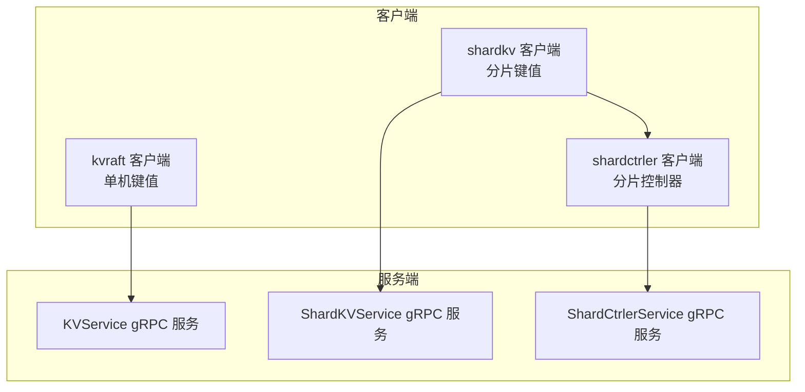
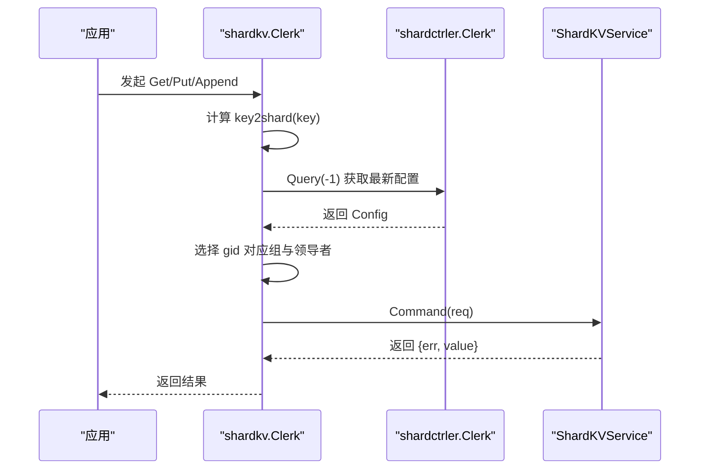
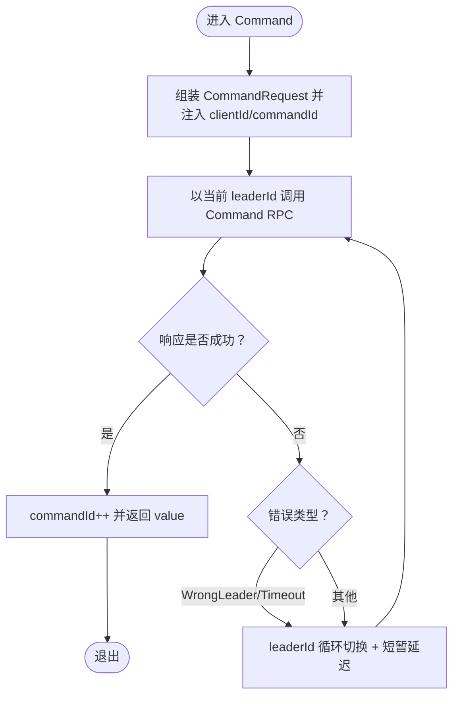
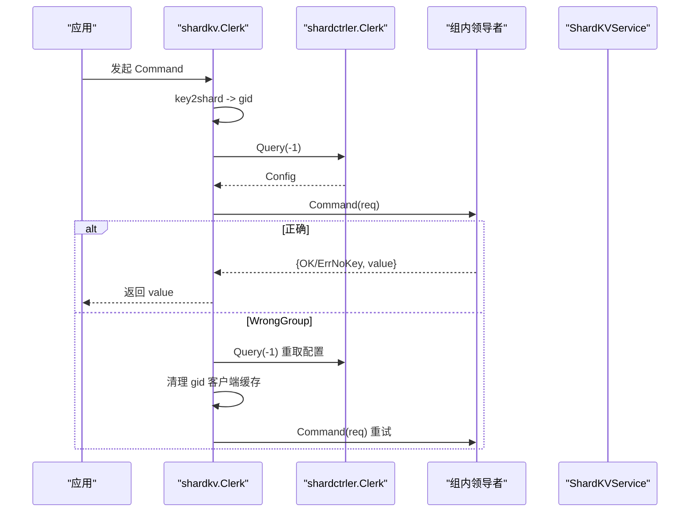
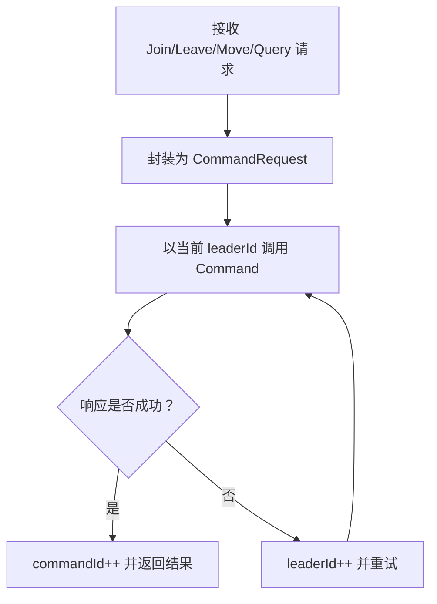
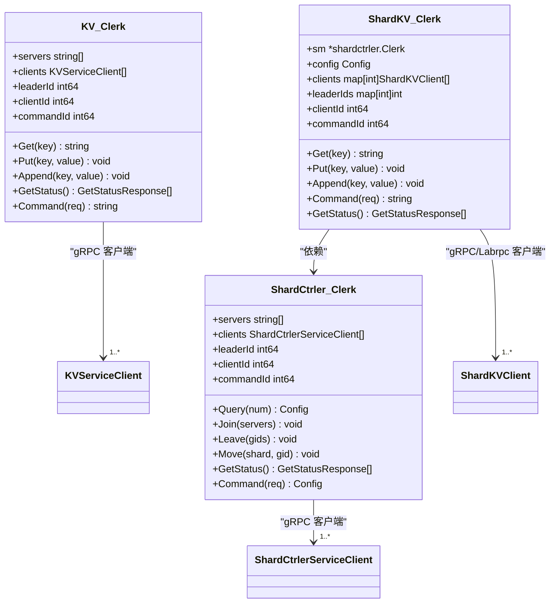
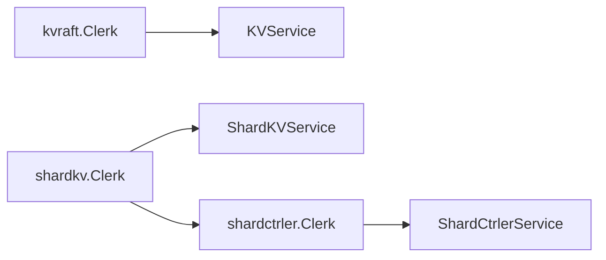

# 客户端实现

## 目录
1. [简介](#简介)
2. [项目结构](#项目结构)
3. [核心组件](#核心组件)
4. [架构总览](#架构总览)
5. [详细组件分析](#详细组件分析)
6. [依赖关系分析](#依赖关系分析)
7. [性能考量](#性能考量)
8. [故障排查指南](#故障排查指南)
9. [结论](#结论)
10. [附录](#附录)

## 简介
本文件面向 eRaft 客户端库（kvraft、shardkv、shardctrler）的实现与使用，系统化阐述客户端设计架构、初始化流程、连接建立与会话管理、负载均衡与故障转移、重试逻辑、配置项与超时、连接池管理现状、API 使用示例（同步）、错误处理与健康检查等。目标是帮助开发者快速集成、正确使用并进行性能优化。

## 项目结构
- kvraft：单机键值服务客户端，基于 gRPC 或 labrpc 适配器。
- shardkv：分片键值服务客户端，通过 shardctrler 获取配置后路由到对应组。
- shardctrler：分片控制器客户端，负责查询/加入/离开/移动分片。
- cmd/*：命令行示例，展示如何以同步方式调用客户端 API。
- proto 文件：定义各服务的 RPC 接口与消息格式。

图表来源
- [kvraft/client.go](file://kvraft/client.go#L30-L46)
- [shardkv/client.go](file://shardkv/client.go#L165-L188)
- [shardctrler/client.go](file://shardctrler/client.go#L36-L54)
- [kvraftpb/kvraft.proto](file://kvraftpb/kvraft.proto#L37-L40)
- [shardkvpb/shardkv.proto](file://shardkvpb/shardkv.proto#L60-L65)
- [shardctrlerpb/shardctrler.proto](file://shardctrlerpb/shardctrler.proto#L51-L54)

章节来源
- [kvraft/client.go](file://kvraft/client.go#L1-L144)
- [shardkv/client.go](file://shardkv/client.go#L1-L310)
- [shardctrler/client.go](file://shardctrler/client.go#L1-L215)
- [cmd/kvclient/main.go](file://cmd/kvclient/main.go#L1-L47)
- [cmd/shardkvclient/main.go](file://cmd/shardkvclient/main.go#L1-L106)
- [cmd/shardctrlerclient/main.go](file://cmd/shardctrlerclient/main.go#L1-L103)

## 核心组件
- kvraft.Clerk：单机键值客户端，维护服务器地址列表、gRPC 客户端数组、当前领导者索引、客户端唯一标识与命令序号。
- shardkv.Clerk：分片键值客户端，内部持有 shardctrler.Clerk，按 key 计算分片并选择组内领导者，动态维护组内 gRPC/Labrpc 客户端映射。
- shardctrler.Clerk：分片控制器客户端，负责 Join/Leave/Move/Query 操作，维护领导者切换与重试。
- 命令模型：统一的 CommandRequest/Response 结构体，配合 OperationOp（GET/PUT/APPEND）与 Err 枚举。
- 超时常量：各模块均定义 ExecuteTimeout 等超时常量，用于 RPC 调用的上下文控制。

章节来源
- [kvraft/client.go](file://kvraft/client.go#L16-L46)
- [shardkv/client.go](file://shardkv/client.go#L151-L188)
- [shardctrler/client.go](file://shardctrler/client.go#L21-L54)
- [kvraft/common.go](file://kvraft/common.go#L9-L92)
- [shardkv/common.go](file://shardkv/common.go#L21-L100)
- [shardctrler/common.go](file://shardctrler/common.go#L26-L106)

## 架构总览
客户端通过 gRPC 或 labrpc 与服务端交互；shardkv 在执行前先向 shardctrler 查询最新配置，再根据 key 所属分片定位到具体组内的领导者节点。

图表来源
- [shardkv/client.go](file://shardkv/client.go#L206-L265)
- [shardctrler/client.go](file://shardctrler/client.go#L125-L197)
- [shardkvpb/shardkv.proto](file://shardkvpb/shardkv.proto#L60-L65)

章节来源
- [shardkv/client.go](file://shardkv/client.go#L190-L265)
- [shardctrler/client.go](file://shardctrler/client.go#L125-L197)

## 详细组件分析

### kvraft 客户端（单机键值）
- 初始化与连接
  - MakeClerk 接收服务器地址列表，对每个地址建立 gRPC 连接并生成 KVServiceClient 列表；同时初始化 leaderId、clientId、commandId。
  - 支持 labrpc 模式：MakeLabrpcClerk 创建基于 labrpc.ClientEnd 的适配器。
- 会话与幂等性
  - 每个 Clerk 维护 clientId 与自增的 commandId，确保请求在服务端可去重。
- 路由与重试
  - Command 先以当前 leaderId 发送请求；若返回 ErrWrongLeader 或 ErrTimeout，则轮询下一个服务器，直至成功或耗尽重试。
  - Get/Put/Append 是对 Command 的封装。
- 健康检查
  - GetStatus 针对每个已知服务器发起 GetStatus 请求，超时时间内失败则标记为 Offline。

图表来源
- [kvraft/client.go](file://kvraft/client.go#L121-L143)
- [kvraft/common.go](file://kvraft/common.go#L49-L70)

章节来源
- [kvraft/client.go](file://kvraft/client.go#L30-L46)
- [kvraft/client.go](file://kvraft/client.go#L74-L87)
- [kvraft/client.go](file://kvraft/client.go#L89-L143)
- [kvraft/common.go](file://kvraft/common.go#L9-L92)

### shardkv 客户端（分片键值）
- 初始化与连接
  - MakeClerk 内部创建 shardctrler.Clerk，并查询初始配置；按需为每个 gid 组构建 gRPC/Labrpc 客户端映射。
  - 支持 labrpc 模式：MakeLabrpcClerk 接受 makeEnd 回调，按需动态创建连接。
- 分片路由与领导者选择
  - key2shard 将 key 映射到分片；从配置中查出该分片所属 gid；若 gid 对应组的服务器列表变化，会重建客户端映射。
  - 每个 gid 维护 leaderIds[gid]，在组内循环尝试领导者。
- 重试与配置更新
  - 若收到 ErrWrongGroup，表示配置已变更，主动重新 Query(-1) 并重置该 gid 的客户端缓存，然后重试。
  - 若组内所有节点都失败，等待一段时间后重试。
- 健康检查
  - GetStatus 遍历每个 gid 的服务器，构造 gRPC/Labrpc 客户端并查询状态，填充 address/gid 字段。

图表来源
- [shardkv/client.go](file://shardkv/client.go#L206-L265)
- [shardkv/common.go](file://shardkv/common.go#L29-L68)

章节来源
- [shardkv/client.go](file://shardkv/client.go#L165-L188)
- [shardkv/client.go](file://shardkv/client.go#L206-L265)
- [shardkv/client.go](file://shardkv/client.go#L267-L310)
- [shardkv/common.go](file://shardkv/common.go#L21-L100)

### shardctrler 客户端（分片控制器）
- 初始化与连接
  - MakeClerk 接收控制器地址列表，建立 gRPC 客户端；支持 labrpc 模式。
- 操作封装
  - Query/Join/Leave/Move 均是对 Command 的封装。
- 重试与领导者切换
  - Command 中若返回 ErrWrongLeader 或 ErrTimeout，则轮询下一个控制器节点。

图表来源
- [shardctrler/client.go](file://shardctrler/client.go#L159-L197)

章节来源
- [shardctrler/client.go](file://shardctrler/client.go#L36-L54)
- [shardctrler/client.go](file://shardctrler/client.go#L125-L197)

### 类与接口关系图

图表来源
- [kvraft/client.go](file://kvraft/client.go#L16-L46)
- [shardkv/client.go](file://shardkv/client.go#L151-L188)
- [shardctrler/client.go](file://shardctrler/client.go#L21-L54)

章节来源
- [kvraft/client.go](file://kvraft/client.go#L16-L46)
- [shardkv/client.go](file://shardkv/client.go#L151-L188)
- [shardctrler/client.go](file://shardctrler/client.go#L21-L54)

## 依赖关系分析
- 协议层
  - kvraftpb：KVService（Command、GetStatus）
  - shardkvpb：ShardKVService（Command、GetShardsData、DeleteShardsData、GetStatus）
  - shardctrlerpb：ShardCtrlerService（Command、GetStatus）
- 客户端到服务端的依赖
  - kvraft.Clerk -> KVService
  - shardkv.Clerk -> ShardKVService；同时依赖 shardctrler.Clerk -> ShardCtrlerService
  - shardctrler.Clerk -> ShardCtrlerService

图表来源
- [kvraftpb/kvraft.proto](file://kvraftpb/kvraft.proto#L37-L40)
- [shardkvpb/shardkv.proto](file://shardkvpb/shardkv.proto#L60-L65)
- [shardctrlerpb/shardctrler.proto](file://shardctrlerpb/shardctrler.proto#L51-L54)

章节来源
- [kvraftpb/kvraft.proto](file://kvraftpb/kvraft.proto#L1-L41)
- [shardkvpb/shardkv.proto](file://shardkvpb/shardkv.proto#L1-L66)
- [shardctrlerpb/shardctrler.proto](file://shardctrlerpb/shardctrler.proto#L1-L55)

## 性能考量
- 超时设置
  - kvraft/shardkv/shardctrler 均定义了 ExecuteTimeout，用于限制单次 RPC 的最长等待时间，避免阻塞。
- 重试与退避
  - kvraft/shardctrler 在遇到错误或超时后会轮询下一个服务器，但未实现指数退避或抖动，可能在高冲突场景下产生短时尖峰。
- 连接管理
  - kvraft：在初始化时为每个服务器建立一个 gRPC 连接并复用；未实现连接池或长连接复用策略。
  - shardkv：按 gid 维度缓存组内客户端；当配置变化时会重建客户端映射。
  - shardctrler：同 kvraft，按地址列表初始化。
- 健康检查
  - kvraft/shardkv 提供 GetStatus，但仅做短超时探测，不持久化健康状态。
- 建议
  - 引入连接池与长连接复用（如连接复用、空闲回收）。
  - 在重试中引入指数退避与抖动，降低雪崩风险。
  - 对 GetStatus 结果进行短期缓存与合并上报，减少频繁探测。

章节来源
- [kvraft/common.go](file://kvraft/common.go#L9-L18)
- [shardkv/common.go](file://shardkv/common.go#L21-L36)
- [shardctrler/common.go](file://shardctrler/common.go#L45-L54)
- [kvraft/client.go](file://kvraft/client.go#L100-L113)
- [shardkv/client.go](file://shardkv/client.go#L267-L310)

## 故障排查指南
- 常见错误码
  - kvraft：OK、ErrNoKey、ErrWrongLeader、ErrTimeout
  - shardkv：OK、ErrNoKey、ErrWrongGroup、ErrWrongLeader、ErrOutDated、ErrTimeout、ErrNotReady
  - shardctrler：OK、ErrWrongLeader、ErrTimeout
- 定位步骤
  - 检查 GetStatus 输出，确认各节点状态与地址映射。
  - 若出现 ErrWrongLeader/ErrTimeout，观察 leaderId 是否持续轮转。
  - 若出现 ErrWrongGroup，确认是否最近进行了 Join/Leave/Move，导致配置变更。
- 日志与调试
  - 各模块提供 Debug 开关与 DPrintf 辅助输出，便于开发调试。

章节来源
- [kvraft/common.go](file://kvraft/common.go#L49-L70)
- [shardkv/common.go](file://shardkv/common.go#L38-L68)
- [shardctrler/common.go](file://shardctrler/common.go#L88-L106)

## 结论
eRaft 客户端库提供了清晰的三层架构：单机键值（kvraft）、分片键值（shardkv）与分片控制器（shardctrler）。客户端通过 gRPC 与 labrpc 双通道适配，具备基本的领导者轮询与配置感知能力。建议在生产环境中引入连接池、指数退避与健康状态缓存，以提升稳定性与吞吐。

## 附录

### API 使用示例（同步）
- kvraft 客户端
  - 初始化：传入逗号分隔的服务器地址列表，调用 MakeClerk。
  - 同步调用：Get/Put/Append 直接返回字符串值或无返回。
  - 健康检查：GetStatus 返回每台服务器的状态摘要。
- shardkv 客户端
  - 初始化：传入控制器地址列表，调用 MakeClerk。
  - 同步调用：Get/Put/Append 自动路由到对应组的领导者。
  - 健康检查：GetStatus 返回每个 gid 下各节点的状态与地址。
- shardctrler 客户端
  - 初始化：传入控制器地址列表，调用 MakeClerk。
  - 同步调用：Join/Leave/Move/Query 返回相应结果。

章节来源
- [cmd/kvclient/main.go](file://cmd/kvclient/main.go#L11-L46)
- [cmd/shardkvclient/main.go](file://cmd/shardkvclient/main.go#L14-L95)
- [cmd/shardctrlerclient/main.go](file://cmd/shardctrlerclient/main.go#L12-L91)

### 关键配置与超时
- ExecuteTimeout：各模块默认的 RPC 超时时间，用于限制单次调用等待。
- Debug：布尔开关，开启后输出辅助日志。

章节来源
- [kvraft/common.go](file://kvraft/common.go#L9-L18)
- [shardkv/common.go](file://shardkv/common.go#L21-L36)
- [shardctrler/common.go](file://shardctrler/common.go#L45-L54)