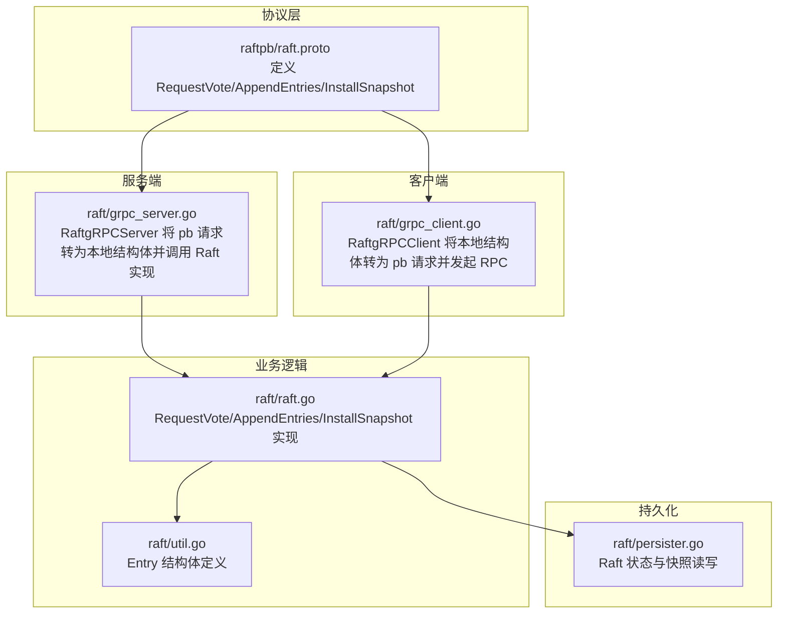
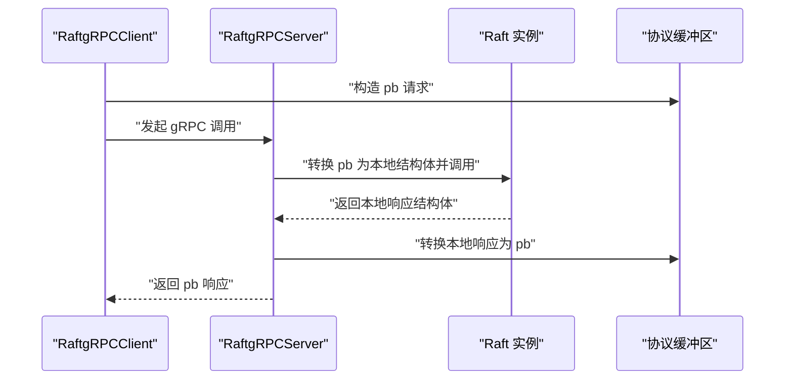
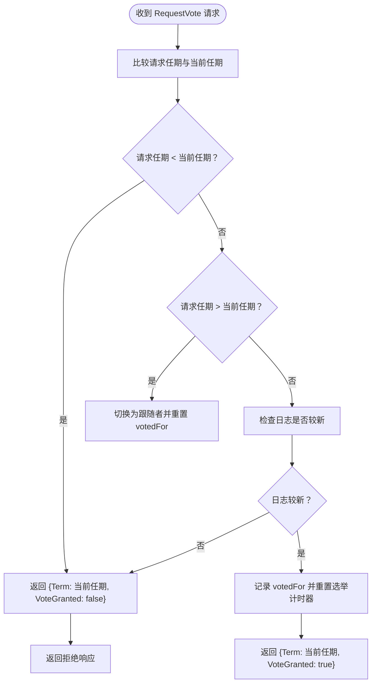
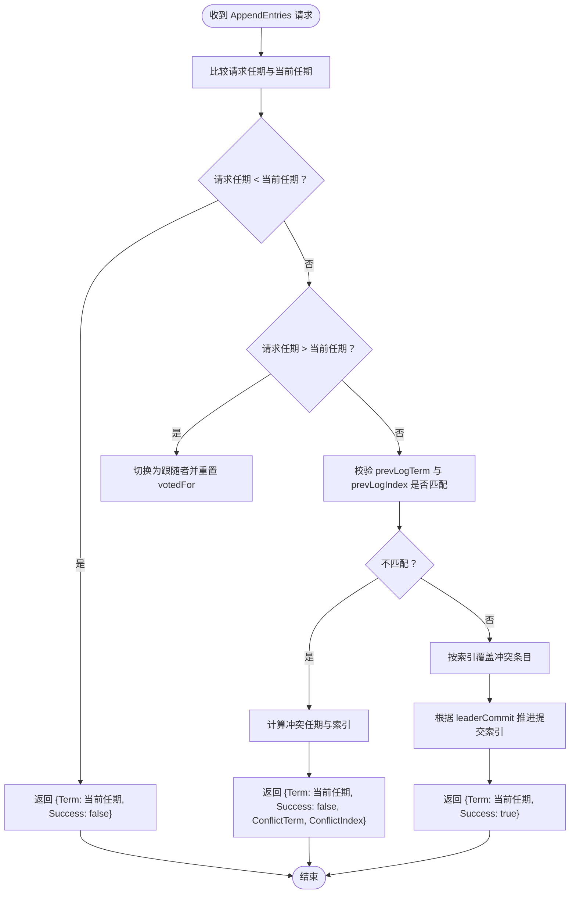
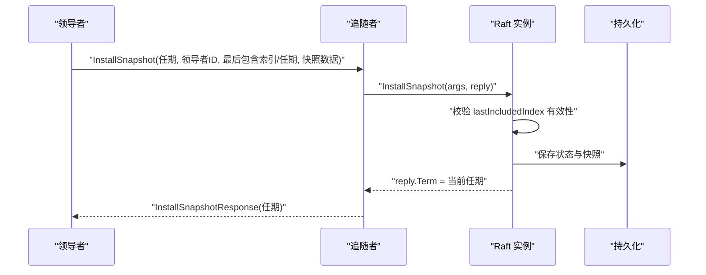
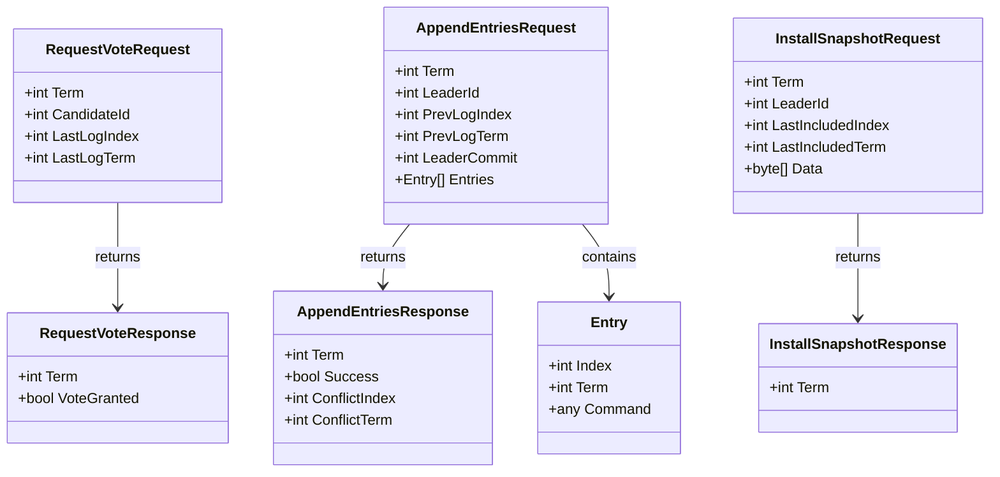

# RPC 接口定义

## 目录
1. [简介](#简介)
2. [项目结构](#项目结构)
3. [核心组件](#核心组件)
4. [架构总览](#架构总览)
5. [详细组件分析](#详细组件分析)
6. [依赖关系分析](#依赖关系分析)
7. [性能考量](#性能考量)
8. [故障排查指南](#故障排查指南)
9. [结论](#结论)
10. [附录](#附录)

## 简介
本文件系统化梳理 eraft 项目中 Raft 协议的三类核心 RPC 接口：RequestVote（请求投票）、AppendEntries（追加日志条目）与 InstallSnapshot（安装快照）。内容覆盖：
- 协议缓冲区定义与 Go 结构体映射关系
- 参数结构、字段含义与数据类型
- 使用场景、调用时机与返回值处理
- 参数验证规则与错误处理机制
- 接口演进与兼容性考虑

## 项目结构
Raft RPC 相关代码主要分布在以下模块：
- 协议定义层：raftpb/raft.proto
- 服务端适配层：raft/grpc_server.go
- 客户端适配层：raft/grpc_client.go
- 业务逻辑层：raft/raft.go、raft/util.go
- 持久化层：raft/persister.go

图表来源
- [raftpb/raft.proto](file://raftpb/raft.proto#L1-L58)
- [raft/grpc_server.go](file://raft/grpc_server.go#L1-L74)
- [raft/grpc_client.go](file://raft/grpc_client.go#L1-L107)
- [raft/raft.go](file://raft/raft.go#L166-L241)
- [raft/util.go](file://raft/util.go#L62-L67)
- [raft/persister.go](file://raft/persister.go#L1-L111)

章节来源
- [raftpb/raft.proto](file://raftpb/raft.proto#L1-L58)
- [raft/grpc_server.go](file://raft/grpc_server.go#L1-L74)
- [raft/grpc_client.go](file://raft/grpc_client.go#L1-L107)
- [raft/raft.go](file://raft/raft.go#L166-L241)
- [raft/util.go](file://raft/util.go#L62-L67)
- [raft/persister.go](file://raft/persister.go#L1-L111)

## 核心组件
- 协议缓冲区消息与服务定义：在 raftpb/raft.proto 中定义了 Entry、RequestVoteRequest/Response、AppendEntriesRequest/Response、InstallSnapshotRequest/Response 以及 RaftService 服务接口。
- 本地 Go 结构体：在 raft/rpc.go 中定义了与 pb 对应的本地结构体，用于在内存中处理 RPC 参数与返回值。
- gRPC 服务器适配器：在 raft/grpc_server.go 中，RaftgRPCServer 将 pb 请求转换为本地结构体，调用 Raft 实例对应方法，并将返回值转换回 pb 响应。
- gRPC 客户端适配器：在 raft/grpc_client.go 中，RaftgRPCClient 将本地结构体转换为 pb 请求，设置超时上下文并发起 RPC；对 AppendEntries 的命令字段做了兼容编码处理。
- 业务逻辑实现：在 raft/raft.go 中实现了 RequestVote、AppendEntries、InstallSnapshot 的核心算法逻辑。
- 数据模型：Entry 在 raft/util.go 中定义，承载日志条目的索引、任期与命令。

章节来源
- [raftpb/raft.proto](file://raftpb/raft.proto#L7-L57)
- [raft/rpc.go](file://raft/rpc.go#L5-L67)
- [raft/grpc_server.go](file://raft/grpc_server.go#L9-L73)
- [raft/grpc_client.go](file://raft/grpc_client.go#L14-L106)
- [raft/raft.go](file://raft/raft.go#L166-L241)
- [raft/util.go](file://raft/util.go#L62-L67)

## 架构总览
下图展示了从客户端到服务端的 RPC 调用链路，以及与业务逻辑层的交互。

图表来源
- [raft/grpc_client.go](file://raft/grpc_client.go#L28-L44)
- [raft/grpc_server.go](file://raft/grpc_server.go#L18-L31)
- [raft/raft.go](file://raft/raft.go#L166-L187)

## 详细组件分析

### RequestVote 接口
- 协议定义与字段
  - RequestVoteRequest：包含当前任期、候选人 ID、候选人的最后日志索引、候选人的最后日志任期。
  - RequestVoteResponse：包含当前任期、是否授予选票。
- 本地结构体映射
  - RequestVoteRequest：Term、CandidateId、LastLogIndex、LastLogTerm。
  - RequestVoteResponse：Term、VoteGranted。
- 使用场景与调用时机
  - 当节点进入候选者状态并开始新一轮选举时，向其他节点发送请求投票 RPC。
- 返回值处理
  - 若请求任期小于当前节点任期或已投过票且不是该候选人，则拒绝投票；若请求任期大于当前节点任期，切换为跟随者并更新当前任期；若候选人的日志较新则投票并重置选举计时器。
- 参数验证与错误处理
  - 验证任期一致性与日志新鲜度；若不满足条件直接返回失败响应。
- 兼容性说明
  - 字段与 pb 定义一一对应，无需额外兼容处理。

图表来源
- [raft/raft.go](file://raft/raft.go#L166-L187)

章节来源
- [raftpb/raft.proto](file://raftpb/raft.proto#L13-L23)
- [raft/rpc.go](file://raft/rpc.go#L5-L23)
- [raft/grpc_server.go](file://raft/grpc_server.go#L18-L31)
- [raft/grpc_client.go](file://raft/grpc_client.go#L28-L44)
- [raft/raft.go](file://raft/raft.go#L166-L187)

### AppendEntries 接口
- 协议定义与字段
  - AppendEntriesRequest：包含当前任期、领导者 ID、前一条日志索引与任期、领导者提交索引、日志条目数组（Entry）。
  - AppendEntriesResponse：包含当前任期、是否成功、冲突索引、冲突任期。
- 本地结构体映射
  - AppendEntriesRequest：Term、LeaderId、PrevLogIndex、PrevLogTerm、LeaderCommit、Entries（Entry 切片）。
  - AppendEntriesResponse：Term、Success、ConflictIndex、ConflictTerm。
- 使用场景与调用时机
  - 领导者周期性发送心跳（空日志条目）以维持权威；当需要复制日志或同步新条目时也会触发。
- 返回值处理
  - 若请求任期小于当前任期，直接失败；若请求任期大于当前任期，切换为跟随者并更新当前任期；若前一条日志不匹配，返回冲突信息（冲突任期与冲突索引）；否则追加缺失条目并尝试推进提交索引。
- 参数验证与错误处理
  - 通过 PrevLogTerm 与 PrevLogIndex 匹配校验；若不匹配，计算冲突任期与索引；若匹配，按索引覆盖冲突条目并推进提交。
- 兼容性说明
  - 命令字段在客户端侧可能为任意类型，客户端会尝试使用 labgob 编码为字节，确保与 pb 的 bytes 字段兼容。

图表来源
- [raft/raft.go](file://raft/raft.go#L189-L241)
- [raft/grpc_server.go](file://raft/grpc_server.go#L33-L58)
- [raft/grpc_client.go](file://raft/grpc_client.go#L46-L88)

章节来源
- [raftpb/raft.proto](file://raftpb/raft.proto#L25-L39)
- [raft/rpc.go](file://raft/rpc.go#L25-L47)
- [raft/grpc_server.go](file://raft/grpc_server.go#L33-L58)
- [raft/grpc_client.go](file://raft/grpc_client.go#L46-L88)
- [raft/raft.go](file://raft/raft.go#L189-L241)

### InstallSnapshot 接口
- 协议定义与字段
  - InstallSnapshotRequest：包含当前任期、领导者 ID、快照包含的最后日志索引与任期、快照数据。
  - InstallSnapshotResponse：包含当前任期。
- 本地结构体映射
  - InstallSnapshotRequest：Term、LeaderId、LastIncludedIndex、LastIncludedTerm、Data（字节切片）。
  - InstallSnapshotResponse：Term。
- 使用场景与调用时机
  - 当追随者落后过多，无法通过日志复制追赶时，领导者将快照一次性发送给追随者。
- 返回值处理
  - 追随者接收后更新当前任期；若追随者状态仍为领导者且响应中的任期更大，则切换为跟随者并更新当前任期。
- 参数验证与错误处理
  - 追随者会检查快照的最后包含索引是否仍有效（未被提交），并在接受后截断日志并保存状态与快照。
- 兼容性说明
  - 字段与 pb 定义一致，无需额外兼容处理。

图表来源
- [raft/raft.go](file://raft/raft.go#L243-L247)
- [raft/raft.go](file://raft/raft.go#L451-L473)
- [raft/persister.go](file://raft/persister.go#L90-L98)
- [raft/grpc_server.go](file://raft/grpc_server.go#L60-L73)
- [raft/grpc_client.go](file://raft/grpc_client.go#L90-L106)

章节来源
- [raftpb/raft.proto](file://raftpb/raft.proto#L41-L51)
- [raft/rpc.go](file://raft/rpc.go#L49-L67)
- [raft/grpc_server.go](file://raft/grpc_server.go#L60-L73)
- [raft/grpc_client.go](file://raft/grpc_client.go#L90-L106)
- [raft/raft.go](file://raft/raft.go#L243-L247)
- [raft/raft.go](file://raft/raft.go#L451-L473)
- [raft/persister.go](file://raft/persister.go#L90-L98)

## 依赖关系分析
- 协议缓冲区与本地结构体
  - raftpb/raft.proto 定义的消息与 raft/rpc.go 中的本地结构体字段一一对应，便于在内存中高效处理。
- 服务端适配器
  - RaftgRPCServer 将 pb 请求转换为本地结构体，调用 Raft 实例对应方法，再将本地响应转换为 pb 返回。
- 客户端适配器
  - RaftgRPCClient 将本地结构体转换为 pb 请求，设置超时上下文并发起 RPC；AppendEntries 的命令字段通过 labgob 编码兼容旧格式。
- 业务逻辑与数据模型
  - AppendEntries 的 Entry 结构体在 raft/util.go 中定义，承载日志条目的索引、任期与命令；Raft 实例在 raft/raft.go 中实现核心算法。
- 持久化
  - Raft 状态与快照通过 Persister 在磁盘上保存，InstallSnapshot 后会原子性保存状态与快照。

图表来源
- [raft/rpc.go](file://raft/rpc.go#L5-L67)
- [raft/util.go](file://raft/util.go#L62-L67)

章节来源
- [raft/rpc.go](file://raft/rpc.go#L5-L67)
- [raft/util.go](file://raft/util.go#L62-L67)

## 性能考量
- RPC 超时设置
  - RequestVote 与 AppendEntries 设置短超时（约 100ms），InstallSnapshot 设置较长超时（约 1s），以适应快照传输的体量。
- 日志条目批量复制
  - AppendEntries 支持批量日志条目，减少 RPC 次数，提高复制效率。
- 冲突回退策略
  - AppendEntries 通过冲突任期与索引快速定位分歧点，避免逐条比对，提升追赶速度。
- 内存优化
  - 日志数组在必要时进行收缩，降低内存占用。

章节来源
- [raft/grpc_client.go](file://raft/grpc_client.go#L29-L30)
- [raft/grpc_client.go](file://raft/grpc_client.go#L47-L48)
- [raft/grpc_client.go](file://raft/grpc_client.go#L91-L92)
- [raft/raft.go](file://raft/raft.go#L213-L228)
- [raft/util.go](file://raft/util.go#L97-L105)

## 故障排查指南
- RPC 调用失败
  - 检查客户端超时设置与网络连通性；确认服务端是否正确注册 RaftService。
- 投票被拒
  - 检查请求任期、日志新鲜度；确认当前节点是否已投过票且不是同一候选人。
- 日志不同步
  - 关注 AppendEntries 返回的冲突任期与索引，调整 nextIndex 并重试；确认 PrevLogTerm 与 PrevLogIndex 是否与本地一致。
- 快照安装异常
  - 检查 lastIncludedIndex 是否仍大于提交索引；确认快照数据完整；查看持久化是否成功保存状态与快照。

章节来源
- [raft/grpc_client.go](file://raft/grpc_client.go#L37-L43)
- [raft/grpc_client.go](file://raft/grpc_client.go#L79-L87)
- [raft/grpc_client.go](file://raft/grpc_client.go#L100-L105)
- [raft/raft.go](file://raft/raft.go#L172-L186)
- [raft/raft.go](file://raft/raft.go#L213-L228)
- [raft/raft.go](file://raft/raft.go#L120-L143)
- [raft/persister.go](file://raft/persister.go#L90-L98)

## 结论
本文件系统梳理了 Raft 的三大核心 RPC 接口，明确了协议缓冲区与本地结构体的映射关系、参数语义与调用流程，并提供了参数验证与错误处理建议。通过合理的超时设置、批量复制与冲突回退策略，可在保证一致性的同时提升性能与可维护性。

## 附录

### 协议缓冲区与 Go 结构体映射对照表
- RequestVoteRequest
  - pb: term, candidate_id, last_log_index, last_log_term
  - 本地: Term, CandidateId, LastLogIndex, LastLogTerm
- RequestVoteResponse
  - pb: term, vote_granted
  - 本地: Term, VoteGranted
- AppendEntriesRequest
  - pb: term, leader_id, prev_log_index, prev_log_term, leader_commit, entries
  - 本地: Term, LeaderId, PrevLogIndex, PrevLogTerm, LeaderCommit, Entries
- AppendEntriesResponse
  - pb: term, success, conflict_index, conflict_term
  - 本地: Term, Success, ConflictIndex, ConflictTerm
- InstallSnapshotRequest
  - pb: term, leader_id, last_included_index, last_included_term, data
  - 本地: Term, LeaderId, LastIncludedIndex, LastIncludedTerm, Data
- InstallSnapshotResponse
  - pb: term
  - 本地: Term
- Entry
  - pb: index, term, command
  - 本地: Index, Term, Command

章节来源
- [raftpb/raft.proto](file://raftpb/raft.proto#L7-L51)
- [raft/rpc.go](file://raft/rpc.go#L5-L67)
- [raft/util.go](file://raft/util.go#L62-L67)