# RPC 通信机制

<cite>
**本文档引用的文件**
- [raft/rpc.go](file://raft/rpc.go)
- [raft/grpc_server.go](file://raft/grpc_server.go)
- [raft/grpc_client.go](file://raft/grpc_client.go)
- [raftpb/raft.proto](file://raftpb/raft.proto)
- [raft/raft.go](file://raft/raft.go)
- [raft/util.go](file://raft/util.go)
- [labrpc/labrpc.go](file://labrpc/labrpc.go)
- [raft/labrpc_adapter.go](file://raft/labrpc_adapter.go)
- [raft/config.go](file://raft/config.go)
</cite>

## 目录
1. [简介](#简介)
2. [项目结构](#项目结构)
3. [核心组件](#核心组件)
4. [架构概览](#架构概览)
5. [详细组件分析](#详细组件分析)
6. [依赖关系分析](#依赖关系分析)
7. [性能考虑](#性能考虑)
8. [故障处理指南](#故障处理指南)
9. [结论](#结论)

## 简介

本文档深入分析了 eraft 项目中的 Raft 协议 RPC 通信机制。该实现提供了两种通信模式：基于 labrpc 的实验室网络模拟器和基于 gRPC 的生产级通信。文档详细解释了 RequestVote、AppendEntries、InstallSnapshot 三种核心 RPC 接口的设计与实现，包括参数定义、返回值结构、调用流程和错误处理机制。

## 项目结构

eraft 项目采用模块化设计，将 Raft 协议实现与通信层分离：

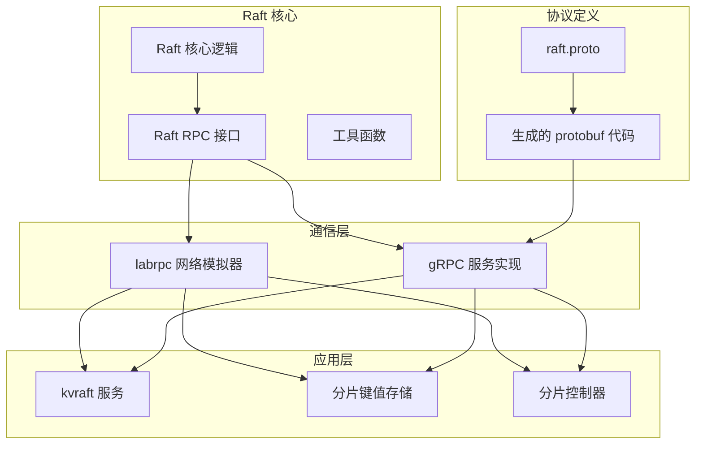

**图表来源**
- [raft/raft.go](file://raft/raft.go#L1-L200)
- [labrpc/labrpc.go](file://labrpc/labrpc.go#L1-L100)
- [raftpb/raft.proto](file://raftpb/raft.proto#L1-L58)

**章节来源**
- [raft/raft.go](file://raft/raft.go#L1-L200)
- [labrpc/labrpc.go](file://labrpc/labrpc.go#L1-L100)
- [raftpb/raft.proto](file://raftpb/raft.proto#L1-L58)

## 核心组件

### RPC 接口数据结构

系统定义了三种核心 RPC 请求和响应的数据结构：

#### RequestVote RPC
- **请求参数**：
  - `Term`: 候选人的任期号
  - `CandidateId`: 候选人的服务器 ID
  - `LastLogIndex`: 候选人最后日志条目的索引
  - `LastLogTerm`: 候选人最后日志条目的任期

- **响应参数**：
  - `Term`: 当前任期（用于候选人更新）
  - `VoteGranted`: 是否授予投票

#### AppendEntries RPC
- **请求参数**：
  - `Term`: 领导人的任期
  - `LeaderId`: 领导人的 ID
  - `PrevLogIndex`: 新条目紧随之前的日志条目的索引
  - `PrevLogTerm`: PrevLogIndex 条目的任期
  - `LeaderCommit`: 领导人已提交的日志条目索引
  - `Entries`: 要保存的日志条目数组（可为空以实现心跳）

- **响应参数**：
  - `Term`: 当前任期
  - `Success`: 追加是否成功
  - `ConflictIndex`: 冲突处的索引
  - `ConflictTerm`: 冲突处的任期

#### InstallSnapshot RPC
- **请求参数**：
  - `Term`: 领导人的当前任期
  - `LeaderId`: 领导人的 ID
  - `LastIncludedIndex`: 快照中包含的最后日志条目的索引
  - `LastIncludedTerm`: LastIncludedIndex 条目的任期
  - `Data`: 快照数据的字节流

- **响应参数**：
  - `Term`: 当前任期

**章节来源**
- [raft/rpc.go](file://raft/rpc.go#L1-L68)
- [raftpb/raft.proto](file://raftpb/raft.proto#L13-L51)

### 并发控制和线程安全

Raft 实现采用了细粒度的锁机制确保线程安全：

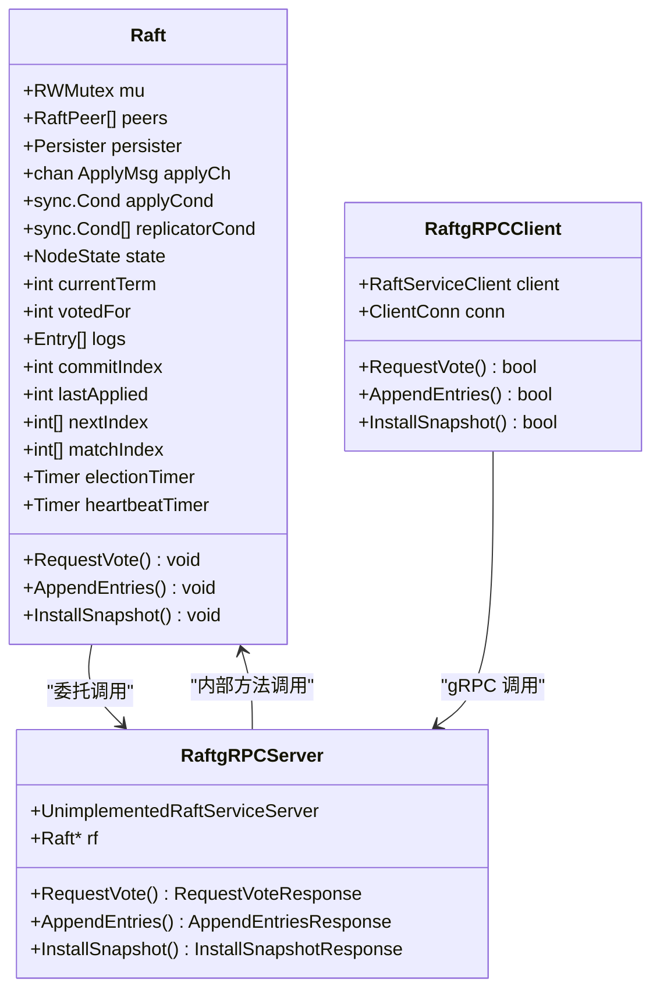

**图表来源**
- [raft/raft.go](file://raft/raft.go#L37-L60)
- [raft/grpc_server.go](file://raft/grpc_server.go#L9-L16)
- [raft/grpc_client.go](file://raft/grpc_client.go#L14-L17)

**章节来源**
- [raft/raft.go](file://raft/raft.go#L37-L60)
- [raft/grpc_server.go](file://raft/grpc_server.go#L9-L16)
- [raft/grpc_client.go](file://raft/grpc_client.go#L14-L17)

## 架构概览

### 通信架构设计

系统支持两种通信模式，既可以在实验室环境中使用 labrpc 模拟网络，也可以在生产环境中使用 gRPC：

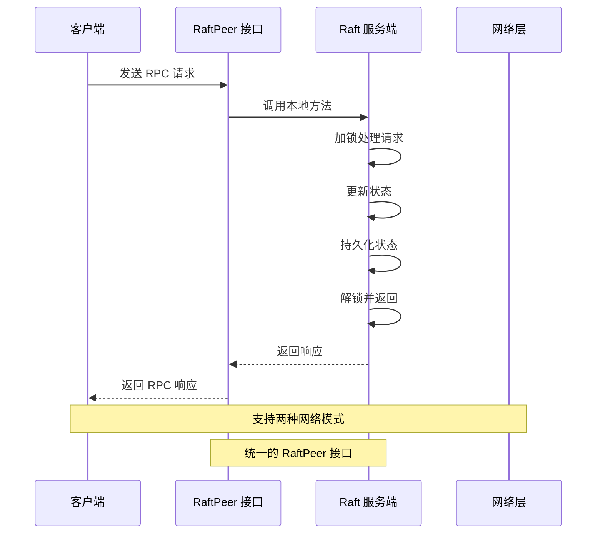

**图表来源**
- [raft/raft.go](file://raft/raft.go#L30-L34)
- [raft/labrpc_adapter.go](file://raft/labrpc_adapter.go#L9-L19)

### 状态管理机制

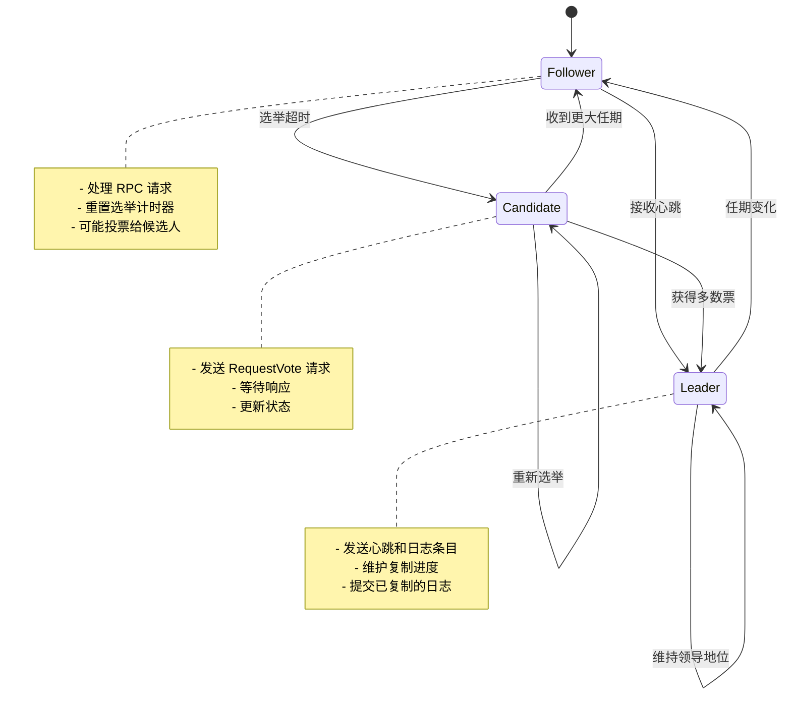

**图表来源**
- [raft/util.go](file://raft/util.go#L43-L61)
- [raft/raft.go](file://raft/raft.go#L475-L494)

**章节来源**
- [raft/util.go](file://raft/util.go#L43-L61)
- [raft/raft.go](file://raft/raft.go#L475-L494)

## 详细组件分析

### gRPC 服务实现

#### 服务端实现

gRPC 服务端负责将 protobuf 请求转换为 Raft 内部数据结构，并调用相应的 Raft 方法：

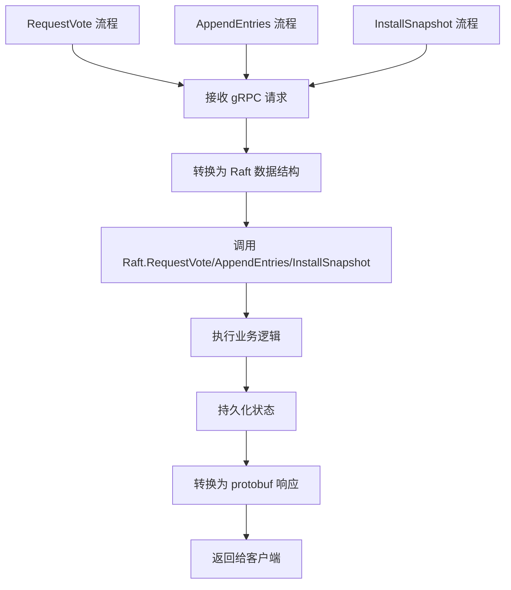

**图表来源**
- [raft/grpc_server.go](file://raft/grpc_server.go#L18-L31)
- [raft/grpc_server.go](file://raft/grpc_server.go#L33-L58)
- [raft/grpc_server.go](file://raft/grpc_server.go#L60-L73)

#### 客户端实现

gRPC 客户端实现了超时控制和错误处理机制：

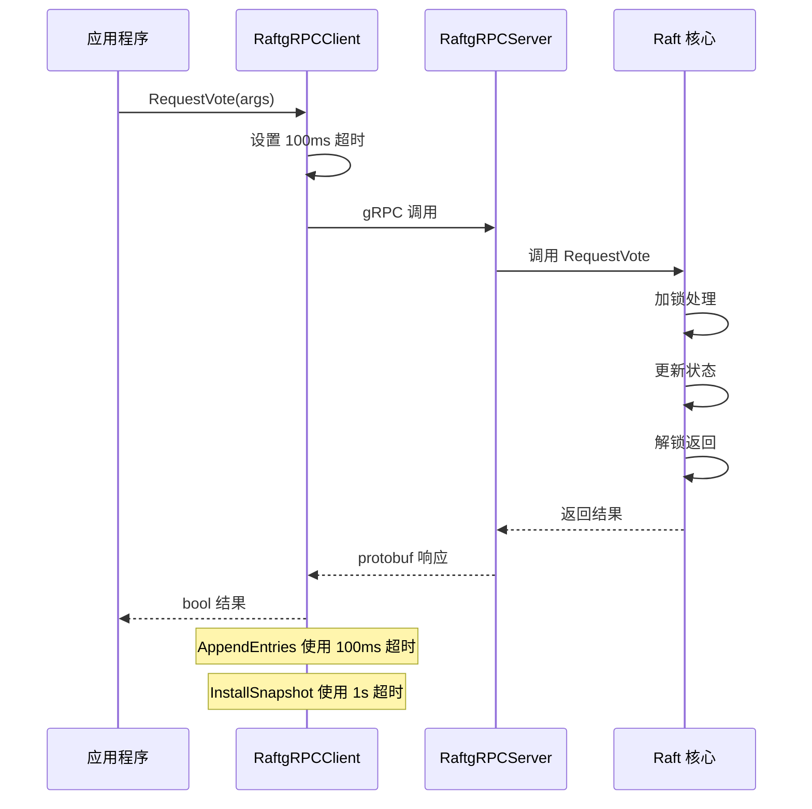

**图表来源**
- [raft/grpc_client.go](file://raft/grpc_client.go#L28-L44)
- [raft/grpc_client.go](file://raft/grpc_client.go#L46-L88)
- [raft/grpc_client.go](file://raft/grpc_client.go#L90-L106)

**章节来源**
- [raft/grpc_server.go](file://raft/grpc_server.go#L1-L74)
- [raft/grpc_client.go](file://raft/grpc_client.go#L1-L107)

### labrpc 网络模拟器

#### 网络特性

labrpc 提供了高度可控的网络环境，用于测试 Raft 在各种网络条件下的行为：

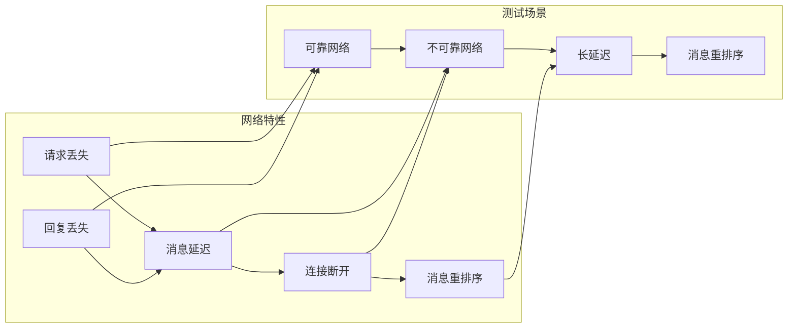

**图表来源**
- [labrpc/labrpc.go](file://labrpc/labrpc.go#L6-L42)

#### 适配器模式

通过适配器模式，Raft 可以透明地使用不同的网络实现：

**章节来源**
- [labrpc/labrpc.go](file://labrpc/labrpc.go#L1-L200)
- [raft/labrpc_adapter.go](file://raft/labrpc_adapter.go#L1-L39)

### RPC 调用流程

#### RequestVote 流程

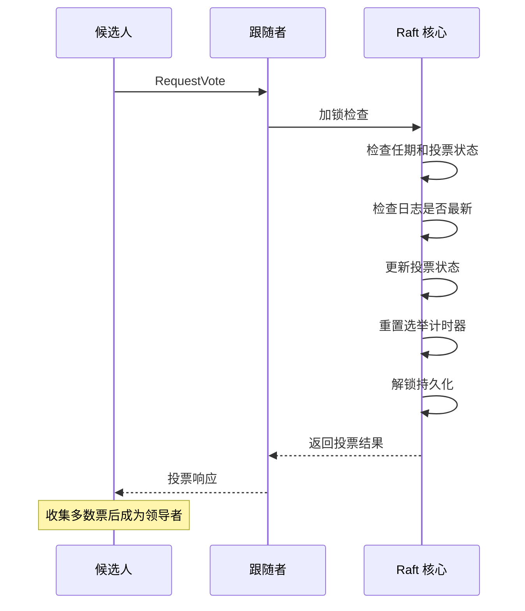

**图表来源**
- [raft/raft.go](file://raft/raft.go#L166-L187)

#### AppendEntries 流程

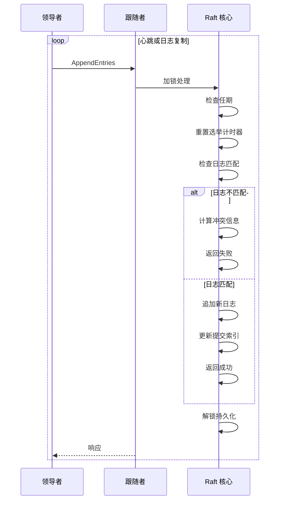

**图表来源**
- [raft/raft.go](file://raft/raft.go#L189-L241)

#### InstallSnapshot 流程

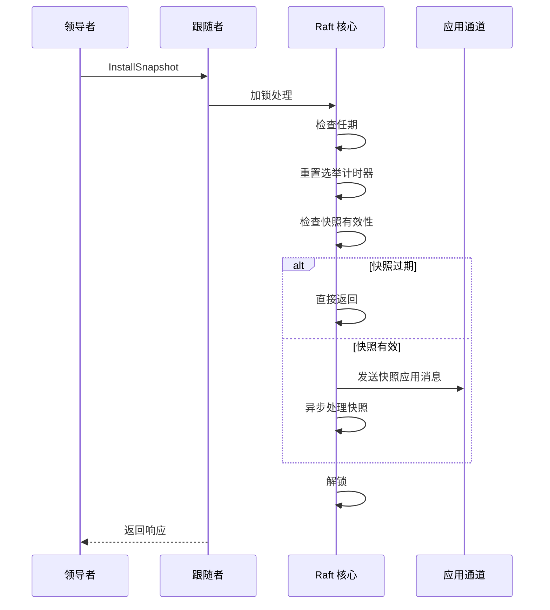

**图表来源**
- [raft/raft.go](file://raft/raft.go#L243-L275)

**章节来源**
- [raft/raft.go](file://raft/raft.go#L166-L275)

## 依赖关系分析

### 组件依赖图

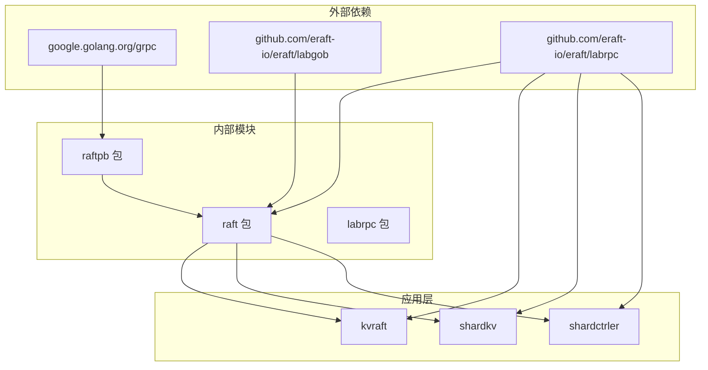

**图表来源**
- [raft/grpc_client.go](file://raft/grpc_client.go#L3-L12)
- [raft/grpc_server.go](file://raft/grpc_server.go#L3-L7)
- [raft/raft.go](file://raft/raft.go#L20-L27)

### 数据类型依赖

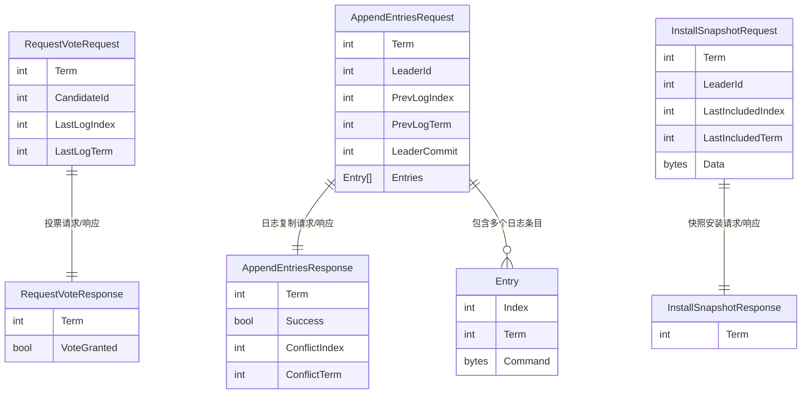

**图表来源**
- [raft/rpc.go](file://raft/rpc.go#L5-L67)

**章节来源**
- [raft/rpc.go](file://raft/rpc.go#L1-L68)
- [raftpb/raft.proto](file://raftpb/raft.proto#L7-L51)

## 性能考虑

### 超时和重试策略

系统实现了不同类型的超时机制来应对网络不确定性：

| RPC 类型 | 超时时间 | 设计目的 |
|---------|---------|----------|
| RequestVote | 100ms | 快速选举决策，避免阻塞 |
| AppendEntries | 100ms | 心跳和日志复制，保持高吞吐 |
| InstallSnapshot | 1s | 快照传输，可能较大 |

### 内存优化

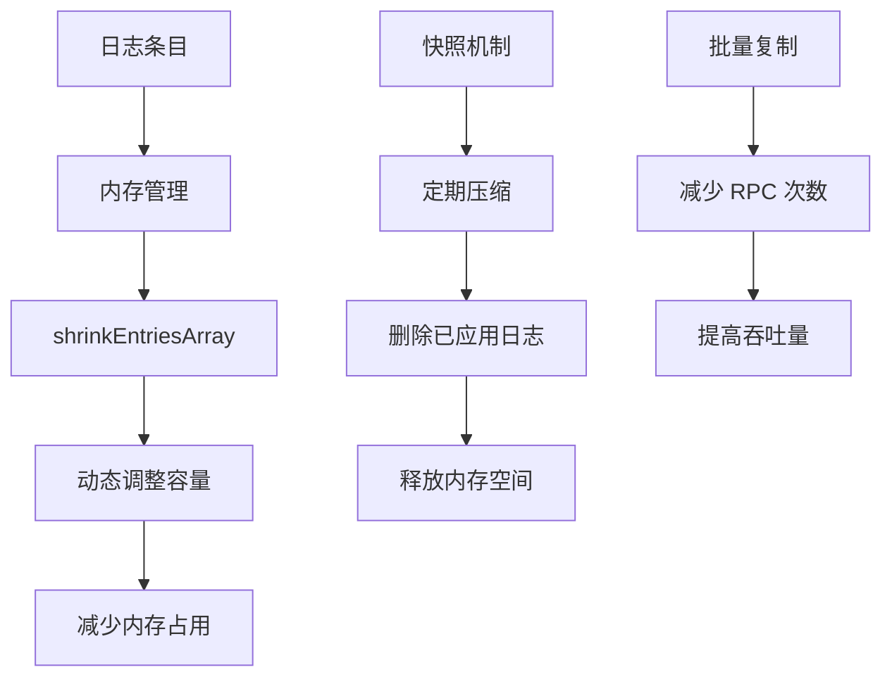

**图表来源**
- [raft/util.go](file://raft/util.go#L97-L105)
- [raft/raft.go](file://raft/raft.go#L150-L164)

### 并发优化

系统通过多种机制优化并发性能：

1. **读写锁分离**：使用 RWMutex 将读操作和写操作分离
2. **条件变量**：使用 sync.Cond 实现高效的等待/通知机制
3. **goroutine 池**：为复制、应用等任务分配专用 goroutine
4. **无锁数据结构**：在某些场景下使用原子操作

**章节来源**
- [raft/util.go](file://raft/util.go#L69-L115)
- [raft/raft.go](file://raft/raft.go#L637-L678)

## 故障处理指南

### 网络分区处理

系统通过以下机制处理网络分区：

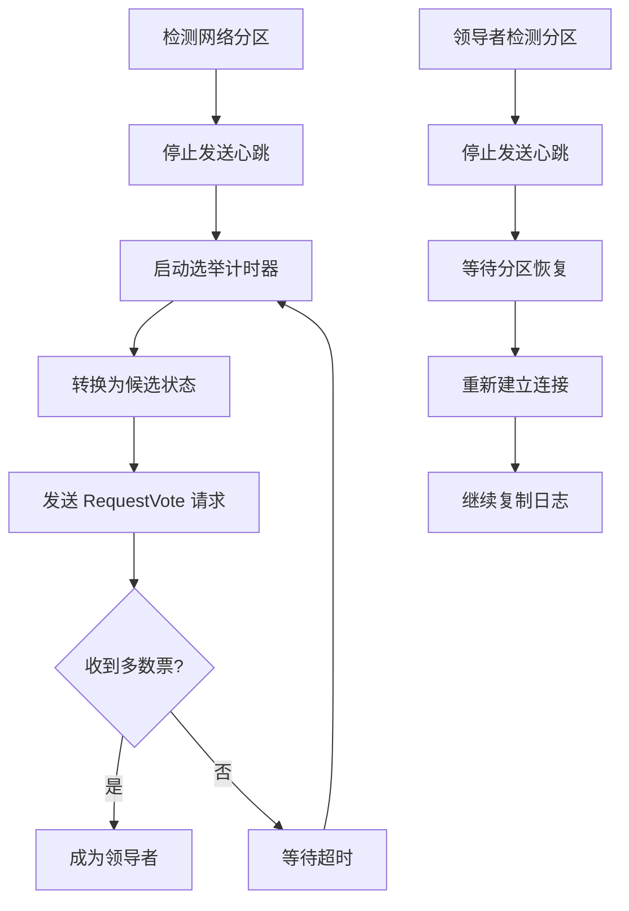

**图表来源**
- [raft/raft.go](file://raft/raft.go#L616-L635)
- [raft/raft.go](file://raft/raft.go#L316-L351)

### 错误恢复机制

#### 心跳超时处理
- 选举计时器到期触发重新选举
- 自动重置随机化的选举超时
- 防止脑裂现象

#### 日志不一致处理
- 使用冲突信息指导回溯
- 动态调整 nextIndex
- 逐步同步日志状态

#### 快照恢复
- 异步应用快照到状态机
- 保持一致性约束
- 支持部分快照恢复

**章节来源**
- [raft/raft.go](file://raft/raft.go#L423-L449)
- [raft/raft.go](file://raft/raft.go#L462-L473)
- [raft/raft.go](file://raft/raft.go#L243-L275)

### 调试和监控

系统提供了丰富的调试功能：

1. **DPrintf 函数**：条件性日志输出
2. **状态检查**：实时监控节点状态
3. **RPC 统计**：跟踪网络通信指标
4. **测试框架**：支持各种网络场景测试

**章节来源**
- [raft/util.go](file://raft/util.go#L14-L19)
- [raft/config.go](file://raft/config.go#L551-L581)

## 结论

eraft 项目的 RPC 通信机制展现了现代分布式系统设计的最佳实践：

1. **清晰的接口设计**：三种核心 RPC 接口简洁明确，满足 Raft 协议的所有需求
2. **灵活的实现选择**：同时支持 labrpc 和 gRPC 两种通信模式
3. **完善的错误处理**：通过超时、重试和状态机转换确保系统稳定性
4. **高效的并发控制**：通过细粒度锁和条件变量实现高性能
5. **良好的可扩展性**：模块化设计便于添加新功能和测试场景

该实现为学习分布式共识算法和构建可靠的分布式系统提供了优秀的参考范例。