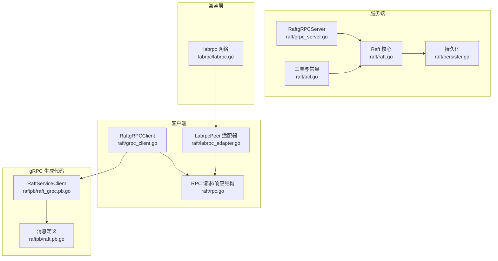
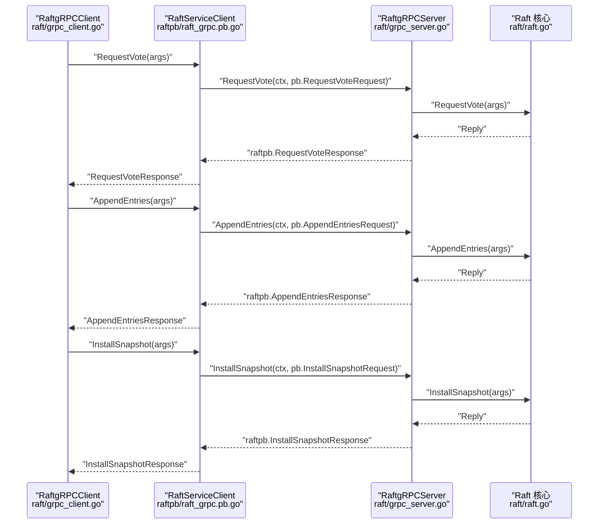
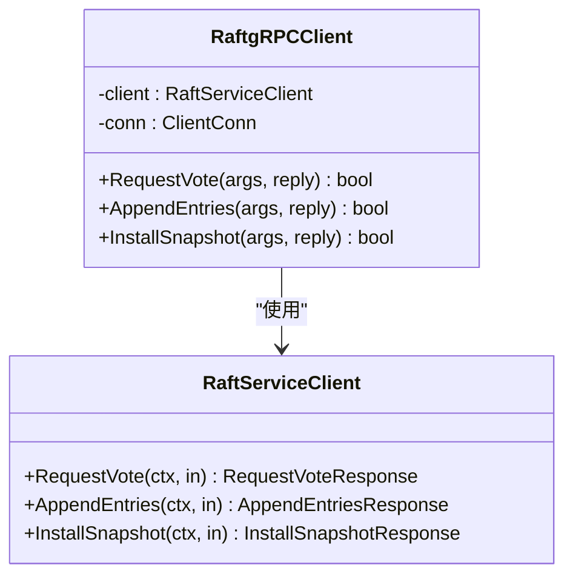
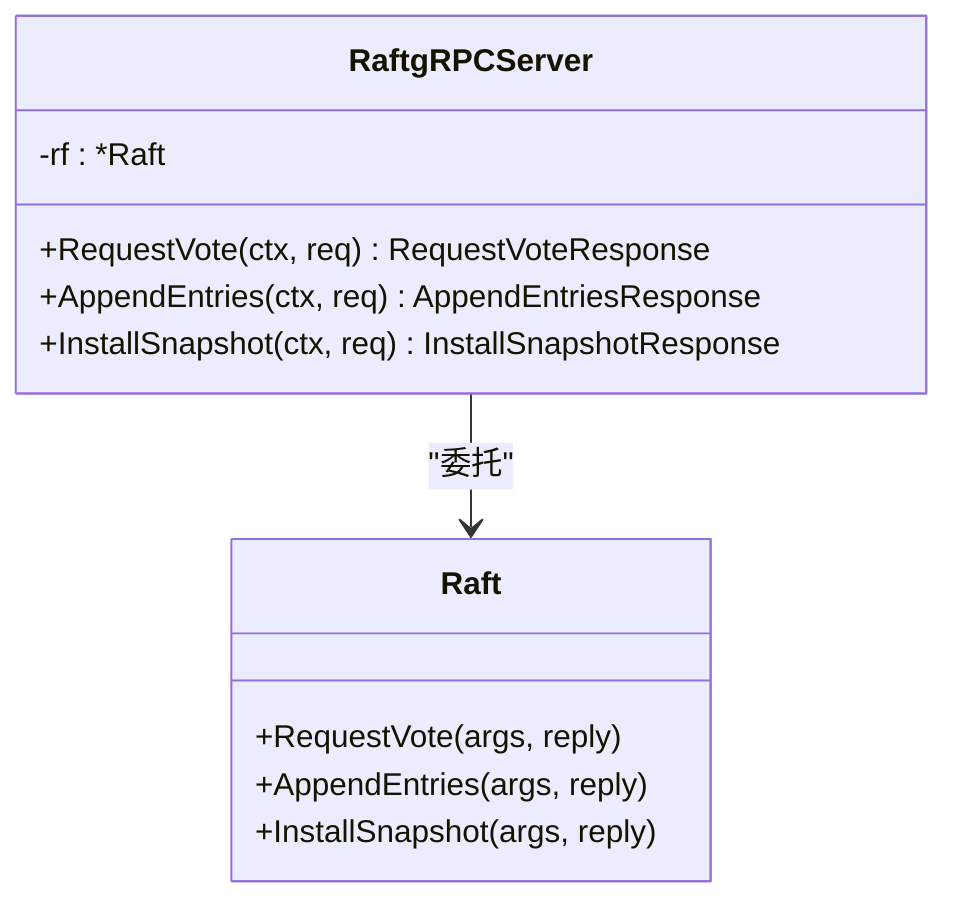
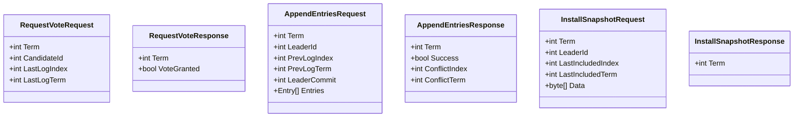
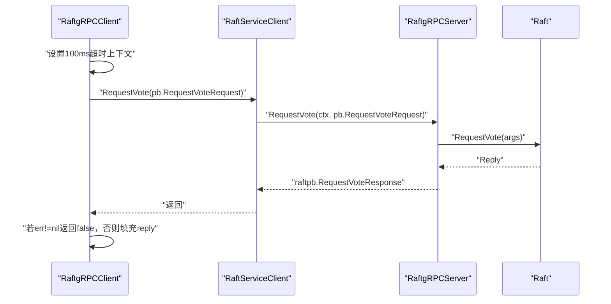
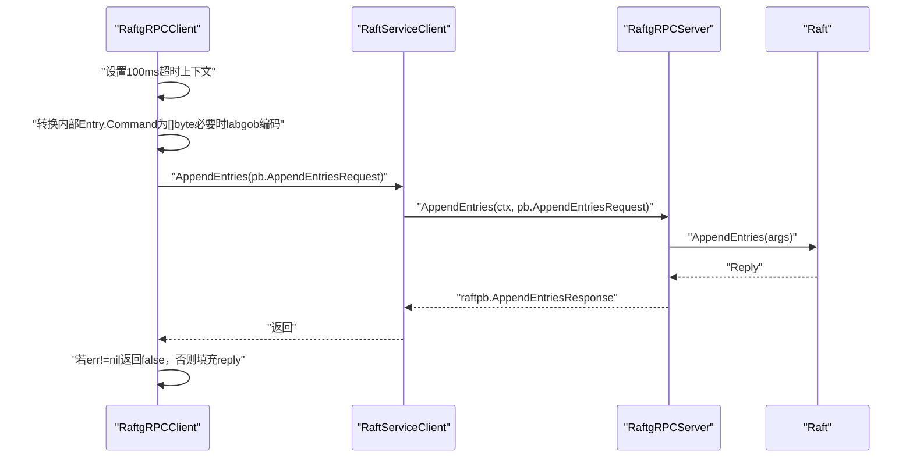
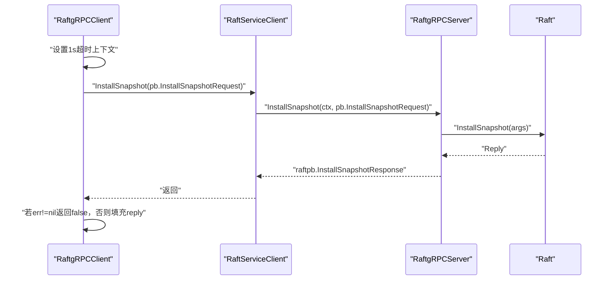
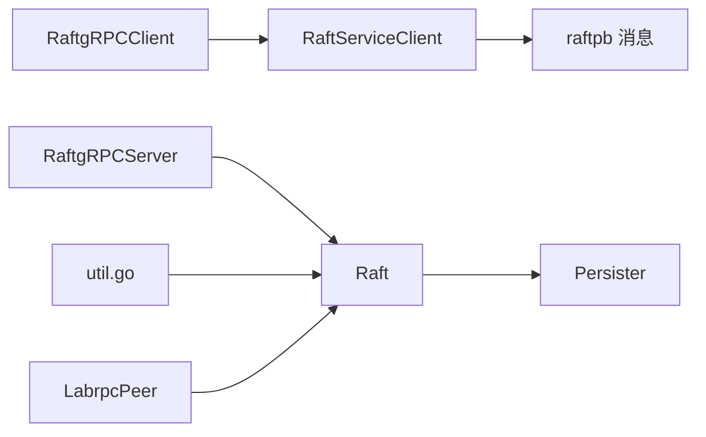

# gRPC 客户端实现

## 目录
1. [简介](#简介)
2. [项目结构](#项目结构)
3. [核心组件](#核心组件)
4. [架构总览](#架构总览)
5. [详细组件分析](#详细组件分析)
6. [依赖关系分析](#依赖关系分析)
7. [性能考虑](#性能考虑)
8. [故障排查指南](#故障排查指南)
9. [结论](#结论)
10. [附录](#附录)

## 简介
本文件系统性解析 Raft 模块中的 gRPC 客户端实现，重点覆盖以下方面：
- 连接管理与生命周期：如何建立、持有与关闭 gRPC 连接
- 连接池与负载均衡：当前实现是否支持多地址轮询或故障转移
- 调用方法 RequestVote、AppendEntries、InstallSnapshot 的实现细节与数据转换
- 超时控制、错误返回与失败处理
- 客户端状态同步、缓存策略与性能优化建议
- 配置参数、健康检查与断线重连机制
- 使用示例与最佳实践

## 项目结构
围绕 gRPC 客户端的关键文件组织如下：
- 客户端侧：raft/grpc_client.go（gRPC 客户端封装）、raft/rpc.go（请求/响应结构体定义）
- 服务端侧：raft/grpc_server.go（gRPC 服务端适配器）、raftpb/raft_grpc.pb.go（生成的 gRPC 客户端）、raftpb/raft.pb.go（消息定义）
- 接口与状态：raft/raft.go（Raft 结构、状态机接口）、raft/util.go（节点状态、超时常量）、raft/persister.go（持久化）
- 兼容层：raft/labrpc_adapter.go（labrpc 到 RaftPeer 的适配）、labrpc/labrpc.go（labrpc 网络模拟）
- 示例：cmd/kvclient/main.go（客户端使用示例）

图表来源
- [grpc_client.go](file://raft/grpc_client.go#L1-L107)
- [grpc_server.go](file://raft/grpc_server.go#L1-L74)
- [rpc.go](file://raft/rpc.go#L1-L68)
- [raft.go](file://raft/raft.go#L1-L200)
- [util.go](file://raft/util.go#L1-L115)
- [persister.go](file://raft/persister.go#L1-L111)
- [raft_grpc.pb.go](file://raftpb/raft_grpc.pb.go#L34-L63)
- [raft.pb.go](file://raftpb/raft.pb.go#L97-L589)
- [labrpc_adapter.go](file://raft/labrpc_adapter.go#L1-L39)
- [labrpc.go](file://labrpc/labrpc.go#L1-L200)

章节来源
- [grpc_client.go](file://raft/grpc_client.go#L1-L107)
- [grpc_server.go](file://raft/grpc_server.go#L1-L74)
- [rpc.go](file://raft/rpc.go#L1-L68)
- [raft.go](file://raft/raft.go#L1-L200)
- [util.go](file://raft/util.go#L1-L115)
- [persister.go](file://raft/persister.go#L1-L111)
- [raft_grpc.pb.go](file://raftpb/raft_grpc.pb.go#L34-L63)
- [raft.pb.go](file://raftpb/raft.pb.go#L97-L589)
- [labrpc_adapter.go](file://raft/labrpc_adapter.go#L1-L39)
- [labrpc.go](file://labrpc/labrpc.go#L1-L200)

## 核心组件
- RaftgRPCClient：封装单个目标地址的 gRPC 客户端，负责 RequestVote、AppendEntries、InstallSnapshot 三类 RPC 的调用
- RaftgRPCServer：将 Raft 核心逻辑暴露为 gRPC 服务端，桥接 raftpb 消息与内部请求/响应结构
- RaftPeer 接口与 LabrpcPeer：提供统一的 RaftPeer 调用接口，便于在不同传输层（labrpc/gRPC）间切换
- RPC 结构体：RequestVoteRequest/Response、AppendEntriesRequest/Response、InstallSnapshotRequest/Response
- 工具与常量：节点状态枚举、心跳/选举超时常量、ApplyMsg 等
- 持久化：Raft 状态与快照的保存与读取

章节来源
- [grpc_client.go](file://raft/grpc_client.go#L14-L26)
- [grpc_server.go](file://raft/grpc_server.go#L9-L16)
- [rpc.go](file://raft/rpc.go#L5-L68)
- [raft.go](file://raft/raft.go#L29-L61)
- [util.go](file://raft/util.go#L43-L87)
- [persister.go](file://raft/persister.go#L17-L26)

## 架构总览
下图展示 gRPC 客户端到服务端的调用链路，以及消息转换过程。

图表来源
- [grpc_client.go](file://raft/grpc_client.go#L28-L106)
- [grpc_server.go](file://raft/grpc_server.go#L18-L73)
- [raft_grpc.pb.go](file://raftpb/raft_grpc.pb.go#L38-L63)
- [raft.go](file://raft/raft.go#L166-L200)

## 详细组件分析

### RaftgRPCClient 组件
- 连接管理
  - 通过 Dial 建立到指定地址的 gRPC 连接，使用不安全凭据（开发用途）
  - 持有 grpc.ClientConn 和 raftpb.RaftServiceClient
  - 当前未实现连接池或多地址自动切换
- 超时控制
  - RequestVote/AppendEntries：100ms 超时
  - InstallSnapshot：1s 超时
- 错误处理
  - 任何 RPC 错误均返回 false；成功则填充响应结构
- 数据转换
  - 将内部 Entry.Command 转换为 []byte；若非 []byte，则尝试使用 labgob 编码回退
  - 将内部结构映射到 raftpb.* 请求/响应消息

图表来源
- [grpc_client.go](file://raft/grpc_client.go#L14-L26)
- [raft_grpc.pb.go](file://raftpb/raft_grpc.pb.go#L34-L63)

章节来源
- [grpc_client.go](file://raft/grpc_client.go#L19-L106)

### RaftgRPCServer 组件
- 将 raftpb.* 请求解包为内部结构，调用 Raft 核心方法
- 将内部响应封装为 raftpb.* 响应返回
- 作为 gRPC 服务端注册到服务器

图表来源
- [grpc_server.go](file://raft/grpc_server.go#L9-L16)
- [raft.go](file://raft/raft.go#L166-L200)

章节来源
- [grpc_server.go](file://raft/grpc_server.go#L14-L73)

### RPC 结构与消息映射
- RequestVoteRequest/Response：包含任期、候选人 ID、最后日志索引/任期等
- AppendEntriesRequest/Response：包含领导者 ID、前后日志索引/任期、领导者提交位置、日志条目列表、冲突信息
- InstallSnapshotRequest/Response：包含领导者 ID、最后包含索引/任期、快照数据

图表来源
- [rpc.go](file://raft/rpc.go#L5-L68)

章节来源
- [rpc.go](file://raft/rpc.go#L5-L68)

### 调用流程与错误处理

#### RequestVote 流程

图表来源
- [grpc_client.go](file://raft/grpc_client.go#L28-L44)
- [grpc_server.go](file://raft/grpc_server.go#L18-L31)
- [raft_grpc.pb.go](file://raftpb/raft_grpc.pb.go#L38-L45)

章节来源
- [grpc_client.go](file://raft/grpc_client.go#L28-L44)
- [grpc_server.go](file://raft/grpc_server.go#L18-L31)

#### AppendEntries 流程

图表来源
- [grpc_client.go](file://raft/grpc_client.go#L46-L88)
- [grpc_server.go](file://raft/grpc_server.go#L33-L58)
- [raft_grpc.pb.go](file://raftpb/raft_grpc.pb.go#L47-L54)

章节来源
- [grpc_client.go](file://raft/grpc_client.go#L46-L88)
- [grpc_server.go](file://raft/grpc_server.go#L33-L58)

#### InstallSnapshot 流程

图表来源
- [grpc_client.go](file://raft/grpc_client.go#L90-L106)
- [grpc_server.go](file://raft/grpc_server.go#L60-L73)
- [raft_grpc.pb.go](file://raftpb/raft_grpc.pb.go#L56-L63)

章节来源
- [grpc_client.go](file://raft/grpc_client.go#L90-L106)
- [grpc_server.go](file://raft/grpc_server.go#L60-L73)

### 负载均衡与连接池
- 当前实现仅支持单地址连接，未内置连接池或多地址轮询
- 若需高可用，可在上层构建“地址列表 + 选择器”的客户端包装，结合 gRPC 的 fail-fast 与重试策略
- 由于未实现连接池，建议在应用层自行维护多个 RaftgRPCClient 实例并按需切换

章节来源
- [grpc_client.go](file://raft/grpc_client.go#L19-L26)

### 超时与重试机制
- RequestVote/AppendEntries：100ms 超时
- InstallSnapshot：1s 超时
- 当前未实现自动重试；上层可基于返回值与错误类型进行指数退避重试
- 建议：对瞬时网络抖动采用短间隔快速重试，对明确的 leader 变更或 term 升级采用更长等待

章节来源
- [grpc_client.go](file://raft/grpc_client.go#L29-L31)
- [grpc_client.go](file://raft/grpc_client.go#L47-L49)
- [grpc_client.go](file://raft/grpc_client.go#L91-L93)

### 故障转移策略
- 当前未实现自动故障转移；上层可依据返回的 Term 升级与 leader 变化进行地址切换
- 建议：记录每个地址最近一次成功时间戳，优先选择最近成功的节点；对失败节点进行短暂隔离

章节来源
- [grpc_client.go](file://raft/grpc_client.go#L41-L43)
- [grpc_client.go](file://raft/grpc_client.go#L83-L87)
- [grpc_client.go](file://raft/grpc_client.go#L104-L105)

### 客户端状态同步与缓存
- 客户端未实现本地状态缓存；每次调用均通过网络交互
- 建议：在上层缓存最近 Term 与 leader 地址，避免频繁跨节点查询
- 注意：Term 升级后需清空过期缓存

章节来源
- [grpc_client.go](file://raft/grpc_client.go#L41-L43)
- [grpc_client.go](file://raft/grpc_client.go#L83-L87)
- [grpc_client.go](file://raft/grpc_client.go#L104-L105)

### 性能优化建议
- 批量发送日志条目以减少 RPC 次数（当前 AppendEntries 已支持批量 Entries）
- 合理设置超时与重试间隔，避免过度竞争
- 在上层实现连接复用与地址选择策略，降低握手开销

章节来源
- [grpc_client.go](file://raft/grpc_client.go#L49-L70)

## 依赖关系分析
- RaftgRPCClient 依赖 gRPC 客户端与 raftpb 消息定义
- RaftgRPCServer 依赖 Raft 核心逻辑与 raftpb 消息定义
- LabrpcPeer 提供与 labrpc 的兼容，便于测试与迁移
- util.go 提供节点状态与超时常量，影响选举与心跳行为

图表来源
- [grpc_client.go](file://raft/grpc_client.go#L1-L107)
- [grpc_server.go](file://raft/grpc_server.go#L1-L74)
- [raft_grpc.pb.go](file://raftpb/raft_grpc.pb.go#L34-L63)
- [raft.go](file://raft/raft.go#L1-L200)
- [util.go](file://raft/util.go#L1-L115)
- [persister.go](file://raft/persister.go#L1-L111)
- [labrpc_adapter.go](file://raft/labrpc_adapter.go#L1-L39)

章节来源
- [grpc_client.go](file://raft/grpc_client.go#L1-L107)
- [grpc_server.go](file://raft/grpc_server.go#L1-L74)
- [raft_grpc.pb.go](file://raftpb/raft_grpc.pb.go#L34-L63)
- [raft.go](file://raft/raft.go#L1-L200)
- [util.go](file://raft/util.go#L1-L115)
- [persister.go](file://raft/persister.go#L1-L111)
- [labrpc_adapter.go](file://raft/labrpc_adapter.go#L1-L39)

## 性能考虑
- 超时设置：根据网络延迟调整，避免过短导致频繁失败
- 批量日志：AppendEntries 支持批量 Entries，减少 RTT
- 重试策略：指数退避，避免雪崩
- 连接复用：避免频繁 Dial/Close，减少握手成本

## 故障排查指南
- 常见问题
  - 调用返回 false：检查网络连通性、目标节点是否存活、gRPC 服务是否启动
  - Term 不一致：关注返回的 Term，及时更新本地状态
  - 快照安装失败：确认 Data 大小与完整性，检查服务端快照安装逻辑
- 建议步骤
  - 记录每次 RPC 的入参与出参摘要
  - 对失败进行分类统计（超时、拒绝、异常）
  - 在上层实现健康检查与断线检测

章节来源
- [grpc_client.go](file://raft/grpc_client.go#L38-L40)
- [grpc_client.go](file://raft/grpc_client.go#L80-L82)
- [grpc_client.go](file://raft/grpc_client.go#L101-L103)

## 结论
当前 gRPC 客户端实现提供了简洁、直接的 RPC 调用封装，具备基本的超时控制与错误返回。对于生产环境，建议在上层补充连接池、多地址轮询、自动重试与故障转移、健康检查与断线重连机制，以提升可用性与稳定性。

## 附录

### 客户端配置参数
- 连接地址：构造函数接收单一地址字符串
- 超时：RequestVote/AppendEntries 100ms；InstallSnapshot 1s
- 凭证：使用不安全凭据（开发用途）

章节来源
- [grpc_client.go](file://raft/grpc_client.go#L19-L26)
- [grpc_client.go](file://raft/grpc_client.go#L29-L31)
- [grpc_client.go](file://raft/grpc_client.go#L47-L49)
- [grpc_client.go](file://raft/grpc_client.go#L91-L93)

### 使用示例与最佳实践
- 使用示例
  - 参考 kvclient 主程序，传入逗号分隔的地址列表，创建 Clerk 并执行操作
- 最佳实践
  - 在应用层维护地址列表与选择策略
  - 对失败进行分类与统计，配合指数退避重试
  - 关注 Term 升级与 leader 变化，及时更新本地缓存
  - 对快照安装与批量日志发送进行限流与背压

章节来源
- [main.go](file://cmd/kvclient/main.go#L11-L47)