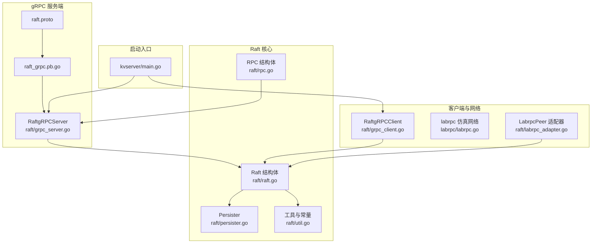
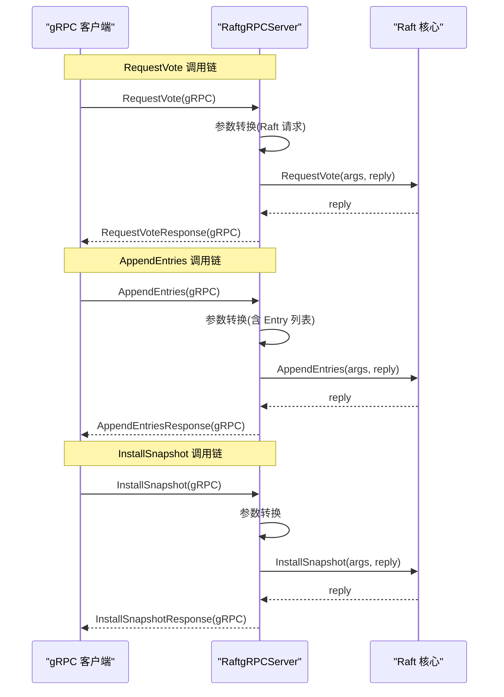
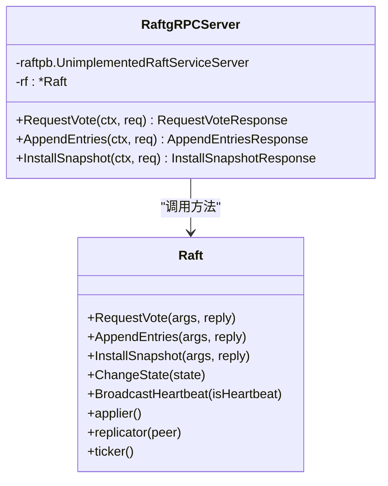
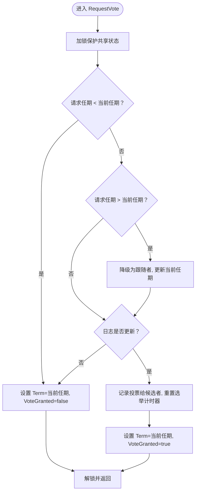
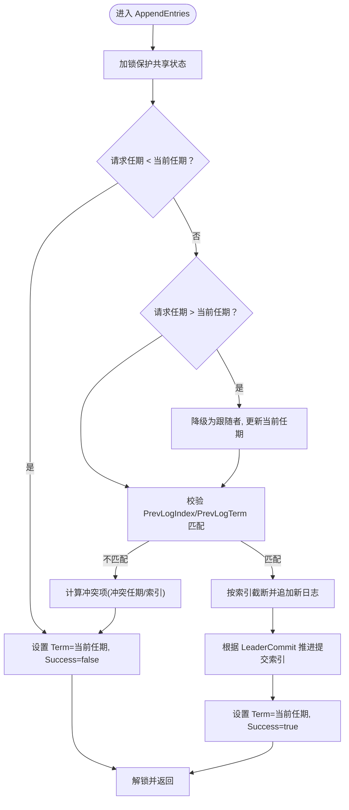
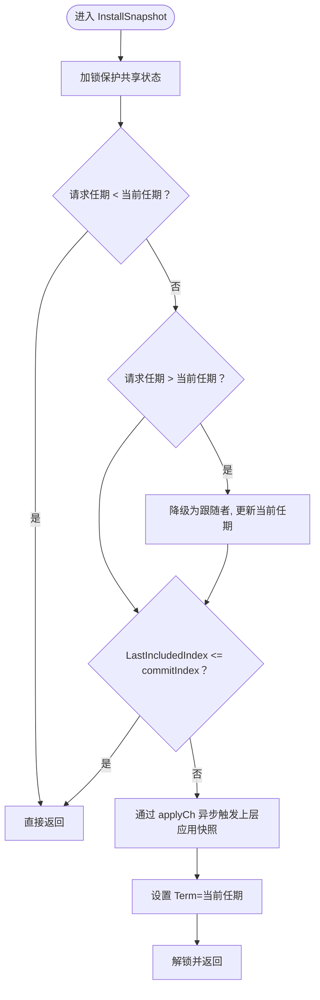
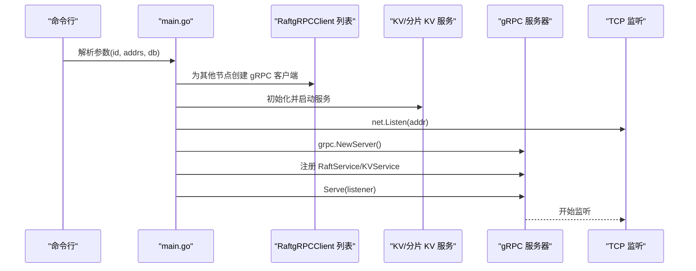
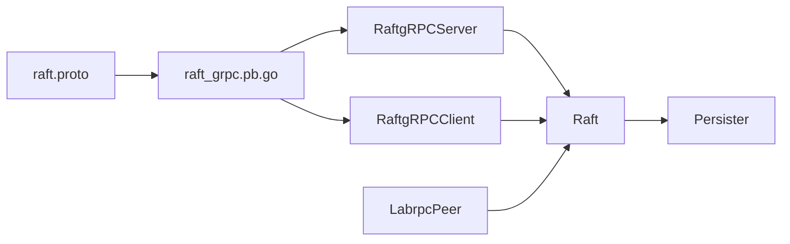

# gRPC 服务器实现

<cite>
**本文引用的文件**
- [grpc_server.go](file://raft/grpc_server.go)
- [raft.go](file://raft/raft.go)
- [rpc.go](file://raft/rpc.go)
- [persister.go](file://raft/persister.go)
- [util.go](file://raft/util.go)
- [labrpc_adapter.go](file://raft/labrpc_adapter.go)
- [raft.proto](file://raftpb/raft.proto)
- [raft_grpc.pb.go](file://raftpb/raft_grpc.pb.go)
- [grpc_client.go](file://raft/grpc_client.go)
- [main.go](file://cmd/kvserver/main.go)
- [labrpc.go](file://labrpc/labrpc.go)
</cite>

## 目录
1. [简介](#简介)
2. [项目结构](#项目结构)
3. [核心组件](#核心组件)
4. [架构总览](#架构总览)
5. [详细组件分析](#详细组件分析)
6. [依赖关系分析](#依赖关系分析)
7. [性能考量](#性能考量)
8. [故障排查指南](#故障排查指南)
9. [结论](#结论)
10. [附录](#附录)

## 简介
本文件系统性解析 eraft 项目中的 Raft gRPC 服务器实现，重点覆盖以下方面：
- gRPC 服务端的注册、监听与处理机制
- RequestVote、AppendEntries、InstallSnapshot 方法在 gRPC 层与 Raft 核心之间的调用链路与数据转换
- 并发模型：goroutine 管理、条件变量、锁策略与资源分配
- 服务器状态管理、连接池与性能优化策略
- 启动流程、优雅关闭与错误恢复机制
- 配置选项与监控指标建议

## 项目结构
围绕 Raft 的 gRPC 服务端实现，主要涉及如下模块：
- 协议定义与生成：raftpb/raft.proto 及其生成的 raft_grpc.pb.go
- gRPC 服务端适配器：raft/grpc_server.go（将 gRPC 请求转发到 Raft 实例）
- Raft 核心：raft/raft.go（状态机、领导者复制、提交推进、快照等）
- RPC 数据结构：raft/rpc.go（请求/响应结构体）
- 持久化：raft/persister.go（Raft 状态与快照持久化）
- 工具与常量：raft/util.go（状态枚举、超时、排序等）
- 测试网络仿真：labrpc/labrpc.go（用于测试的通道仿真 RPC）
- gRPC 客户端：raft/grpc_client.go（RaftPeer 接口的 gRPC 实现）
- 服务启动入口：cmd/kvserver/main.go（gRPC 服务器注册与监听）

**图表来源**
- [grpc_server.go](file://raft/grpc_server.go#L1-L74)
- [raft.proto](file://raftpb/raft.proto#L1-L58)
- [raft_grpc.pb.go](file://raftpb/raft_grpc.pb.go#L1-L178)
- [raft.go](file://raft/raft.go#L36-L116)
- [rpc.go](file://raft/rpc.go#L5-L67)
- [persister.go](file://raft/persister.go#L17-L111)
- [util.go](file://raft/util.go#L43-L115)
- [grpc_client.go](file://raft/grpc_client.go#L14-L107)
- [labrpc.go](file://labrpc/labrpc.go#L128-L200)
- [labrpc_adapter.go](file://raft/labrpc_adapter.go#L5-L39)
- [main.go](file://cmd/kvserver/main.go#L16-L47)

**章节来源**
- [grpc_server.go](file://raft/grpc_server.go#L1-L74)
- [raft.go](file://raft/raft.go#L36-L116)
- [rpc.go](file://raft/rpc.go#L5-L67)
- [persister.go](file://raft/persister.go#L17-L111)
- [util.go](file://raft/util.go#L43-L115)
- [labrpc_adapter.go](file://raft/labrpc_adapter.go#L5-L39)
- [raft.proto](file://raftpb/raft.proto#L1-L58)
- [raft_grpc.pb.go](file://raftpb/raft_grpc.pb.go#L1-L178)
- [grpc_client.go](file://raft/grpc_client.go#L14-L107)
- [main.go](file://cmd/kvserver/main.go#L16-L47)
- [labrpc.go](file://labrpc/labrpc.go#L128-L200)

## 核心组件
- RaftgRPCServer：gRPC 服务端适配器，负责将 gRPC 请求转换为 Raft 内部请求结构，调用 Raft 实例对应方法，并将结果转换回 gRPC 响应。
- Raft：核心状态机，维护当前任期、投票信息、日志、提交索引、应用索引、节点状态（跟随者/候选人/领导者），并提供 RequestVote、AppendEntries、InstallSnapshot 等方法。
- Persister：持久化层，保存 Raft 状态与快照，支持磁盘读写与原子保存。
- RaftgRPCClient：RaftPeer 接口的 gRPC 实现，用于集群内节点间通信。
- LabrpcPeer：RaftPeer 接口的 labrpc 仿真实现，用于测试。
- 协议与生成：通过 proto 文件定义 RPC 接口，使用 protoc-gen-go-grpc 生成 gRPC 服务端/客户端桩代码。

**章节来源**
- [grpc_server.go](file://raft/grpc_server.go#L9-L16)
- [raft.go](file://raft/raft.go#L36-L116)
- [persister.go](file://raft/persister.go#L17-L111)
- [grpc_client.go](file://raft/grpc_client.go#L14-L107)
- [labrpc_adapter.go](file://raft/labrpc_adapter.go#L5-L39)
- [raft.proto](file://raftpb/raft.proto#L13-L57)
- [raft_grpc.pb.go](file://raftpb/raft_grpc.pb.go#L65-L99)

## 架构总览
Raft gRPC 服务器采用“协议层—适配层—核心层”的分层设计：
- 协议层：基于 protobuf 定义的 RaftService，包含 RequestVote、AppendEntries、InstallSnapshot 三个方法。
- 适配层：RaftgRPCServer 将 gRPC 请求映射为 Raft 内部请求结构，调用 Raft 实例对应方法；同时将 Raft 返回的内部响应转换为 gRPC 响应。
- 核心层：Raft 实例负责状态管理、选举、日志复制、提交推进与快照处理；通过 Persister 进行持久化；通过 goroutine 与条件变量协调复制、心跳与应用。

**图表来源**
- [grpc_server.go](file://raft/grpc_server.go#L18-L73)
- [raft.go](file://raft/raft.go#L166-L275)
- [rpc.go](file://raft/rpc.go#L5-L67)
- [raft.proto](file://raftpb/raft.proto#L13-L57)

**章节来源**
- [grpc_server.go](file://raft/grpc_server.go#L18-L73)
- [raft.go](file://raft/raft.go#L166-L275)
- [rpc.go](file://raft/rpc.go#L5-L67)
- [raft.proto](file://raftpb/raft.proto#L13-L57)

## 详细组件分析

### gRPC 服务端适配器：RaftgRPCServer
- 职责
  - 注册 RaftService 服务，接收 gRPC 请求
  - 将 gRPC 请求参数转换为 Raft 内部请求结构
  - 调用 Raft 实例对应方法
  - 将 Raft 内部响应转换为 gRPC 响应返回
- 关键点
  - 使用 UnimplementedRaftServiceServer 作为基类，确保向后兼容
  - 在每个 RPC 处理函数中进行类型转换与字段映射
  - 不直接持有 Raft 实例的状态，仅通过方法调用完成交互

**图表来源**
- [grpc_server.go](file://raft/grpc_server.go#L9-L16)
- [raft.go](file://raft/raft.go#L36-L116)

**章节来源**
- [grpc_server.go](file://raft/grpc_server.go#L9-L16)
- [raft.go](file://raft/raft.go#L36-L116)

### RequestVote 方法实现
- 输入输出
  - gRPC 请求：包含任期、候选者 ID、最后日志索引与最后日志任期
  - gRPC 响应：包含任期与是否授予选票
- 处理流程
  - 适配层将 gRPC 请求转换为 Raft 内部 RequestVoteRequest
  - Raft 核心在加锁状态下执行投票判定逻辑（比较任期、日志新旧、更新投票信息）
  - 适配层将 Raft 内部响应转换为 gRPC 响应返回
- 错误与边界
  - 若请求任期小于当前任期或已投过票且非当前候选者，则拒绝
  - 若请求任期大于当前任期，跟随者降级为跟随者并更新当前任期

**图表来源**
- [grpc_server.go](file://raft/grpc_server.go#L18-L31)
- [raft.go](file://raft/raft.go#L166-L187)

**章节来源**
- [grpc_server.go](file://raft/grpc_server.go#L18-L31)
- [raft.go](file://raft/raft.go#L166-L187)

### AppendEntries 方法实现
- 输入输出
  - gRPC 请求：包含任期、领导者 ID、前驱日志索引/任期、领导者提交索引、日志条目列表
  - gRPC 响应：包含任期、成功标志、冲突项的索引与任期
- 处理流程
  - 适配层将 gRPC 请求转换为 Raft 内部 AppendEntriesRequest（含 Entry 列表转换）
  - Raft 核心在加锁状态下执行：
    - 比较任期，必要时降级为跟随者并重置选举计时器
    - 校验前驱日志匹配，不匹配则计算冲突项
    - 对新增日志进行截断与追加
    - 根据领导者提交索引推进本地提交索引
  - 适配层将响应转换为 gRPC 响应返回
- 性能要点
  - 批量日志条目传输，减少 RPC 次数
  - 使用条件变量与 goroutine 协调复制与应用

**图表来源**
- [grpc_server.go](file://raft/grpc_server.go#L33-L58)
- [raft.go](file://raft/raft.go#L189-L241)

**章节来源**
- [grpc_server.go](file://raft/grpc_server.go#L33-L58)
- [raft.go](file://raft/raft.go#L189-L241)

### InstallSnapshot 方法实现
- 输入输出
  - gRPC 请求：包含任期、领导者 ID、快照包含的最后索引/任期、快照数据
  - gRPC 响应：包含任期
- 处理流程
  - 适配层将 gRPC 请求转换为 Raft 内部 InstallSnapshotRequest
  - Raft 核心在加锁状态下：
    - 比较任期，必要时降级为跟随者并重置选举计时器
    - 检查快照是否过期（落后于已提交索引），若未过期则通过 applyCh 异步触发上层应用快照
  - 适配层将响应转换为 gRPC 响应返回
- 并发与资源
  - 快照应用通过独立 goroutine 发送到 applyCh，避免阻塞 RPC 处理

**图表来源**
- [grpc_server.go](file://raft/grpc_server.go#L60-L73)
- [raft.go](file://raft/raft.go#L243-L275)

**章节来源**
- [grpc_server.go](file://raft/grpc_server.go#L60-L73)
- [raft.go](file://raft/raft.go#L243-L275)

### 服务器启动流程与监听
- 启动步骤
  - 解析命令行参数（节点 ID、地址列表、数据目录等）
  - 构建 RaftPeer 列表（除自身外的其他节点使用 gRPC 客户端）
  - 初始化持久化存储（文件持久化）
  - 启动 KV 服务（或 ShardKV 服务）并获取其 Raft 实例
  - 创建 TCP 监听
  - 创建 gRPC 服务器并注册 RaftService 与 KV/分片 KV 服务
  - 启动服务监听
- 优雅关闭
  - 该仓库未提供显式的优雅关闭实现；建议在生产环境中增加信号处理与连接清理

**图表来源**
- [main.go](file://cmd/kvserver/main.go#L16-L47)
- [grpc_client.go](file://raft/grpc_client.go#L19-L26)

**章节来源**
- [main.go](file://cmd/kvserver/main.go#L16-L47)
- [grpc_client.go](file://raft/grpc_client.go#L19-L26)

### 并发处理、goroutine 管理与资源分配
- 并发模型
  - Raft 核心使用互斥锁保护共享状态，关键路径在加锁后执行
  - 通过条件变量（applyCond、replicatorCond）协调应用与复制 goroutine
  - ticker、applier、replicator 各自运行在独立 goroutine 中
- 资源分配
  - 复制器 goroutine：每个非本节点的对等体一个，等待条件信号批量发送日志
  - 应用器 goroutine：从提交索引到已应用索引之间逐条推送 ApplyMsg
  - 心跳定时器：选举计时器与心跳计时器分别控制选举与领导者心跳
- 资源优化
  - 日志数组收缩：当长度远小于容量时进行收缩，降低内存占用
  - 条件变量唤醒：仅在状态变化时通知，避免忙等

**章节来源**
- [raft.go](file://raft/raft.go#L36-L116)
- [raft.go](file://raft/raft.go#L475-L494)
- [raft.go](file://raft/raft.go#L497-L524)
- [raft.go](file://raft/raft.go#L616-L635)
- [raft.go](file://raft/raft.go#L638-L664)
- [raft.go](file://raft/raft.go#L666-L678)
- [util.go](file://raft/util.go#L97-L115)

### 服务器状态管理、连接池与性能优化
- 状态管理
  - 节点状态：Follower、Candidate、Leader，通过 ChangeState 统一切换
  - 计时器：随机选举超时与稳定心跳超时，避免同时发起选举
- 连接池
  - gRPC 客户端连接：每个对等节点维护一个 grpc.ClientConn
  - 超时控制：RequestVote/AppendEntries 使用短超时，InstallSnapshot 使用较长超时
- 性能优化
  - 批量复制：心跳广播与复制器批量发送，减少 RPC 数量
  - 日志压缩：通过快照与日志截断减少存储与传输开销
  - 内存优化：日志数组收缩与持久化分离

**章节来源**
- [raft.go](file://raft/raft.go#L475-L494)
- [util.go](file://raft/util.go#L84-L95)
- [grpc_client.go](file://raft/grpc_client.go#L29-L44)
- [grpc_client.go](file://raft/grpc_client.go#L47-L88)
- [grpc_client.go](file://raft/grpc_client.go#L91-L106)
- [raft.go](file://raft/raft.go#L150-L164)
- [util.go](file://raft/util.go#L97-L115)

### 错误恢复机制
- 网络仿真与测试
  - labrpc 提供可靠的通道仿真，支持丢包、延迟、重排与断开连接
  - 通过配置可模拟不可靠网络环境，验证 Raft 的鲁棒性
- 错误处理
  - gRPC 客户端在 RPC 调用失败时返回 false，避免阻塞
  - 服务器端在处理过程中保持锁粒度最小化，快速返回并记录调试信息
- 恢复策略
  - 任期不匹配时自动降级为跟随者
  - 快照过期检查：落后于已提交索引的快照会被拒绝
  - 应用器异步处理快照，避免阻塞 RPC

**章节来源**
- [labrpc.go](file://labrpc/labrpc.go#L84-L126)
- [labrpc.go](file://labrpc/labrpc.go#L128-L200)
- [grpc_client.go](file://raft/grpc_client.go#L37-L44)
- [grpc_client.go](file://raft/grpc_client.go#L79-L88)
- [grpc_client.go](file://raft/grpc_client.go#L100-L106)
- [raft.go](file://raft/raft.go#L243-L275)

## 依赖关系分析
- 适配层依赖
  - RaftgRPCServer 依赖 raftpb 生成的服务接口与 Raft 实例
  - gRPC 客户端依赖 raftpb 客户端接口与 grpc 库
- 核心依赖
  - Raft 依赖 Persister 进行持久化，依赖条件变量与 goroutine 协调
  - LabrpcPeer 与 RaftgRPCClient 共同实现 RaftPeer 接口，满足不同运行场景
- 协议依赖
  - raft.proto 定义了服务与消息格式，raft_grpc.pb.go 提供编解码与服务注册

**图表来源**
- [raft.proto](file://raftpb/raft.proto#L1-L58)
- [raft_grpc.pb.go](file://raftpb/raft_grpc.pb.go#L1-L178)
- [grpc_server.go](file://raft/grpc_server.go#L1-L16)
- [grpc_client.go](file://raft/grpc_client.go#L1-L17)
- [raft.go](file://raft/raft.go#L36-L116)
- [persister.go](file://raft/persister.go#L17-L111)
- [labrpc_adapter.go](file://raft/labrpc_adapter.go#L5-L39)

**章节来源**
- [raft.proto](file://raftpb/raft.proto#L1-L58)
- [raft_grpc.pb.go](file://raftpb/raft_grpc.pb.go#L1-L178)
- [grpc_server.go](file://raft/grpc_server.go#L1-L16)
- [grpc_client.go](file://raft/grpc_client.go#L1-L17)
- [raft.go](file://raft/raft.go#L36-L116)
- [persister.go](file://raft/persister.go#L17-L111)
- [labrpc_adapter.go](file://raft/labrpc_adapter.go#L5-L39)

## 性能考量
- RPC 调用频率
  - 心跳与复制：通过稳定心跳超时与批量复制减少 RPC 次数
  - 投票：随机选举超时避免同时发起选举
- 存储与传输
  - 日志条目包含命令字节，批量传输可显著降低网络开销
  - 快照机制减少日志长度与传输量
- 内存与 CPU
  - 日志数组收缩降低内存占用
  - 条件变量与 goroutine 协调提升吞吐，避免忙等

[本节为通用性能讨论，无需列出具体文件来源]

## 故障排查指南
- 常见问题
  - RPC 调用失败：检查 gRPC 客户端超时设置与网络连通性
  - 投票被拒：确认请求任期、日志新旧与是否重复投票
  - 日志不匹配：核对 PrevLogIndex/PrevLogTerm 是否一致，关注冲突项计算
  - 快照过期：确认 LastIncludedIndex/LastIncludedTerm 与本地提交索引关系
- 调试建议
  - 启用调试日志以观察状态切换与 RPC 处理过程
  - 使用 labrpc 仿真网络模拟异常场景（丢包、延迟、重排）

**章节来源**
- [grpc_client.go](file://raft/grpc_client.go#L29-L44)
- [grpc_client.go](file://raft/grpc_client.go#L47-L88)
- [grpc_client.go](file://raft/grpc_client.go#L91-L106)
- [raft.go](file://raft/raft.go#L166-L187)
- [raft.go](file://raft/raft.go#L207-L228)
- [raft.go](file://raft/raft.go#L243-L275)
- [util.go](file://raft/util.go#L12-L19)

## 结论
本实现以清晰的分层设计将 gRPC 协议与 Raft 核心解耦：协议层负责消息编解码与服务注册，适配层负责数据结构转换与调用转发，核心层专注状态机与一致性算法。通过 goroutine、条件变量与持久化机制，系统在保证正确性的同时具备良好的并发性能与可扩展性。建议在生产环境中补充优雅关闭、连接池管理与可观测性指标采集，以进一步提升稳定性与运维效率。

[本节为总结性内容，无需列出具体文件来源]

## 附录
- 配置选项建议
  - gRPC 客户端超时：RequestVote/AppendEntries 短超时，InstallSnapshot 长超时
  - 心跳与选举超时：根据网络状况调整稳定心跳与随机选举超时
  - 日志数组收缩阈值：避免频繁扩容/缩容
- 监控指标建议
  - RPC 调用次数与耗时分布
  - 日志长度与快照大小
  - 节点状态切换次数
  - 提交延迟与应用延迟

[本节为通用建议，无需列出具体文件来源]