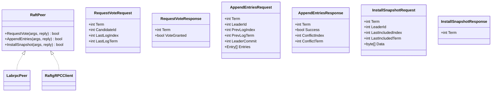

# 网络通信处理

## 目录
1. [引言](#引言)
2. [项目结构](#项目结构)
3. [核心组件](#核心组件)
4. [架构总览](#架构总览)
5. [详细组件分析](#详细组件分析)
6. [依赖关系分析](#依赖关系分析)
7. [性能考量](#性能考量)
8. [故障排查指南](#故障排查指南)
9. [结论](#结论)

## 引言
本文件聚焦于 Raft 系统中的网络通信处理，涵盖网络层抽象、消息传递与可靠性保障、RPC 调用流程、超时与重试策略、网络分区处理、消息丢失模拟、并发控制与线程安全、资源竞争处理、网络延迟建模、带宽限制与拥塞控制思路，以及网络调试工具、监控指标与故障诊断方法。文档以代码为依据，结合图示帮助读者从整体到细节全面理解 Raft 的网络通信机制。

## 项目结构
该仓库采用分层模块化组织：
- raft：Raft 核心状态机与网络适配层（labrpc/gRPC 双栈）
- labrpc：基于通道的实验室网络仿真器，用于模拟丢包、延迟、乱序与断连
- kvraft/shardctrler/shardkv：上层服务与客户端，通过 Raft 提供一致性
- raftpb/shardctrlerpb/shardkvpb：gRPC 协议定义与生成代码
- wiki：文档与实验说明

图表来源
- [labrpc/labrpc.go](file://labrpc/labrpc.go#L128-L312)
- [raft/raft.go](file://raft/raft.go#L37-L60)
- [raft/grpc_server.go](file://raft/grpc_server.go#L9-L16)
- [raft/grpc_client.go](file://raft/grpc_client.go#L14-L26)
- [raft/labrpc_adapter.go](file://raft/labrpc_adapter.go#L5-L7)

章节来源
- [raft/raft.go](file://raft/raft.go#L37-L60)
- [labrpc/labrpc.go](file://labrpc/labrpc.go#L128-L312)

## 核心组件
- RaftPeer 接口：统一 Raft 节点间通信抽象，支持 RequestVote、AppendEntries、InstallSnapshot 三类 RPC。
- LabrpcPeer：将 labrpc 的 ClientEnd 封装为 RaftPeer，实现透明的网络仿真。
- RaftgRPCClient/RaftgRPCServer：基于 gRPC 的 RPC 客户端与服务端，负责协议转换与超时控制。
- labrpc.Network：通道驱动的网络仿真器，可配置可靠/不可靠、长延迟、长乱序等行为，模拟真实网络。
- Raft 核心：在 RaftPeer 抽象之上实现选举、日志复制、快照安装与提交推进等逻辑。

章节来源
- [raft/raft.go](file://raft/raft.go#L29-L34)
- [raft/labrpc_adapter.go](file://raft/labrpc_adapter.go#L5-L19)
- [raft/grpc_client.go](file://raft/grpc_client.go#L14-L26)
- [raft/grpc_server.go](file://raft/grpc_server.go#L9-L16)
- [labrpc/labrpc.go](file://labrpc/labrpc.go#L128-L312)

## 架构总览
Raft 的网络层抽象通过 RaftPeer 接口屏蔽底层传输差异，既可使用 labrpc 进行实验室仿真，也可使用 gRPC 进行实际部署。Raft 核心在不同场景下复用同一套状态机逻辑，确保一致性算法正确性不受网络实现影响。

图表来源
- [raft/grpc_client.go](file://raft/grpc_client.go#L28-L44)
- [raft/grpc_server.go](file://raft/grpc_server.go#L18-L31)
- [raft/labrpc_adapter.go](file://raft/labrpc_adapter.go#L9-L11)
- [labrpc/labrpc.go](file://labrpc/labrpc.go#L87-L126)

## 详细组件分析

### 组件A：RaftPeer 接口与 RPC 数据模型
- RaftPeer：定义 RequestVote、AppendEntries、InstallSnapshot 三个方法，作为所有 Raft 节点间通信的统一入口。
- RPC 请求/响应数据结构：RequestVoteRequest/Response、AppendEntriesRequest/Response、InstallSnapshotRequest/Response，包含必要的元信息（任期、领导者ID、日志索引/任期、提交索引、快照数据等）。

图表来源
- [raft/raft.go](file://raft/raft.go#L29-L34)
- [raft/rpc.go](file://raft/rpc.go#L5-L67)

章节来源
- [raft/raft.go](file://raft/raft.go#L29-L34)
- [raft/rpc.go](file://raft/rpc.go#L5-L67)

### 组件B：labrpc 网络仿真器
- Channel-based RPC：通过 reqMsg/ replyMsg 在单线程调度器中串行处理请求，避免竞态。
- 可配置网络行为：可靠/不可靠、长延迟、长乱序、丢包率等，用于模拟真实网络环境。
- 超时与失败语义：当服务器被删除或无响应时，返回 false；支持统计 RPC 总数与字节数。

图表来源
- [labrpc/labrpc.go](file://labrpc/labrpc.go#L221-L312)

章节来源
- [labrpc/labrpc.go](file://labrpc/labrpc.go#L128-L312)

### 组件C：gRPC 客户端与服务端
- RaftgRPCClient：为每个目标节点建立 gRPC 连接，封装 RequestVote/AppendEntries/InstallSnapshot 调用，设置上下文超时。
- RaftgRPCServer：将 gRPC 请求转换为 RaftPeer 方法调用，调用 Raft 实例处理并返回响应。

图表来源
- [raft/grpc_client.go](file://raft/grpc_client.go#L28-L88)
- [raft/grpc_server.go](file://raft/grpc_server.go#L18-L73)

章节来源
- [raft/grpc_client.go](file://raft/grpc_client.go#L14-L107)
- [raft/grpc_server.go](file://raft/grpc_server.go#L9-L74)

### 组件D：Raft 核心与 RPC 调用链
- Raft 核心通过 RaftPeer 抽象调用远端节点，内部使用 goroutine 并发发送 RPC，使用条件变量协调复制器与应用器。
- 处理流程：选举触发、心跳广播、日志复制、冲突回退、提交推进、快照安装。

图表来源
- [raft/raft.go](file://raft/raft.go#L304-L314)
- [raft/raft.go](file://raft/raft.go#L423-L449)
- [raft/raft.go](file://raft/raft.go#L462-L473)

章节来源
- [raft/raft.go](file://raft/raft.go#L304-L351)
- [raft/raft.go](file://raft/raft.go#L368-L397)
- [raft/raft.go](file://raft/raft.go#L423-L473)

### 组件E：网络分区与消息丢失模拟
- 分区操作：通过禁用部分 ClientEnd 的连接实现网络分区，验证少数派无法选举或提交。
- 消息丢失：labrpc 在不可靠模式下按概率丢弃请求或回复，模拟网络不稳定。
- 长延迟/乱序：用于测试领导者不会同步发送 RPC、响应乱序等边界情况。

图表来源
- [raft/config.go](file://raft/config.go#L179-L192)
- [labrpc/labrpc.go](file://labrpc/labrpc.go#L225-L294)

章节来源
- [raft/config.go](file://raft/config.go#L179-L192)
- [labrpc/labrpc.go](file://labrpc/labrpc.go#L225-L294)

### 组件F：并发控制、线程安全与资源竞争
- 互斥锁与读写锁：Raft 使用 RWMutex 保护共享状态，避免竞态；复制器/应用器使用独立条件变量协调。
- goroutine 设计：ticker、applier、replicator 各自独立循环，通过信号与超时协同。
- labrpc 的单线程请求处理器避免了并发竞态，同时通过原子计数统计 RPC 与字节。

章节来源
- [raft/raft.go](file://raft/raft.go#L37-L46)
- [raft/raft.go](file://raft/raft.go#L616-L635)
- [raft/raft.go](file://raft/raft.go#L637-L664)
- [raft/raft.go](file://raft/raft.go#L666-L678)
- [labrpc/labrpc.go](file://labrpc/labrpc.go#L153-L165)

### 组件G：超时、重试与错误处理策略
- gRPC 超时：RequestVote/AppendEntries 设置短超时，InstallSnapshot 设置较长超时，避免阻塞。
- labrpc 返回值：ClientEnd.Call 返回 false 表示网络问题或服务器不可达，Raft 层据此重试或回退。
- 响应解析：gRPC 侧通过错误判断返回 false；labrpc 侧通过 replyMsg.ok 判断。

章节来源
- [raft/grpc_client.go](file://raft/grpc_client.go#L28-L44)
- [raft/grpc_client.go](file://raft/grpc_client.go#L46-L88)
- [raft/grpc_client.go](file://raft/grpc_client.go#L90-L106)
- [labrpc/labrpc.go](file://labrpc/labrpc.go#L115-L125)

### 组件H：网络延迟建模、带宽限制与拥塞控制
- 延迟建模：labrpc 支持长延迟模式，用于验证领导者不会同步发送 RPC。
- 带宽统计：Network 维护 RPC 总数与字节数，便于评估带宽占用。
- 拥塞控制：当前实现未内置拥塞控制；可通过调整心跳间隔、批处理大小与复制器信号策略间接缓解拥塞。

章节来源
- [labrpc/labrpc.go](file://labrpc/labrpc.go#L188-L193)
- [labrpc/labrpc.go](file://labrpc/labrpc.go#L367-L383)
- [raft/util.go](file://raft/util.go#L84-L95)

### 组件I：网络调试工具、监控指标与故障诊断
- 统计接口：Network 提供 RPC 总数与字节数查询，config 提供测试期间的统计输出。
- 日志与状态：Raft 提供 GetStatus、GetRaftStateSize 等状态查询，辅助定位问题。
- 测试用例：包含分区、不可靠、崩溃重启等场景，覆盖网络异常下的正确性验证。

章节来源
- [raft/config.go](file://raft/config.go#L352-L366)
- [raft/raft.go](file://raft/raft.go#L70-L80)
- [raft/test_test.go](file://raft/test_test.go#L1-L200)

## 依赖关系分析
- RaftPeer 是核心抽象，LabrpcPeer 与 RaftgRPCClient 实现该接口，使 Raft 核心与传输无关。
- labrpc.Network 作为统一调度器，集中处理请求/响应与统计，避免多线程竞争。
- gRPC 通过 raftpb.RaftService 定义服务契约，RaftgRPCServer/Client 作为桥接层。

图表来源
- [raft/raft.go](file://raft/raft.go#L37-L60)
- [raft/labrpc_adapter.go](file://raft/labrpc_adapter.go#L5-L19)
- [labrpc/labrpc.go](file://labrpc/labrpc.go#L128-L168)
- [raft/grpc_server.go](file://raft/grpc_server.go#L9-L16)

章节来源
- [raft/raft.go](file://raft/raft.go#L37-L60)
- [labrpc/labrpc.go](file://labrpc/labrpc.go#L128-L168)

## 性能考量
- 心跳与选举超时：稳定的心跳周期与随机化的选举超时有助于减少不必要的选举与冲突。
- 批量复制：复制器通过条件变量批量发送日志条目，降低 RPC 数量。
- 快照：定期快照可显著减少日志长度，降低网络传输与匹配成本。
- 带宽与延迟：通过 labrpc 的统计接口评估网络开销，结合测试用例验证性能回归。

章节来源
- [raft/util.go](file://raft/util.go#L84-L95)
- [raft/raft.go](file://raft/raft.go#L353-L366)
- [raft/raft.go](file://raft/raft.go#L150-L164)
- [raft/config.go](file://raft/config.go#L551-L581)

## 故障排查指南
- 网络不可靠导致的超时：确认 labrpc 不可靠模式参数与长延迟设置；检查 RPC 总数与字节是否异常增长。
- 分区导致的无主：验证分区前后领导者数量与任期变化；确保分区恢复后能重新选举。
- 快照安装异常：核对 lastIncludedIndex/term 是否递增；确认 applyCh 正确接收快照消息。
- 并发竞态：检查 Raft 的互斥锁使用与条件变量信号时机；避免在持有锁的情况下进行阻塞操作。

章节来源
- [labrpc/labrpc.go](file://labrpc/labrpc.go#L225-L294)
- [raft/raft.go](file://raft/raft.go#L243-L275)
- [raft/raft.go](file://raft/raft.go#L637-L664)

## 结论
该 Raft 网络通信体系通过 RaftPeer 抽象实现了传输无关性，结合 labrpc 的仿真能力与 gRPC 的生产可用性，提供了从实验室到生产的完整网络通信方案。其设计在可靠性、并发安全与可观测性方面均具备良好支撑，适合进一步扩展到更复杂的分布式场景。