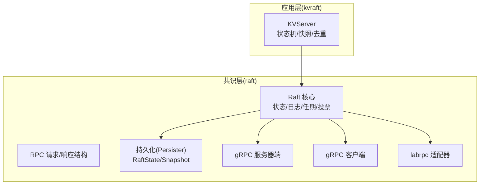
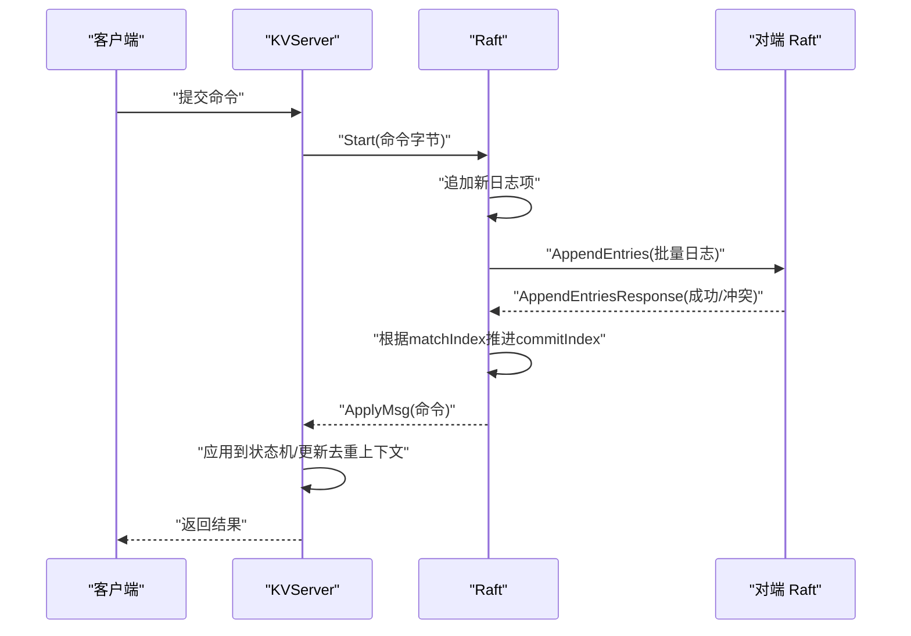
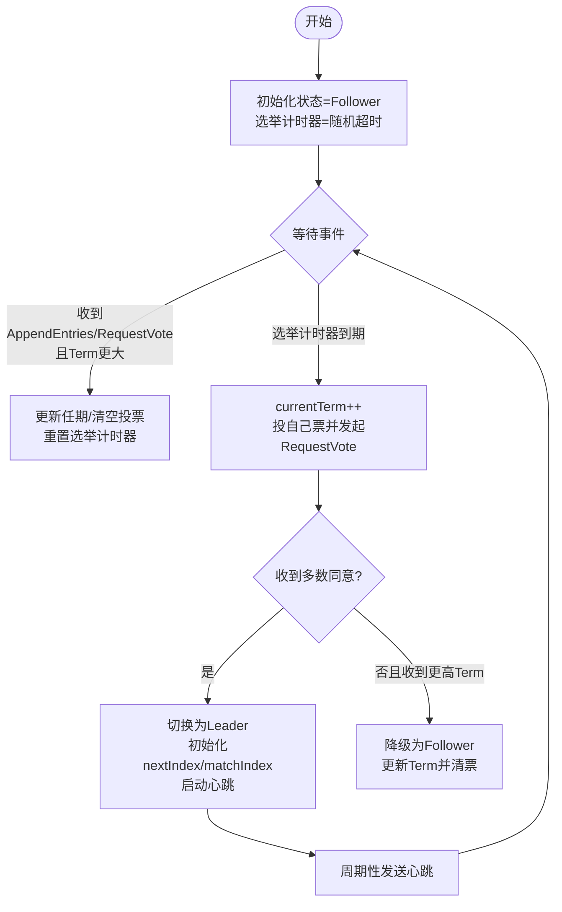
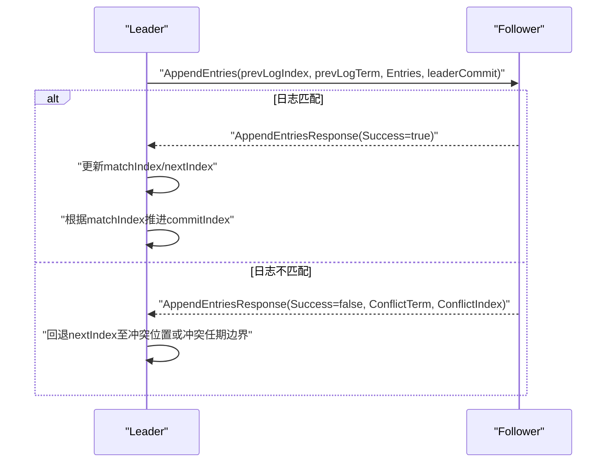
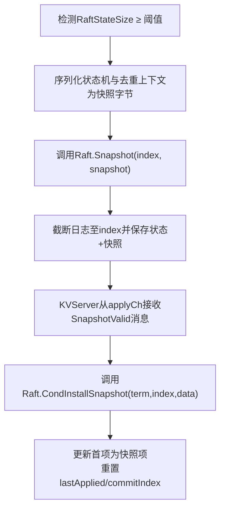
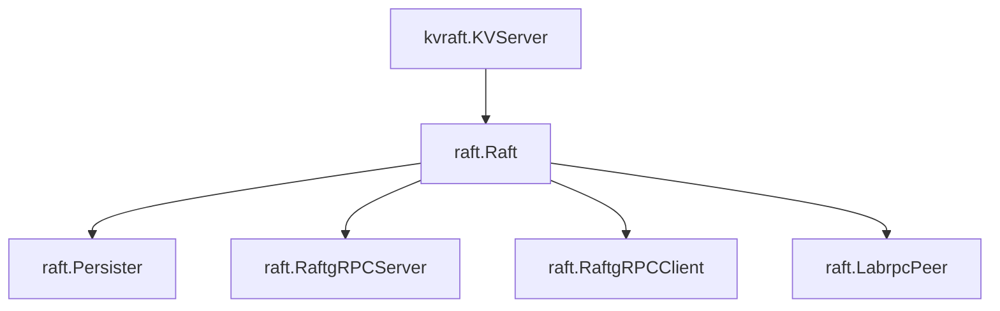

# Raft 共识算法


## 目录
1. [引言](#引言)
2. [项目结构](#项目结构)
3. [核心组件](#核心组件)
4. [架构总览](#架构总览)
5. [详细组件分析](#详细组件分析)
6. [依赖关系分析](#依赖关系分析)
7. [性能考量](#性能考量)
8. [故障排查指南](#故障排查指南)
9. [结论](#结论)
10. [附录](#附录)

## 引言
本文件面向希望深入理解并实现 Raft 共识算法的读者，结合仓库中的完整实现，系统讲解以下内容：
- 领导者选举与心跳/超时机制
- 日志复制与一致性检查（冲突回退）
- 安全性保证（任期单调递增、日志匹配、提交规则）
- 快照与日志压缩、快照恢复
- 关键数据结构、状态转换与 RPC 交互
- 性能优化策略（批量复制、applier 并行、内存收缩）
- 持久化与崩溃恢复
- 网络分区处理与测试用例覆盖

该实现采用 gRPC 进行节点间通信，并通过独立的 applier 和 replicator 协程提升吞吐；同时提供基于 labrpc 的适配器以支持测试框架。

## 项目结构
eRaft 是一个分布式键值存储系统，Raft 作为其核心共识层，向上为 KV 服务提供线性一致的日志复制能力。核心模块分布如下：
- raft：Raft 核心实现（状态机、RPC 处理、心跳/选举、快照）
- raftpb：Raft gRPC 接口定义
- kvraft：基于 Raft 的 KV 服务，负责应用日志到状态机、快照与去重
- labrpc：测试网络模拟层（可选）
- shardctrler/shardkv：分片控制器与分片 KV 集群（扩展应用）



图表来源
- [raft/raft.go](file://raft/raft.go#L36-L60)
- [raft/rpc.go](file://raft/rpc.go#L5-L67)
- [raft/persister.go](file://raft/persister.go#L17-L22)
- [raft/grpc_server.go](file://raft/grpc_server.go#L9-L16)
- [raft/grpc_client.go](file://raft/grpc_client.go#L14-L26)
- [raft/labrpc_adapter.go](file://raft/labrpc_adapter.go#L5-L27)
- [kvraft/server.go](file://kvraft/server.go#L88-L100)

章节来源
- [README.md](file://README.md#L6-L22)
- [wiki/Raft-Consensus.md](file://wiki/Raft-Consensus.md#L1-L21)

## 核心组件
- Raft 结构体：保存当前节点的状态（状态、任期、投票对象）、日志数组、提交/已应用索引、nextIndex/matchIndex、定时器、持久化器、通道与条件变量等。
- RPC 结构：RequestVote、AppendEntries、InstallSnapshot 及其响应。
- 持久化器：统一保存 Raft 状态与快照，支持磁盘读写与原子落盘。
- gRPC 适配：服务端将内部请求映射为本地结构，客户端将本地结构映射为 protobuf 并发起调用。
- KVServer：在 Raft 之上构建 KV 状态机，负责命令去重、通知通道、快照与恢复。

章节来源
- [raft/raft.go](file://raft/raft.go#L36-L60)
- [raft/rpc.go](file://raft/rpc.go#L5-L67)
- [raft/persister.go](file://raft/persister.go#L17-L22)
- [raft/grpc_server.go](file://raft/grpc_server.go#L9-L73)
- [raft/grpc_client.go](file://raft/grpc_client.go#L14-L106)
- [raft/labrpc_adapter.go](file://raft/labrpc_adapter.go#L5-L38)
- [kvraft/server.go](file://kvraft/server.go#L88-L100)

## 架构总览
Raft 在每个节点上运行，通过 gRPC 与其它节点交互。KVServer 将用户命令编码后交由 Raft 提议，Raft 通过 AppendEntries 将日志复制给多数派，满足多数同意后提交并在 applier 中应用到 KV 状态机。



图表来源
- [raft/raft.go](file://raft/raft.go#L576-L591)
- [raft/raft.go](file://raft/raft.go#L388-L397)
- [raft/raft.go](file://raft/raft.go#L423-L449)
- [raft/raft.go](file://raft/raft.go#L637-L664)
- [kvraft/server.go](file://kvraft/server.go#L102-L139)

## 详细组件分析

### 数据结构与状态机
- 节点状态：Follower、Candidate、Leader 三种状态，通过定时器驱动状态切换。
- 日志条目：包含索引、任期、命令；首项为“占位”条目，记录最后快照的索引与任期。
- 关键索引：commitIndex（已提交）、lastApplied（已应用）、nextIndex/matchIndex（复制进度）。
- 条件变量：用于唤醒 applier 与 replicator，避免忙等。

```mermaid
classDiagram
class Raft {
+int currentTerm
+int votedFor
+[]Entry logs
+int commitIndex
+int lastApplied
+[]int nextIndex
+[]int matchIndex
+NodeState state
+Start(command) (int,int,bool)
+GetState() (int,bool)
+Snapshot(index,snapshot)
+CondInstallSnapshot(term,index,data) bool
}
class Entry {
+int Index
+int Term
+interface{} Command
}
class NodeState {
<<enumeration>>
Follower
Candidate
Leader
}
Raft --> Entry : "维护日志"
Raft --> NodeState : "状态"
```

图表来源
- [raft/raft.go](file://raft/raft.go#L36-L60)
- [raft/util.go](file://raft/util.go#L43-L61)
- [raft/util.go](file://raft/util.go#L63-L67)

章节来源
- [raft/raft.go](file://raft/raft.go#L36-L60)
- [raft/util.go](file://raft/util.go#L43-L67)

### 领导者选举与心跳/超时
- 随机选举超时：每次选举前重置为稳定心跳的若干倍随机区间，避免“双峰”竞争。
- 心跳超时：Leader 周期性发送心跳维持权威，Follower 收到心跳则重置选举计时器。
- 选举流程：Candidate 自增任期、投自己票、并行向其余节点发起 RequestVote；收到多数同意则成为 Leader；若收到更高任期的 RequestVote 则转为 Follower。
- 超时触发：ticker 定时器到期即进入候选态并发起选举。



图表来源
- [raft/raft.go](file://raft/raft.go#L614-L635)
- [raft/raft.go](file://raft/raft.go#L316-L351)
- [raft/util.go](file://raft/util.go#L84-L95)

章节来源
- [raft/raft.go](file://raft/raft.go#L614-L635)
- [raft/raft.go](file://raft/raft.go#L316-L351)
- [raft/util.go](file://raft/util.go#L84-L95)

### 日志复制与冲突回退
- Leader 侧：生成 AppendEntries 请求，携带 prevLogIndex/prevLogTerm 与 Entries；根据响应推进 nextIndex/matchIndex，并依据 matchIndex 计算新的 commitIndex。
- Follower 侧：校验 Term 与 prevLog 匹配；若不匹配，返回冲突信息（冲突任期与冲突索引），Leader 据此回退 nextIndex。
- 提交规则：仅当某条日志在当前任期被多数节点复制时才可提交，避免“旧领导提交”的问题。



图表来源
- [raft/raft.go](file://raft/raft.go#L189-L241)
- [raft/raft.go](file://raft/raft.go#L423-L449)
- [raft/raft.go](file://raft/raft.go#L496-L524)

章节来源
- [raft/raft.go](file://raft/raft.go#L189-L241)
- [raft/raft.go](file://raft/raft.go#L423-L449)
- [raft/raft.go](file://raft/raft.go#L496-L524)

### 安全性保证
- 任期单调性：收到更高任期的 RPC 时立即更新当前任期并降级；RequestVote 仅在“日志更完整”时投票，防止分裂投票。
- 日志匹配：AppendEntries 前置校验 prevLogIndex/prevLogTerm，确保链路连续性。
- 提交安全：仅在当前任期中被多数复制的日志才可提交，避免跨任期提交导致的回滚风险。

章节来源
- [raft/raft.go](file://raft/raft.go#L166-L187)
- [raft/raft.go](file://raft/raft.go#L195-L228)
- [raft/raft.go](file://raft/raft.go#L506-L513)

### 快照机制与日志压缩
- 快照触发：当 Raft 状态大小超过阈值（由上层配置）时，KVServer 触发快照，将状态机与去重上下文序列化为快照字节。
- 快照写入：调用 Raft.Snapshot(index, data)，截断日志至 index，并原子保存状态与快照。
- 快照恢复：当收到 InstallSnapshot 请求时，通过 KVServer 的 applier 将快照交给 Raft.CondInstallSnapshot，后者更新日志首项并重置已应用/已提交索引。



图表来源
- [raft/raft.go](file://raft/raft.go#L146-L164)
- [raft/raft.go](file://raft/raft.go#L120-L144)
- [kvraft/server.go](file://kvraft/server.go#L238-L258)
- [kvraft/server.go](file://kvraft/server.go#L224-L236)

章节来源
- [raft/raft.go](file://raft/raft.go#L120-L144)
- [raft/raft.go](file://raft/raft.go#L146-L164)
- [kvraft/server.go](file://kvraft/server.go#L224-L258)

### RPC 接口与 gRPC 实现
- 接口定义：RequestVote、AppendEntries、InstallSnapshot 三类 RPC，分别用于选举、日志复制与快照传输。
- gRPC 映射：gRPC 服务端将 protobuf 请求映射为内部结构并调用 Raft 方法；客户端将内部结构映射为 protobuf 并发起调用。
- labrpc 适配：在测试环境中，通过 labrpc.ClientEnd.Call 调用本地 Raft 方法，便于模拟网络不可靠。

章节来源
- [raftpb/raft.proto](file://raftpb/raft.proto#L13-L57)
- [raft/grpc_server.go](file://raft/grpc_server.go#L18-L73)
- [raft/grpc_client.go](file://raft/grpc_client.go#L28-L106)
- [raft/labrpc_adapter.go](file://raft/labrpc_adapter.go#L9-L19)

### 应用层集成（KVServer）
- 去重：基于 clientId 与 commandId 维护 lastOperations，避免重复执行。
- 通知：为每个命令索引维护通知通道，Leader 在当前任期内提交后直接通知对应客户端。
- 快照：定期检测 RaftStateSize 是否超过阈值，触发快照并调用 Raft.Snapshot。

章节来源
- [kvraft/server.go](file://kvraft/server.go#L102-L139)
- [kvraft/server.go](file://kvraft/server.go#L176-L236)
- [kvraft/server.go](file://kvraft/server.go#L238-L258)

## 依赖关系分析
- Raft 依赖持久化器进行状态与快照的读写。
- Raft 通过 gRPC 或 labrpc 与对端交互。
- KVServer 依赖 Raft 提供的日志复制能力，并在应用层实现状态机与快照。



图表来源
- [raft/raft.go](file://raft/raft.go#L36-L60)
- [raft/persister.go](file://raft/persister.go#L17-L22)
- [raft/grpc_server.go](file://raft/grpc_server.go#L9-L16)
- [raft/grpc_client.go](file://raft/grpc_client.go#L14-L26)
- [raft/labrpc_adapter.go](file://raft/labrpc_adapter.go#L5-L27)
- [kvraft/server.go](file://kvraft/server.go#L318-L341)

章节来源
- [raft/raft.go](file://raft/raft.go#L36-L60)
- [raft/persister.go](file://raft/persister.go#L17-L22)
- [raft/grpc_server.go](file://raft/grpc_server.go#L9-L16)
- [raft/grpc_client.go](file://raft/grpc_client.go#L14-L26)
- [raft/labrpc_adapter.go](file://raft/labrpc_adapter.go#L5-L27)
- [kvraft/server.go](file://kvraft/server.go#L318-L341)

## 性能考量
- 并行复制：每个对端维护独立的 replicator goroutine，批量发送日志，减少锁持有时间。
- 并行应用：applier goroutine 独立于复制循环，避免阻塞复制进度。
- 内存优化：shrinkEntriesArray 在数组长度远小于容量时重建切片，降低内存占用。
- 快照压缩：通过定期快照截断日志，控制 RaftStateSize，避免无限增长。
- RPC 超时：gRPC 客户端设置短超时，快速失败并重试，提高鲁棒性。

章节来源
- [raft/raft.go](file://raft/raft.go#L666-L678)
- [raft/raft.go](file://raft/raft.go#L637-L664)
- [raft/util.go](file://raft/util.go#L97-L105)
- [raft/grpc_client.go](file://raft/grpc_client.go#L28-L106)
- [raft/config.go](file://raft/config.go#L183-L236)

## 故障排查指南
- 无领导者：检查选举计时器是否频繁触发，确认网络分区与丢包情况。
- 分裂投票：确保各节点日志完整性比较正确，避免过早投票。
- 提交停滞：核对 matchIndex 推进逻辑与多数派判定，确认冲突回退是否正确。
- 快照异常：确认 CondInstallSnapshot 返回值与首项更新，检查快照数据解码。
- 应用乱序：确认 lastApplied 不回退，且按提交顺序应用。

章节来源
- [raft/raft.go](file://raft/raft.go#L496-L524)
- [raft/raft.go](file://raft/raft.go#L120-L144)
- [raft/raft.go](file://raft/raft.go#L637-L664)
- [raft/config.go](file://raft/config.go#L183-L236)

## 结论
本实现遵循 Raft 核心思想，通过清晰的状态机、严格的日志匹配与提交规则、完善的快照与持久化机制，以及高效的并行复制与应用，提供了生产可用的共识基础。配合 KVServer 的状态机与去重逻辑，可进一步支撑高可用的分布式键值服务。

## 附录

### 使用模式与示例（路径指引）
- 启动 Raft 服务：参考 KVServer 的启动流程，传入 peers、persister、applyCh。
  - [kvraft/server.go](file://kvraft/server.go#L318-L341)
- 提交命令：KVServer 调用 Raft.Start，返回索引、任期与是否领导者。
  - [raft/raft.go](file://raft/raft.go#L576-L591)
  - [kvraft/server.go](file://kvraft/server.go#L118-L139)
- 触发快照：当 RaftStateSize 达到阈值时，KVServer 调用 Raft.Snapshot。
  - [raft/raft.go](file://raft/raft.go#L146-L164)
  - [kvraft/server.go](file://kvraft/server.go#L238-L258)
- 快照恢复：收到 SnapshotValid 消息后调用 CondInstallSnapshot。
  - [raft/raft.go](file://raft/raft.go#L120-L144)
  - [kvraft/server.go](file://kvraft/server.go#L224-L236)

### 测试与验证（路径指引）
- 基础选举与一致性测试：参考测试文件中的多项用例。
  - [raft/test_test.go](file://raft/test_test.go#L24-L53)
  - [raft/test_test.go](file://raft/test_test.go#L124-L145)
  - [raft/test_test.go](file://raft/test_test.go#L586-L630)
- 网络不可靠场景：通过配置 unreliable=true 验证一致性。
  - [raft/test_test.go](file://raft/test_test.go#L772-L799)
- 快照与崩溃恢复：验证重启后状态一致性。
  - [raft/test_test.go](file://raft/test_test.go#L632-L706)