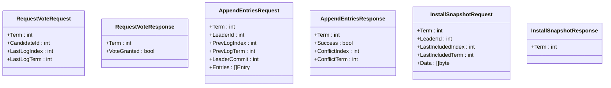

# Raft 实现细节

## 目录
1. [简介](#简介)
2. [项目结构](#项目结构)
3. [核心组件](#核心组件)
4. [架构概览](#架构概览)
5. [详细组件分析](#详细组件分析)
6. [依赖关系分析](#依赖关系分析)
7. [性能考虑](#性能考虑)
8. [故障排除指南](#故障排除指南)
9. [结论](#结论)

## 简介

本文件提供了 eraft 项目中 Raft 共识算法实现的深入技术文档。Raft 是一种用于管理复制日志的一致性算法，广泛应用于分布式系统中。该实现包含了完整的 Raft 协议实现，包括领导者选举、日志复制、快照机制和状态持久化等核心功能。

## 项目结构

eraft 项目的 Raft 实现采用模块化设计，主要包含以下核心目录和文件：


**图表来源**
- [raft.go](file://raft/raft.go#L1-L726)
- [rpc.go](file://raft/rpc.go#L1-L68)
- [util.go](file://raft/util.go#L1-L115)
- [persister.go](file://raft/persister.go#L1-L111)

**章节来源**
- [raft.go](file://raft/raft.go#L1-L726)
- [util.go](file://raft/util.go#L1-L115)

## 核心组件

### Raft 结构体

Raft 结构体是整个实现的核心，包含了所有必要的状态信息和运行时数据：

```mermaid
classDiagram
class Raft {
+mu : RWMutex
+peers : []RaftPeer
+persister : *Persister
+me : int
+dead : int32
+applyCh : chan ApplyMsg
+applyCond : *sync.Cond
+replicatorCond : []*sync.Cond
+state : NodeState
+currentTerm : int
+votedFor : int
+logs : []Entry
+commitIndex : int
+lastApplied : int
+nextIndex : []int
+matchIndex : []int
+electionTimer : *time.Timer
+heartbeatTimer : *time.Timer
}
class Entry {
+Index : int
+Term : int
+Command : interface{}
}
class ApplyMsg {
+CommandValid : bool
+Command : interface{}
+CommandIndex : int
+CommandTerm : int
+SnapshotValid : bool
+Snapshot : []byte
+SnapshotTerm : int
+SnapshotIndex : int
}
Raft --> Entry : "包含"
Raft --> ApplyMsg : "发送到"
```

**图表来源**
- [raft.go](file://raft/raft.go#L37-L60)
- [util.go](file://raft/util.go#L63-L67)
- [util.go](file://raft/util.go#L21-L31)

### 节点状态管理

实现支持三种节点状态：
- **Follower（跟随者）**：默认状态，响应选举请求
- **Candidate（候选人）**：参与领导者选举
- **Leader（领导者）**：负责日志复制和心跳发送

状态转换通过 `ChangeState` 方法管理，确保在不同状态下执行相应的定时器操作和初始化逻辑。

**章节来源**
- [raft.go](file://raft/raft.go#L475-L494)
- [util.go](file://raft/util.go#L43-L61)

## 架构概览

Raft 实现采用了分层架构设计，清晰分离了不同职责：


**图表来源**
- [raft.go](file://raft/raft.go#L689-L725)
- [grpc_server.go](file://raft/grpc_server.go#L9-L16)
- [grpc_client.go](file://raft/grpc_client.go#L14-L17)

## 详细组件分析

### 核心方法实现

#### Start 方法

Start 方法是 Raft 提供给上层服务的主要入口点，用于启动新的日志条目共识：


**图表来源**
- [raft.go](file://raft/raft.go#L581-L591)
- [raft.go](file://raft/raft.go#L546-L553)
- [raft.go](file://raft/raft.go#L353-L366)

#### RequestVote 方法

RequestVote 实现了领导者选举过程中的投票请求处理：


**图表来源**
- [raft.go](file://raft/raft.go#L166-L187)

#### AppendEntries 方法

AppendEntries 处理领导者的心跳和日志复制请求：


**图表来源**
- [raft.go](file://raft/raft.go#L189-L241)

#### InstallSnapshot 方法

InstallSnapshot 处理快照传输场景：


**图表来源**
- [raft.go](file://raft/raft.go#L243-L275)

**章节来源**
- [raft.go](file://raft/raft.go#L166-L275)

### 数据结构分析

#### 日志条目结构

日志条目是 Raft 实现的核心数据结构，包含以下关键字段：

| 字段名 | 类型 | 描述 | 复杂度 |
|--------|------|------|--------|
| Index | int | 日志条目的全局唯一索引 | O(1) |
| Term | int | 创建该条目的任期号 | O(1) |
| Command | interface{} | 可执行的命令数据 | O(1) |

日志条目通过切片数组存储，第一个条目作为占位符，包含最后快照的任期和索引信息。

#### RPC 请求和响应结构

RPC 层实现了标准的 Raft RPC 接口：



**图表来源**
- [rpc.go](file://raft/rpc.go#L5-L67)

**章节来源**
- [rpc.go](file://raft/rpc.go#L1-L68)

### 并发控制机制

Raft 实现采用了多层并发控制策略：

#### 互斥锁保护

- **RWMutex**：使用读写锁区分只读操作和修改操作
- **全局锁**：在关键路径上使用互斥锁确保原子性
- **条件变量**：使用 `sync.Cond` 实现 goroutine 间的协调

#### goroutine 协作


**图表来源**
- [raft.go](file://raft/raft.go#L44-L46)
- [raft.go](file://raft/raft.go#L638-L678)

**章节来源**
- [raft.go](file://raft/raft.go#L638-L678)

### 定时器机制

Raft 实现使用两个独立的定时器来管理选举和心跳：

#### 选举定时器

- **随机超时**：每次选举超时时间在固定范围内随机化
- **自动重置**：收到 RPC 或成为跟随者时重置
- **状态切换**：超时后自动转换为候选人状态

#### 心跳定时器

- **稳定超时**：领导者的心跳间隔
- **周期性触发**：领导者定期发送心跳保持权威
- **条件重置**：收到新的日志条目时重置

**章节来源**
- [util.go](file://raft/util.go#L84-L95)
- [raft.go](file://raft/raft.go#L475-L494)

## 依赖关系分析

### 组件间依赖


**图表来源**
- [raft.go](file://raft/raft.go#L20-L27)
- [grpc_server.go](file://raft/grpc_server.go#L3-L7)
- [grpc_client.go](file://raft/grpc_client.go#L3-L12)

### 外部依赖

- **labrpc**：提供网络模拟和 RPC 通信
- **labgob**：Go 编码/解码工具
- **gRPC**：高性能 RPC 框架
- **sync**：Go 语言并发原语

**章节来源**
- [raft.go](file://raft/raft.go#L20-L27)
- [grpc_client.go](file://raft/grpc_client.go#L3-L12)

## 性能考虑

### 内存管理优化

#### 日志数组收缩

实现包含了智能的日志数组收缩机制：


**图表来源**
- [util.go](file://raft/util.go#L97-L105)

#### 快照机制

- **定期快照**：基于配置的快照间隔触发
- **增量快照**：仅保存最近的状态和日志
- **异步应用**：快照应用不阻塞 RPC 处理

### 并发性能优化

#### 批量复制

- **批量发送**：复制器使用批量模式减少 RPC 数量
- **条件通知**：使用条件变量避免不必要的唤醒
- **管道机制**：通过 goroutine 管道提高吞吐量

#### 压缩算法

- **labgob 编码**：使用高效的 Go 编码格式
- **字节缓冲**：避免频繁的内存分配
- **类型安全**：支持多种命令类型的编码

**章节来源**
- [util.go](file://raft/util.go#L97-L105)
- [grpc_client.go](file://raft/grpc_client.go#L46-L88)

## 故障排除指南

### 常见问题诊断

#### 选举失败

**症状**：集群无法选出领导者
**可能原因**：
- 网络分区导致多数派不足
- 定时器配置不当
- 节点状态不一致

**解决步骤**：
1. 检查网络连通性
2. 验证定时器设置
3. 查看节点状态日志

#### 日志不一致

**症状**：节点间日志内容不匹配
**可能原因**：
- 快照应用延迟
- RPC 超时导致的日志冲突
- 并发修改导致的数据竞争

**解决步骤**：
1. 检查快照传输完整性
2. 验证 RPC 超时设置
3. 分析并发访问模式

#### 内存泄漏

**症状**：内存使用持续增长
**可能原因**：
- 日志数组未及时收缩
- goroutine 泄漏
- 缓冲区未正确释放

**解决步骤**：
1. 启用内存分析工具
2. 检查日志数组收缩逻辑
3. 验证 goroutine 生命周期

**章节来源**
- [raft.go](file://raft/raft.go#L638-L678)
- [util.go](file://raft/util.go#L97-L105)

### 调试技巧

#### 日志分析

实现提供了详细的调试输出功能：

```go
// 调试输出示例
DPrintf("{Node %v}'s state is {state %v,term %v,commitIndex %v,lastApplied %v,firstLog %v,lastLog %v} before processing AppendEntriesRequest %v and reply AppendEntriesResponse %v", rf.me, rf.state, rf.currentTerm, rf.commitIndex, rf.lastApplied, rf.getFirstLog(), rf.getLastLog(), request, response)
```

#### 性能监控

- **RPC 计数**：跟踪每个节点的 RPC 调用次数
- **字节统计**：监控网络流量使用情况
- **内存使用**：跟踪日志和快照的内存占用

**章节来源**
- [config.go](file://raft/config.go#L551-L581)
- [util.go](file://raft/util.go#L14-L19)

## 结论

eraft 项目的 Raft 实现展现了现代分布式一致性算法的完整实现。该实现具有以下特点：

### 技术优势

1. **模块化设计**：清晰的分层架构便于维护和扩展
2. **并发安全**：完善的并发控制机制确保数据一致性
3. **性能优化**：智能的内存管理和批量处理提升吞吐量
4. **可测试性**：完整的测试框架支持持续集成

### 扩展建议

1. **监控增强**：添加更详细的性能指标和健康检查
2. **配置管理**：提供动态配置调整能力
3. **故障恢复**：增强自动故障检测和恢复机制
4. **安全性**：添加认证和授权机制

该实现为开发者提供了深入理解 Raft 协议的机会，并为构建可靠的分布式系统奠定了坚实基础。