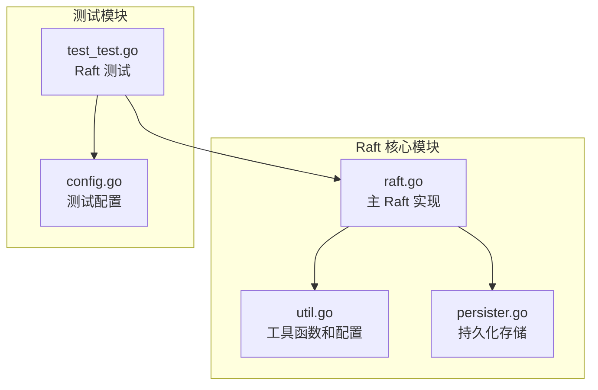
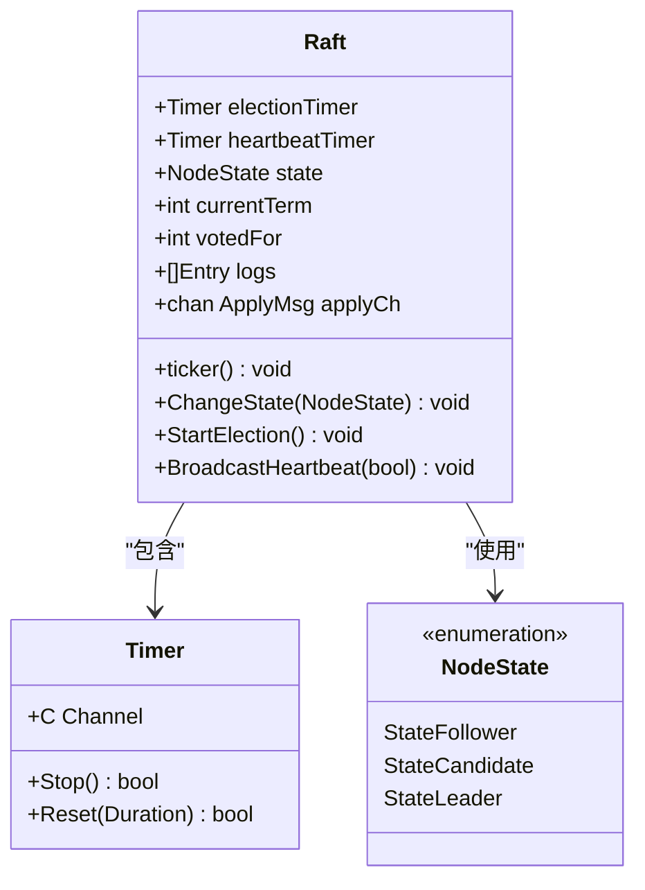
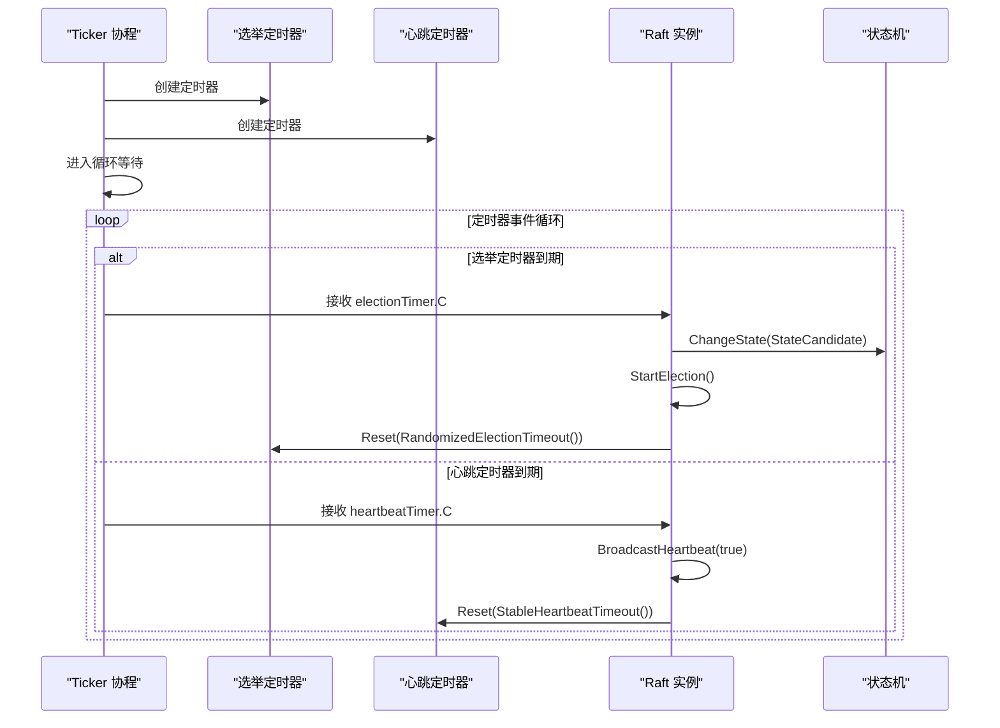
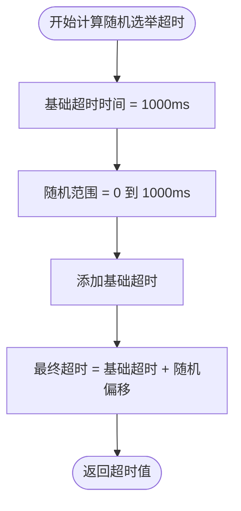
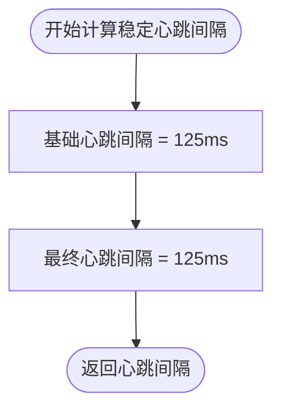
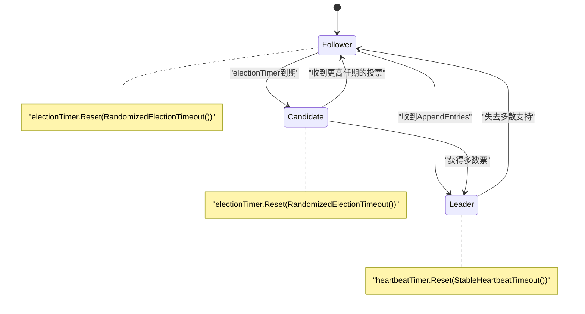
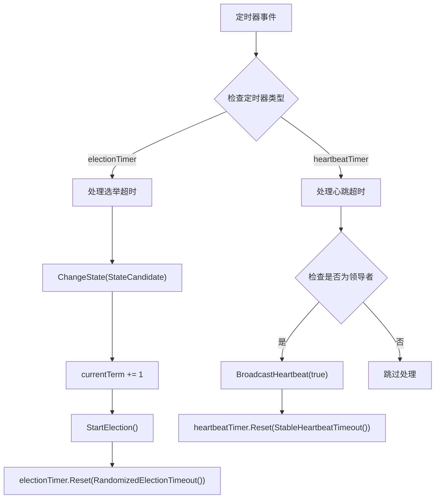
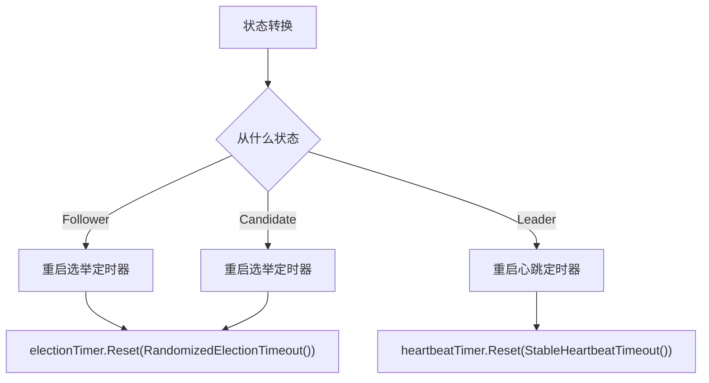
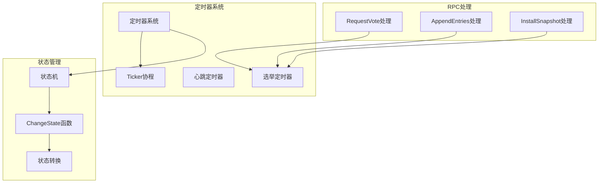

# 定时器系统

<cite>
**本文档中引用的文件**
- [raft.go](file://raft/raft.go)
- [util.go](file://raft/util.go)
- [config.go](file://raft/config.go)
- [test_test.go](file://raft/test_test.go)
- [persister.go](file://raft/persister.go)
</cite>

## 目录
1. [简介](#简介)
2. [项目结构](#项目结构)
3. [核心组件](#核心组件)
4. [架构概览](#架构概览)
5. [详细组件分析](#详细组件分析)
6. [依赖关系分析](#依赖关系分析)
7. [性能考虑](#性能考虑)
8. [故障排除指南](#故障排除指南)
9. [结论](#结论)

## 简介

Raft 定时器系统是 Raft 分布式一致性算法的核心组件之一，负责维护集群中的领导者选举和心跳机制。该系统通过两个关键的定时器实现了 Raft 的核心功能：

- **electionTimer（选举定时器）**：用于触发新的领导者选举过程
- **heartbeatTimer（心跳定时器）**：用于维持当前领导者的权威地位

本文档将深入分析这两个定时器的作用机制、初始化过程、重置机制、停止和重启策略，以及它们在 Raft 状态转换中的协调工作。

## 项目结构

Raft 定时器系统主要分布在以下文件中：



**图表来源**
- [raft.go](file://raft/raft.go#L1-L726)
- [util.go](file://raft/util.go#L1-L115)
- [test_test.go](file://raft/test_test.go#L1-L1085)

**章节来源**
- [raft.go](file://raft/raft.go#L1-L726)
- [util.go](file://raft/util.go#L1-L115)

## 核心组件

### 定时器数据结构

Raft 结构体中定义了两个核心定时器：



**图表来源**
- [raft.go](file://raft/raft.go#L37-L60)
- [util.go](file://raft/util.go#L43-L61)

### 定时器初始化

在 Raft 服务器启动时，两个定时器都会被初始化：

**章节来源**
- [raft.go](file://raft/raft.go#L689-L725)
- [util.go](file://raft/util.go#L84-L95)

## 架构概览

Raft 定时器系统采用协程驱动的设计模式，通过一个专门的 ticker 协程来监控定时器事件：



**图表来源**
- [raft.go](file://raft/raft.go#L614-L635)

## 详细组件分析

### 选举定时器（electionTimer）

#### 作用机制

选举定时器是 Raft 实现领导者选举的核心机制。当跟随者节点长时间没有收到任何来自当前领导者的消息时，选举定时器会触发新的选举过程。

#### 初始化过程

选举定时器在以下场景中被初始化：

1. **服务器启动时**：所有节点（包括领导者）都会设置一个随机的选举超时时间
2. **状态转换时**：从领导者转换为跟随者时重新设置
3. **网络分区恢复**：领导者重新连接到网络时

#### 随机化选举超时计算



**图表来源**
- [util.go](file://raft/util.go#L84-L95)

#### 超时计算公式

随机选举超时的计算公式为：
```
RandomizedElectionTimeout = 1000ms + random(0, 1000ms)
```

这意味着每次选举的超时时间会在 1000ms 到 2000ms 之间随机选择，有效避免了多个节点同时发起选举的情况。

**章节来源**
- [util.go](file://raft/util.go#L84-L95)
- [raft.go](file://raft/raft.go#L689-L725)

### 心跳定时器（heartbeatTimer）

#### 作用机制

心跳定时器用于维持当前领导者的权威地位。领导者定期向所有跟随者发送心跳消息，以证明其仍然活跃并保持领导地位。

#### 初始化过程

心跳定时器只在领导者状态下被激活：

1. **领导者状态转换时**：从跟随者转换为领导者时设置
2. **领导者重启时**：领导者重新建立权威时重新设置

#### 稳定心跳间隔计算



**图表来源**
- [util.go](file://raft/util.go#L84-L91)

#### 心跳间隔计算公式

稳定心跳间隔的计算公式为：
```
StableHeartbeatTimeout = 125ms
```

这个固定的心跳间隔确保了领导者能够及时向跟随者证明自己的存在，同时不会过于频繁地发送心跳消息。

**章节来源**
- [util.go](file://raft/util.go#L84-L91)
- [raft.go](file://raft/raft.go#L481-L493)

### 定时器重置机制

#### 状态转换时的重置



**图表来源**
- [raft.go](file://raft/raft.go#L475-L494)

#### 超时事件处理流程



**图表来源**
- [raft.go](file://raft/raft.go#L614-L635)

**章节来源**
- [raft.go](file://raft/raft.go#L475-L494)
- [raft.go](file://raft/raft.go#L614-L635)

### ticker 协程工作原理

#### 循环检查机制

ticker 协程是一个无限循环，使用 select 语句监听两个定时器的通道：

```mermaid
sequenceDiagram
participant Loop as "ticker循环"
participant ElectionChan as "electionTimer.C"
participant HeartbeatChan as "heartbeatTimer.C"
participant Mutex as "互斥锁"
Loop->>Loop : 进入select循环
alt 收到选举定时器信号
Loop->>Mutex : 加锁
Loop->>Loop : 处理选举超时
Mutex-->>Loop : 解锁
else 收到心跳定时器信号
Loop->>Mutex : 加锁
Loop->>Loop : 处理心跳超时
Mutex-->>Loop : 解锁
end
Loop->>Loop : 继续下一次循环
```

**图表来源**
- [raft.go](file://raft/raft.go#L614-L635)

#### 并发安全设计

ticker 协程通过互斥锁确保对 Raft 实例状态的安全访问：

1. **加锁时机**：在处理任何定时器事件之前获取锁
2. **解锁时机**：在完成事件处理后立即释放锁
3. **最小持有时间**：锁的持有时间仅限于事件处理期间

**章节来源**
- [raft.go](file://raft/raft.go#L614-L635)

### 定时器停止和重启管理

#### 停止策略

不同状态下定时器的停止策略：

| 状态 | electionTimer | heartbeatTimer |
|------|---------------|----------------|
| Follower | 停止 | 停止 |
| Candidate | 停止 | 停止 |
| Leader | 停止 | 停止 |

#### 重启策略

状态转换时的重启策略：



**图表来源**
- [raft.go](file://raft/raft.go#L481-L493)

**章节来源**
- [raft.go](file://raft/raft.go#L481-L493)

## 依赖关系分析

### 内部依赖关系



**图表来源**
- [raft.go](file://raft/raft.go#L166-L275)
- [raft.go](file://raft/raft.go#L475-L494)

### 外部依赖关系

定时器系统依赖于 Go 标准库的 time 包提供的定时器功能：

- **time.Timer**：提供定时器功能
- **time.Duration**：表示时间间隔
- **time.Millisecond**：毫秒时间单位

**章节来源**
- [raft.go](file://raft/raft.go#L20-L27)
- [util.go](file://raft/util.go#L3-L9)

## 性能考虑

### 时间复杂度分析

定时器系统的操作具有以下时间复杂度特征：

- **定时器创建**：O(1)
- **定时器重置**：O(1)
- **定时器到期处理**：O(1)
- **状态转换**：O(1)

### 内存使用优化

1. **定时器复用**：同一实例在不同状态下复用相同的定时器对象
2. **最小锁持有时间**：锁仅在事件处理期间持有
3. **无内存泄漏**：定时器在状态转换时正确停止

### 并发安全性

定时器系统通过以下机制确保并发安全：

1. **互斥锁保护**：所有定时器事件处理都在锁保护下进行
2. **原子操作**：关键状态变更使用原子操作
3. **条件变量**：配合定时器使用的同步机制

## 故障排除指南

### 常见问题诊断

#### 问题：定时器不触发

可能原因：
1. ticker 协程意外退出
2. 定时器被错误地停止
3. 系统时钟异常

#### 问题：选举过于频繁

可能原因：
1. 随机选举超时范围过大
2. 网络延迟过高
3. 系统负载过重

#### 问题：心跳丢失

可能原因：
1. 心跳定时器未正确重启
2. 网络分区
3. 系统资源不足

### 调试技巧

1. **启用调试日志**：通过 DPrintf 函数输出定时器事件
2. **监控状态转换**：跟踪节点状态的变化频率
3. **检查定时器剩余时间**：验证定时器是否按预期重置

**章节来源**
- [util.go](file://raft/util.go#L14-L19)
- [raft.go](file://raft/raft.go#L614-L635)

## 结论

Raft 定时器系统通过精心设计的双定时器机制实现了高效的领导者选举和心跳维持。其核心特点包括：

1. **随机化选举**：通过随机选举超时避免脑裂现象
2. **稳定心跳**：固定的心跳间隔确保领导者权威的及时证明
3. **状态感知**：根据节点状态动态调整定时器行为
4. **并发安全**：通过互斥锁和条件变量确保线程安全

该系统的设计充分体现了 Raft 算法在可用性和一致性之间的平衡，为分布式系统的稳定运行提供了可靠的基础。