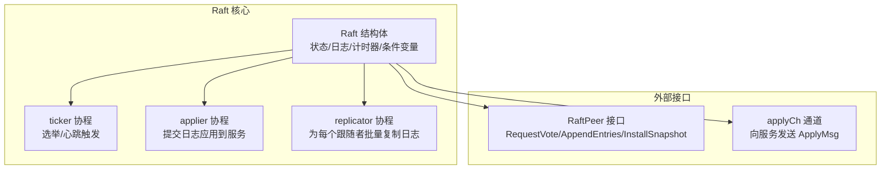
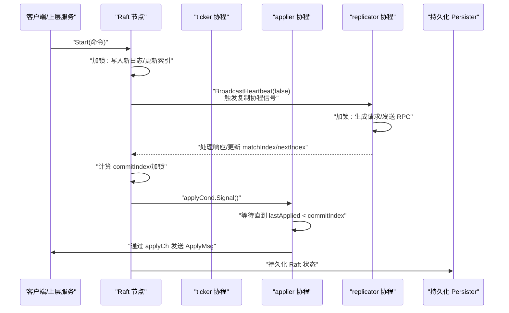
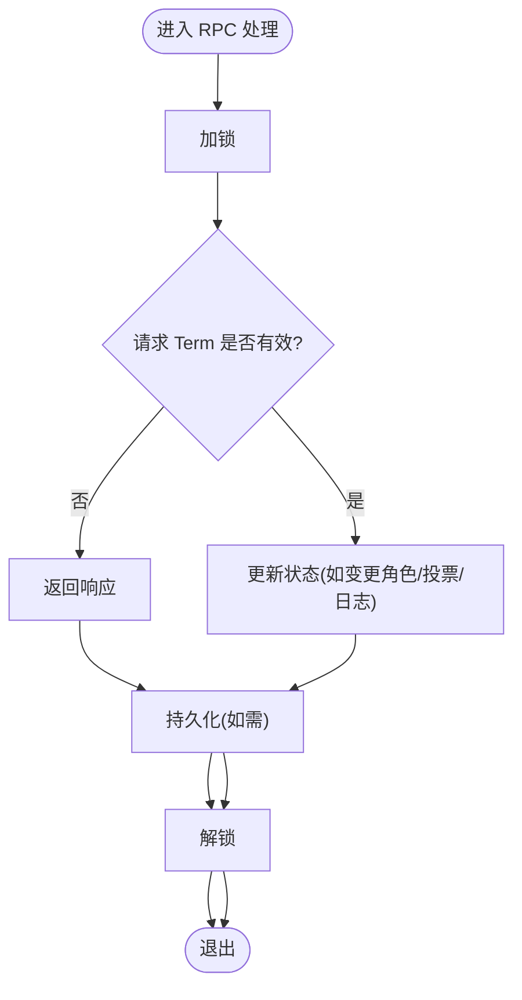
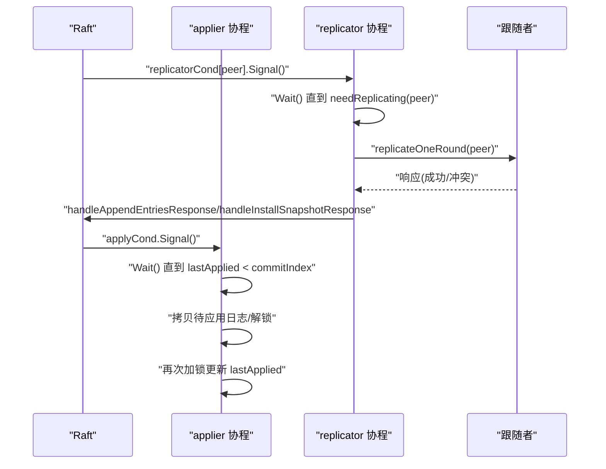
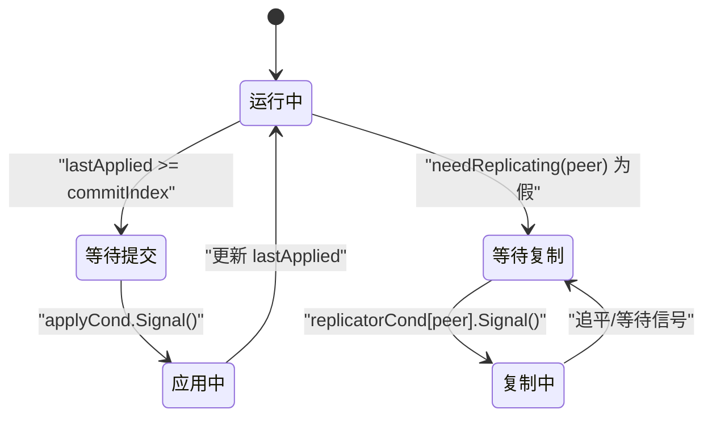
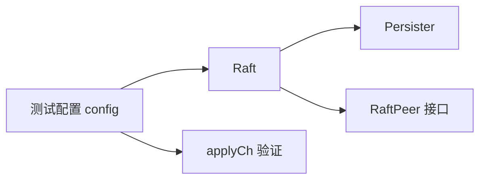

# 并发控制机制

## 目录
1. [引言](#引言)
2. [项目结构与角色定位](#项目结构与角色定位)
3. [核心组件与并发模型](#核心组件与并发模型)
4. [架构总览](#架构总览)
5. [详细组件分析](#详细组件分析)
6. [依赖关系与耦合分析](#依赖关系与耦合分析)
7. [性能与可扩展性考量](#性能与可扩展性考量)
8. [故障排查与常见问题](#故障排查与常见问题)
9. [结论](#结论)

## 引言
本文件系统化梳理 eraft 项目中 Raft 模块的并发控制机制，围绕以下主题展开：
- 互斥锁与读写锁的使用策略、加锁/解锁时机与锁粒度控制
- 条件变量的应用：applyCond（应用条件变量）与 replicatorCond（复制器条件变量）的使用场景与信号机制
- goroutine 生命周期与协作：ticker（定时器协程）、applier（应用协程）、replicator（复制协程）
- 原子操作的使用：dead 字段的原子操作与线程安全保证
- 竞态条件的避免：状态访问保护与数据竞争预防
- 提供并发流程图、协程交互图与锁使用示例路径，帮助读者快速理解与实践

## 项目结构与角色定位
Raft 模块位于 raft 子目录，核心文件包括：
- raft.go：Raft 实现主体，包含状态机、RPC 处理、领导者选举、日志复制、提交与应用等
- util.go：通用类型定义（状态、条目、ApplyMsg）、随机数封装、超时常量与工具函数
- persister.go：持久化存储封装，提供 Raft 状态与快照的保存与读取
- rpc.go：RPC 请求/响应结构体定义
- config.go：测试框架中的配置与并发辅助（用于验证 Raft 并发正确性）
- test_test.go：Raft 单元测试，覆盖选举、一致性、快照等并发场景

**图表来源**
- [raft.go](file://raft/raft.go#L37-L60)
- [raft.go](file://raft/raft.go#L616-L635)
- [raft.go](file://raft/raft.go#L638-L664)
- [raft.go](file://raft/raft.go#L666-L678)

**章节来源**
- [raft.go](file://raft/raft.go#L37-L60)
- [util.go](file://raft/util.go#L21-L41)
- [rpc.go](file://raft/rpc.go#L5-L67)

## 核心组件与并发模型
- 共享状态保护：使用读写锁保护所有共享状态字段，读多写少的场景采用 RWMutex，写路径尽量短小并尽快释放锁。
- 条件变量：
  - applyCond：当新日志被提交后唤醒 applier 协程，避免忙等。
  - replicatorCond：为每个跟随者维护独立的条件变量，当有新日志或需要追赶时唤醒对应复制协程。
- 定时器与协程：
  - ticker 协程：基于选举/心跳定时器驱动状态转换与心跳广播。
  - applier 协程：在无待应用日志时阻塞等待，确保“恰好一次”应用。
  - replicator 协程：按需批量复制，减少网络开销。
- 原子操作：使用原子整型标记节点死亡，避免协程循环中持有锁导致资源泄漏。
- 持久化：对持久化对象使用互斥锁保护磁盘 IO，保证状态与快照的一致性。

**章节来源**
- [raft.go](file://raft/raft.go#L37-L60)
- [raft.go](file://raft/raft.go#L616-L635)
- [raft.go](file://raft/raft.go#L638-L664)
- [raft.go](file://raft/raft.go#L666-L678)
- [raft.go](file://raft/raft.go#L602-L608)
- [persister.go](file://raft/persister.go#L17-L22)

## 架构总览
下图展示 Raft 节点内部协程与状态流转的并发关系，以及与外部服务的交互。

**图表来源**
- [raft.go](file://raft/raft.go#L581-L591)
- [raft.go](file://raft/raft.go#L353-L366)
- [raft.go](file://raft/raft.go#L666-L678)
- [raft.go](file://raft/raft.go#L638-L664)
- [raft.go](file://raft/raft.go#L509-L513)
- [raft.go](file://raft/raft.go#L85-L87)

## 详细组件分析

### 互斥锁与读写锁（mu）的使用
- 读写锁策略
  - 读路径：GetState/GetStatus/HasLogInCurrentTerm 等只读方法使用 RLock，降低锁竞争。
  - 写路径：Start、AppendEntries、RequestVote、InstallSnapshot、Snapshot、CondInstallSnapshot 等修改状态的方法使用 Lock，并在进入 RPC 处理前统一加锁，处理完后统一解锁，随后持久化。
- 锁粒度控制
  - 将持久化调用放在锁内，避免跨锁访问；在 RPC 发送前后分别加锁，确保状态在发送时一致。
  - 在复制协程中，先 RLock 获取必要只读信息，再 Unlock，最后在发送 RPC 后再加锁处理响应，避免长时间持锁。
- 锁的释放时机
  - 所有加锁均以 defer 语句保证异常路径也能释放锁，防止死锁。
  - 对于 RPC 处理函数，先加锁、再持久化、再打印调试信息，遵循“先锁后持久化”的顺序。

**图表来源**
- [raft.go](file://raft/raft.go#L166-L187)
- [raft.go](file://raft/raft.go#L189-L241)
- [raft.go](file://raft/raft.go#L243-L275)

**章节来源**
- [raft.go](file://raft/raft.go#L64-L74)
- [raft.go](file://raft/raft.go#L166-L187)
- [raft.go](file://raft/raft.go#L189-L241)
- [raft.go](file://raft/raft.go#L243-L275)
- [raft.go](file://raft/raft.go#L581-L591)

### 条件变量：applyCond 与 replicatorCond
- applyCond（应用条件变量）
  - 触发时机：当 commitIndex 可推进且当前任期的日志被提交时，调用 Signal 唤醒 applier。
  - 等待逻辑：applier 在 lastApplied >= commitIndex 时 Wait，避免忙等。
  - 一致性保障：应用阶段使用临时变量记录 commitIndex，避免 Unlock/ReLock 期间值变化导致重复或遗漏应用。
- replicatorCond（复制器条件变量）
  - 触发时机：StartElection/BroadcastHeartbeat(false) 时对每个跟随者调用 Signal，通知复制协程开始批量复制。
  - 等待逻辑：复制协程在 needReplicating(peer) 为假时 Wait，直到收到信号或状态变化。
  - 批量复制：复制协程在收到信号后循环调用 replicateOneRound，直至该跟随者追平，然后继续 Wait。

**图表来源**
- [raft.go](file://raft/raft.go#L509-L513)
- [raft.go](file://raft/raft.go#L638-L664)
- [raft.go](file://raft/raft.go#L666-L678)
- [raft.go](file://raft/raft.go#L353-L366)
- [raft.go](file://raft/raft.go#L368-L397)
- [raft.go](file://raft/raft.go#L423-L449)
- [raft.go](file://raft/raft.go#L462-L473)

**章节来源**
- [raft.go](file://raft/raft.go#L44-L46)
- [raft.go](file://raft/raft.go#L45-L46)
- [raft.go](file://raft/raft.go#L509-L513)
- [raft.go](file://raft/raft.go#L638-L664)
- [raft.go](file://raft/raft.go#L666-L678)
- [raft.go](file://raft/raft.go#L353-L366)

### goroutine 生命周期与协作
- ticker 协程
  - 周期性检查选举/心跳定时器，触发状态切换与心跳广播；在每次事件处理前后加锁，确保状态一致性。
- applier 协程
  - 在无待应用日志时 Wait；应用完成后更新 lastApplied；使用临时变量避免并发更新带来的不一致。
- replicator 协程
  - 为每个跟随者独立运行，按需批量复制；在收到信号或需要追赶时工作，否则 Wait。

**图表来源**
- [raft.go](file://raft/raft.go#L616-L635)
- [raft.go](file://raft/raft.go#L638-L664)
- [raft.go](file://raft/raft.go#L666-L678)

**章节来源**
- [raft.go](file://raft/raft.go#L616-L635)
- [raft.go](file://raft/raft.go#L638-L664)
- [raft.go](file://raft/raft.go#L666-L678)

### 原子操作与线程安全
- dead 字段
  - 使用原子 Store/Load 操作标记节点死亡，避免协程循环中持有锁导致资源泄漏。
  - Killer 与被 Killer 的协程均通过 killed() 判断是否退出，确保优雅停机。
- 测试框架中的原子使用
  - 测试框架在并发检查中使用原子变量控制并行检查的终止，体现原子操作在复杂并发场景下的正确性。

**章节来源**
- [raft.go](file://raft/raft.go#L602-L608)
- [config.go](file://raft/config.go#L274-L281)

### 竞态条件的避免与状态保护
- 状态访问保护
  - 所有共享状态（currentTerm、state、logs、commitIndex、lastApplied、nextIndex、matchIndex 等）仅在加锁范围内访问。
  - RPC 处理函数统一加锁/解锁，避免跨锁访问导致的竞态。
- 数据竞争预防
  - 应用阶段使用临时变量记录 commitIndex，避免 Unlock/ReLock 期间值变化。
  - 快照安装与日志修剪在锁内完成，确保一致性。
  - 复制协程在发送 RPC 前后分别加锁，避免长时间持锁造成阻塞。

**章节来源**
- [raft.go](file://raft/raft.go#L638-L664)
- [raft.go](file://raft/raft.go#L150-L164)
- [raft.go](file://raft/raft.go#L120-L144)
- [raft.go](file://raft/raft.go#L368-L397)

## 依赖关系与耦合分析
- Raft 与 Persister
  - Raft 在持久化状态与快照时通过 Persister 的互斥锁保证原子写入，避免状态与快照不同步。
- Raft 与 RPC 层
  - RequestVote/AppendEntries/InstallSnapshot 由 RaftPeer 接口实现，Raft 在处理 RPC 时统一加锁，确保状态在 RPC 期间一致。
- Raft 与测试框架
  - 测试框架通过 config 维护多个 Raft 实例，使用互斥锁保护共享状态，同时通过 applyCh 验证日志应用的正确性。

**图表来源**
- [raft.go](file://raft/raft.go#L85-L87)
- [raft.go](file://raft/raft.go#L304-L314)
- [config.go](file://raft/config.go#L162-L181)

**章节来源**
- [raft.go](file://raft/raft.go#L85-L87)
- [raft.go](file://raft/raft.go#L304-L314)
- [config.go](file://raft/config.go#L162-L181)

## 性能与可扩展性考量
- 锁粒度优化
  - 读多写少场景使用 RWMutex，减少读锁竞争；写路径尽量短小，尽早释放锁。
- 条件变量批量化
  - replicatorCond 为每个跟随者独立信号，避免全局广播带来的不必要的唤醒。
- 忙等避免
  - applier 与 replicator 在无任务时 Wait，显著降低 CPU 占用。
- 日志修剪
  - shrinkEntriesArray 与 Snapshot/CondInstallSnapshot 机制减少内存占用，提升长期运行稳定性。

[本节为一般性建议，无需特定文件引用]

## 故障排查与常见问题
- 协程未退出
  - 检查 Killer 是否调用了 atomic.StoreInt32 设置 dead，各协程是否在循环中检查 killed()。
- 应用阶段卡住
  - 检查 applyCond 是否被正确 Signal，applier 是否在 Wait 前后正确判断 lastApplied 与 commitIndex。
- 复制阶段停滞
  - 检查 replicatorCond 是否被正确 Signal，needReplicating 的判断是否正确。
- 竞态检测
  - 使用测试框架提供的并发检查，关注 applyCh 中日志顺序与重复应用问题。

**章节来源**
- [raft.go](file://raft/raft.go#L602-L608)
- [raft.go](file://raft/raft.go#L638-L664)
- [raft.go](file://raft/raft.go#L666-L678)
- [config.go](file://raft/config.go#L162-L181)

## 结论
eraft 的 Raft 实现通过明确的锁策略、条件变量与协程协作，实现了高可靠与高性能的共识算法。读写锁与细粒度的加锁/解锁时机确保了读多写少场景下的低竞争；applyCond 与 replicatorCond 的合理使用避免了忙等与过度唤醒；原子操作保证了优雅停机与测试框架的正确性。遵循本文的并发流程图与协程交互图，可以更好地理解与维护 Raft 的并发控制机制。