# 持久化层实现

<cite>
**本文档引用的文件**
- [raft/persister.go](file://raft/persister.go)
- [raft/raft.go](file://raft/raft.go)
- [labgob/labgob.go](file://labgob/labgob.go)
- [raft/util.go](file://raft/util.go)
- [raft/config.go](file://raft/config.go)
- [raft/rpc.go](file://raft/rpc.go)
- [raft/grpc_client.go](file://raft/grpc_client.go)
- [raftpb/raft.pb.go](file://raftpb/raft.pb.go)
</cite>

## 目录
1. [简介](#简介)
2. [项目结构](#项目结构)
3. [核心组件](#核心组件)
4. [架构概览](#架构概览)
5. [详细组件分析](#详细组件分析)
6. [依赖关系分析](#依赖关系分析)
7. [性能考虑](#性能考虑)
8. [故障排除指南](#故障排除指南)
9. [结论](#结论)

## 简介

本文档深入分析了 eRaft 项目中 Raft 协议的持久化层实现。该实现提供了可靠的持久化机制，确保在节点崩溃后能够恢复到一致的状态。文档重点关注以下关键功能：

- **持久化方法**：`persist()`、`readPersist()`、`encodeState()`
- **快照机制**：`Snapshot()`、`CondInstallSnapshot()`
- **持久化内容**：`currentTerm`、`votedFor`、`logs` 的序列化和反序列化
- **文件结构**：Raft 状态文件和快照文件的格式与存储位置
- **性能优化**：批量写入、内存映射、压缩算法

## 项目结构

eRaft 项目的持久化相关代码主要分布在以下几个模块中：

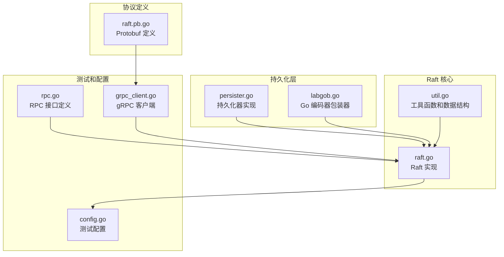

**图表来源**
- [raft/persister.go](file://raft/persister.go#L1-L111)
- [raft/raft.go](file://raft/raft.go#L1-L726)
- [labgob/labgob.go](file://labgob/labgob.go#L1-L178)

**章节来源**
- [raft/persister.go](file://raft/persister.go#L1-L111)
- [raft/raft.go](file://raft/raft.go#L1-L726)
- [labgob/labgob.go](file://labgob/labgob.go#L1-L178)

## 核心组件

### 持久化器 (Persister)

持久化器是整个持久化系统的核心组件，负责管理 Raft 状态和快照数据的存储与检索。

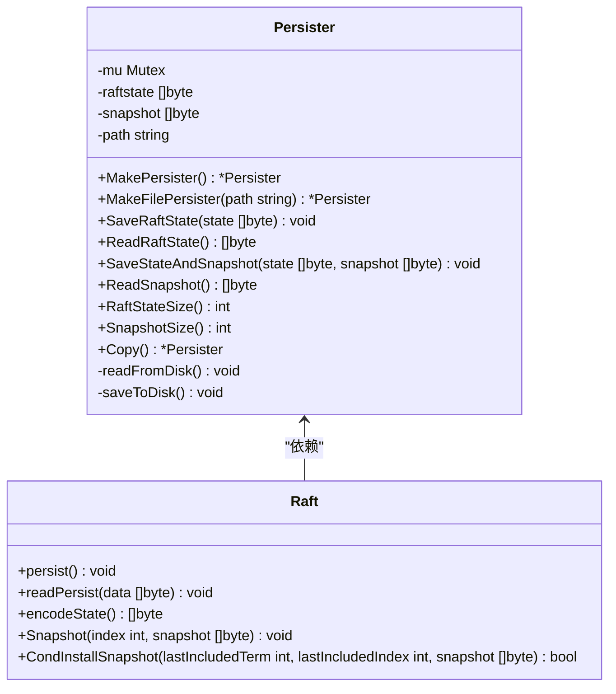

**图表来源**
- [raft/persister.go](file://raft/persister.go#L17-L22)
- [raft/raft.go](file://raft/raft.go#L37-L60)

### 数据结构定义

Raft 核心数据结构包括状态、日志条目和应用消息：

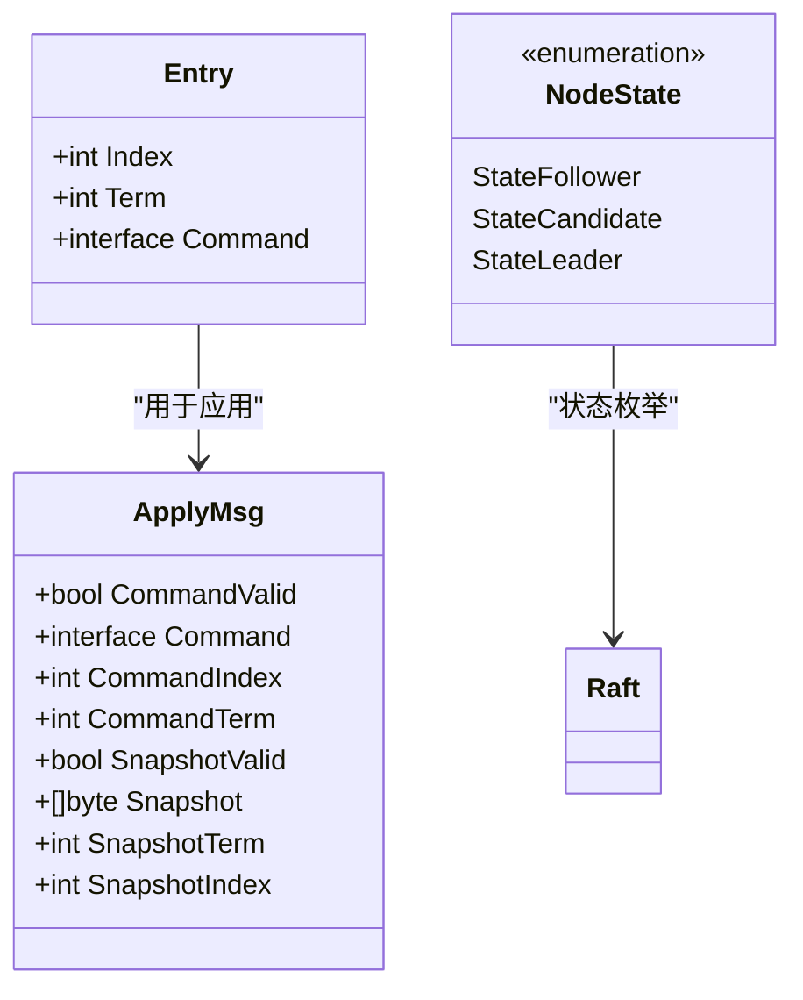

**图表来源**
- [raft/util.go](file://raft/util.go#L63-L67)
- [raft/util.go](file://raft/util.go#L21-L31)
- [raft/util.go](file://raft/util.go#L43-L61)

**章节来源**
- [raft/persister.go](file://raft/persister.go#L17-L110)
- [raft/raft.go](file://raft/raft.go#L37-L60)
- [raft/util.go](file://raft/util.go#L21-L67)

## 架构概览

### 持久化架构

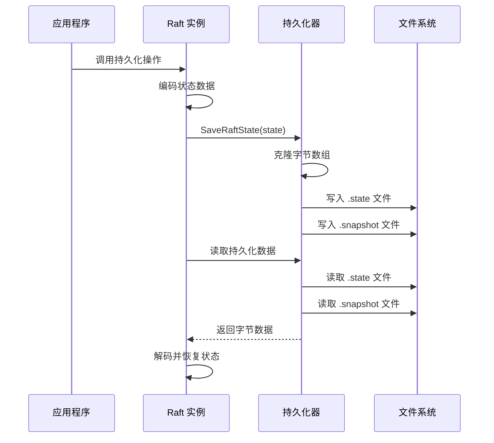

**图表来源**
- [raft/raft.go](file://raft/raft.go#L85-L116)
- [raft/persister.go](file://raft/persister.go#L71-L104)

### 快照处理流程

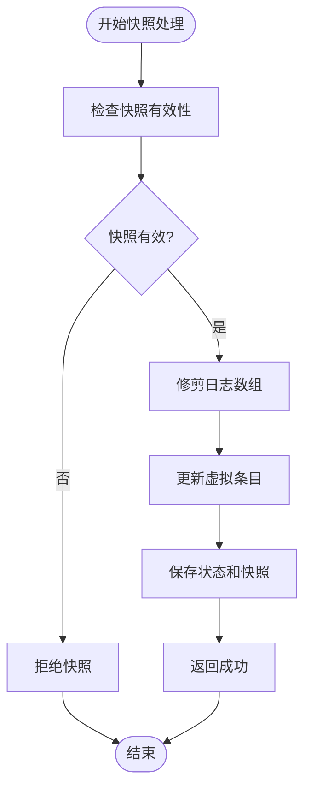

**图表来源**
- [raft/raft.go](file://raft/raft.go#L120-L144)

**章节来源**
- [raft/raft.go](file://raft/raft.go#L85-L144)
- [raft/persister.go](file://raft/persister.go#L71-L104)

## 详细组件分析

### 持久化方法实现

#### persist() 方法

`persist()` 方法负责将当前 Raft 状态持久化到磁盘：

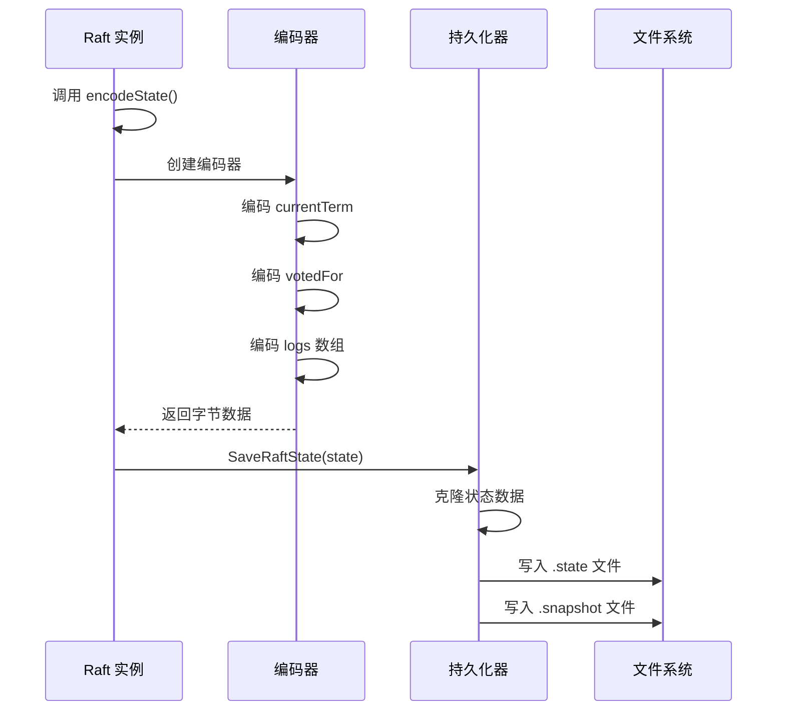

**图表来源**
- [raft/raft.go](file://raft/raft.go#L85-L87)
- [raft/raft.go](file://raft/raft.go#L109-L116)
- [raft/persister.go](file://raft/persister.go#L71-L76)

#### readPersist() 方法

`readPersist()` 方法从持久化存储中恢复 Raft 状态：

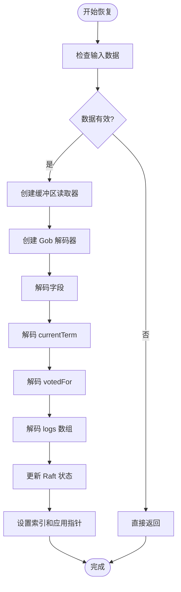

**图表来源**
- [raft/raft.go](file://raft/raft.go#L89-L106)

#### encodeState() 方法

`encodeState()` 方法将 Raft 状态编码为字节数组：

**章节来源**
- [raft/raft.go](file://raft/raft.go#L85-L116)

### 快照机制实现

#### Snapshot() 方法

`Snapshot()` 方法创建新的快照并修剪日志：

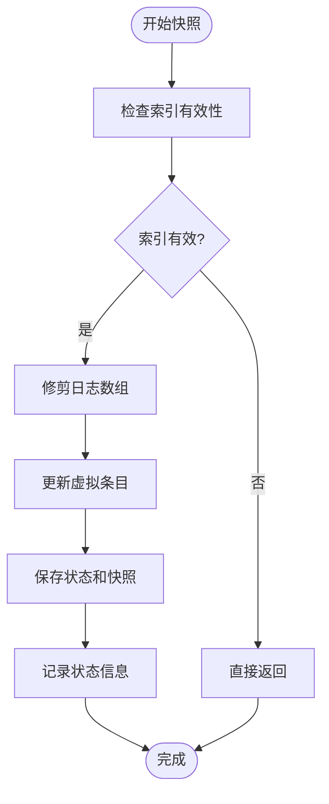

**图表来源**
- [raft/raft.go](file://raft/raft.go#L150-L164)

#### CondInstallSnapshot() 方法

`CondInstallSnapshot()` 方法条件性地安装远程快照：

**章节来源**
- [raft/raft.go](file://raft/raft.go#L150-L164)

### 文件格式和存储结构

#### 持久化文件格式

持久化器使用简单的文件系统存储格式：

| 文件类型 | 文件名 | 存储内容 | 权限 |
|---------|--------|----------|------|
| Raft 状态 | `{path}.state` | 编码后的 Raft 状态数据 | 0644 |
| 快照数据 | `{path}.snapshot` | 完整的快照数据 | 0644 |

#### 数据序列化格式

使用 labgob 包进行数据序列化，支持以下类型：
- 基本类型：`int`、`string`、`bool`
- 复合类型：`[]Entry`（日志数组）
- 结构体：`Entry`、`ApplyMsg`

**章节来源**
- [raft/persister.go](file://raft/persister.go#L34-L54)
- [labgob/labgob.go](file://labgob/labgob.go#L24-L58)

## 依赖关系分析

### 组件依赖图

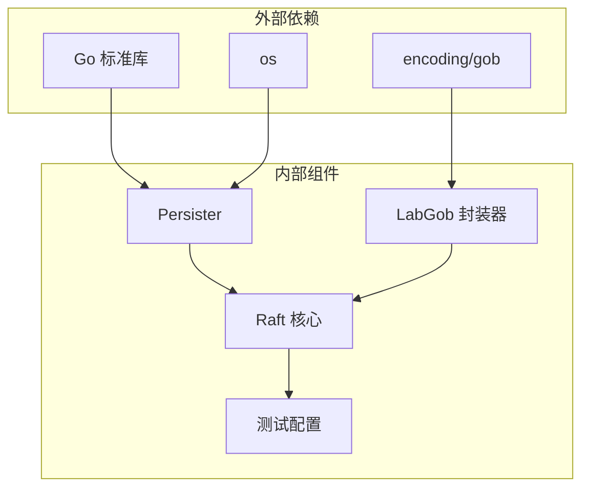

**图表来源**
- [raft/persister.go](file://raft/persister.go#L12-L15)
- [labgob/labgob.go](file://labgob/labgob.go#L10-L18)
- [raft/raft.go](file://raft/raft.go#L20-L27)

### 关键依赖关系

1. **持久化器依赖**：
   - `os` 包：文件系统操作
   - `sync` 包：线程安全
   - `labgob` 包：数据序列化

2. **Raft 核心依赖**：
   - `labgob` 包：状态编码/解码
   - `bytes` 包：缓冲区操作
   - `time` 包：定时器管理

**章节来源**
- [raft/persister.go](file://raft/persister.go#L12-L15)
- [raft/raft.go](file://raft/raft.go#L20-L27)

## 性能考虑

### 当前实现的性能特征

#### 优点
1. **简单可靠**：基于标准库的实现，经过充分测试
2. **原子操作**：`SaveStateAndSnapshot` 提供原子性保证
3. **线程安全**：内置互斥锁保护并发访问
4. **内存效率**：使用缓冲区避免不必要的内存分配

#### 性能瓶颈
1. **I/O 频率**：每次状态变更都触发磁盘写入
2. **序列化开销**：完整日志数组的频繁编码/解码
3. **文件系统压力**：频繁的小文件写入操作

### 性能优化建议

#### 批量写入策略
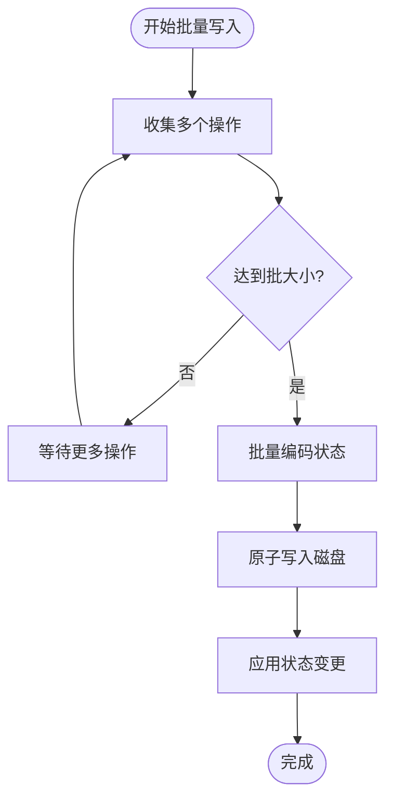

#### 内存映射优化
- 使用 `mmap` 减少系统调用次数
- 实现写时复制（CoW）避免频繁数据拷贝
- 采用延迟写入策略减少磁盘 I/O

#### 压缩算法选择
- **Snappy**：快速压缩，适合高频写入场景
- **Zstandard**：平衡压缩比和速度
- **LZ4**：极低延迟，适合实时性要求高的场景

### 实现复杂度分析

| 操作 | 时间复杂度 | 空间复杂度 | 说明 |
|------|------------|------------|------|
| `persist()` | O(n) | O(n) | n 为日志条目数量 |
| `readPersist()` | O(n) | O(n) | 需要解码完整状态 |
| `encodeState()` | O(n) | O(n) | 字节流编码 |
| `Snapshot()` | O(n) | O(n) | 日志修剪和状态保存 |
| `CondInstallSnapshot()` | O(n) | O(n) | 条件安装和状态恢复 |

**章节来源**
- [raft/raft.go](file://raft/raft.go#L85-L116)
- [raft/persister.go](file://raft/persister.go#L71-L104)

## 故障排除指南

### 常见问题诊断

#### 序列化错误
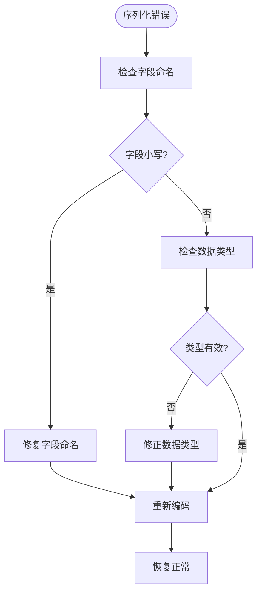

#### 并发访问问题
- 确保所有持久化操作都在正确的锁保护下执行
- 避免在持久化过程中进行长时间的阻塞操作
- 使用 `Copy()` 方法创建独立的持久化器实例

#### 文件系统错误
- 检查磁盘空间是否充足
- 验证文件权限设置正确
- 确保路径存在且可写

### 调试技巧

1. **启用调试输出**：使用 `DPrintf` 函数查看详细的持久化过程
2. **监控文件大小**：定期检查 `.state` 和 `.snapshot` 文件大小
3. **验证数据完整性**：比较编码前后的数据一致性

**章节来源**
- [labgob/labgob.go](file://labgob/labgob.go#L70-L115)
- [raft/raft.go](file://raft/raft.go#L14-L19)

## 结论

eRaft 项目的持久化层实现了 Raft 协议所需的核心功能，提供了可靠的状态持久化和快照管理能力。虽然当前实现相对简单，但具有良好的可维护性和测试覆盖。

### 主要成就
1. **完整的持久化机制**：支持 Raft 状态和快照的完整生命周期管理
2. **线程安全设计**：通过互斥锁确保并发访问的安全性
3. **原子性保证**：提供状态和快照的原子保存操作
4. **清晰的接口设计**：简洁明了的 API 便于集成和使用

### 改进建议
1. **性能优化**：实现批量写入和内存映射以提高 I/O 效率
2. **压缩支持**：添加数据压缩以减少存储空间占用
3. **异步持久化**：引入异步写入机制减少对主流程的影响
4. **故障恢复**：增强错误处理和自动恢复能力

该持久化层为 eRaft 项目提供了坚实的基础设施，为后续的功能扩展和性能优化奠定了良好基础。