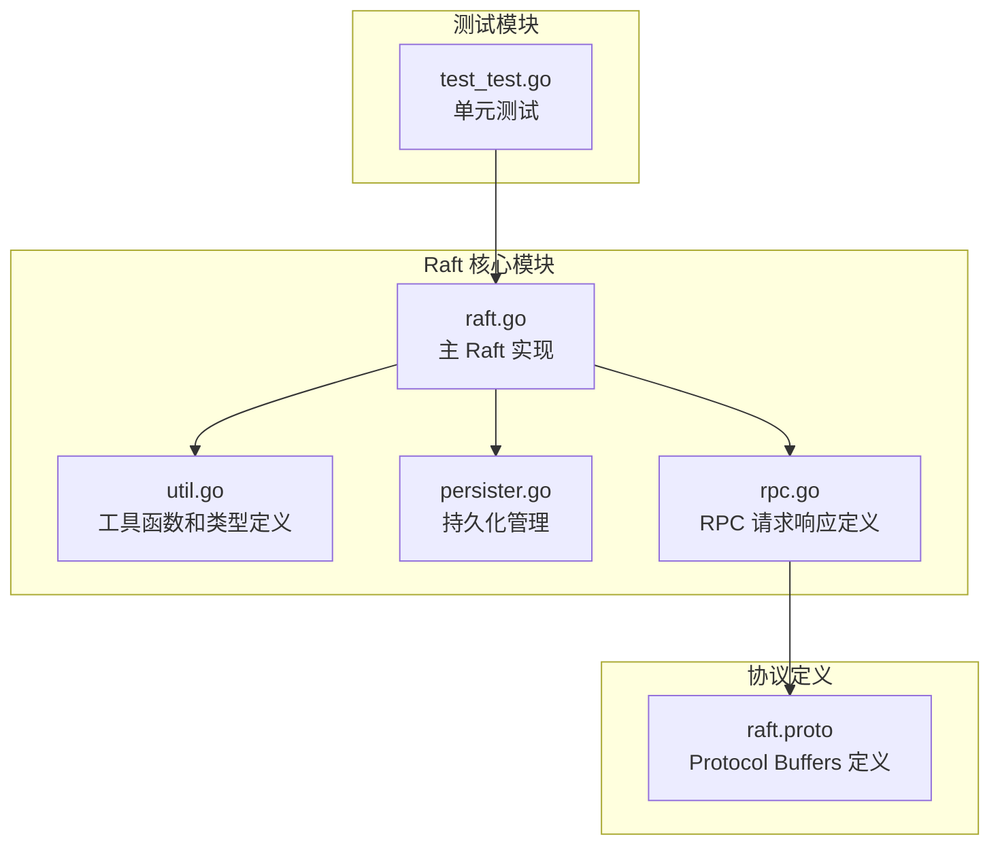
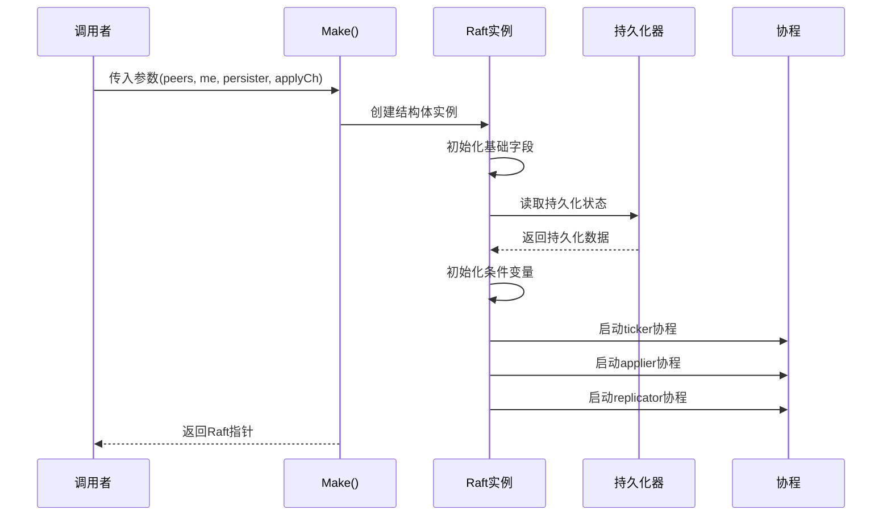
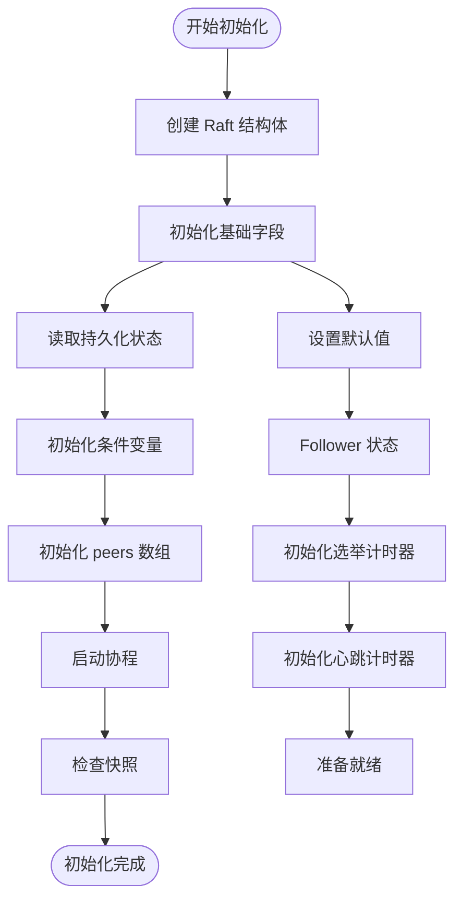
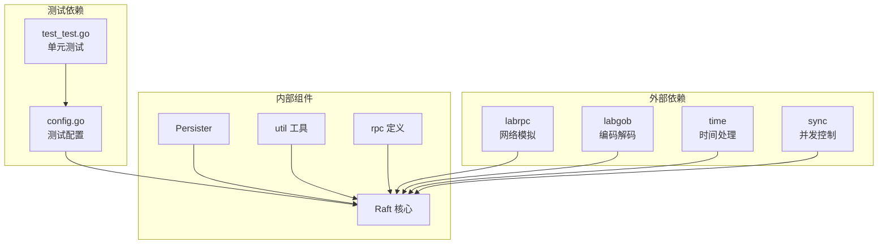
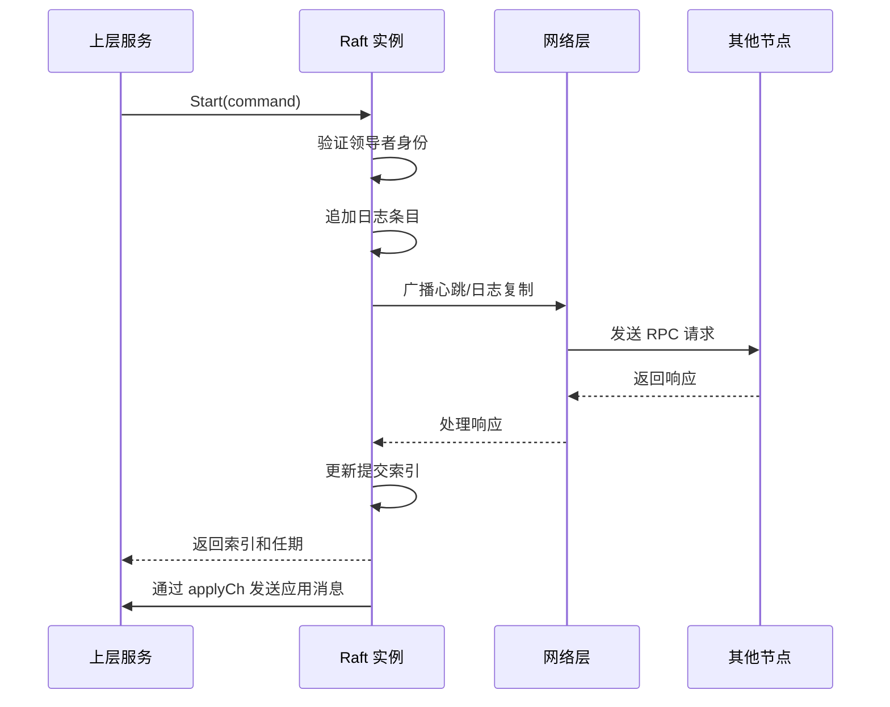

# 数据结构设计


## 目录
1. [简介](#简介)
2. [项目结构](#项目结构)
3. [核心组件](#核心组件)
4. [架构概览](#架构概览)
5. [详细组件分析](#详细组件分析)
6. [依赖关系分析](#依赖关系分析)
7. [性能考虑](#性能考虑)
8. [故障排除指南](#故障排除指南)
9. [结论](#结论)

## 简介

本文档深入分析了 Raft 共识算法的数据结构设计，重点关注 Raft 结构体的核心字段及其相互关系。Raft 是一种用于管理复制日志的一致性算法，广泛应用于分布式系统中确保数据一致性。

## 项目结构

Raft 实现位于 `raft/` 目录下，主要包含以下关键文件：



**图表来源**
- [raft.go](file://raft/raft.go#L1-L726)
- [util.go](file://raft/util.go#L1-L115)
- [persister.go](file://raft/persister.go#L1-L111)
- [rpc.go](file://raft/rpc.go#L1-L68)

**章节来源**
- [raft.go](file://raft/raft.go#L1-L726)
- [util.go](file://raft/util.go#L1-L115)
- [persister.go](file://raft/persister.go#L1-L111)
- [rpc.go](file://raft/rpc.go#L1-L68)

## 核心组件

### Raft 结构体概述

Raft 结构体是整个共识算法的核心数据容器，包含了所有必要的状态信息和运行时资源。

```mermaid
classDiagram
class Raft {
+RWMutex mu
+[]RaftPeer peers
+Persister* persister
+int me
+int32 dead
+chan ApplyMsg applyCh
+Cond* applyCond
+[]Cond* replicatorCond
+NodeState state
+int currentTerm
+int votedFor
+[]Entry logs
+int commitIndex
+int lastApplied
+[]int nextIndex
+[]int matchIndex
+Timer* electionTimer
+Timer* heartbeatTimer
+GetState() (int, bool)
+Start(command) (int, int, bool)
+RequestVote() void
+AppendEntries() void
+ChangeState() void
+persist() void
+readPersist() void
}
class Persister {
+Mutex mu
+[]byte raftstate
+[]byte snapshot
+string path
+SaveRaftState() void
+ReadRaftState() []byte
+SaveStateAndSnapshot() void
+ReadSnapshot() []byte
}
class Entry {
+int Index
+int Term
+interface{} Command
}
class NodeState {
<<enumeration>>
StateFollower
StateCandidate
StateLeader
}
Raft --> Persister : "使用"
Raft --> Entry : "包含"
Raft --> NodeState : "维护"
```

**图表来源**
- [raft.go](file://raft/raft.go#L37-L60)
- [persister.go](file://raft/persister.go#L17-L22)
- [util.go](file://raft/util.go#L63-L67)
- [util.go](file://raft/util.go#L43-L61)

### 字段初始化过程

Raft 结构体的初始化过程遵循严格的顺序，确保所有组件正确配置：



**图表来源**
- [raft.go](file://raft/raft.go#L689-L725)
- [raft.go](file://raft/raft.go#L707-L722)

**章节来源**
- [raft.go](file://raft/raft.go#L689-L725)

## 架构概览

### 内存布局和并发控制

Raft 的内存布局设计体现了良好的并发控制策略：

```mermaid
graph TB
subgraph "Raft 结构体内存布局"
MU[mu: RWMutex<br/>互斥锁]
PEERS[peers: []RaftPeer<br/>对等节点列表]
PERSISTER[persister: *Persister<br/>持久化对象]
ME[me: int<br/>当前节点索引]
DEAD[dead: int32<br/>死亡标志]
STATE[state: NodeState<br/>节点状态]
CURRENT_TERM[currentTerm: int<br/>当前任期]
VOTED_FOR[votedFor: int<br/>投票对象]
LOGS[logs: []Entry<br/>日志数组]
COMMIT_INDEX[commitIndex: int<br/>提交索引]
LAST_APPLIED[lastApplied: int<br/>最后应用索引]
NEXT_INDEX[nextIndex: []int<br/>下一个索引]
MATCH_INDEX[matchIndex: []int<br/>匹配索引]
ELECTION_TIMER[electionTimer: *time.Timer<br/>选举计时器]
HEARTBEAT_TIMER[heartbeatTimer: *time.Timer<br/>心跳计时器]
end
subgraph "并发访问控制"
RWLOCK[RWMutex<br/>读写锁]
ATOMIC[atomic<br/>原子操作]
COND[Cond<br/>条件变量]
end
MU --> RWLOCK
DEAD --> ATOMIC
APPLY_COND[applyCond: *Cond] --> COND
REPLICATOR_COND[replicatorCond: []*Cond] --> COND
```

**图表来源**
- [raft.go](file://raft/raft.go#L37-L60)
- [raft.go](file://raft/raft.go#L38-L46)

### 并发访问模式

Raft 采用了多种并发控制机制来确保线程安全：

| 访问模式 | 锁类型 | 使用场景 | 说明 |
|---------|--------|----------|------|
| 读操作 | RWMutex.RLock | GetState, GetStatus | 允许多个读操作同时进行 |
| 写操作 | RWMutex.Lock | 所有修改状态的方法 | 排他性访问，防止竞态条件 |
| 原子操作 | atomic.StoreInt32 | Kill() 方法 | 快速检查节点死亡状态 |
| 条件变量 | sync.Cond | 应用器和复制器协程 | 高效的等待/通知机制 |

**章节来源**
- [raft.go](file://raft/raft.go#L64-L80)
- [raft.go](file://raft/raft.go#L602-L608)
- [raft.go](file://raft/raft.go#L638-L664)

## 详细组件分析

### 核心字段详解

#### 基础状态字段

| 字段名 | 类型 | 初始值 | 作用描述 |
|--------|------|--------|----------|
| mu | sync.RWMutex | 未初始化 | 主要的互斥锁，保护所有共享状态 |
| peers | []RaftPeer | 传入参数 | 对等节点的 RPC 端点列表 |
| persister | *Persister | 传入参数 | 持久化存储管理器 |
| me | int | 传入参数 | 当前节点在 peers 数组中的索引 |
| dead | int32 | 0 | 原子标志，指示节点是否已死亡 |

#### 节点状态字段

| 字段名 | 类型 | 初始值 | 作用描述 |
|--------|------|--------|----------|
| state | NodeState | StateFollower | 当前节点的 Raft 状态 |
| currentTerm | int | 0 | 当前任期号，单调递增 |
| votedFor | int | -1 | 在当前任期中投出的候选者 ID |

#### 日志相关字段

| 字段名 | 类型 | 初始值 | 作用描述 |
|--------|------|--------|----------|
| logs | []Entry | 包含虚拟条目的数组 | 日志条目数组，第一个为虚拟条目 |
| commitIndex | int | 第一个日志条目的索引 | 已提交的日志最高索引 |
| lastApplied | int | 第一个日志条目的索引 | 已应用到状态机的最高索引 |
| nextIndex | []int | 全部初始化为最后一个日志索引+1 | 下一个要发送给每个跟随者的索引 |
| matchIndex | []int | 全部初始化为 0 | 每个跟随者已匹配的日志最高索引 |

#### 定时器字段

| 字段名 | 类型 | 初始值 | 作用描述 |
|--------|------|--------|----------|
| electionTimer | *time.Timer | 随机选举超时 | 触发选举的计时器 |
| heartbeatTimer | *time.Timer | 稳定的心跳超时 | 维持领导地位的心跳计时器 |

**章节来源**
- [raft.go](file://raft/raft.go#L37-L60)
- [raft.go](file://raft/raft.go#L689-L725)

### 字段关系图

```mermaid
graph TB
subgraph "状态同步机制"
ELECTION_TIMER[electionTimer<br/>选举计时器]
HEARTBEAT_TIMER[heartbeatTimer<br/>心跳计时器]
TICKER[ticker()<br/>定时器协程]
APPLY_COND[applyCond<br/>应用条件变量]
REPLICATOR_COND[replicatorCond<br/>复制条件变量]
end
subgraph "日志同步机制"
LOGS[logs<br/>日志数组]
COMMIT_INDEX[commitIndex<br/>提交索引]
LAST_APPLIED[lastApplied<br/>最后应用索引]
NEXT_INDEX[nextIndex<br/>下一个索引]
MATCH_INDEX[matchIndex<br/>匹配索引]
APPLY_CH[applyCh<br/>应用通道]
end
subgraph "状态转换机制"
STATE[state<br/>节点状态]
CURRENT_TERM[currentTerm<br/>当前任期]
VOTED_FOR[votedFor<br/>投票对象]
CHANGE_STATE[ChangeState()<br/>状态转换]
end
ELECTION_TIMER --> TICKER
HEARTBEAT_TIMER --> TICKER
TICKER --> STATE
STATE --> CHANGE_STATE
LOGS --> COMMIT_INDEX
COMMIT_INDEX --> APPLY_COND
APPLY_COND --> APPLY_CH
NEXT_INDEX --> MATCH_INDEX
MATCH_INDEX --> COMMIT_INDEX
CURRENT_TERM --> VOTED_FOR
```

**图表来源**
- [raft.go](file://raft/raft.go#L475-L494)
- [raft.go](file://raft/raft.go#L497-L524)
- [raft.go](file://raft/raft.go#L616-L635)

### 初始化流程分析

Raft 的初始化过程包含多个关键步骤：



**图表来源**
- [raft.go](file://raft/raft.go#L689-L725)
- [raft.go](file://raft/raft.go#L707-L718)

**章节来源**
- [raft.go](file://raft/raft.go#L689-L725)

### 数据结构复杂度分析

| 操作类型 | 时间复杂度 | 空间复杂度 | 说明 |
|----------|------------|------------|------|
| 日志追加 | O(1) | O(1) | 追加新日志条目 |
| 日志查询 | O(1) | O(1) | 通过索引访问日志 |
| 提交索引更新 | O(n) | O(n) | 领导者端排序计算 |
| 心跳发送 | O(n) | O(1) | 向所有跟随者广播 |
| 选举投票 | O(1) | O(1) | 投票决策逻辑 |

**章节来源**
- [raft.go](file://raft/raft.go#L497-L524)
- [raft.go](file://raft/raft.go#L353-L366)

## 依赖关系分析

### 组件耦合度分析



**图表来源**
- [raft.go](file://raft/raft.go#L20-L27)
- [util.go](file://raft/util.go#L1-L115)
- [persister.go](file://raft/persister.go#L1-L111)

### 外部接口契约

Raft 实现遵循以下接口契约：



**图表来源**
- [raft.go](file://raft/raft.go#L576-L591)
- [raft.go](file://raft/raft.go#L638-L664)

**章节来源**
- [raft.go](file://raft/raft.go#L576-L591)
- [raft.go](file://raft/raft.go#L638-L664)

## 性能考虑

### 内存优化策略

1. **日志数组收缩**: 实现了 `shrinkEntriesArray` 函数，在数组长度小于容量的 1/2 时进行收缩，减少内存占用。

2. **条件变量优化**: 使用独立的条件变量数组 `replicatorCond`，避免全局锁竞争。

3. **原子操作**: 对 `dead` 标志使用原子操作，提高检查效率。

### 并发性能优化

1. **读写分离**: 使用 `RWMutex` 实现读写分离，允许多个读操作并行执行。

2. **批量复制**: 通过条件变量实现批量复制，减少 RPC 调用次数。

3. **异步应用**: 应用器协程异步处理日志应用，避免阻塞主循环。

**章节来源**
- [util.go](file://raft/util.go#L97-L105)
- [raft.go](file://raft/raft.go#L666-L678)

## 故障排除指南

### 常见问题诊断

| 问题类型 | 症状 | 可能原因 | 解决方案 |
|----------|------|----------|----------|
| 死锁 | 协程阻塞 | 锁顺序错误 | 检查锁获取顺序，确保一致性 |
| 内存泄漏 | 内存持续增长 | 条件变量未释放 | 确保协程正常退出 |
| 数据不一致 | 日志冲突 | 网络分区 | 检查日志匹配逻辑 |
| 性能下降 | RPC 响应慢 | 锁竞争严重 | 优化锁粒度 |

### 调试技巧

1. **状态监控**: 使用 `GetStatus()` 方法定期检查节点状态。

2. **日志分析**: 利用调试输出跟踪状态转换和日志操作。

3. **性能分析**: 监控 RPC 计数和内存使用情况。

**章节来源**
- [raft.go](file://raft/raft.go#L70-L74)
- [util.go](file://raft/util.go#L14-L19)

## 结论

Raft 数据结构设计体现了现代分布式系统设计的最佳实践：

1. **清晰的状态管理**: 通过明确的状态字段和状态转换函数，确保系统行为可预测。

2. **高效的并发控制**: 采用多种并发控制机制，平衡了安全性与性能。

3. **健壮的持久化**: 独立的持久化组件提供了可靠的状态恢复能力。

4. **优雅的错误处理**: 完善的错误检测和恢复机制保证了系统的稳定性。

该设计为构建可靠的分布式共识系统奠定了坚实的基础，为后续的功能扩展和性能优化提供了良好的框架。