# 快照管理机制

## 目录
1. [简介](#简介)
2. [项目结构](#项目结构)
3. [核心组件](#核心组件)
4. [架构概览](#架构概览)
5. [详细组件分析](#详细组件分析)
6. [依赖关系分析](#依赖关系分析)
7. [性能考虑](#性能考虑)
8. [故障排除指南](#故障排除指南)
9. [结论](#结论)

## 简介

本文件详细分析了 Raft 分布式一致性算法中的快照管理机制。快照是 Raft 实现中用于日志压缩和存储空间优化的关键机制，它允许服务器定期保存状态机的完整状态，并丢弃已经应用到状态机的日志条目，从而避免日志无限增长。

本文档深入探讨了快照创建流程、快照安装处理、快照与日志的关系以及快照安装的异步处理机制，为开发者提供了完整的快照管理技术参考。

## 项目结构

该代码库采用模块化设计，快照管理功能主要分布在以下模块中：

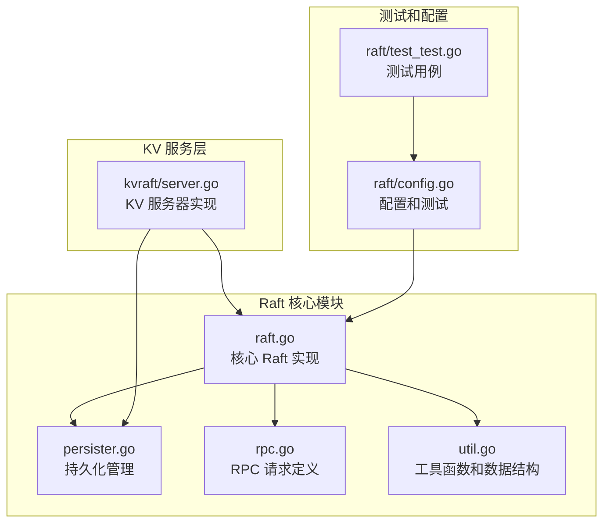

**图表来源**
- [raft.go](file://raft/raft.go#L1-L726)
- [persister.go](file://raft/persister.go#L1-L111)
- [server.go](file://kvraft/server.go#L1-L342)

**章节来源**
- [raft.go](file://raft/raft.go#L1-L726)
- [persister.go](file://raft/persister.go#L1-L111)
- [server.go](file://kvraft/server.go#L1-L342)

## 核心组件

### 快照相关数据结构

快照管理涉及多个核心数据结构：

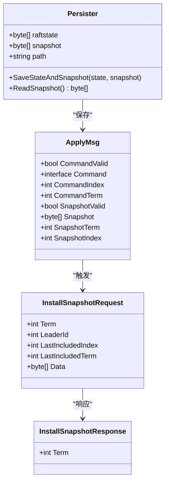

**图表来源**
- [util.go](file://raft/util.go#L21-L41)
- [rpc.go](file://raft/rpc.go#L49-L67)
- [persister.go](file://raft/persister.go#L17-L22)

### 快照触发条件

快照创建的主要触发条件包括：
1. **存储空间限制**：当 Raft 状态大小超过配置阈值时
2. **日志长度限制**：基于固定间隔的周期性快照
3. **手动触发**：服务层主动要求创建快照

**章节来源**
- [server.go](file://kvraft/server.go#L238-L240)
- [config.go](file://raft/config.go#L182-L183)
- [config.go](file://raft/config.go#L220-L226)

## 架构概览

快照管理机制在整体架构中的位置如下：

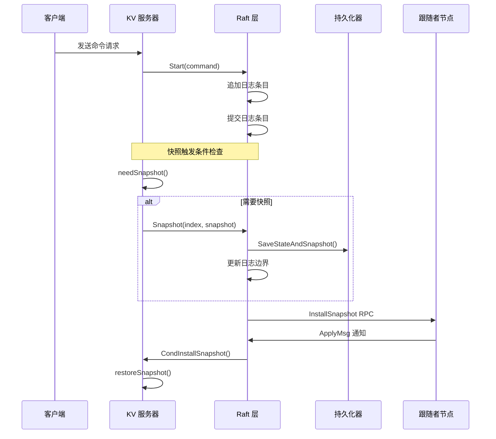

**图表来源**
- [server.go](file://kvraft/server.go#L218-L227)
- [raft.go](file://raft/raft.go#L150-L164)
- [raft.go](file://raft/raft.go#L243-L275)

## 详细组件分析

### 快照创建流程

快照创建是一个多阶段的过程，涉及服务层触发、日志截断和数据持久化：

#### 1. 服务层触发条件检查

服务层通过 `needSnapshot()` 方法检查是否需要创建快照：

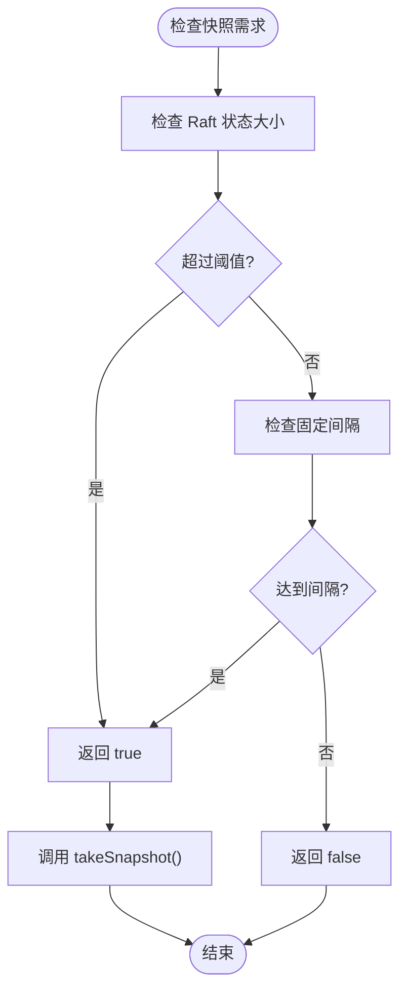

**图表来源**
- [server.go](file://kvraft/server.go#L238-L240)
- [config.go](file://raft/config.go#L182-L183)

#### 2. 日志截断策略

快照创建时的日志截断策略由 `Snapshot()` 方法实现：

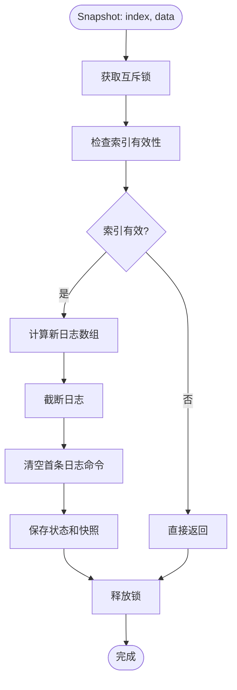

**图表来源**
- [raft.go](file://raft/raft.go#L150-L164)

#### 3. 快照数据生成

快照数据的生成由 `takeSnapshot()` 方法负责：

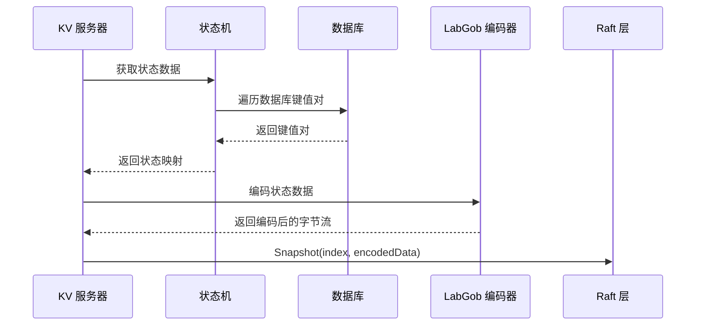

**图表来源**
- [server.go](file://kvraft/server.go#L242-L258)

**章节来源**
- [server.go](file://kvraft/server.go#L238-L258)
- [raft.go](file://raft/raft.go#L150-L164)

### 快照安装处理

快照安装处理分为领导者发送和跟随者接收两个方面：

#### 1. 领导者快照发送

领导者节点通过 `replicateOneRound()` 方法检测跟随者是否需要快照：

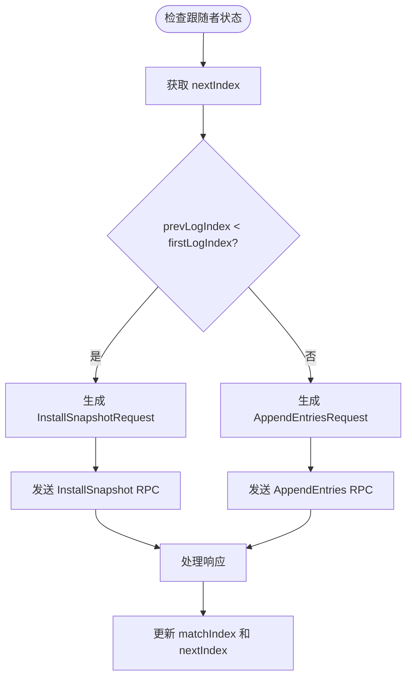

**图表来源**
- [raft.go](file://raft/raft.go#L368-L397)
- [raft.go](file://raft/raft.go#L451-L460)

#### 2. 跟随者快照接收

跟随者节点通过 `InstallSnapshot()` 方法接收快照：

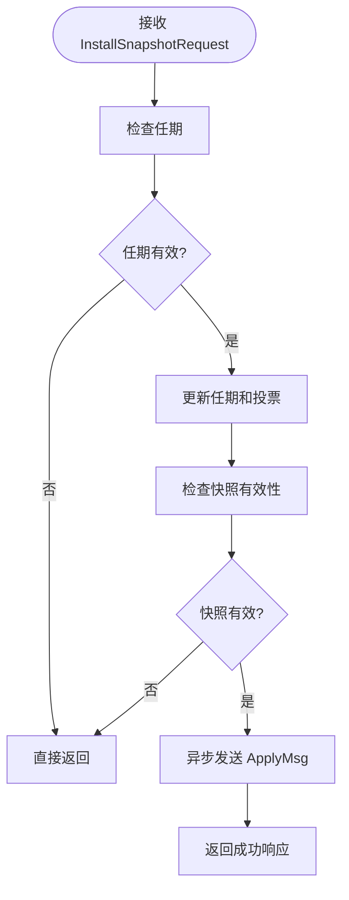

**图表来源**
- [raft.go](file://raft/raft.go#L243-L275)

#### 3. 快照有效性验证

快照的有效性验证由 `CondInstallSnapshot()` 方法执行：

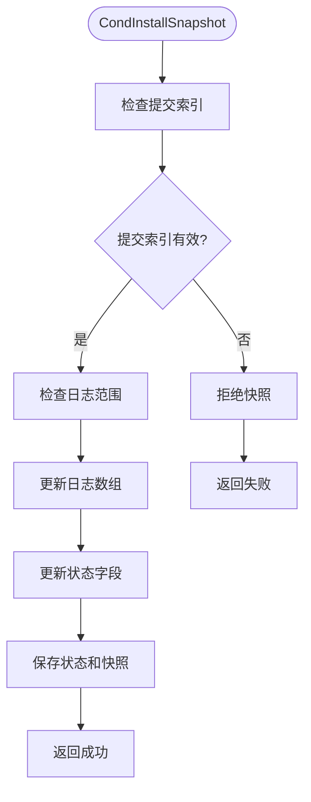

**图表来源**
- [raft.go](file://raft/raft.go#L120-L144)

**章节来源**
- [raft.go](file://raft/raft.go#L243-L275)
- [raft.go](file://raft/raft.go#L120-L144)
- [raft.go](file://raft/raft.go#L368-L397)

### 快照与日志的关系

快照与日志的关系体现在以下几个方面：

#### 1. 快照边界维护

快照通过维护日志边界来确保一致性：

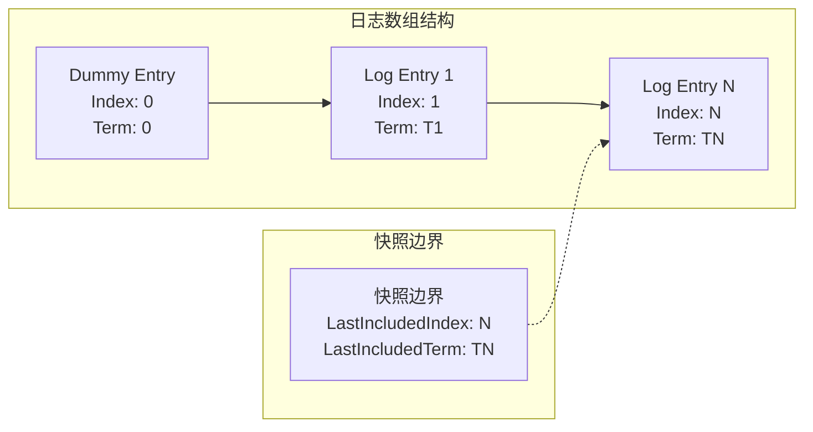

**图表来源**
- [raft.go](file://raft/raft.go#L51-L52)
- [raft.go](file://raft/raft.go#L137-L139)

#### 2. 日志压缩机制

日志压缩通过截断无效的日志条目来减少存储空间：

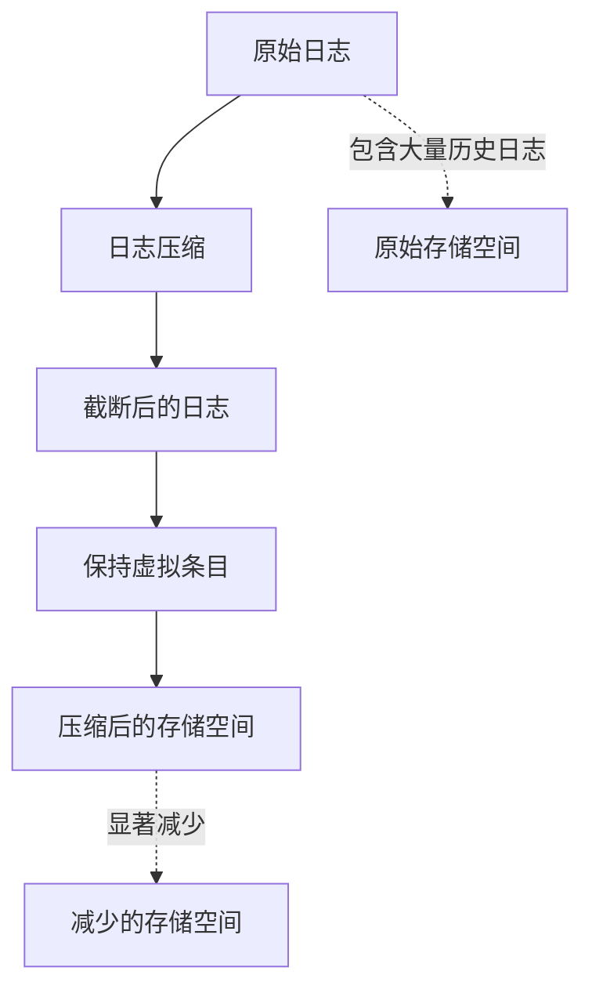

**图表来源**
- [raft.go](file://raft/raft.go#L159-L163)
- [util.go](file://raft/util.go#L97-L105)

#### 3. 存储空间优化

存储空间优化通过原子操作确保数据一致性：

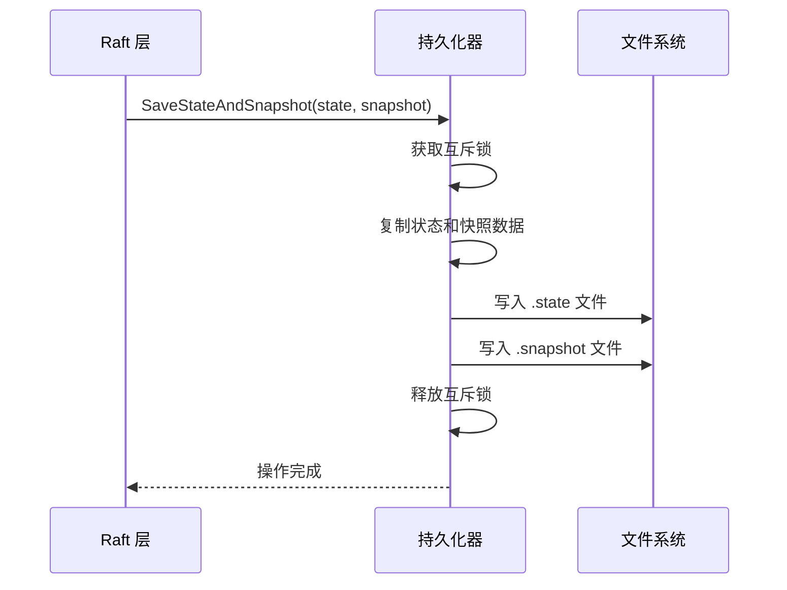

**图表来源**
- [persister.go](file://raft/persister.go#L90-L98)

**章节来源**
- [raft.go](file://raft/raft.go#L51-L52)
- [raft.go](file://raft/raft.go#L159-L163)
- [persister.go](file://raft/persister.go#L90-L98)

### 快照安装的异步处理

快照安装采用异步处理机制，通过 ApplyMsg 通知机制实现：

#### 1. ApplyMsg 通知机制

ApplyMsg 结构体定义了快照通知的消息格式：

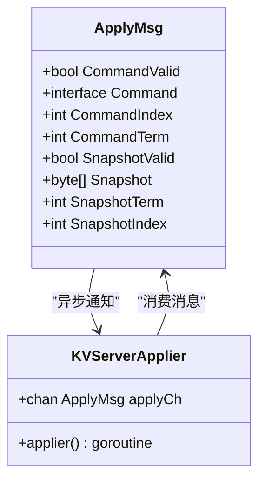

**图表来源**
- [util.go](file://raft/util.go#L21-L41)
- [server.go](file://kvraft/server.go#L177-L236)

#### 2. 状态机恢复

状态机恢复过程包括数据解码和状态重建：

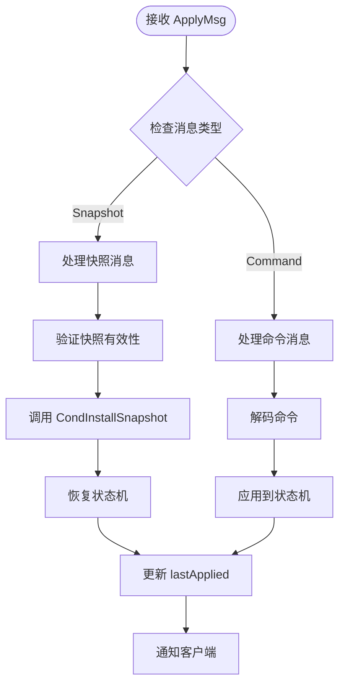

**图表来源**
- [server.go](file://kvraft/server.go#L177-L236)
- [server.go](file://kvraft/server.go#L224-L230)

#### 3. 日志重建

日志重建确保跟随者能够正确重建其日志状态：

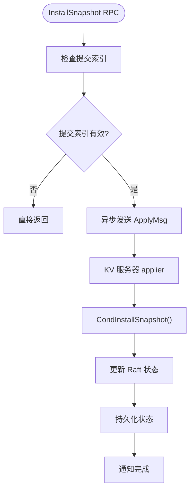

**图表来源**
- [raft.go](file://raft/raft.go#L267-L275)
- [raft.go](file://raft/raft.go#L120-L144)

**章节来源**
- [util.go](file://raft/util.go#L21-L41)
- [server.go](file://kvraft/server.go#L177-L236)
- [raft.go](file://raft/raft.go#L267-L275)

## 依赖关系分析

快照管理机制涉及多个组件之间的复杂依赖关系：

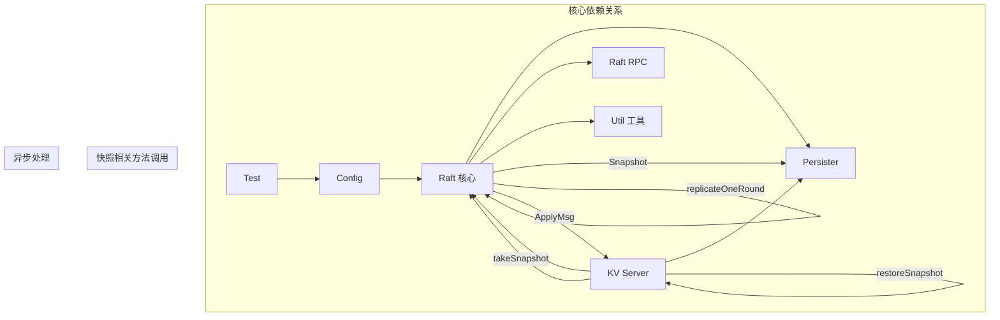

**图表来源**
- [raft.go](file://raft/raft.go#L85-L87)
- [raft.go](file://raft/raft.go#L120-L144)
- [server.go](file://kvraft/server.go#L238-L258)

**章节来源**
- [raft.go](file://raft/raft.go#L85-L87)
- [raft.go](file://raft/raft.go#L120-L144)
- [server.go](file://kvraft/server.go#L238-L258)

## 性能考虑

快照管理机制在性能方面的考虑包括：

### 存储空间优化
- **日志压缩**：通过定期截断历史日志减少存储空间占用
- **原子持久化**：使用 `SaveStateAndSnapshot` 确保状态和快照的一致性
- **内存管理**：使用 `shrinkEntriesArray` 优化内存使用

### 并发性能
- **异步处理**：快照安装采用异步方式，避免阻塞主流程
- **互斥锁保护**：合理使用互斥锁确保线程安全
- **批量操作**：支持批量复制和应用操作

### 网络效率
- **增量同步**：只传输必要的日志条目
- **冲突检测**：通过冲突索引快速定位不一致点
- **心跳机制**：维持领导者的活跃状态

## 故障排除指南

### 常见问题及解决方案

#### 快照创建失败
**问题描述**：快照创建过程中出现错误
**可能原因**：
- 快照索引无效（小于当前快照索引）
- 状态机数据编码失败
- 持久化操作异常

**解决方法**：
1. 检查快照索引的有效性
2. 验证状态机数据完整性
3. 确认持久化文件写入权限

#### 快照安装失败
**问题描述**：跟随者无法正确安装接收到的快照
**可能原因**：
- 快照提交索引过期
- 快照数据损坏
- 状态机恢复失败

**解决方法**：
1. 验证快照的提交索引
2. 检查快照数据的完整性
3. 确认状态机恢复过程

#### 日志截断异常
**问题描述**：日志截断后出现不一致
**可能原因**：
- 截断逻辑错误
- 索引计算错误
- 状态更新不完整

**解决方法**：
1. 检查日志边界计算
2. 验证索引映射关系
3. 确认状态字段更新

**章节来源**
- [raft.go](file://raft/raft.go#L150-L164)
- [raft.go](file://raft/raft.go#L120-L144)
- [server.go](file://kvraft/server.go#L260-L279)

## 结论

快照管理机制是 Raft 实现中的关键特性，它通过以下方式提升了系统的整体性能和可靠性：

1. **存储空间优化**：通过定期截断历史日志和保存状态机快照，有效控制存储空间增长
2. **系统可用性提升**：异步处理机制确保快照操作不会阻塞正常的日志复制和提交流程
3. **数据一致性保证**：严格的快照验证和原子持久化操作确保数据完整性
4. **网络效率优化**：智能的日志压缩和增量同步机制减少了网络传输开销

该实现展示了分布式系统中快照管理的最佳实践，为构建大规模、高可用的分布式系统提供了坚实的技术基础。通过合理的触发条件、严格的验证机制和高效的异步处理，快照管理机制能够在保证数据一致性的同时，最大化系统的性能表现。