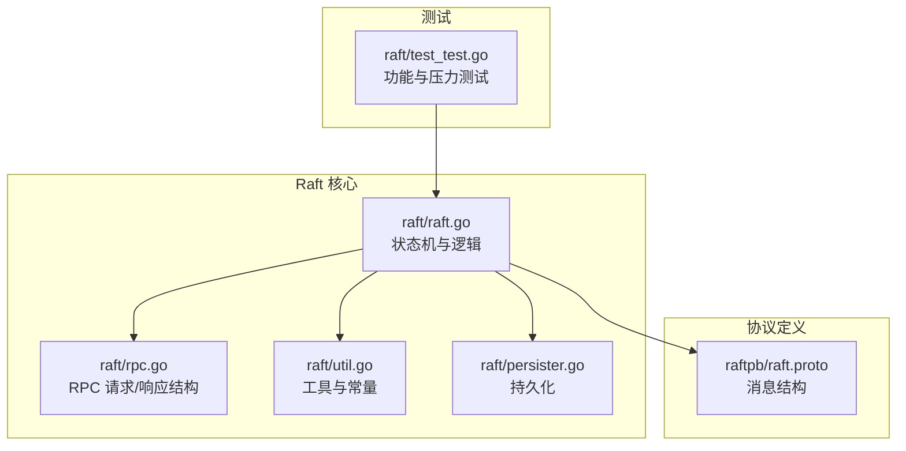
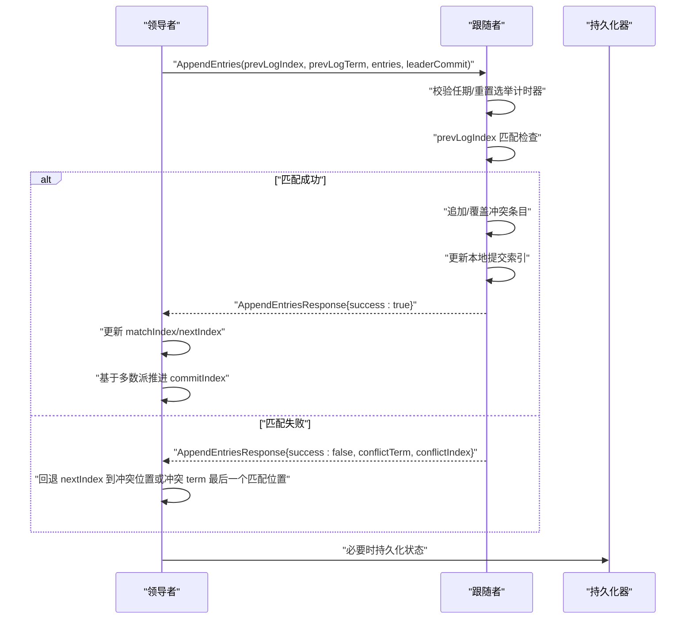
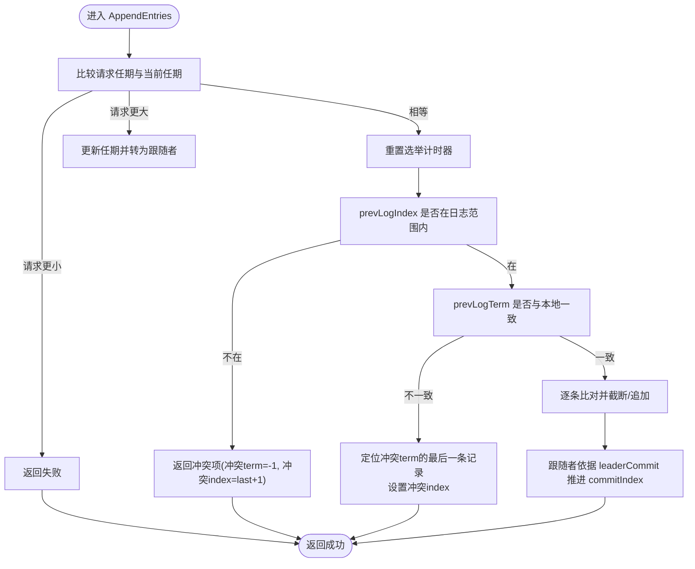
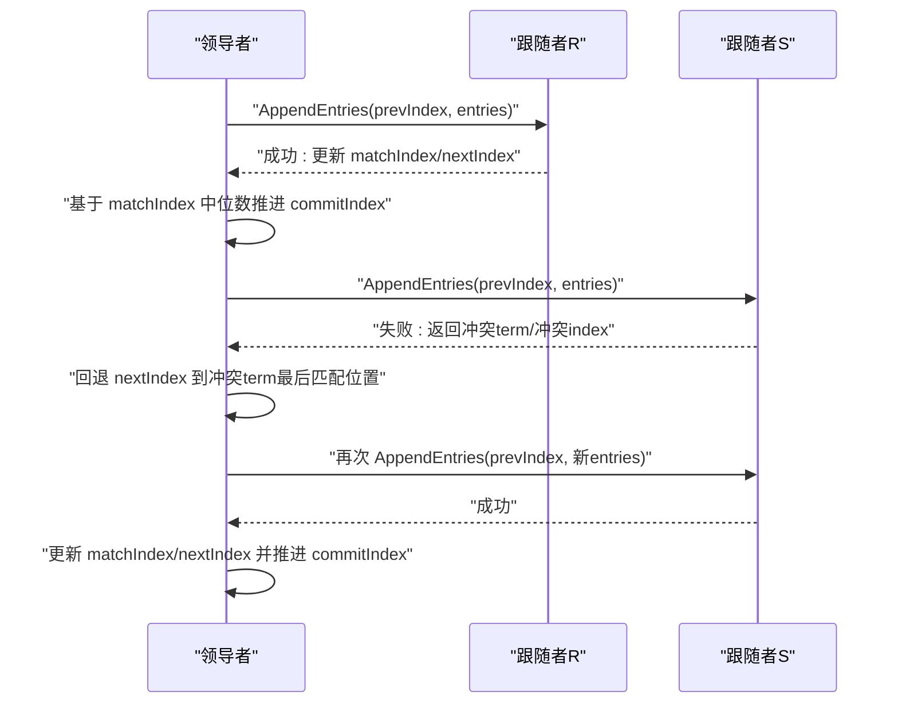
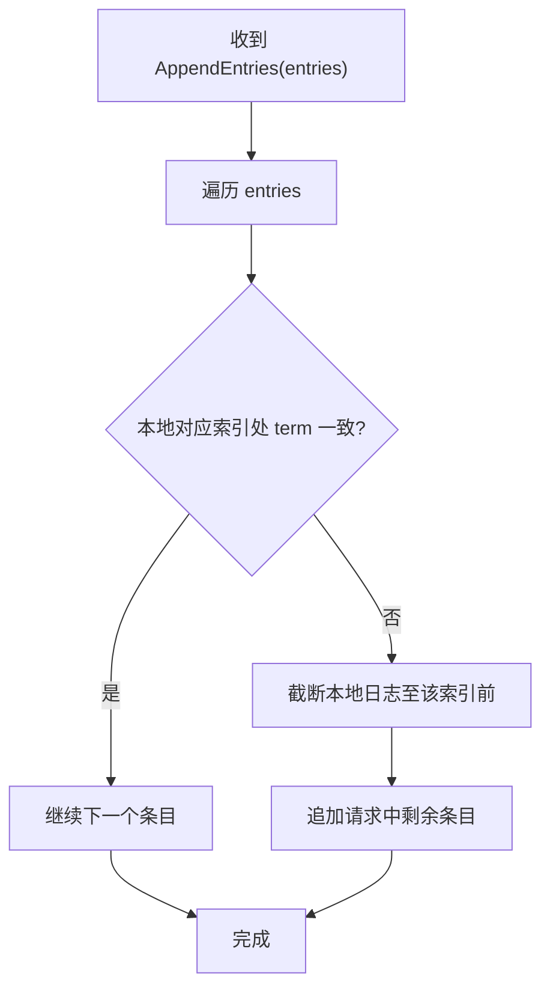
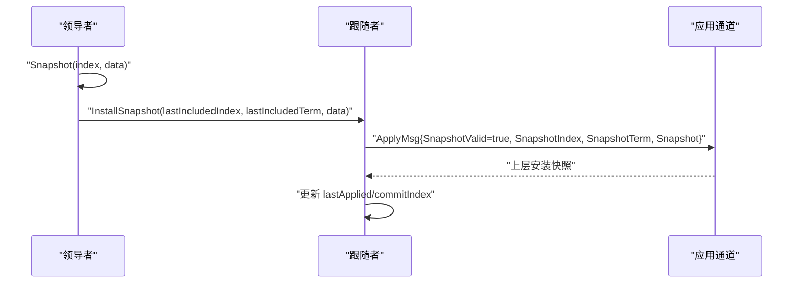
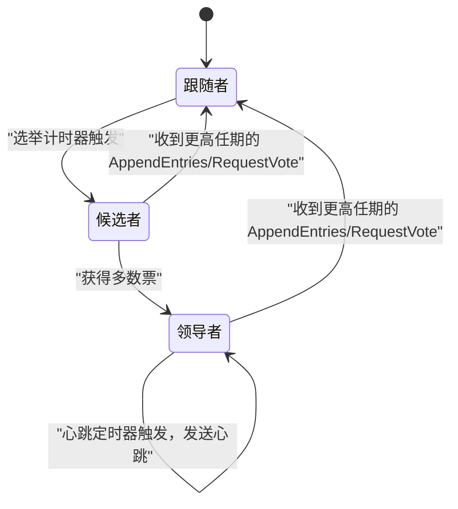
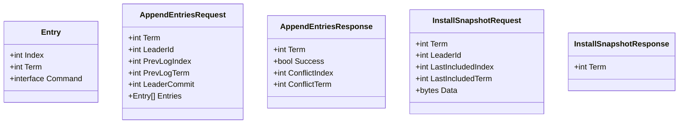
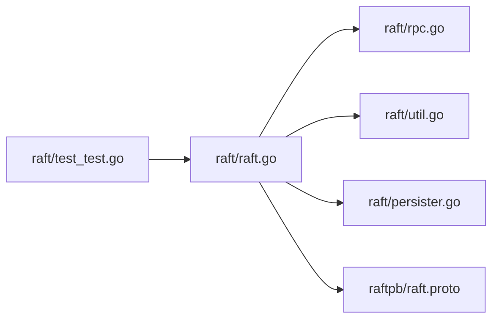

# 日志复制算法

## 目录
1. [简介](#简介)
2. [项目结构](#项目结构)
3. [核心组件](#核心组件)
4. [架构总览](#架构总览)
5. [详细组件分析](#详细组件分析)
6. [依赖关系分析](#依赖关系分析)
7. [性能考量](#性能考量)
8. [故障排查指南](#故障排查指南)
9. [结论](#结论)

## 简介
本文件系统性阐述该 Raft 实现中的日志复制算法，重点围绕 AppendEntries RPC 的处理流程：日志匹配检查、冲突检测与解决、日志条目追加机制；详细解释领导者与跟随者的日志同步（nextIndex/matchIndex 管理、批量复制优化、复制进度跟踪）；分析日志一致性保证（日志条目覆盖规则、冲突回溯算法、日志截断机制）；解释心跳机制（心跳包发送、超时检测、领导者保持）。文末提供时序图、状态同步图，并通过具体代码路径示例展示数据结构变化与 RPC 交互。

## 项目结构
该仓库采用分层组织方式：
- raft 层：核心 Raft 状态机、RPC 定义与实现、持久化、定时器与协程调度
- raftpb 层：基于 protobuf 的消息定义
- 测试层：覆盖选举、日志复制、快照等场景的单元测试

**图表来源**
- [raft/raft.go](file://raft/raft.go#L1-L726)
- [raft/rpc.go](file://raft/rpc.go#L1-L68)
- [raft/util.go](file://raft/util.go#L1-L115)
- [raft/persister.go](file://raft/persister.go#L1-L111)
- [raftpb/raft.proto](file://raftpb/raft.proto#L1-L58)
- [raft/test_test.go](file://raft/test_test.go#L1-L200)

**章节来源**
- [raft/raft.go](file://raft/raft.go#L1-L726)
- [raft/rpc.go](file://raft/rpc.go#L1-L68)
- [raft/util.go](file://raft/util.go#L1-L115)
- [raft/persister.go](file://raft/persister.go#L1-L111)
- [raftpb/raft.proto](file://raftpb/raft.proto#L1-L58)
- [raft/test_test.go](file://raft/test_test.go#L1-L200)

## 核心组件
- Raft 结构体：维护当前任期、投票对象、日志数组、提交索引、应用索引、nextIndex/matchIndex 数组、状态机状态、定时器、持久化器、应用通道等
- RPC 结构：RequestVoteRequest/Response、AppendEntriesRequest/Response、InstallSnapshotRequest/Response
- 工具与常量：节点状态枚举、Entry 结构、心跳/选举超时、插入排序、数组收缩等
- 持久化：保存 Raft 状态与快照，支持原子写入

**章节来源**
- [raft/raft.go](file://raft/raft.go#L37-L60)
- [raft/rpc.go](file://raft/rpc.go#L5-L67)
- [raft/util.go](file://raft/util.go#L43-L115)
- [raft/persister.go](file://raft/persister.go#L17-L111)

## 架构总览
Raft 节点在启动后初始化状态与定时器，进入跟随者状态。领导者周期性发送心跳（AppendEntries）维持权威；跟随者收到心跳重置选举计时器。领导者为每个跟随者维护 nextIndex 与 matchIndex，按需发送日志条目或快照，根据响应更新复制进度并推进提交。

**图表来源**
- [raft/raft.go](file://raft/raft.go#L189-L241)
- [raft/raft.go](file://raft/raft.go#L423-L449)
- [raft/raft.go](file://raft/raft.go#L368-L397)
- [raft/raft.go](file://raft/raft.go#L409-L421)

## 详细组件分析

### AppendEntries RPC 处理流程
- 任期检查与状态转换：若请求任期大于当前任期则更新并转为跟随者；若小于则直接拒绝
- 心跳处理：重置选举计时器，确保领导者持续性
- 日志匹配检查：prevLogIndex 必须落在当前日志范围内；prevLogTerm 必须与本地一致
- 冲突检测与解决：
  - 若 prevLogIndex 超出范围，返回冲突项（冲突 term=-1，冲突索引为本地 last+1）
  - 否则根据本地 term 回溯，定位冲突 term 的最后一条记录，将冲突索引设为该位置
- 日志条目追加机制：遍历请求中的条目，若发现不一致则截断并追加剩余条目
- 提交推进：跟随者依据 leaderCommit 推进本地 commitIndex，并通知应用协程

**图表来源**
- [raft/raft.go](file://raft/raft.go#L189-L241)
- [raft/raft.go](file://raft/raft.go#L213-L236)
- [raft/raft.go](file://raft/raft.go#L517-L524)

**章节来源**
- [raft/raft.go](file://raft/raft.go#L189-L241)
- [raft/raft.go](file://raft/raft.go#L213-L236)
- [raft/raft.go](file://raft/raft.go#L517-L524)

### 领导者与跟随者的日志同步
- nextIndex/matchIndex 管理：
  - 初始化：跟随者加入集群时 nextIndex 设为领导者 lastLog+1，matchIndex 为 0
  - 追加成功：matchIndex 更新为 prevIndex+len(entries)，nextIndex=matchIndex+1
  - 追加失败：若响应包含冲突 term，则回退到冲突 term 最后一个匹配位置；否则直接回退到冲突索引
- 批量复制优化：领导者使用条件变量唤醒复制协程，批量发送日志条目，减少 RPC 次数
- 复制进度跟踪：领导者基于 matchIndex 的中位数推进 commitIndex，仅允许当前任期的日志被提交

**图表来源**
- [raft/raft.go](file://raft/raft.go#L423-L449)
- [raft/raft.go](file://raft/raft.go#L497-L514)
- [raft/raft.go](file://raft/raft.go#L368-L397)

**章节来源**
- [raft/raft.go](file://raft/raft.go#L423-L449)
- [raft/raft.go](file://raft/raft.go#L497-L514)
- [raft/raft.go](file://raft/raft.go#L368-L397)

### 日志一致性保证
- 日志条目覆盖规则：当请求中某条目的索引处存在但 term 不一致时，从该索引开始截断并追加请求中的剩余条目
- 冲突回溯算法：通过冲突 term 向前回退，找到该 term 的最后一条记录作为新的 nextIndex，确保后续能逐步对齐
- 日志截断机制：在领导者侧，一旦发现不一致立即截断并追加；在跟随者侧，先定位冲突再截断

**图表来源**
- [raft/raft.go](file://raft/raft.go#L230-L236)

**章节来源**
- [raft/raft.go](file://raft/raft.go#L230-L236)

### 快照与 InstallSnapshot
- 快照触发：上层服务调用 Snapshot(index, data) 将旧日志截断并保存快照
- 条件安装：跟随者收到 InstallSnapshot 请求后，若索引落后且未过期，通过 applyCh 通知上层进行快照安装
- 快照安装后：跟随者更新其 lastApplied/commitIndex，并恢复状态

**图表来源**
- [raft/raft.go](file://raft/raft.go#L150-L164)
- [raft/raft.go](file://raft/raft.go#L243-L275)
- [raft/raft.go](file://raft/raft.go#L120-L144)

**章节来源**
- [raft/raft.go](file://raft/raft.go#L150-L164)
- [raft/raft.go](file://raft/raft.go#L243-L275)
- [raft/raft.go](file://raft/raft.go#L120-L144)

### 心跳机制
- 心跳包发送：领导者在心跳定时器到期时广播心跳（AppendEntries），携带当前 commitIndex
- 超时检测：跟随者收到心跳后重置选举计时器；领导者在心跳间隔内持续发送以维持权威
- 领导者保持：心跳期间不改变状态；若选举计时器触发则发起选举

**图表来源**
- [raft/raft.go](file://raft/raft.go#L616-L635)
- [raft/raft.go](file://raft/raft.go#L353-L366)
- [raft/util.go](file://raft/util.go#L84-L95)

**章节来源**
- [raft/raft.go](file://raft/raft.go#L616-L635)
- [raft/raft.go](file://raft/raft.go#L353-L366)
- [raft/util.go](file://raft/util.go#L84-L95)

### 数据结构与 RPC 定义
- Entry：包含索引、任期、命令
- AppendEntriesRequest/Response：包含任期、领导者 ID、prevLogIndex/prevLogTerm、entries、leaderCommit、冲突信息
- InstallSnapshotRequest/Response：包含任期、领导者 ID、lastIncludedIndex/lastIncludedTerm、快照数据

**图表来源**
- [raft/rpc.go](file://raft/rpc.go#L5-L67)
- [raftpb/raft.proto](file://raftpb/raft.proto#L7-L51)

**章节来源**
- [raft/rpc.go](file://raft/rpc.go#L5-L67)
- [raftpb/raft.proto](file://raftpb/raft.proto#L7-L51)

## 依赖关系分析
- Raft 结构体依赖持久化器进行状态与快照的读写
- RPC 结构体与 protobuf 定义一一对应，用于跨进程通信
- 工具模块提供超时控制、排序与数组管理等基础能力
- 测试模块验证日志复制、快照与线性一致性

**图表来源**
- [raft/raft.go](file://raft/raft.go#L1-L726)
- [raft/rpc.go](file://raft/rpc.go#L1-L68)
- [raft/util.go](file://raft/util.go#L1-L115)
- [raft/persister.go](file://raft/persister.go#L1-L111)
- [raftpb/raft.proto](file://raftpb/raft.proto#L1-L58)
- [raft/test_test.go](file://raft/test_test.go#L1-L200)

**章节来源**
- [raft/raft.go](file://raft/raft.go#L1-L726)
- [raft/rpc.go](file://raft/rpc.go#L1-L68)
- [raft/util.go](file://raft/util.go#L1-L115)
- [raft/persister.go](file://raft/persister.go#L1-L111)
- [raftpb/raft.proto](file://raftpb/raft.proto#L1-L58)
- [raft/test_test.go](file://raft/test_test.go#L1-L200)

## 性能考量
- 批量复制：通过条件变量批量触发复制，降低 RPC 次数
- 数组收缩：避免日志数组过度占用内存
- 插入排序：计算中位数推进提交索引时使用插入排序，时间复杂度 O(n^2)，在多数节点数较小场景可接受
- 快照：定期截断日志并保存快照，控制日志大小增长

[本节为通用性能讨论，无需特定文件来源]

## 故障排查指南
- 日志不一致：检查 AppendEntries 处理中的冲突回溯逻辑是否正确设置 nextIndex
- 提交异常：确认领导者基于 matchIndex 中位数推进 commitIndex 的条件（当前任期 term 一致）
- 快照安装：确认 InstallSnapshot 请求的 lastIncludedIndex/term 与本地 commitIndex 关系判断
- 心跳丢失：检查心跳定时器与选举定时器配置，确保网络延迟合理

**章节来源**
- [raft/raft.go](file://raft/raft.go#L423-L449)
- [raft/raft.go](file://raft/raft.go#L497-L514)
- [raft/raft.go](file://raft/raft.go#L243-L275)
- [raft/util.go](file://raft/util.go#L84-L95)

## 结论
该实现完整实现了 Raft 日志复制的核心流程：通过 AppendEntries 的严格匹配与冲突回溯，结合 nextIndex/matchIndex 的动态维护，确保领导者与跟随者日志最终一致；心跳机制保障领导者权威；快照机制有效控制日志规模。测试用例覆盖了基本一致性、快照与线性一致性验证，为生产级部署提供了坚实基础。