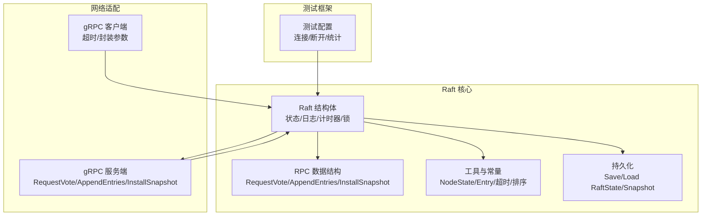
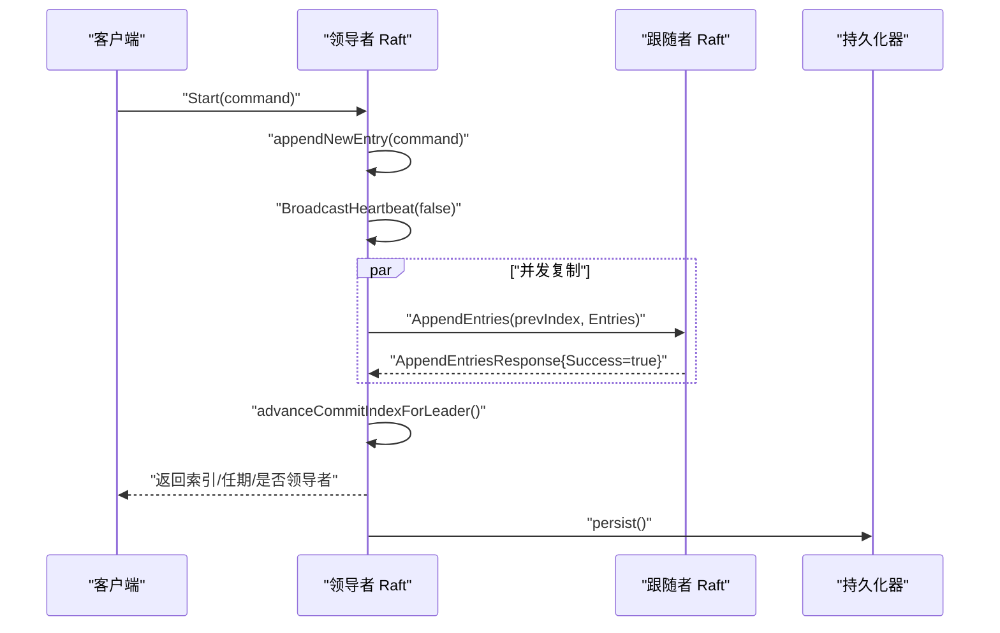
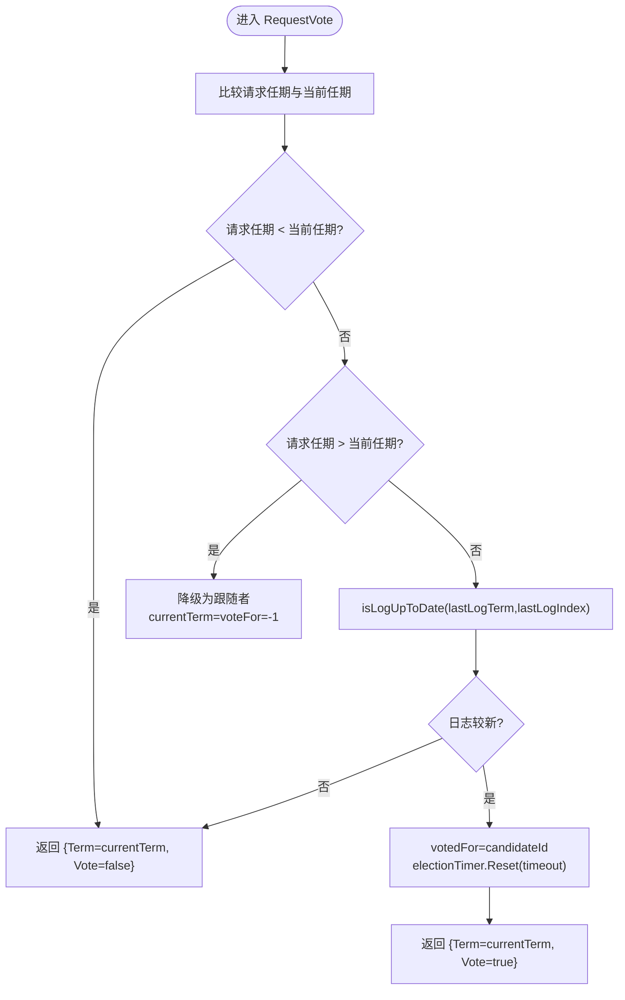
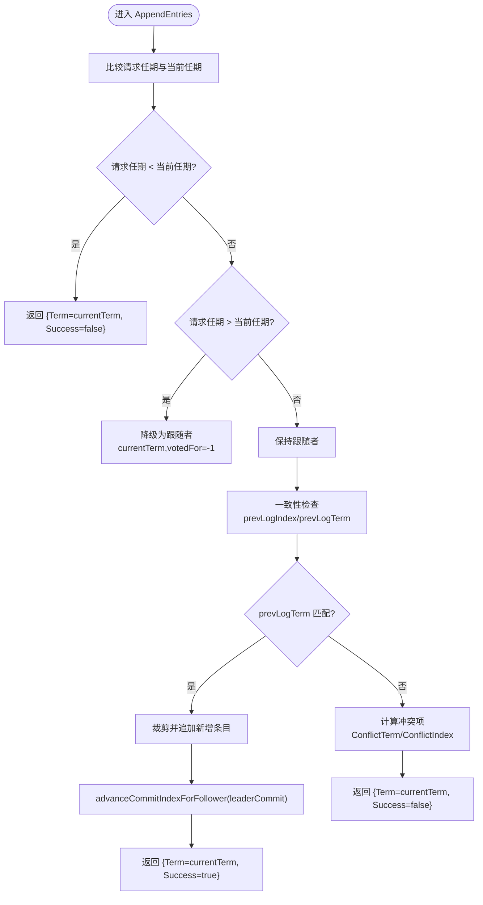
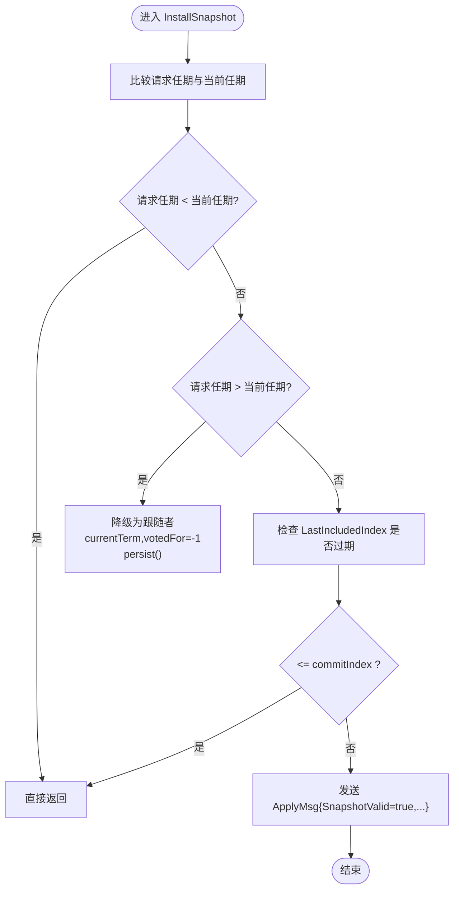
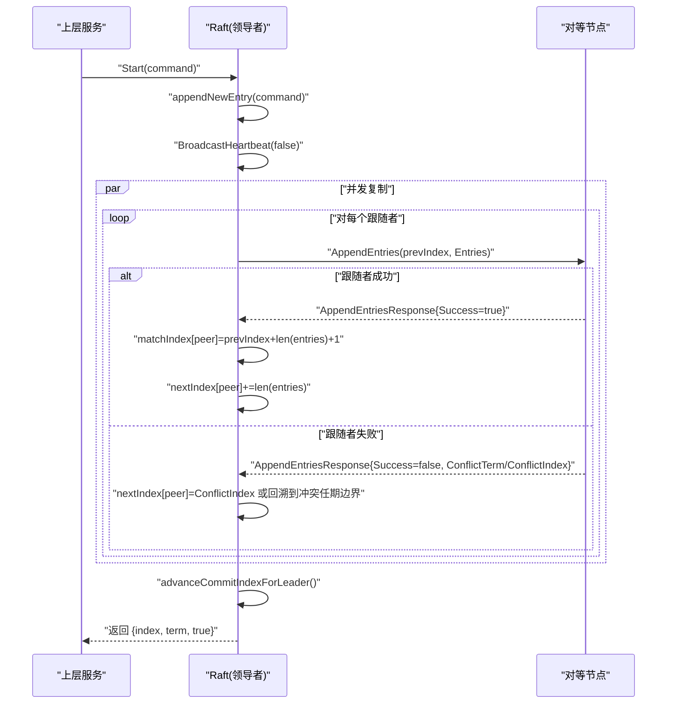
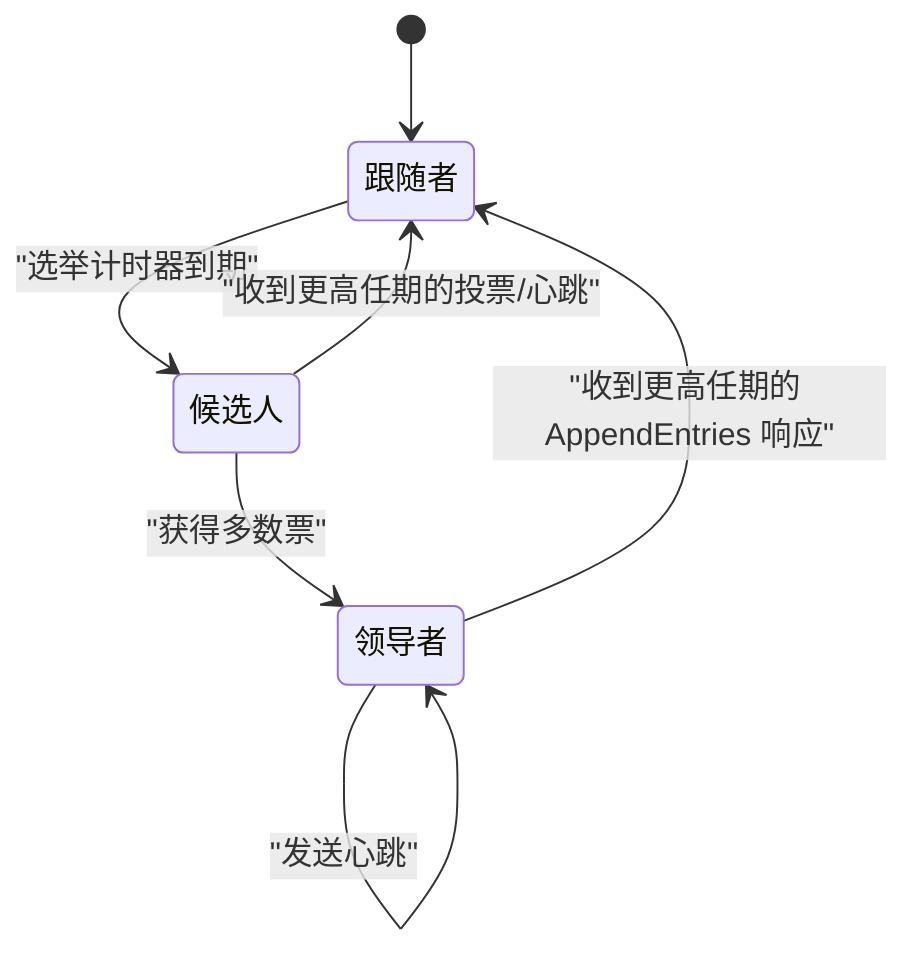
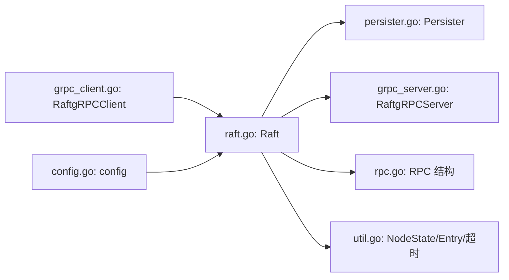

# 核心算法实现

## 目录
1. [简介](#简介)
2. [项目结构](#项目结构)
3. [核心组件](#核心组件)
4. [架构总览](#架构总览)
5. [详细组件分析](#详细组件分析)
6. [依赖关系分析](#依赖关系分析)
7. [性能考量](#性能考量)
8. [故障排查指南](#故障排查指南)
9. [结论](#结论)
10. [附录](#附录)

## 简介
本文件面向 Raft 共识算法的核心实现，聚焦以下目标：
- 深入解析三个核心 RPC 方法：RequestVote（请求投票）、AppendEntries（附加日志条目）、InstallSnapshot（安装快照）
- 详解 Start 方法的实现流程：领导者选举、日志复制、提交确认
- 分析状态转换机制：候选人状态、领导者状态、跟随者状态之间的转换条件与触发时机
- 解释选举算法：随机超时机制、投票规则、任期管理
- 解释日志复制算法：一致性检查、冲突解决、批量复制
- 提供算法流程图、状态转换图与时序图
- 给出具体代码路径与调用关系说明

## 项目结构
Raft 实现位于 raft 子目录，采用“按功能分层”的组织方式：
- raft/raft.go：Raft 核心状态机、定时器、RPC 处理、领导者复制、提交与应用
- raft/rpc.go：RPC 请求/响应数据结构定义
- raft/util.go：通用类型、常量、工具函数（状态枚举、排序、随机超时等）
- raft/config.go：测试配置与辅助逻辑（用于测试框架）
- raft/persister.go：持久化存储抽象（Raft 状态与快照）
- raft/grpc_server.go：gRPC 服务端适配器（将内部结构映射到 protobuf）
- raft/grpc_client.go：gRPC 客户端适配器（将内部结构映射到 protobuf）
- raft/test_test.go：Raft 单元测试与压力测试样例

图表来源
- [raft.go](file://raft/raft.go#L36-L116)
- [rpc.go](file://raft/rpc.go#L5-L67)
- [util.go](file://raft/util.go#L43-L95)
- [persister.go](file://raft/persister.go#L17-L110)
- [grpc_server.go](file://raft/grpc_server.go#L9-L73)
- [grpc_client.go](file://raft/grpc_client.go#L14-L106)
- [config.go](file://raft/config.go#L44-L106)

章节来源
- [raft.go](file://raft/raft.go#L36-L116)
- [rpc.go](file://raft/rpc.go#L5-L67)
- [util.go](file://raft/util.go#L43-L95)
- [persister.go](file://raft/persister.go#L17-L110)
- [grpc_server.go](file://raft/grpc_server.go#L9-L73)
- [grpc_client.go](file://raft/grpc_client.go#L14-L106)
- [config.go](file://raft/config.go#L44-L106)

## 核心组件
- Raft 结构体：维护当前节点的状态（状态、任期、投票对象）、日志数组、提交索引、已应用索引、nextIndex/matchIndex 数组、两个计时器（选举/心跳）、持久化器、应用通道与条件变量等
- RPC 接口：RequestVote、AppendEntries、InstallSnapshot 的请求/响应结构
- 工具与常量：节点状态枚举、日志条目结构、稳定心跳与随机选举超时、插入排序、数组收缩策略
- gRPC 适配器：服务端将内部结构映射为 protobuf 响应；客户端将内部结构映射为 protobuf 请求并设置超时
- 测试配置：连接/断开网络、统计 RPC 数量与字节数、等待多数派提交、检查一致性

章节来源
- [raft.go](file://raft/raft.go#L36-L116)
- [rpc.go](file://raft/rpc.go#L5-L67)
- [util.go](file://raft/util.go#L43-L114)
- [grpc_server.go](file://raft/grpc_server.go#L9-L73)
- [grpc_client.go](file://raft/grpc_client.go#L14-L106)
- [config.go](file://raft/config.go#L44-L106)

## 架构总览
Raft 节点通过 gRPC 与对等节点通信，内部以状态机驱动：
- 定时器驱动：选举计时器在跟随者/候选人状态下工作；心跳计时器仅在领导者下工作
- RPC 处理：接收来自其他节点的 RPC 并更新本地状态
- 日志复制：领导者向跟随者批量复制日志条目，基于冲突回退与匹配索引推进
- 提交与应用：根据多数派匹配索引推进提交，应用线程保证每条日志只应用一次

图表来源
- [raft.go](file://raft/raft.go#L581-L591)
- [raft.go](file://raft/raft.go#L353-L366)
- [raft.go](file://raft/raft.go#L497-L514)
- [raft.go](file://raft/raft.go#L85-L87)

章节来源
- [raft.go](file://raft/raft.go#L581-L591)
- [raft.go](file://raft/raft.go#L353-L366)
- [raft.go](file://raft/raft.go#L497-L514)
- [raft.go](file://raft/raft.go#L85-L87)

## 详细组件分析

### RequestVote（请求投票）RPC
职责与流程
- 验证请求任期与自身任期关系，必要时降级为跟随者并重置选举计时器
- 判断候选人的日志是否至少与自己一样新（按最后日志项的任期与索引比较）
- 若满足条件则投赞成票并记录投票对象，同时重置选举计时器
- 返回当前任期与投票结果

图表来源
- [raft.go](file://raft/raft.go#L166-L187)
- [raft.go](file://raft/raft.go#L535-L538)

章节来源
- [raft.go](file://raft/raft.go#L166-L187)
- [raft.go](file://raft/raft.go#L535-L538)

### AppendEntries（附加日志条目）RPC
职责与流程
- 处理任期不一致：若请求任期小于当前任期直接拒绝；若大于则降级为跟随者并重置计时器
- 一致性检查：若 prevLogIndex 小于最小日志索引，直接拒绝；否则检查 prevLogTerm 是否匹配
- 冲突处理：若不匹配，计算冲突项的任期与索引，返回给领导者以便回退
- 追加与裁剪：将请求中新增的日志条目追加到本地日志，覆盖冲突部分
- 提交推进：依据请求中的 leaderCommit 推进本地 commitIndex，并通知应用线程

图表来源
- [raft.go](file://raft/raft.go#L189-L241)
- [raft.go](file://raft/raft.go#L213-L236)
- [raft.go](file://raft/raft.go#L517-L524)

章节来源
- [raft.go](file://raft/raft.go#L189-L241)
- [raft.go](file://raft/raft.go#L213-L236)
- [raft.go](file://raft/raft.go#L517-L524)

### InstallSnapshot（安装快照）RPC
职责与流程
- 若请求任期小于当前任期直接忽略
- 若请求任期大于当前任期，降级为跟随者并重置计时器
- 若请求的快照索引已过期（<= commitIndex），直接忽略
- 否则通过 applyCh 发送快照消息，由上层服务决定是否接受并更新本地状态

图表来源
- [raft.go](file://raft/raft.go#L243-L275)

章节来源
- [raft.go](file://raft/raft.go#L243-L275)

### Start 方法：领导者选举、日志复制、提交确认
Start 的职责
- 仅领导者可执行
- 在本地日志末尾追加新条目，更新 matchIndex 与 nextIndex
- 触发广播心跳（非心跳模式）以启动复制流程
- 返回命令索引、任期与是否领导者

领导者选举流程
- 定时器到期后，跟随者变为候选人，任期自增，发起选举
- 投票收集：并行向其他节点发送 RequestVote，累计半数以上同意即成为领导者
- 成功后初始化 nextIndex/matchIndex，启动心跳定时器

日志复制与提交
- 领导者向跟随者批量复制日志，基于 nextIndex/matchIndex 推进
- 跟随者返回成功或失败及冲突信息，领导者据此调整 nextIndex
- 提交推进：根据多数派 matchIndex 计算新的 commitIndex，并通知应用线程

图表来源
- [raft.go](file://raft/raft.go#L581-L591)
- [raft.go](file://raft/raft.go#L353-L366)
- [raft.go](file://raft/raft.go#L423-L449)
- [raft.go](file://raft/raft.go#L497-L514)

章节来源
- [raft.go](file://raft/raft.go#L581-L591)
- [raft.go](file://raft/raft.go#L353-L366)
- [raft.go](file://raft/raft.go#L423-L449)
- [raft.go](file://raft/raft.go#L497-L514)

### 状态转换机制：跟随者、候选人、领导者
状态转换条件与触发时机
- 跟随者
  - 收到 AppendEntries/RequestVote 且任期不小于当前任期时保持跟随者
  - 选举计时器到期时转为候选人
- 候选人
  - 自增任期并投自己一票，向其他节点发起选举
  - 收集到多数票后转为领导者
  - 若收到更高任期的 RequestVote 响应则降级为跟随者
- 领导者
  - 定时发送心跳维持权威
  - 若收到更高任期的 AppendEntries 响应则降级为跟随者

图表来源
- [raft.go](file://raft/raft.go#L475-L494)
- [raft.go](file://raft/raft.go#L616-L635)
- [raft.go](file://raft/raft.go#L316-L351)

章节来源
- [raft.go](file://raft/raft.go#L475-L494)
- [raft.go](file://raft/raft.go#L616-L635)
- [raft.go](file://raft/raft.go#L316-L351)

### 选举算法：随机超时、投票规则、任期管理
- 随机超时：选举超时时间在固定区间内随机，避免多个节点同时发起选举
- 投票规则：仅当候选人日志至少与当前节点一样新时才投票
- 任期管理：收到更高任期的 RPC 时立即更新并降级为跟随者，重置投票对象

章节来源
- [util.go](file://raft/util.go#L84-L95)
- [raft.go](file://raft/raft.go#L166-L187)
- [raft.go](file://raft/raft.go#L200-L202)

### 日志复制算法：一致性检查、冲突解决、批量复制
- 一致性检查：通过 prevLogIndex/prevLogTerm 校验边界
- 冲突解决：返回冲突任期与索引，领导者据此回退 nextIndex
- 批量复制：领导者按 nextIndex 生成请求，跟随者逐条匹配并裁剪/追加

章节来源
- [raft.go](file://raft/raft.go#L213-L236)
- [raft.go](file://raft/raft.go#L423-L449)
- [raft.go](file://raft/raft.go#L353-L397)

## 依赖关系分析
- Raft 结构体依赖持久化器进行状态与快照的保存/恢复
- gRPC 服务端/客户端负责将内部结构映射为 protobuf，屏蔽网络细节
- 测试配置模块负责网络连接控制、RPC 统计与多数派等待

图表来源
- [raft.go](file://raft/raft.go#L36-L116)
- [persister.go](file://raft/persister.go#L17-L110)
- [grpc_server.go](file://raft/grpc_server.go#L9-L73)
- [grpc_client.go](file://raft/grpc_client.go#L14-L106)
- [config.go](file://raft/config.go#L44-L106)
- [rpc.go](file://raft/rpc.go#L5-L67)
- [util.go](file://raft/util.go#L43-L95)

章节来源
- [raft.go](file://raft/raft.go#L36-L116)
- [persister.go](file://raft/persister.go#L17-L110)
- [grpc_server.go](file://raft/grpc_server.go#L9-L73)
- [grpc_client.go](file://raft/grpc_client.go#L14-L106)
- [config.go](file://raft/config.go#L44-L106)
- [rpc.go](file://raft/rpc.go#L5-L67)
- [util.go](file://raft/util.go#L43-L95)

## 性能考量
- 日志数组收缩：当长度远小于容量时进行收缩，降低内存占用
- 插入排序：在计算多数派提交索引时使用插入排序，复杂度 O(n^2)，但 n 通常较小（典型集群规模）
- 并发复制：通过独立 goroutine 与条件变量实现批量复制与背压
- 快照：支持上层服务定期生成快照并修剪日志，减少日志体积

章节来源
- [util.go](file://raft/util.go#L97-L114)
- [raft.go](file://raft/raft.go#L497-L514)
- [raft.go](file://raft/raft.go#L666-L678)
- [config.go](file://raft/config.go#L183-L236)

## 故障排查指南
常见问题与定位建议
- 无法成为领导者：检查选举超时是否过长、网络分区导致多数派不足
- 提交停滞：确认多数派 matchIndex 是否推进、是否有更高任期的 AppendEntries 导致降级
- 快照不生效：确认 LastIncludedIndex 是否落后于 commitIndex、上层服务是否调用 CondInstallSnapshot
- 应用重复或丢失：检查 applyCh 是否被正确唤醒、lastApplied 是否单调递增

章节来源
- [raft.go](file://raft/raft.go#L616-L635)
- [raft.go](file://raft/raft.go#L638-L664)
- [raft.go](file://raft/raft.go#L120-L144)
- [config.go](file://raft/config.go#L183-L236)

## 结论
该实现遵循 Raft 核心思想：强领导者、日志复制与多数派决策。通过清晰的状态机、严格的任期与日志一致性检查、以及高效的批量复制与提交推进机制，实现了高可用与正确性。配合快照与持久化，能够在崩溃后快速恢复并保持数据一致性。

## 附录
- gRPC 服务端/客户端映射：请求/响应字段一一对应，注意数据类型转换（如 Command 的编码）
- 测试用例参考：通过测试配置模块模拟网络故障、并发提交、多数派等待等场景

章节来源
- [grpc_server.go](file://raft/grpc_server.go#L18-L73)
- [grpc_client.go](file://raft/grpc_client.go#L28-L106)
- [test_test.go](file://raft/test_test.go#L24-L53)