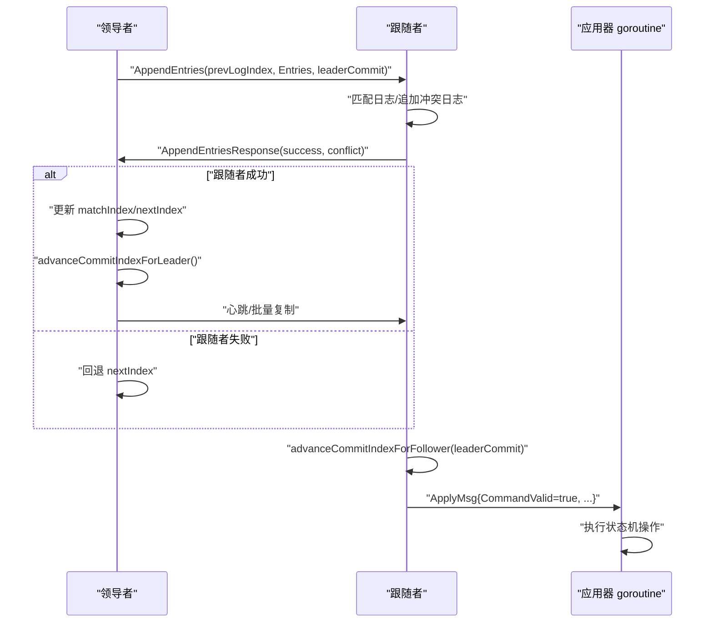

# 状态机提交机制

<cite>
**本文引用的文件列表**
- [raft/raft.go](file://raft/raft.go)
- [raft/rpc.go](file://raft/rpc.go)
- [raft/util.go](file://raft/util.go)
- [raft/persister.go](file://raft/persister.go)
- [raft/config.go](file://raft/config.go)
- [kvraft/server.go](file://kvraft/server.go)
- [shardkv/server.go](file://shardkv/server.go)
</cite>

## 目录
1. [简介](#简介)
2. [项目结构](#项目结构)
3. [核心组件](#核心组件)
4. [架构总览](#架构总览)
5. [详细组件分析](#详细组件分析)
6. [依赖关系分析](#依赖关系分析)
7. [性能考量](#性能考量)
8. [故障排查指南](#故障排查指南)
9. [结论](#结论)
10. [附录](#附录)

## 简介
本文件系统化阐述 Raft 状态机提交机制，重点覆盖：
- 领导者端提交计算（基于 matchIndex 排序取中位数，仅在当前任期内日志可提交）
- 跟随者端提交更新（基于 leaderCommit 参数）
- 提交安全性保证（任期一致性与单调性）
- 应用器 goroutine 工作流（提交索引监控、日志应用调度、ApplyMsg 消息生成）
- 快照机制对提交的影响（截断后提交索引重置、服务层快照安装处理）

同时给出提交流程图与时序图，并通过“代码片段路径”指引定位到具体实现位置，便于读者对照源码深入理解。

## 项目结构
围绕提交机制的关键模块分布如下：
- raft 层：Raft 核心状态、提交推进、快照、RPC 请求/响应定义、持久化
- kvraft/shardkv 层：服务侧应用器 goroutine，接收 ApplyMsg 并执行状态机操作
- 测试与配置：用于验证提交正确性与线性一致性的工具

图表来源
- [raft/raft.go](file://raft/raft.go#L37-L60)
- [raft/rpc.go](file://raft/rpc.go#L5-L67)
- [raft/util.go](file://raft/util.go#L21-L67)
- [raft/persister.go](file://raft/persister.go#L17-L22)
- [kvraft/server.go](file://kvraft/server.go#L176-L210)
- [shardkv/server.go](file://shardkv/server.go#L247-L307)
- [raft/config.go](file://raft/config.go#L44-L63)

章节来源
- [raft/raft.go](file://raft/raft.go#L37-L60)
- [raft/rpc.go](file://raft/rpc.go#L5-L67)
- [raft/util.go](file://raft/util.go#L21-L67)
- [raft/persister.go](file://raft/persister.go#L17-L22)
- [raft/config.go](file://raft/config.go#L44-L63)

## 核心组件
- Raft 结构体与字段
  - 关键字段：commitIndex、lastApplied、matchIndex[]、nextIndex[]、applyCh、applyCond、replicatorCond[]
  - 提交推进：领导者端使用 matchIndex 计算候选提交索引；跟随者端依据 leaderCommit 更新
- ApplyMsg
  - 包含命令有效标志、命令内容、索引、任期，以及快照有效标志、快照数据、索引、任期
- Entry/NodeState
  - 日志条目结构与节点状态枚举
- 持久化
  - 保存 Raft 状态与快照，支持原子写入

章节来源
- [raft/raft.go](file://raft/raft.go#L37-L60)
- [raft/util.go](file://raft/util.go#L21-L67)
- [raft/util.go](file://raft/util.go#L63-L67)
- [raft/persister.go](file://raft/persister.go#L71-L98)

## 架构总览
Raft 提交机制由“领导者推进 + 跟随者同步 + 应用器执行”三部分构成：
- 领导者：根据复制进度 matchIndex 计算新提交索引，仅允许提交当前任期内的日志
- 跟随者：接收 AppendEntries 中的 leaderCommit，按需推进本地 commitIndex
- 应用器：从 applyCh 读取已提交日志，逐条应用到状态机，确保每条日志只应用一次

图表来源
- [raft/raft.go](file://raft/raft.go#L423-L449)
- [raft/raft.go](file://raft/raft.go#L516-L524)
- [raft/raft.go](file://raft/raft.go#L638-L664)
- [raft/rpc.go](file://raft/rpc.go#L25-L43)

## 详细组件分析

### 提交索引推进算法（领导者端）
- 基于 matchIndex 排序取中位数作为候选提交索引
- 仅当候选索引处的日志任期等于当前任期时才允许推进
- 使用条件变量通知应用器 goroutine 进行应用

图表来源
- [raft/raft.go](file://raft/raft.go#L496-L514)
- [raft/util.go](file://raft/util.go#L107-L114)

章节来源
- [raft/raft.go](file://raft/raft.go#L496-L514)
- [raft/util.go](file://raft/util.go#L107-L114)

### 提交索引推进算法（跟随者端）
- 跟随者依据 leaderCommit 与自身最后日志索引，取较小值作为新提交索引
- 通过条件变量唤醒应用器 goroutine

图表来源
- [raft/raft.go](file://raft/raft.go#L516-L524)

章节来源
- [raft/raft.go](file://raft/raft.go#L516-L524)

### 提交安全性保证
- 任期一致性：仅允许提交当前任期内的日志条目，避免跨任期提交
- 单调递增：提交索引严格单调不减，防止回退
- 证据校验：领导者通过 matchIndex 排序取中位数，确保多数派已复制

章节来源
- [raft/raft.go](file://raft/raft.go#L505-L513)
- [raft/raft.go](file://raft/raft.go#L518-L523)

### 应用器 goroutine 工作流程
- 监控 commitIndex 与 lastApplied：若未达到提交索引则等待
- 批量读取待应用日志，生成 ApplyMsg 并发送至服务层
- 原子更新 lastApplied，避免并发 InstallSnapshot 导致回滚

图表来源
- [raft/raft.go](file://raft/raft.go#L638-L664)

章节来源
- [raft/raft.go](file://raft/raft.go#L638-L664)

### 快照机制对提交的影响
- 快照截断后，日志数组重置为包含“虚拟首项”的数组，首项记录快照边界
- 提交索引与 lastApplied 同步到快照边界，确保后续日志可正确提交
- 服务层通过 CondInstallSnapshot 安装快照，触发应用器发送快照 ApplyMsg

图表来源
- [raft/raft.go](file://raft/raft.go#L243-L275)
- [raft/raft.go](file://raft/raft.go#L120-L144)
- [raft/raft.go](file://raft/raft.go#L150-L164)

章节来源
- [raft/raft.go](file://raft/raft.go#L120-L144)
- [raft/raft.go](file://raft/raft.go#L150-L164)
- [raft/raft.go](file://raft/raft.go#L243-L275)

### 服务层应用器（KV/ShardKV）对接
- 接收 ApplyMsg，去重与幂等处理
- 将命令反序列化后应用到状态机
- 对当前任期内且为领导者的日志进行结果通知

章节来源
- [kvraft/server.go](file://kvraft/server.go#L176-L210)
- [shardkv/server.go](file://shardkv/server.go#L247-L307)

## 依赖关系分析
- Raft 依赖
  - util.go：ApplyMsg、Entry、NodeState、排序函数
  - rpc.go：RPC 请求/响应结构体
  - persister.go：持久化接口（Raft 状态与快照）
- 服务层依赖
  - kvraft/server.go 与 shardkv/server.go 依赖 Raft 的 applyCh 与状态查询

图表来源
- [raft/util.go](file://raft/util.go#L21-L67)
- [raft/rpc.go](file://raft/rpc.go#L5-L67)
- [raft/persister.go](file://raft/persister.go#L71-L98)
- [raft/raft.go](file://raft/raft.go#L37-L60)

章节来源
- [raft/util.go](file://raft/util.go#L21-L67)
- [raft/rpc.go](file://raft/rpc.go#L5-L67)
- [raft/persister.go](file://raft/persister.go#L71-L98)
- [raft/raft.go](file://raft/raft.go#L37-L60)

## 性能考量
- 批量复制与心跳：领导者通过心跳维持领导地位并批量复制日志，减少 RPC 次数
- 条目数组收缩：通过 shrinkEntriesArray 控制内存占用，避免过大的容量
- 应用器并发：应用器与复制器并行，提升吞吐

章节来源
- [raft/raft.go](file://raft/raft.go#L353-L366)
- [raft/util.go](file://raft/util.go#L97-L105)
- [raft/raft.go](file://raft/raft.go#L638-L664)

## 故障排查指南
- 提交停滞
  - 检查领导者是否正确更新 matchIndex/nextIndex 并调用 advanceCommitIndexForLeader
  - 检查跟随者是否正确调用 advanceCommitIndexForFollower
- 提交回退
  - 确认仅提交当前任期内的日志（matchLog 当前任期校验）
- 应用器未触发
  - 检查 applyCond 是否被正确 Signal
  - 检查 lastApplied 是否被正确更新
- 快照安装异常
  - 确认 CondInstallSnapshot 返回值与日志截断逻辑
  - 确认服务层正确处理 Snapshot ApplyMsg

章节来源
- [raft/raft.go](file://raft/raft.go#L423-L449)
- [raft/raft.go](file://raft/raft.go#L516-L524)
- [raft/raft.go](file://raft/raft.go#L505-L513)
- [raft/raft.go](file://raft/raft.go#L638-L664)
- [raft/raft.go](file://raft/raft.go#L120-L144)

## 结论
本文件系统梳理了 Raft 提交机制的核心实现：领导者基于多数派复制进度推进提交、跟随者依据 leaderCommit 同步提交、应用器确保每条日志仅应用一次，并通过快照机制维持长期运行的稳定性。通过严格的任期一致性与单调性约束，结合服务层的幂等应用，整体设计在复杂网络环境下仍能保证线性一致性和正确性。

## 附录
- 代码片段路径参考
  - 领导者提交推进：[raft/raft.go](file://raft/raft.go#L496-L514)
  - 跟随者提交推进：[raft/raft.go](file://raft/raft.go#L516-L524)
  - 应用器工作流：[raft/raft.go](file://raft/raft.go#L638-L664)
  - 快照安装与截断：[raft/raft.go](file://raft/raft.go#L120-L144), [raft/raft.go](file://raft/raft.go#L150-L164)
  - 服务层应用器对接：[kvraft/server.go](file://kvraft/server.go#L176-L210), [shardkv/server.go](file://shardkv/server.go#L247-L307)