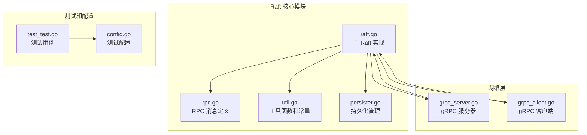
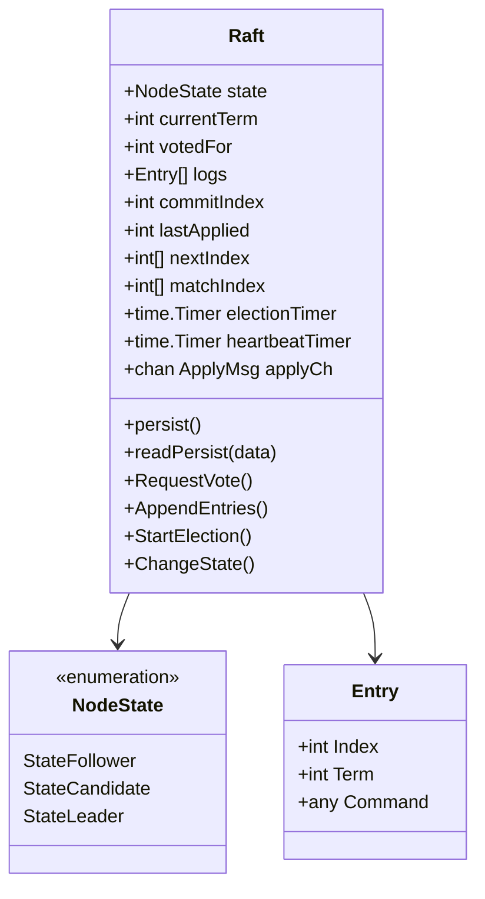
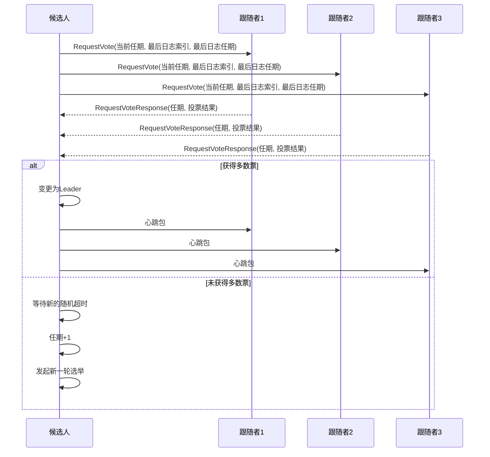
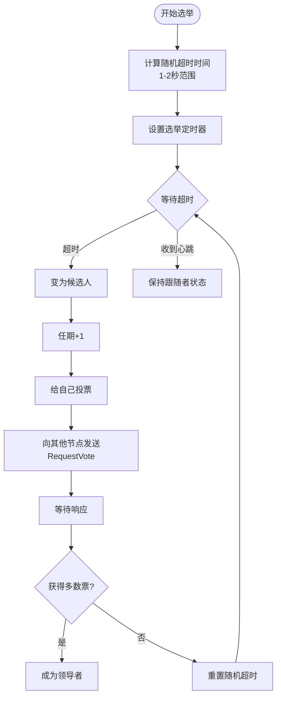
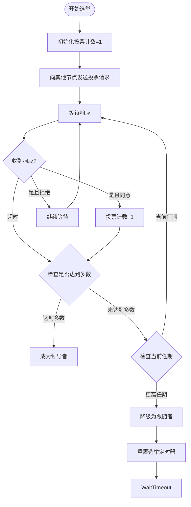
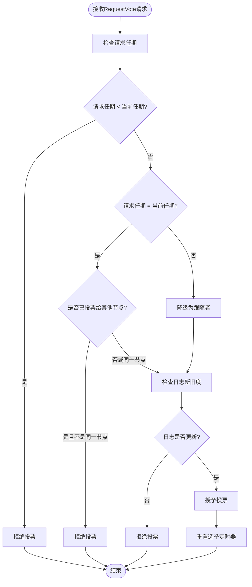
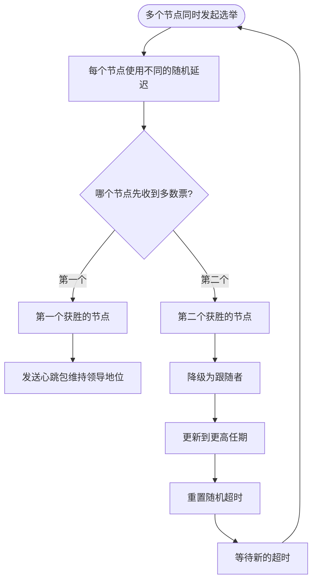
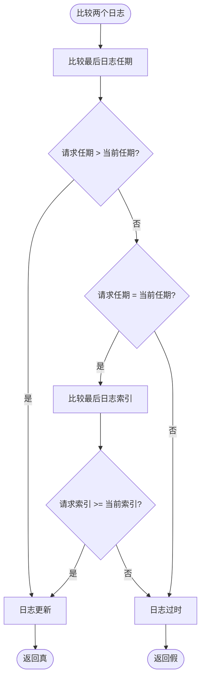
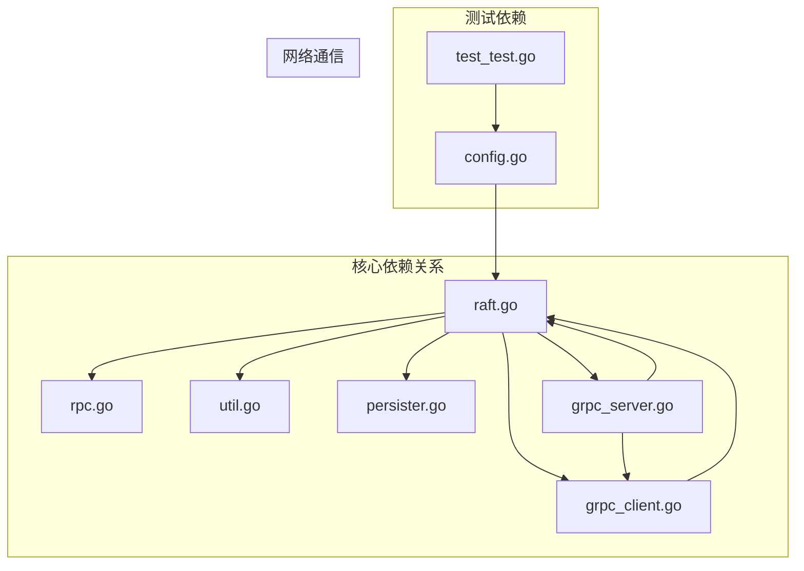

# 选举算法实现

## 目录
1. [简介](#简介)
2. [项目结构](#项目结构)
3. [核心组件](#核心组件)
4. [架构概览](#架构概览)
5. [详细组件分析](#详细组件分析)
6. [依赖关系分析](#依赖关系分析)
7. [性能考虑](#性能考虑)
8. [故障排除指南](#故障排除指南)
9. [结论](#结论)

## 简介

本文档深入分析了 Raft 一致性算法中选举机制的完整实现，包括候选人状态转换、随机超时机制、投票计数逻辑、RequestVote RPC 处理流程以及选举竞争处理。该实现提供了完整的分布式共识算法基础，确保在各种网络条件下维持系统的正确性和可用性。

## 项目结构

该项目采用模块化设计，将 Raft 算法的核心功能组织在独立的模块中：



**图表来源**
- [raft.go](file://raft/raft.go#L1-L726)
- [rpc.go](file://raft/rpc.go#L1-L68)
- [util.go](file://raft/util.go#L1-L115)
- [persister.go](file://raft/persister.go#L1-L111)

**章节来源**
- [raft.go](file://raft/raft.go#L1-L726)
- [util.go](file://raft/util.go#L1-L115)

## 核心组件

### Raft 结构体

Raft 结构体是整个算法的核心数据容器，包含了所有必要的状态信息：



**图表来源**
- [raft.go](file://raft/raft.go#L37-L60)
- [util.go](file://raft/util.go#L43-L67)

### 状态转换机制

Raft 使用三种基本状态来管理节点行为：

| 状态 | 角色 | 主要职责 |
|------|------|----------|
| Follower | 被动参与者 | 响应其他节点请求，维护系统稳定性 |
| Candidate | 候选人 | 发起选举，争取成为领导者 |
| Leader | 领导者 | 维护集群一致性，复制日志条目 |

**章节来源**
- [raft.go](file://raft/raft.go#L47-L48)
- [util.go](file://raft/util.go#L43-L61)

## 架构概览

### 选举状态转换图

```mermaid
stateDiagram-v2
[*] --> Follower
state Follower {
[*] --> 等待超时
等待超时 --> Candidate : 随机超时到期
}
state Candidate {
[*] --> 发送RequestVote请求
发送RequestVote请求 --> 等待响应
等待响应 --> Candidate : 投票计数不足
等待响应 --> Leader : 获得多数票
等待响应 --> Follower : 收到更高任期
}
state Leader {
[*] --> 发送心跳包
发送心跳包 --> Leader : 维持领导地位
}
Candidate --> Follower : 新任期发现
Follower --> Candidate : 超时触发
Candidate --> Leader : 选举成功
```

**图表来源**
- [raft.go](file://raft/raft.go#L616-L635)
- [raft.go](file://raft/raft.go#L475-L494)

### RPC 交互序列



**图表来源**
- [raft.go](file://raft/raft.go#L316-L351)
- [raft.go](file://raft/raft.go#L166-L187)

## 详细组件分析

### 候选人状态转换机制

#### 超时机制实现

Raft 使用随机化的选举超时来避免多个节点同时发起选举：



**图表来源**
- [raft.go](file://raft/raft.go#L616-L635)
- [util.go](file://raft/util.go#L89-L95)

#### 投票计数逻辑

选举过程中的投票计数遵循多数原则：



**图表来源**
- [raft.go](file://raft/raft.go#L316-L351)

**章节来源**
- [raft.go](file://raft/raft.go#L616-L635)
- [raft.go](file://raft/raft.go#L316-L351)

### RequestVote RPC 处理流程

#### 投票判断标准

RequestVote RPC 的处理遵循严格的规则：



**图表来源**
- [raft.go](file://raft/raft.go#L166-L187)

#### 投票授予条件

投票授予需要满足以下条件：

1. **任期比较**：请求的任期必须大于等于当前节点的任期
2. **日志新旧度**：候选人的日志必须至少与当前节点一样新
3. **唯一性保证**：在同一任期内，每个节点只能投给一个候选人

**章节来源**
- [raft.go](file://raft/raft.go#L166-L187)
- [raft.go](file://raft/raft.go#L535-L538)

### 选举竞争处理

#### 多候选人并发选举

当多个节点同时成为候选人时，系统通过以下机制解决冲突：



#### 投票分散问题

为避免投票分散，系统采用了以下策略：

1. **单次投票限制**：在同一任期内，每个节点只能投给一个候选人
2. **日志完整性检查**：只有日志更新的节点才能获得投票
3. **随机超时机制**：不同节点使用不同的超时时间，减少同时选举的可能性

**章节来源**
- [raft.go](file://raft/raft.go#L172-L179)
- [raft.go](file://raft/raft.go#L535-L538)

### 数据结构和算法

#### 日志比较算法



**图表来源**
- [raft.go](file://raft/raft.go#L535-L538)

**章节来源**
- [raft.go](file://raft/raft.go#L535-L538)

## 依赖关系分析

### 组件耦合度分析



**图表来源**
- [raft.go](file://raft/raft.go#L20-L27)
- [grpc_server.go](file://raft/grpc_server.go#L1-L16)
- [grpc_client.go](file://raft/grpc_client.go#L1-L17)

### 外部依赖

系统对外部依赖主要体现在以下几个方面：

1. **Go 标准库**：使用 `time`、`sync`、`math/rand` 等标准库
2. **自定义库**：使用 `labgob` 进行数据序列化
3. **网络库**：使用 `labrpc` 和 `grpc` 进行网络通信

**章节来源**
- [raft.go](file://raft/raft.go#L20-L27)
- [grpc_server.go](file://raft/grpc_server.go#L3-L7)
- [grpc_client.go](file://raft/grpc_client.go#L3-L12)

## 性能考虑

### 时间复杂度分析

| 操作 | 时间复杂度 | 空间复杂度 |
|------|------------|------------|
| 选举发起 | O(n) | O(1) |
| 投票处理 | O(1) | O(1) |
| 日志比较 | O(1) | O(1) |
| 状态转换 | O(1) | O(1) |

### 内存使用优化

1. **日志数组收缩**：当日志数组长度远小于容量时进行收缩
2. **条件变量优化**：使用条件变量减少不必要的轮询
3. **定时器复用**：复用定时器避免频繁创建销毁

**章节来源**
- [raft.go](file://raft/raft.go#L97-L105)
- [raft.go](file://raft/raft.go#L475-L494)

## 故障排除指南

### 常见问题诊断

#### 选举失败问题

1. **检查超时配置**：确认随机超时范围设置合理
2. **验证网络连通性**：确保节点间能够正常通信
3. **监控日志同步**：检查日志是否及时同步

#### 投票被拒绝问题

1. **检查日志完整性**：确认本地日志是否包含最新的条目
2. **验证任期一致性**：确保所有节点的任期同步
3. **审查网络延迟**：检查是否存在异常的网络延迟

**章节来源**
- [raft.go](file://raft/raft.go#L166-L187)
- [util.go](file://raft/util.go#L89-L95)

### 调试技巧

1. **启用调试输出**：通过 `Debug` 常量控制调试信息输出
2. **监控状态变化**：观察节点状态的转换频率
3. **分析 RPC 计数**：统计各类型 RPC 的调用次数

**章节来源**
- [util.go](file://raft/util.go#L12-L19)

## 结论

该 Raft 选举算法实现提供了完整的分布式一致性解决方案，具有以下特点：

1. **可靠性**：通过随机超时机制避免脑裂问题
2. **效率性**：使用多数原则快速达成共识
3. **可扩展性**：支持动态节点加入和离开
4. **健壮性**：完善的错误处理和恢复机制

该实现为构建可靠的分布式系统奠定了坚实的基础，适用于各种需要强一致性的应用场景。