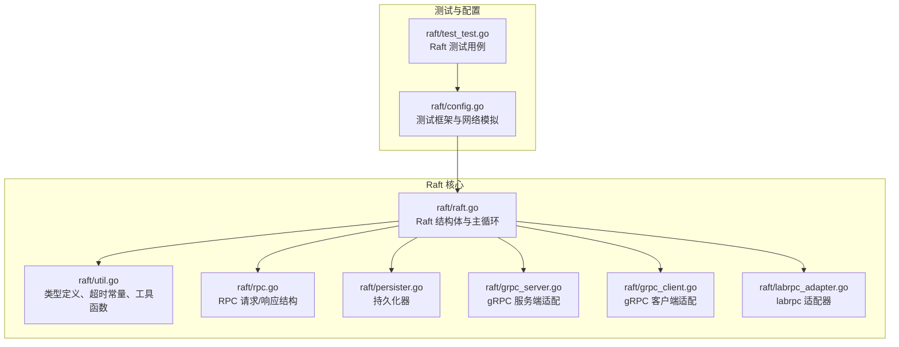
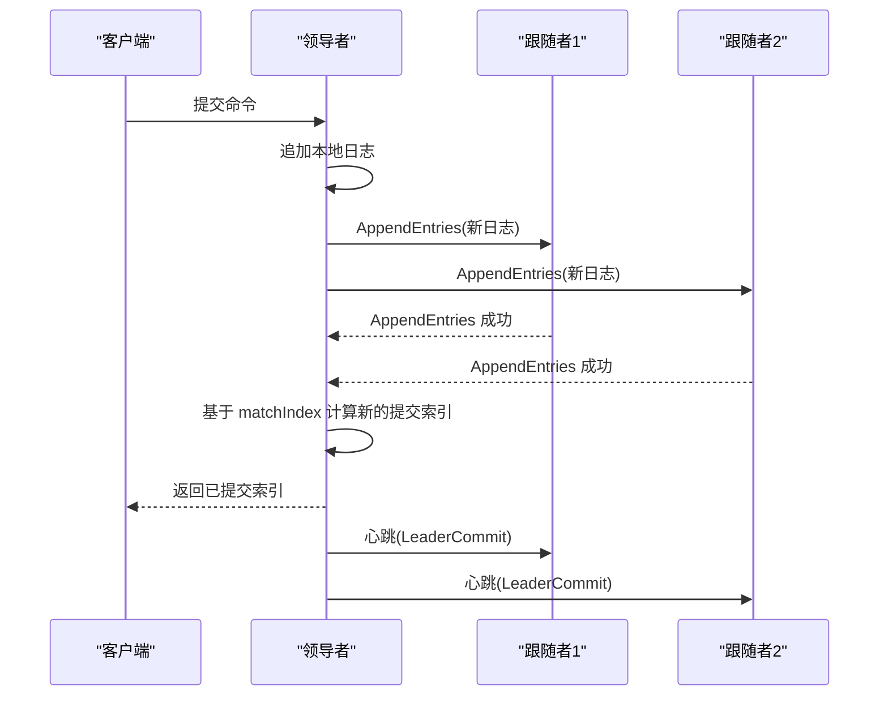
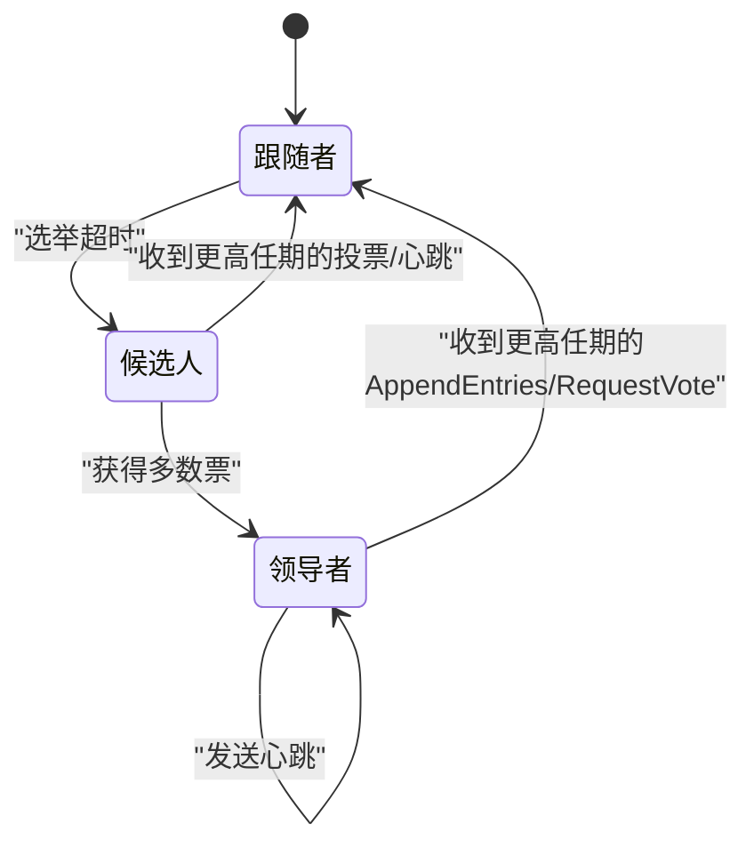
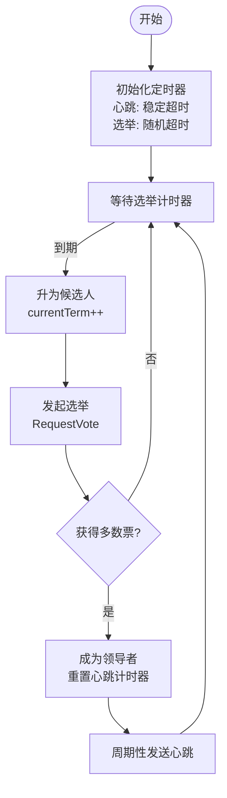
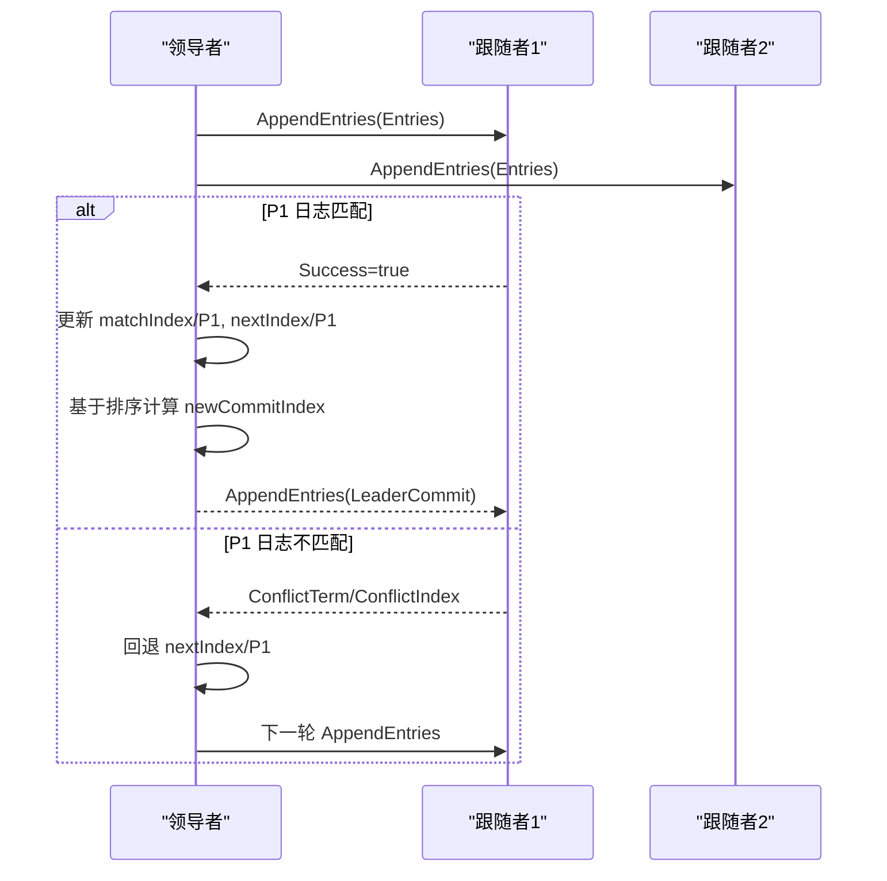
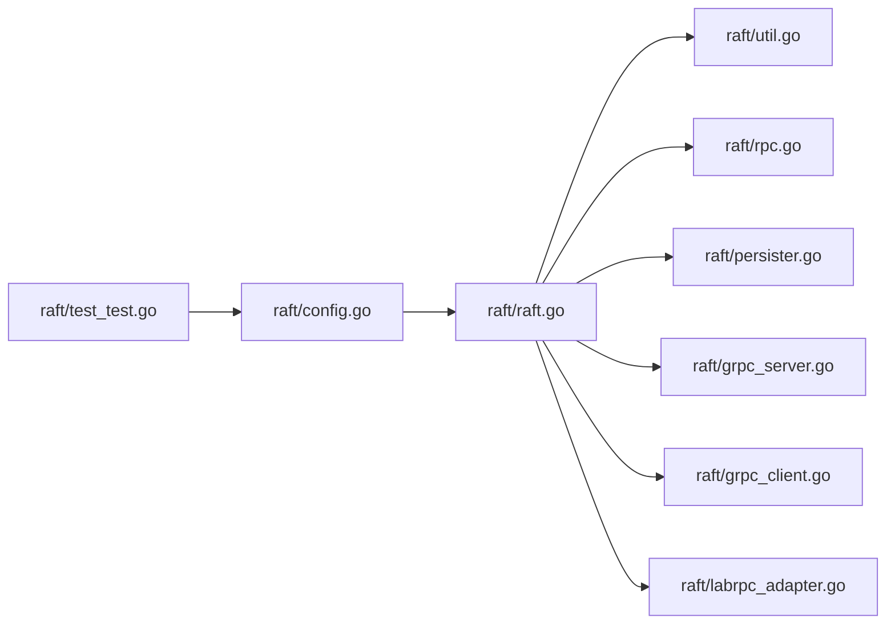

# Raft 算法原理

<cite>
**本文引用的文件列表**
- [raft.go](file://raft/raft.go)
- [util.go](file://raft/util.go)
- [rpc.go](file://raft/rpc.go)
- [persister.go](file://raft/persister.go)
- [grpc_server.go](file://raft/grpc_server.go)
- [grpc_client.go](file://raft/grpc_client.go)
- [labrpc_adapter.go](file://raft/labrpc_adapter.go)
- [config.go](file://raft/config.go)
- [test_test.go](file://raft/test_test.go)
- [Raft-Consensus.md](file://wiki/Raft-Consensus.md)
- [README.md](file://README.md)
</cite>

## 目录
1. [简介](#简介)
2. [项目结构](#项目结构)
3. [核心组件](#核心组件)
4. [架构总览](#架构总览)
5. [详细组件分析](#详细组件分析)
6. [依赖关系分析](#依赖关系分析)
7. [性能考量](#性能考量)
8. [故障排查指南](#故障排查指南)
9. [结论](#结论)
10. [附录](#附录)

## 简介
本文件面向初学者与工程实践者，系统讲解 Raft 共识算法的核心思想与实现要点，包括领导者选举、日志复制、安全性保证与一致性约束。文档基于仓库中的完整实现进行分析，涵盖三种节点状态（跟随者、候选人、领导者）的转换机制、随机化选举超时、心跳机制与任期管理，并提供流程图、状态转换图与时序图，帮助读者建立从概念到代码的完整认知。

## 项目结构
eRaft 是一个基于 Raft 的分布式键值存储系统，Raft 模块位于 raft 子目录中，提供共识层；上层有 kvraft、shardctrler、shardkv 等模块用于构建完整的分布式系统。Raft 模块内部通过 gRPC 或 labrpc 进行节点间通信，使用持久化器保存状态与快照。

图表来源
- [raft.go](file://raft/raft.go#L36-L116)
- [util.go](file://raft/util.go#L43-L95)
- [rpc.go](file://raft/rpc.go#L5-L67)
- [persister.go](file://raft/persister.go#L17-L110)
- [grpc_server.go](file://raft/grpc_server.go#L9-L73)
- [grpc_client.go](file://raft/grpc_client.go#L14-L106)
- [labrpc_adapter.go](file://raft/labrpc_adapter.go#L5-L38)
- [config.go](file://raft/config.go#L44-L106)
- [test_test.go](file://raft/test_test.go#L24-L52)

章节来源
- [README.md](file://README.md#L6-L21)
- [Raft-Consensus.md](file://wiki/Raft-Consensus.md#L1-L21)

## 核心组件
- Raft 结构体：封装当前节点的状态（任期、投票对象、日志、提交索引、应用索引、nextIndex/matchIndex、状态机等），以及定时器、条件变量、锁等并发控制结构。
- 节点状态：跟随者、候选人、领导者三态，通过 ChangeState 切换。
- RPC 接口：RequestVote、AppendEntries、InstallSnapshot，分别处理选举、日志复制与快照安装。
- 持久化：保存 currentTerm、votedFor、日志数组，以及快照数据。
- 超时与心跳：稳定的心跳超时与随机化的选举超时，配合定时器驱动状态切换。
- 并发模型：读写锁保护共享状态，多个 goroutine 协作（ticker、applier、replicator）。

章节来源
- [raft.go](file://raft/raft.go#L36-L116)
- [util.go](file://raft/util.go#L43-L95)
- [rpc.go](file://raft/rpc.go#L5-L67)
- [persister.go](file://raft/persister.go#L71-L110)

## 架构总览
Raft 在每个节点上运行，通过 RPC 与其它节点交互。领导者负责接收客户端命令，复制到多数节点后提交；跟随者被动接受日志与快照；当跟随者长时间未收到心跳或领导者失效，会发起选举成为候选人。

图表来源
- [raft.go](file://raft/raft.go#L576-L591)
- [raft.go](file://raft/raft.go#L353-L366)
- [raft.go](file://raft/raft.go#L496-L524)

## 详细组件分析

### 节点状态与转换机制
- 状态枚举：Follower、Candidate、Leader。
- 转换规则：
  - Follower 收到 AppendEntries 或 RequestVote（且任期不小于当前任期）时重置选举计时器，保持 Follower。
  - Follower 在选举超时后变为 Candidate，增加当前任期并投自己一票，向其他节点发起 RequestVote。
  - Candidate 若获得多数选票则成为 Leader；若收到更高任期的 RequestVote 响应则转为 Follower。
  - Leader 定期发送心跳维持权威，若发现更高任期则降级为 Follower。

图表来源
- [raft.go](file://raft/raft.go#L475-L494)
- [raft.go](file://raft/raft.go#L616-L635)
- [raft.go](file://raft/raft.go#L166-L187)
- [raft.go](file://raft/raft.go#L189-L241)

章节来源
- [util.go](file://raft/util.go#L43-L61)
- [raft.go](file://raft/raft.go#L475-L494)
- [raft.go](file://raft/raft.go#L616-L635)

### 随机化选举超时与心跳机制
- 心跳超时：稳定的心跳间隔，用于维持领导权。
- 选举超时：在固定时间基础上加入随机抖动，避免多节点同时发起选举导致分裂投票。
- 定时器驱动：
  - ticker：监听选举计时器到期触发选举；监听心跳计时器到期发送心跳。
  - 各种 RPC 处理逻辑中都会重置选举计时器，防止被误判为“无响应”。

图表来源
- [util.go](file://raft/util.go#L84-L95)
- [raft.go](file://raft/raft.go#L616-L635)
- [raft.go](file://raft/raft.go#L316-L351)

章节来源
- [util.go](file://raft/util.go#L84-L95)
- [raft.go](file://raft/raft.go#L616-L635)

### 任期管理与安全性
- 任期单调递增：只有在发起选举或收到更高任期时才更新 currentTerm。
- 投票限制：同一任期内每个节点只能投一票；RequestVote 会拒绝过期请求。
- 日志匹配：AppendEntries 通过 PrevLogIndex/PrevLogTerm 匹配，不匹配时返回冲突信息，加速追赶。
- 提交约束：仅能提交当前任期内的已复制日志，由领导者基于 matchIndex 计算新的 commitIndex。

章节来源
- [raft.go](file://raft/raft.go#L166-L187)
- [raft.go](file://raft/raft.go#L189-L241)
- [raft.go](file://raft/raft.go#L496-L524)

### 日志复制与一致性
- 新命令追加：Start 将命令追加到本地日志并广播心跳（批量复制）。
- 复制过程：领导者维护每个跟随者的 nextIndex 与 matchIndex，逐步推进复制。
- 冲突回退：当跟随者日志不一致时，领导者根据冲突项快速回退到可匹配位置。
- 提交推进：领导者依据多数节点的 matchIndex 计算新的 commitIndex，并通知应用线程。

图表来源
- [raft.go](file://raft/raft.go#L576-L591)
- [raft.go](file://raft/raft.go#L353-L366)
- [raft.go](file://raft/raft.go#L423-L449)

章节来源
- [raft.go](file://raft/raft.go#L576-L591)
- [raft.go](file://raft/raft.go#L353-L366)
- [raft.go](file://raft/raft.go#L423-L449)

### 快照与日志压缩
- 快照触发：上层服务定期调用 Snapshot 截断日志并保存快照。
- 条件安装：InstallSnapshot 由领导者发送，跟随者将快照交给上层，上层再调用 CondInstallSnapshot 完成状态恢复。
- 状态恢复：重启后从持久化器读取 currentTerm、votedFor、日志，初始化 first/last log。

章节来源
- [raft.go](file://raft/raft.go#L146-L164)
- [raft.go](file://raft/raft.go#L243-L275)
- [raft.go](file://raft/raft.go#L118-L144)
- [raft.go](file://raft/raft.go#L89-L106)
- [persister.go](file://raft/persister.go#L90-L110)

### 并发与应用线程
- 应用线程：applier 等待提交条件变量，按顺序将已提交日志应用到状态机，确保每条日志恰好应用一次。
- 复制线程：每个跟随者一个 replicator goroutine，等待信号批量复制日志。
- 锁策略：读写锁保护共享状态，减少锁竞争。

章节来源
- [raft.go](file://raft/raft.go#L637-L664)
- [raft.go](file://raft/raft.go#L666-L678)

### RPC 接口与通信适配
- gRPC 服务端/客户端：将内部结构转换为 protobuf 类型，处理超时与错误。
- labrpc 适配器：在测试环境中通过 labrpc 模拟网络，便于调试与验证。

章节来源
- [grpc_server.go](file://raft/grpc_server.go#L18-L73)
- [grpc_client.go](file://raft/grpc_client.go#L28-L106)
- [labrpc_adapter.go](file://raft/labrpc_adapter.go#L9-L27)

## 依赖关系分析
- Raft 依赖 util（类型、超时、工具）、rpc（请求/响应结构）、persister（持久化）、gRPC/适配器（通信）。
- 测试框架 config 提供网络模拟、连接/断开控制、统计与一致性检查。
- 上层模块（如 shardkv）通过 Raft API 使用共识能力。

图表来源
- [raft.go](file://raft/raft.go#L20-L27)
- [util.go](file://raft/util.go#L1-L19)
- [rpc.go](file://raft/rpc.go#L1-L67)
- [persister.go](file://raft/persister.go#L1-L22)
- [grpc_server.go](file://raft/grpc_server.go#L1-L16)
- [grpc_client.go](file://raft/grpc_client.go#L1-L12)
- [labrpc_adapter.go](file://raft/labrpc_adapter.go#L1-L3)
- [config.go](file://raft/config.go#L67-L106)
- [test_test.go](file://raft/test_test.go#L24-L52)

章节来源
- [raft.go](file://raft/raft.go#L20-L27)
- [config.go](file://raft/config.go#L67-L106)

## 性能考量
- 批量复制：BroadcastHeartbeat 在心跳场景下直接发送，非心跳场景仅发出信号，由 replicator 批量复制，降低 RPC 次数。
- 快照与日志压缩：定期截断日志并保存快照，避免日志无限增长。
- 并发优化：applier 与 replicator 分离，提升吞吐。
- 超时参数：心跳短、选举长且带随机抖动，兼顾稳定性与快速收敛。

章节来源
- [raft.go](file://raft/raft.go#L353-L366)
- [raft.go](file://raft/raft.go#L637-L664)
- [raft.go](file://raft/raft.go#L666-L678)
- [util.go](file://raft/util.go#L84-L95)

## 故障排查指南
- 无法选出领导者：检查网络连通性与断开策略，确认心跳是否被阻塞；观察选举计时器是否频繁到期。
- 分裂投票：确认选举超时是否足够大且带有随机抖动；避免网络分区导致多节点同时发起选举。
- 日志不一致：关注 AppendEntries 冲突返回的 ConflictTerm/ConflictIndex，调整 nextIndex 回退策略。
- 快照安装失败：确认 InstallSnapshot 请求的 LastIncludedIndex/LastIncludedTerm 是否有效，上层 CondInstallSnapshot 是否及时调用。
- 应用顺序异常：检查 applier 是否严格按 commitIndex 顺序推送，避免重复或遗漏。

章节来源
- [raft.go](file://raft/raft.go#L207-L228)
- [raft.go](file://raft/raft.go#L243-L275)
- [raft.go](file://raft/raft.go#L637-L664)

## 结论
本实现遵循 Raft 的核心设计：以领导者为中心的日志复制、严格的任期与投票规则、基于多数派的安全提交。通过随机化选举超时、心跳机制与快照压缩，系统在复杂网络环境下仍能保持一致性与高可用。结合并发的复制与应用线程，整体吞吐与稳定性得到保障。建议在实际部署中结合监控指标（RPC 数、日志大小、提交延迟）持续优化超时参数与快照策略。

## 附录
- 关键 API 与职责
  - Start：提案命令，追加本地日志并广播复制。
  - GetState：查询当前任期与是否为领导者。
  - Snapshot/CondInstallSnapshot：日志截断与快照安装。
  - RequestVote/AppendEntries/InstallSnapshot：选举与复制/快照 RPC 处理。
- 测试要点
  - 初始选举、重选举、多轮选举、基本一致性、RPC 字节数统计、容错与漂移等。

章节来源
- [raft.go](file://raft/raft.go#L576-L591)
- [raft.go](file://raft/raft.go#L166-L187)
- [raft.go](file://raft/raft.go#L189-L241)
- [raft.go](file://raft/raft.go#L243-L275)
- [test_test.go](file://raft/test_test.go#L24-L52)