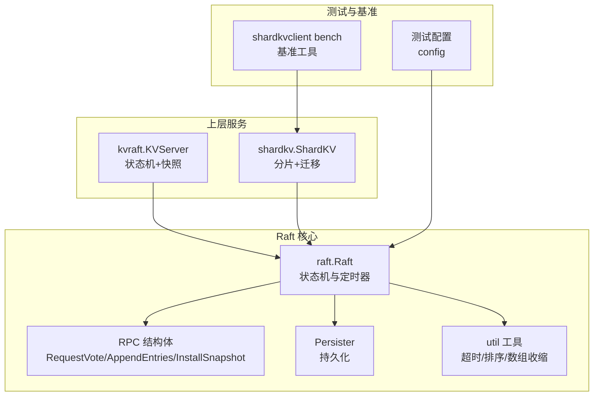
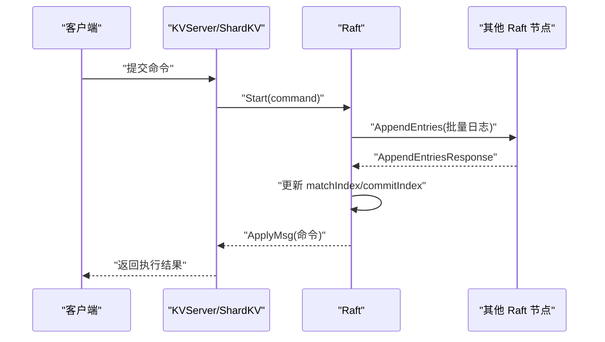
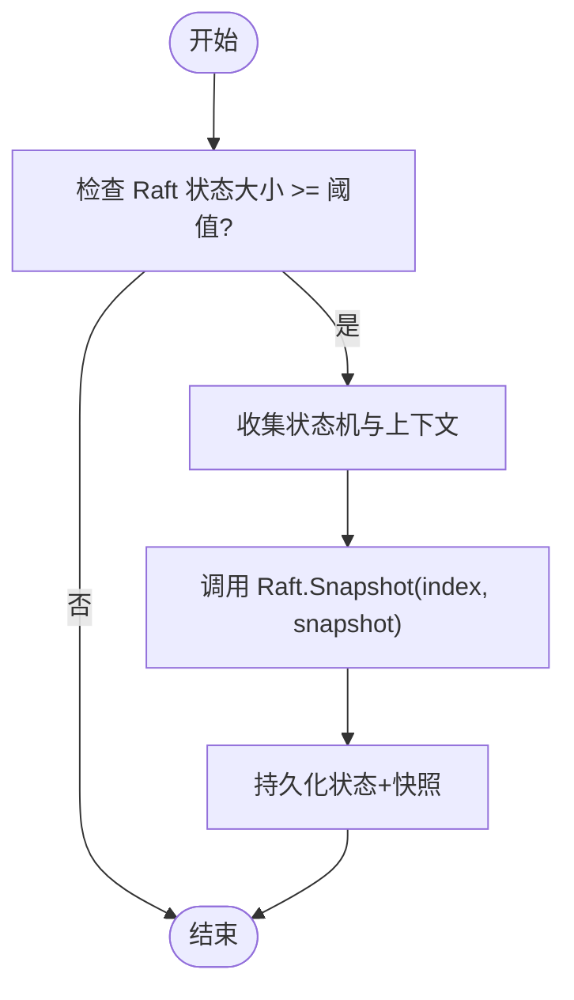
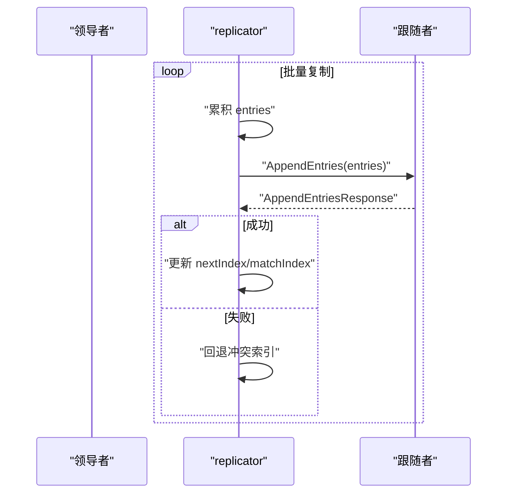
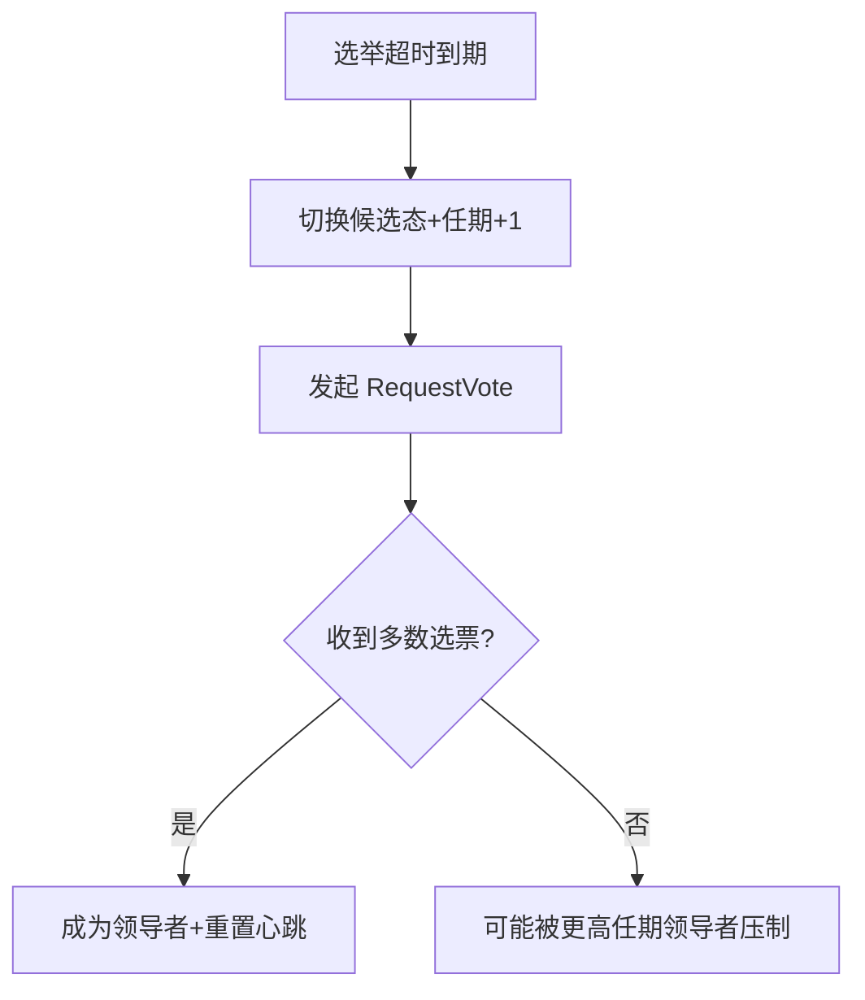
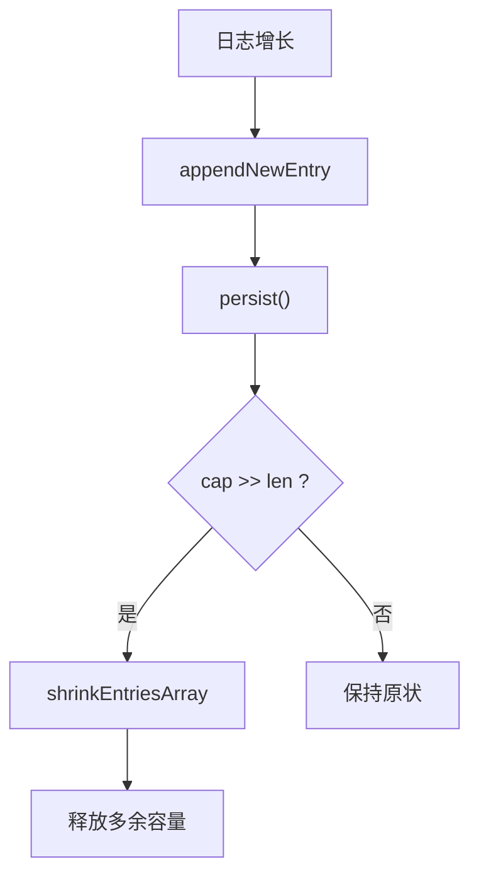
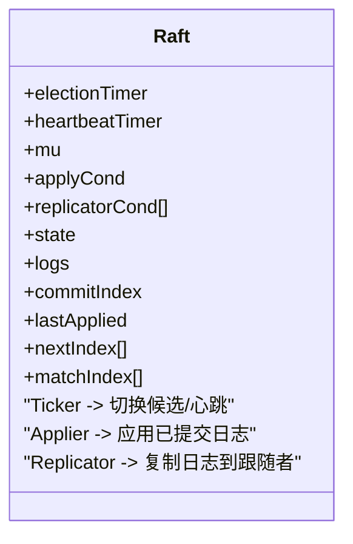
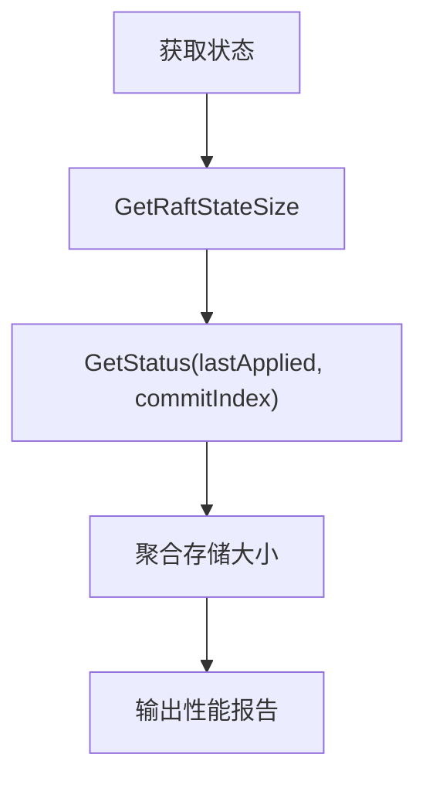
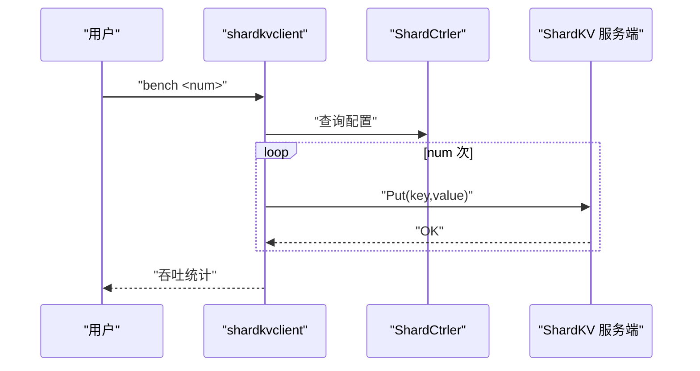
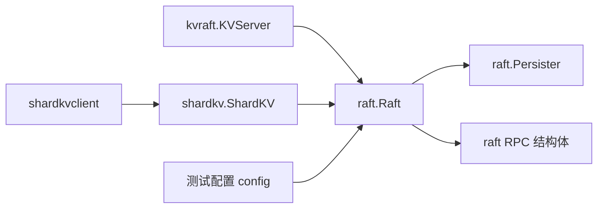

# 性能优化与调优

## 目录
1. [简介](#简介)
2. [项目结构](#项目结构)
3. [核心组件](#核心组件)
4. [架构总览](#架构总览)
5. [详细组件分析](#详细组件分析)
6. [依赖关系分析](#依赖关系分析)
7. [性能考量](#性能考量)
8. [故障排查指南](#故障排查指南)
9. [结论](#结论)
10. [附录](#附录)

## 简介
本文件面向 eRaft 项目的 Raft 实现，系统性梳理并提出性能优化与调优方案，覆盖以下主题：
- 日志压缩与快照：基于已实现的 CondInstallSnapshot/Snapshot 接口，给出触发时机与容量控制策略
- 批量复制：利用 replicator goroutine 的条件变量机制，设计批量复制与流水线化策略
- 心跳优化：心跳间隔与选举超时的权衡，避免频繁选举导致的吞吐下降
- 内存管理：日志数组收缩、通知通道回收、持久化写入策略
- 定时器与并发控制：ticker、心跳与选举定时器的并发调度，以及锁粒度优化
- 性能瓶颈识别：通过内置统计接口与基准工具定位瓶颈
- 负载场景与优化建议：不同节点规模、网络可靠性、数据分布对性能的影响
- 基准测试与案例：使用 shardkvclient bench 进行压测，结合观测指标评估优化效果

## 项目结构
eRaft 采用分层与模块化组织：
- raft 层：Raft 核心状态机、RPC 请求/响应结构、持久化与工具函数
- kvraft/shardkv 层：基于 Raft 的键值服务，包含状态机、快照与应用循环
- 测试与基准：内置测试框架与 shardkvclient 基准工具
- 协议定义：raftpb/shardkvpb 提供 RPC/消息结构

**图表来源**
- [raft.go](file://raft/raft.go#L37-L725)
- [rpc.go](file://raft/rpc.go#L5-L67)
- [persister.go](file://raft/persister.go#L17-L110)
- [util.go](file://raft/util.go#L84-L114)
- [server.go](file://kvraft/server.go#L88-L341)
- [server.go](file://shardkv/server.go#L76-L799)
- [config.go](file://raft/config.go#L44-L107)
- [main.go](file://cmd/shardkvclient/main.go#L67-L91)

**章节来源**
- [raft.go](file://raft/raft.go#L37-L725)
- [server.go](file://kvraft/server.go#L88-L341)
- [server.go](file://shardkv/server.go#L76-L799)
- [config.go](file://raft/config.go#L44-L107)
- [main.go](file://cmd/shardkvclient/main.go#L67-L91)

## 核心组件
- Raft 状态机与定时器：维护当前任期、投票对象、日志、提交/应用索引、nextIndex/matchIndex、选举与心跳定时器
- RPC 结构体：RequestVote、AppendEntries、InstallSnapshot 及其响应
- 持久化：保存 Raft 状态与快照，支持原子写入
- 上层 KV 服务：KVServer/ShardKV 在 Raft 之上构建状态机，支持按需快照与恢复
- 测试配置：封装网络、计数器、统计输出，便于性能评估
- 基准工具：shardkvclient bench 支持随机键写入与吞吐统计

**章节来源**
- [raft.go](file://raft/raft.go#L37-L725)
- [rpc.go](file://raft/rpc.go#L5-L67)
- [persister.go](file://raft/persister.go#L17-L110)
- [server.go](file://kvraft/server.go#L88-L341)
- [server.go](file://shardkv/server.go#L76-L799)
- [config.go](file://raft/config.go#L44-L107)
- [main.go](file://cmd/shardkvclient/main.go#L67-L91)

## 架构总览
Raft 核心通过 RPC 与其他节点交互，上层 KV 服务在 Raft 之上提供线性一致的状态机。心跳与选举定时器驱动共识推进；applier 与 replicator goroutine 并行工作，分别负责日志应用与复制。

**图表来源**
- [raft.go](file://raft/raft.go#L576-L591)
- [raft.go](file://raft/raft.go#L353-L366)
- [raft.go](file://raft/raft.go#L423-L449)
- [server.go](file://kvraft/server.go#L102-L139)
- [server.go](file://shardkv/server.go#L129-L157)

## 详细组件分析

### 日志压缩与快照（Snapshot）
- 触发条件
  - KV 层根据 Raft 状态大小阈值触发快照（maxRaftState）：当 Raft 状态大小达到阈值时，KV 层调用 Snapshot(index, snapshot)，随后持久化 Raft 状态与快照
  - 应用层可调用 CondInstallSnapshot 来接受来自领导者的快照，以裁剪本地日志
- 关键流程
  - KV 层在应用循环中检测是否需要快照，满足条件后收集状态机数据与操作上下文，调用 Snapshot
  - 领导者在复制时若落后节点缺失日志，优先发送 InstallSnapshot
- 优化建议
  - 合理设置 maxRaftState：避免日志过大导致快照频繁或内存压力
  - 快照内容包含状态机与去重上下文，减少重复执行成本
  - 使用异步清理通知通道，降低内存占用

**图表来源**
- [server.go](file://kvraft/server.go#L238-L258)
- [server.go](file://shardkv/server.go#L463-L485)
- [raft.go](file://raft/raft.go#L150-L164)
- [raft.go](file://raft/raft.go#L120-L144)

**章节来源**
- [server.go](file://kvraft/server.go#L238-L258)
- [server.go](file://shardkv/server.go#L463-L485)
- [raft.go](file://raft/raft.go#L120-L164)

### 批量复制（Replication）
- 当前实现
  - replicator goroutine 通过条件变量等待新日志或心跳信号，逐条复制到落后节点
  - 领导者广播心跳时，会一次性发送一轮复制请求
- 优化方向
  - 将逐条复制改为批量复制：在 replicator 中累积一定数量的日志项再发送 AppendEntries
  - 引入流水线：允许未确认的批次继续发送，提高带宽利用率
  - 为每个 peer 维护独立的复制窗口，避免阻塞其他节点

**图表来源**
- [raft.go](file://raft/raft.go#L368-L397)
- [raft.go](file://raft/raft.go#L423-L449)
- [raft.go](file://raft/raft.go#L666-L678)

**章节来源**
- [raft.go](file://raft/raft.go#L368-L397)
- [raft.go](file://raft/raft.go#L423-L449)
- [raft.go](file://raft/raft.go#L666-L678)

### 心跳优化（Heartbeat）
- 心跳与选举超时
  - 心跳间隔固定，选举超时随机化，防止同时发起选举
- 优化建议
  - 根据网络 RTT 动态调整心跳间隔，缩短多数派确认路径
  - 在高负载下适当增加心跳频率，降低跟随者空闲时间，减少选举风险
  - 对于跨数据中心部署，考虑使用多租户心跳策略

**图表来源**
- [raft.go](file://raft/raft.go#L616-L635)
- [util.go](file://raft/util.go#L89-L95)

**章节来源**
- [raft.go](file://raft/raft.go#L616-L635)
- [util.go](file://raft/util.go#L89-L95)

### 内存管理（Memory Management）
- 日志数组收缩：当数组长度远小于容量时，复制到更小的新切片，释放多余容量
- 通知通道回收：请求完成后异步删除通知通道，避免长期持有
- 持久化写入：持久化为磁盘同步写，确保一致性但带来 IO 压力

**图表来源**
- [raft.go](file://raft/raft.go#L546-L553)
- [raft.go](file://raft/raft.go#L85-L87)
- [util.go](file://raft/util.go#L97-L105)

**章节来源**
- [raft.go](file://raft/raft.go#L546-L553)
- [raft.go](file://raft/raft.go#L85-L87)
- [util.go](file://raft/util.go#L97-L105)

### 定时器与并发控制（Timers & Concurrency）
- 定时器
  - electionTimer：随机选举超时，避免“双峰”竞争
  - heartbeatTimer：稳定心跳周期，维持领导地位
- 并发
  - RWMutex 保护共享状态，读多写少场景下提升并发度
  - 条件变量用于 applier/replicator 的唤醒与等待，避免忙等

**图表来源**
- [raft.go](file://raft/raft.go#L37-L74)
- [raft.go](file://raft/raft.go#L616-L635)
- [raft.go](file://raft/raft.go#L637-L664)
- [raft.go](file://raft/raft.go#L666-L678)

**章节来源**
- [raft.go](file://raft/raft.go#L37-L74)
- [raft.go](file://raft/raft.go#L616-L635)
- [raft.go](file://raft/raft.go#L637-L664)
- [raft.go](file://raft/raft.go#L666-L678)

### 性能瓶颈识别与监控
- 监控指标
  - Raft 状态大小：GetRaftStateSize，反映日志与持久化体积
  - 应用与提交索引：GetStatus 返回 lastApplied/commitIndex，衡量复制进度
  - 存储占用：KV 层聚合状态机与 Raft 状态大小
- 测试统计
  - config 统计 RPC 数量、字节数、耗时、最大索引，用于评估吞吐与开销

**图表来源**
- [raft.go](file://raft/raft.go#L70-L80)
- [raft.go](file://raft/raft.go#L70-L74)
- [server.go](file://kvraft/server.go#L171-L174)
- [config.go](file://raft/config.go#L567-L581)

**章节来源**
- [raft.go](file://raft/raft.go#L70-L80)
- [raft.go](file://raft/raft.go#L70-L74)
- [server.go](file://kvraft/server.go#L171-L174)
- [config.go](file://raft/config.go#L567-L581)

### 不同负载场景与优化建议
- 高写入/低延迟
  - 批量复制与流水线化，减少 RTT 往返
  - 适度缩短心跳间隔，降低跟随者空闲时间
- 跨数据中心
  - 选举超时与心跳间隔需考虑 RTT，避免频繁选举
  - 使用快照减少跨域传输的数据量
- 大日志/高快照频率
  - 合理设置 maxRaftState，平衡快照频率与内存占用
  - 使用 SSD 提升持久化与快照 IO 性能

**章节来源**
- [Benchmark.md](file://wiki/Benchmark.md#L18-L26)
- [util.go](file://raft/util.go#L89-L95)

### 性能测试方法与基准测试
- 基准工具
  - shardkvclient bench：随机生成键值对，顺序发送 Put 请求，统计总耗时与平均吞吐
- 建议流程
  - 固定节点规模与网络拓扑，逐步调整快照阈值、心跳间隔与批处理大小
  - 记录 Raft 状态大小、RPC 字节数、最大索引变化，对比优化前后差异

**图表来源**
- [main.go](file://cmd/shardkvclient/main.go#L67-L91)
- [server.go](file://shardkv/server.go#L129-L157)

**章节来源**
- [main.go](file://cmd/shardkvclient/main.go#L67-L91)
- [Benchmark.md](file://wiki/Benchmark.md#L8-L16)

## 依赖关系分析
- Raft 依赖持久化与 RPC 结构体，对外暴露 Start/GetState/ApplyMsg
- KV 与 ShardKV 依赖 Raft 的 Start 与快照接口，内部维护状态机与去重上下文
- 测试配置封装网络与统计，基准工具通过客户端向集群提交请求

**图表来源**
- [raft.go](file://raft/raft.go#L37-L725)
- [persister.go](file://raft/persister.go#L17-L110)
- [rpc.go](file://raft/rpc.go#L5-L67)
- [server.go](file://kvraft/server.go#L88-L341)
- [server.go](file://shardkv/server.go#L76-L799)
- [config.go](file://raft/config.go#L44-L107)
- [main.go](file://cmd/shardkvclient/main.go#L67-L91)

**章节来源**
- [raft.go](file://raft/raft.go#L37-L725)
- [persister.go](file://raft/persister.go#L17-L110)
- [rpc.go](file://raft/rpc.go#L5-L67)
- [server.go](file://kvraft/server.go#L88-L341)
- [server.go](file://shardkv/server.go#L76-L799)
- [config.go](file://raft/config.go#L44-L107)
- [main.go](file://cmd/shardkvclient/main.go#L67-L91)

## 性能考量
- CPU 效率
  - 减少锁持有时间：在 KV 层不持有锁进行 RPC 调用，提升吞吐
  - 并行化：applier 与 replicator 并行运行，避免阻塞
- 内存效率
  - 日志数组收缩与通知通道回收，降低内存占用
  - 快照裁剪日志，避免无界增长
- IO 优化
  - 使用 SSD 提升持久化与快照 IO
  - 批量复制减少网络往返与序列化开销

**章节来源**
- [server.go](file://kvraft/server.go#L113-L139)
- [util.go](file://raft/util.go#L97-L105)
- [Benchmark.md](file://wiki/Benchmark.md#L24-L25)

## 故障排查指南
- 常见问题
  - 选举风暴：检查选举超时是否过短或网络分区频繁
  - 快照不生效：确认 CondInstallSnapshot 的索引与任期判断逻辑
  - 应用滞后：检查 commitIndex 更新与 applier 唤醒条件
- 调试手段
  - 使用 GetStatus 获取节点角色、任期、应用与提交索引
  - 通过测试配置统计 RPC 数量与字节，定位异常流量

**章节来源**
- [raft.go](file://raft/raft.go#L70-L80)
- [raft.go](file://raft/raft.go#L120-L144)
- [config.go](file://raft/config.go#L567-L581)

## 结论
通过对 eRaft 的 Raft 核心、KV 与 ShardKV 服务、测试与基准工具的系统分析，本文提出了围绕日志压缩、批量复制、心跳优化与内存管理的优化策略，并给出了针对不同负载场景的建议与可量化的测试方法。实际部署中应结合硬件条件（如 SSD）、网络拓扑与业务特征，动态调整参数并持续监控关键指标，以获得最佳性能与稳定性。

## 附录
- 关键 API 与路径
  - Start：[raft.go](file://raft/raft.go#L581-L591)
  - Snapshot/CondInstallSnapshot：[raft.go](file://raft/raft.go#L150-L164), [raft.go](file://raft/raft.go#L120-L144)
  - 快照触发（KV）：[server.go](file://kvraft/server.go#L238-L258)
  - 快照触发（ShardKV）：[server.go](file://shardkv/server.go#L463-L485)
  - 快照应用（KV）：[server.go](file://kvraft/server.go#L260-L279)
  - 快照应用（ShardKV）：[server.go](file://shardkv/server.go#L487-L516)
  - RPC 结构体：[rpc.go](file://raft/rpc.go#L5-L67)
  - 协议定义：[raft.proto](file://raftpb/raft.proto#L7-L57), [shardkv.proto](file://shardkvpb/shardkv.proto#L13-L65)
  - 基准工具：[main.go](file://cmd/shardkvclient/main.go#L67-L91)
  - 性能观测：[config.go](file://raft/config.go#L567-L581)