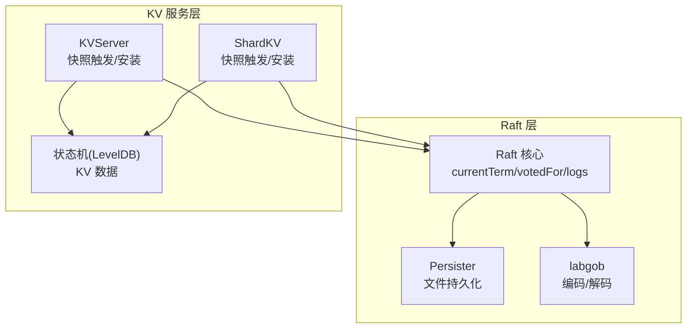
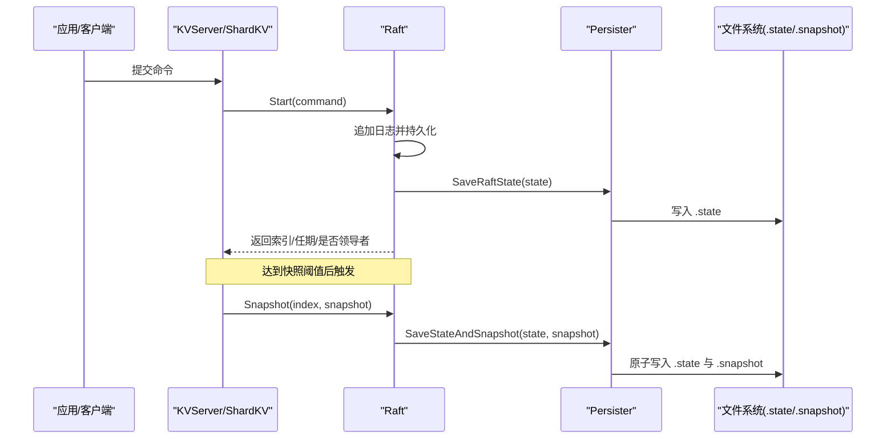
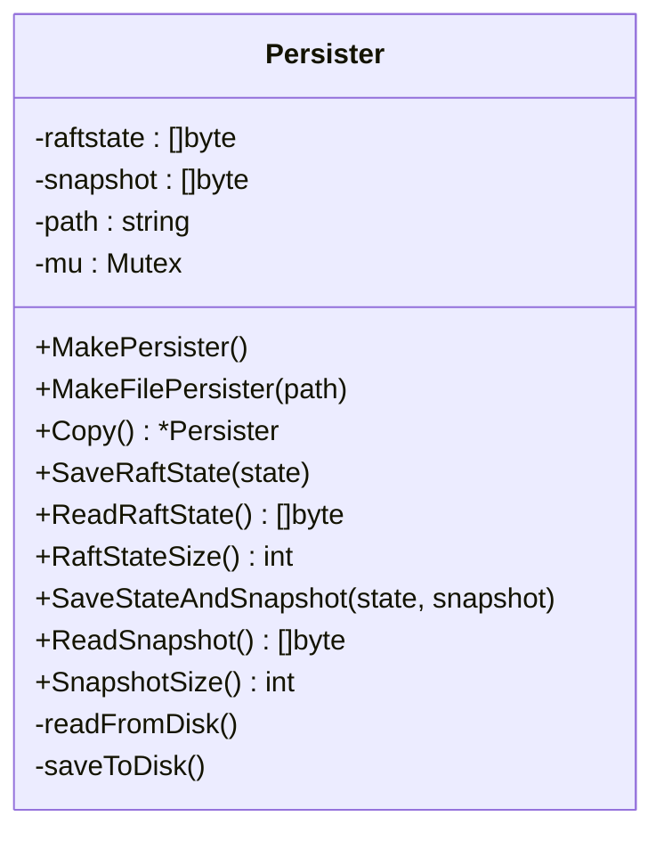
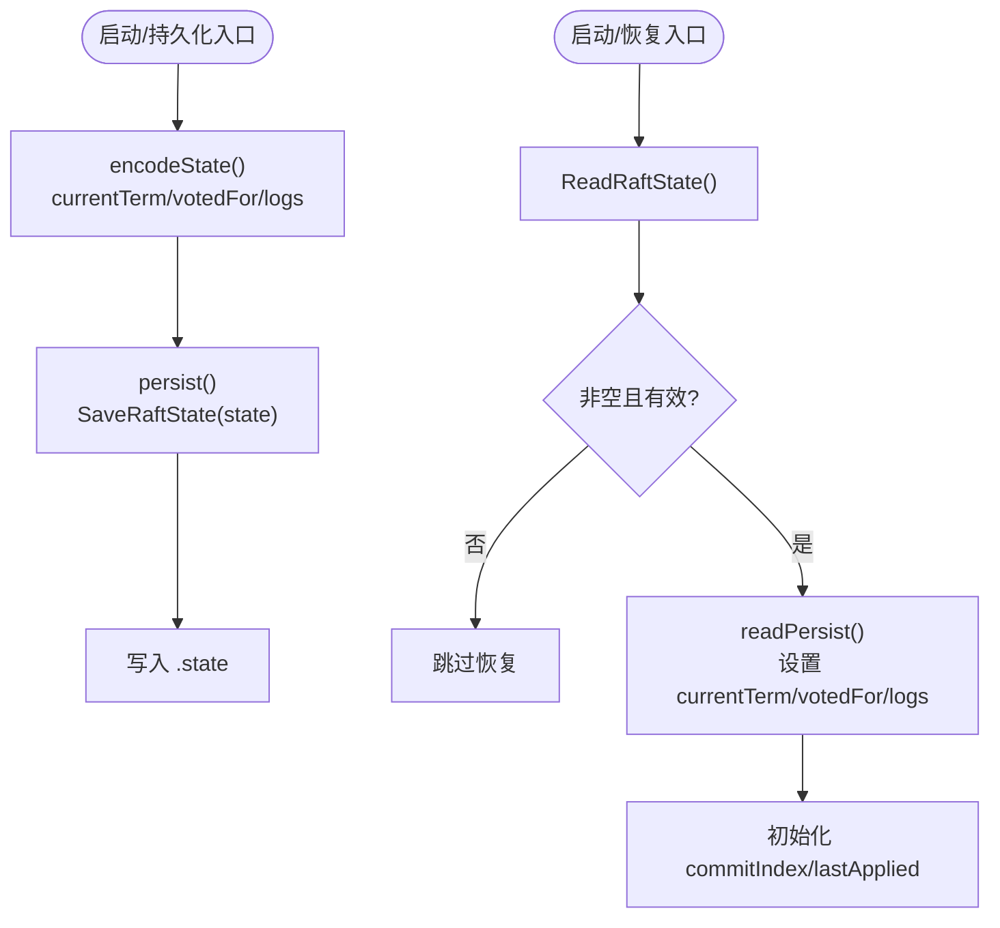
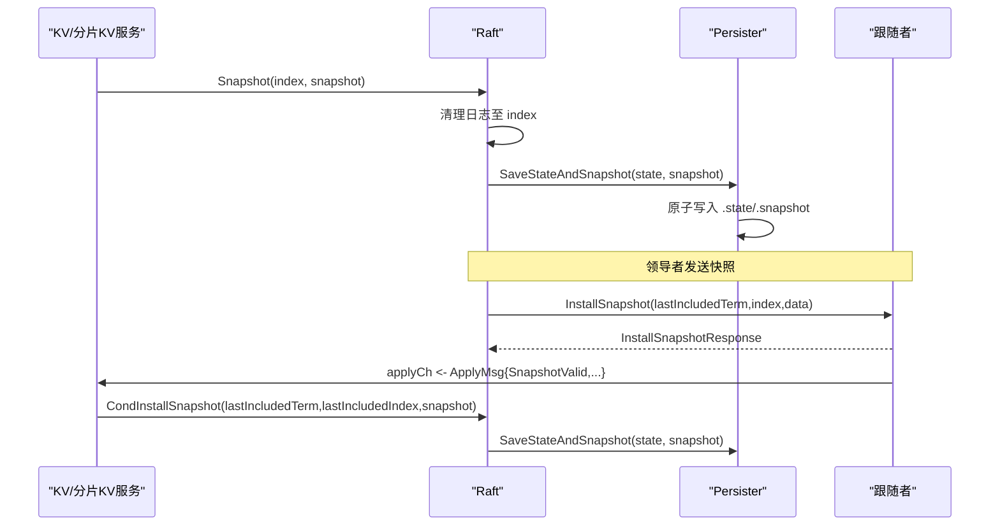
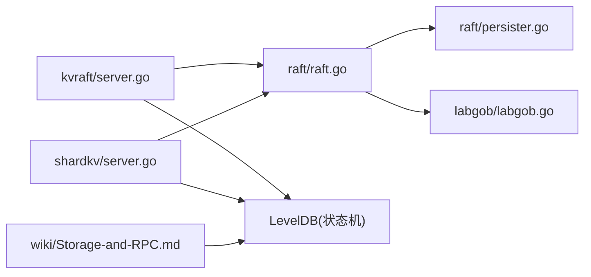

# 持久化与存储

## 目录
1. [简介](#简介)
2. [项目结构](#项目结构)
3. [核心组件](#核心组件)
4. [架构总览](#架构总览)
5. [详细组件分析](#详细组件分析)
6. [依赖关系分析](#依赖关系分析)
7. [性能考量](#性能考量)
8. [故障排查指南](#故障排查指南)
9. [结论](#结论)
10. [附录](#附录)

## 简介
本文件聚焦于 Raft 的持久化与存储机制，系统性阐述以下主题：
- 持久化状态的保存与恢复：当前任期、投票记录（votedFor）与日志条目。
- Persister 对象的设计与实现，包括原子写入、并发安全与磁盘 I/O 行为。
- 快照机制的工作原理、触发条件与安装流程。
- 存储格式、序列化策略与数据完整性保障。
- 持久化流程图、存储结构图与恢复过程示例。
- 磁盘 I/O 优化、存储空间管理与崩溃恢复机制。

## 项目结构
围绕持久化与存储的关键模块如下：
- raft 层：Raft 核心状态（currentTerm、votedFor、logs）、持久化入口与恢复逻辑、快照接口。
- labgob 层：基于 Go 编解码的封装，提供字段命名检查与默认值警告。
- kvraft/shardkv 层：上层服务侧的快照触发与安装，结合状态机数据。
- wiki 文档：说明生产环境使用 LevelDB 作为状态机存储，Raft 层仍使用内存/文件持久化。

图表来源
- [raft/raft.go](file://raft/raft.go#L36-L116)
- [raft/persister.go](file://raft/persister.go#L17-L111)
- [labgob/labgob.go](file://labgob/labgob.go#L24-L68)
- [kvraft/server.go](file://kvraft/server.go#L88-L100)
- [shardkv/server.go](file://shardkv/server.go#L300-L326)

章节来源
- [raft/raft.go](file://raft/raft.go#L36-L116)
- [raft/persister.go](file://raft/persister.go#L17-L111)
- [labgob/labgob.go](file://labgob/labgob.go#L24-L68)
- [kvraft/server.go](file://kvraft/server.go#L88-L100)
- [shardkv/server.go](file://shardkv/server.go#L300-L326)

## 核心组件
- Persister：负责 Raft 状态与快照的文件持久化，提供原子保存、复制与读取能力。
- Raft：定义并维护持久化状态（currentTerm、votedFor、logs），在关键路径调用 Persister 完成持久化；在启动时从 Persister 恢复。
- labgob：提供带字段命名检查的编码/解码器，避免因小写字段导致的序列化问题。
- KV/分片 KV 服务：根据 Raft 日志大小触发快照，将状态机数据打包为快照并调用 Raft 接口保存。

章节来源
- [raft/persister.go](file://raft/persister.go#L17-L111)
- [raft/raft.go](file://raft/raft.go#L82-L116)
- [labgob/labgob.go](file://labgob/labgob.go#L24-L68)
- [kvraft/server.go](file://kvraft/server.go#L238-L258)
- [shardkv/server.go](file://shardkv/server.go#L463-L484)

## 架构总览
下图展示持久化与快照在整体系统中的交互关系。

图表来源
- [raft/raft.go](file://raft/raft.go#L546-L553)
- [raft/raft.go](file://raft/raft.go#L109-L116)
- [raft/raft.go](file://raft/raft.go#L150-L164)
- [raft/persister.go](file://raft/persister.go#L71-L98)
- [raft/persister.go](file://raft/persister.go#L48-L54)

## 详细组件分析

### Persister 设计与实现
- 并发安全：内部使用互斥锁保护 raftstate 与 snapshot 的读写，确保多线程下的原子性。
- 文件布局：当提供路径时，从路径加载 .state 与 .snapshot；保存时分别写入对应文件。
- 原子性：SaveStateAndSnapshot 同步更新 raftstate 与 snapshot，并统一落盘，避免两者不同步。
- 复制：Copy 返回独立副本，内部进行字节拷贝，避免共享状态被并发修改。
- 尺寸查询：提供 RaftStateSize/SnapshotSize 用于上层判断是否需要快照。

图表来源
- [raft/persister.go](file://raft/persister.go#L17-L111)

章节来源
- [raft/persister.go](file://raft/persister.go#L17-L111)

### Raft 持久化与恢复
- 持久化入口：persist 调用 Persister.SaveRaftState，序列化 currentTerm、votedFor 与 logs。
- 恢复入口：Make 初始化时调用 readPersist，从 Persister.ReadRaftState 读取字节流并反序列化。
- 序列化策略：使用 labgob 编码，字段必须大写以保证可序列化与一致性。
- 数据完整性：若读取失败或为空，不覆盖现有状态；恢复后初始化 commitIndex 与 lastApplied 为日志首项。

图表来源
- [raft/raft.go](file://raft/raft.go#L82-L116)
- [raft/raft.go](file://raft/raft.go#L689-L725)

章节来源
- [raft/raft.go](file://raft/raft.go#L82-L116)
- [raft/raft.go](file://raft/raft.go#L689-L725)

### 快照机制工作原理与触发条件
- 触发条件：
  - 测试框架中按固定间隔触发（每 10 条日志一次）。
  - 上层服务根据 Raft 状态大小阈值触发（maxRaftState）。
- 触发流程：
  - 服务侧收集状态机数据（如 KV/分片 KV 的全部键值或分片元信息），使用 labgob 编码为快照字节。
  - 调用 Raft.Snapshot(index, snapshot) 清理日志并保存状态与快照。
- 安装流程：
  - 领导者通过 InstallSnapshot RPC 发送快照；跟随者收到后通过 applyCh 投递 ApplyMsg(SnapshotValid)。
  - 服务侧调用 Raft.CondInstallSnapshot(lastIncludedTerm, lastIncludedIndex, snapshot) 安装快照。
  - 安装成功后，Raft 更新日志首项为快照边界，重新保存状态与快照。

图表来源
- [raft/raft.go](file://raft/raft.go#L150-L164)
- [raft/raft.go](file://raft/raft.go#L243-L275)
- [raft/raft.go](file://raft/raft.go#L120-L144)
- [kvraft/server.go](file://kvraft/server.go#L218-L222)
- [shardkv/server.go](file://shardkv/server.go#L308-L312)

章节来源
- [raft/raft.go](file://raft/raft.go#L150-L164)
- [raft/raft.go](file://raft/raft.go#L243-L275)
- [raft/raft.go](file://raft/raft.go#L120-L144)
- [kvraft/server.go](file://kvraft/server.go#L218-L222)
- [shardkv/server.go](file://shardkv/server.go#L308-L312)

### 存储格式、序列化策略与数据完整性
- 存储格式：
  - Raft 状态：.state 文件保存 currentTerm、votedFor、logs 的二进制序列化结果。
  - 快照：.snapshot 文件保存服务侧生成的快照字节。
- 序列化策略：
  - 使用 labgob.NewEncoder/NewDecoder，字段名必须大写；否则会输出错误提示。
  - Persister.Copy/Read/Save 方法均返回字节拷贝，避免共享状态引发竞态。
- 数据完整性：
  - SaveStateAndSnapshot 原子写入，避免 .state 与 .snapshot 不一致。
  - 恢复时仅在有效数据情况下更新状态，防止覆盖现有状态。
  - 上层服务在安装快照前校验 lastIncludedIndex/term，避免过期快照。

章节来源
- [labgob/labgob.go](file://labgob/labgob.go#L24-L68)
- [raft/persister.go](file://raft/persister.go#L71-L110)
- [raft/raft.go](file://raft/raft.go#L89-L106)
- [raft/raft.go](file://raft/raft.go#L120-L144)

### 磁盘 I/O 优化与存储空间管理
- I/O 优化：
  - Persister 采用同步写入，确保崩溃后状态可恢复；在单节点场景下满足一致性要求。
  - SaveStateAndSnapshot 原子写入，减少多次落盘带来的开销。
- 存储空间管理：
  - 通过 SnapShotInterval 或 maxRaftState 阈值触发快照，清理日志，降低 .state 文件体积。
  - 服务侧快照包含状态机数据，进一步控制 Raft 日志增长。
- 崩溃恢复：
  - Make 启动时优先从 Persister.ReadRaftState 恢复 Raft 状态，再从 Persister.ReadSnapshot 恢复服务侧状态。
  - 若 .state/.snapshot 不存在或读取失败，Raft 保持初始状态并继续运行。

章节来源
- [raft/config.go](file://raft/config.go#L182-L236)
- [kvraft/server.go](file://kvraft/server.go#L238-L258)
- [shardkv/server.go](file://shardkv/server.go#L463-L484)
- [raft/raft.go](file://raft/raft.go#L689-L725)

## 依赖关系分析
- Raft 依赖 Persister 进行持久化与恢复。
- Raft 依赖 labgob 进行状态与快照的序列化。
- KV/分片 KV 服务依赖 Raft 的快照接口与 Persister 的快照读取。
- wiki 文档指出生产环境使用 LevelDB 作为状态机存储，Raft 层仍使用文件持久化。

图表来源
- [raft/raft.go](file://raft/raft.go#L20-L27)
- [raft/persister.go](file://raft/persister.go#L12-L15)
- [kvraft/server.go](file://kvraft/server.go#L12-L14)
- [shardkv/server.go](file://shardkv/server.go#L12-L14)
- [wiki/Storage-and-RPC.md](file://wiki/Storage-and-RPC.md#L5-L15)

章节来源
- [raft/raft.go](file://raft/raft.go#L20-L27)
- [raft/persister.go](file://raft/persister.go#L12-L15)
- [kvraft/server.go](file://kvraft/server.go#L12-L14)
- [shardkv/server.go](file://shardkv/server.go#L12-L14)
- [wiki/Storage-and-RPC.md](file://wiki/Storage-and-RPC.md#L5-L15)

## 性能考量
- 序列化成本：labgob 在字段命名检查与默认值警告上有一定开销，建议在生产环境中谨慎使用测试工具链。
- 日志修剪：通过快照及时清理日志，显著降低 .state 文件大小与序列化/反序列化时间。
- 并发写入：Persister 的互斥锁保证原子性，但可能成为高并发下的瓶颈；可通过批量持久化与异步写入策略优化。
- 磁盘 I/O：单文件写入简单可靠，但在频繁快照场景下可考虑合并写入与预分配策略以减少碎片。

## 故障排查指南
- 字段命名错误：labgob 会在检测到小写字段时打印错误信息，需修正结构体字段为大写。
- 恢复失败：readPersist 解码失败或输入为空时不会覆盖现有状态，检查 .state 是否存在且完整。
- 快照过期：CondInstallSnapshot 会拒绝过期快照（lastIncludedIndex <= commitIndex），确认快照边界正确。
- I/O 异常：检查 .state/.snapshot 写入权限与磁盘空间，必要时清理旧文件或调整阈值。

章节来源
- [labgob/labgob.go](file://labgob/labgob.go#L70-L115)
- [raft/raft.go](file://raft/raft.go#L89-L106)
- [raft/raft.go](file://raft/raft.go#L120-L144)
- [raft/persister.go](file://raft/persister.go#L48-L54)

## 结论
本实现以 Persister 为核心，结合 labgob 的稳定序列化与 Raft 的关键路径持久化，提供了可靠的崩溃恢复能力。快照机制通过服务侧与 Raft 层的协同，有效控制日志规模并加速恢复。在生产环境中，建议配合 LevelDB 等高性能状态机存储以提升整体吞吐与稳定性。

## 附录
- 快照触发示例（测试框架）：每 10 条日志触发一次快照，随后等待应用线程处理并清理日志。
- 状态机数据恢复：KV/分片 KV 服务在启动时从 Persister.ReadSnapshot 恢复状态机数据，确保一致性。

章节来源
- [raft/config.go](file://raft/config.go#L182-L236)
- [kvraft/server.go](file://kvraft/server.go#L334-L335)
- [shardkv/server.go](file://shardkv/server.go#L487-L491)