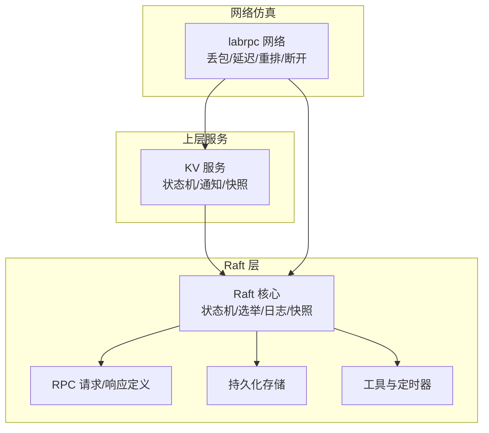
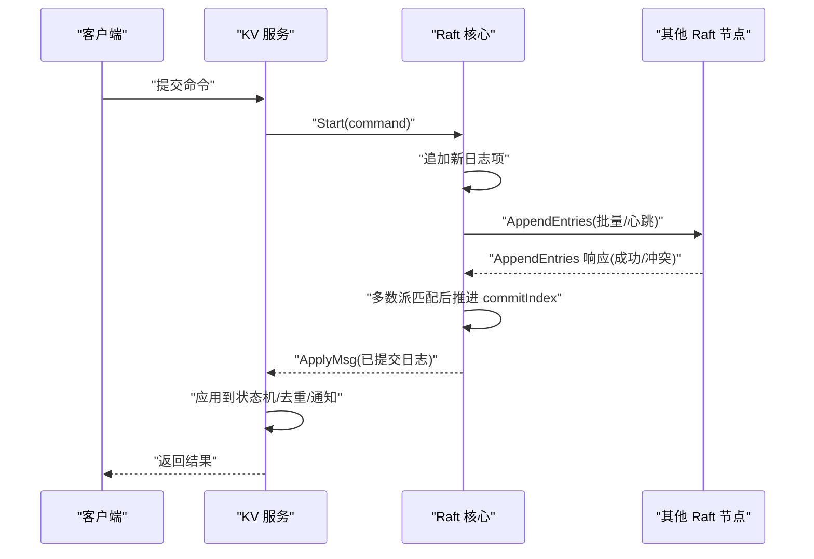
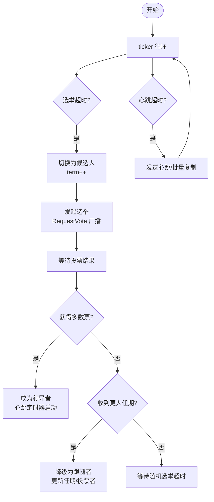
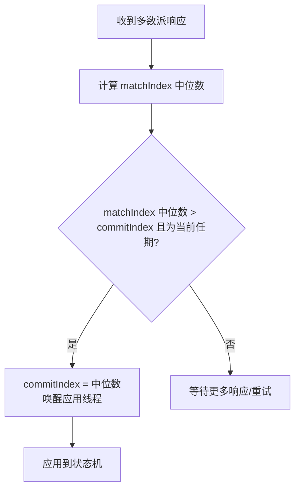
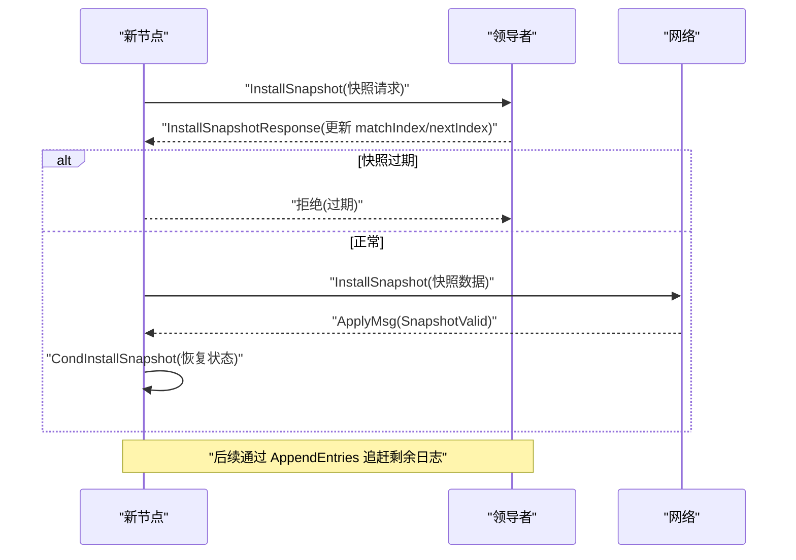
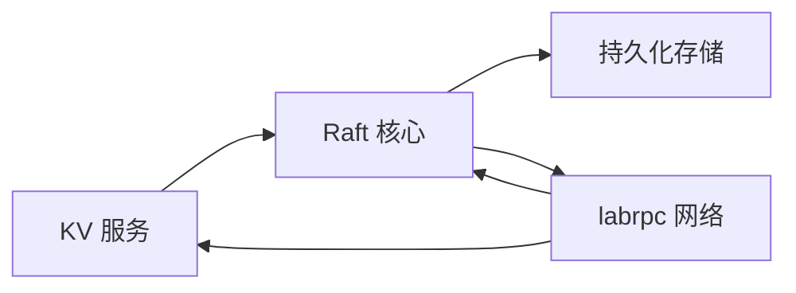

# 故障处理与容错

## 目录
1. [简介](#简介)
2. [项目结构](#项目结构)
3. [核心组件](#核心组件)
4. [架构总览](#架构总览)
5. [详细组件分析](#详细组件分析)
6. [依赖关系分析](#依赖关系分析)
7. [性能考量](#性能考量)
8. [故障排查指南](#故障排查指南)
9. [结论](#结论)
10. [附录](#附录)

## 简介
本文件聚焦于 Raft 分布式共识协议在本仓库中的故障处理与容错机制，围绕以下主题展开：
- 故障检测机制：心跳超时、网络分区与节点失效处理
- 容错能力：少数节点故障不影响集群运行、数据不丢失与一致性保证
- 故障恢复流程：节点重启、状态恢复与重新加入集群
- 不同故障场景的处理策略与恢复时间评估
- 包含故障处理流程图、恢复过程示例与故障排除指南
- 解释监控告警、自动恢复与人工干预机制

## 项目结构
该仓库采用分层与模块化组织方式：
- raft 层：实现 Raft 核心共识逻辑（状态机、选举、日志复制、快照）
- kvraft 层：基于 Raft 的键值服务，负责应用日志到状态机并提供客户端接口
- labrpc 层：模拟网络环境（丢包、延迟、重排、断开），用于测试与演示
- 测试与配置：通过 config.go 提供测试框架，支持不可靠网络、快照等场景

图表来源
- [raft/raft.go](file://raft/raft.go#L37-L60)
- [raft/rpc.go](file://raft/rpc.go#L5-L67)
- [raft/persister.go](file://raft/persister.go#L17-L22)
- [raft/util.go](file://raft/util.go#L84-L95)
- [kvraft/server.go](file://kvraft/server.go#L88-L100)
- [labrpc/labrpc.go](file://labrpc/labrpc.go#L128-L141)

章节来源
- [raft/raft.go](file://raft/raft.go#L37-L60)
- [raft/util.go](file://raft/util.go#L84-L95)
- [labrpc/labrpc.go](file://labrpc/labrpc.go#L128-L141)

## 核心组件
- Raft 核心状态机与定时器
  - 节点状态：跟随者、候选人、领导者
  - 心跳与选举定时器：随机化选举超时，稳定心跳周期
  - 日志复制与提交：基于多数派提交，确保一致性
- RPC 接口与消息类型
  - RequestVote、AppendEntries、InstallSnapshot 及其请求/响应
- 持久化与快照
  - Raft 状态与快照原子保存，支持日志裁剪与状态恢复
- 上层 KV 服务
  - 将 Raft 日志应用到状态机，提供客户端命令执行与通知
- 网络仿真
  - 支持可靠/不可靠网络、长延迟、重排序与服务器断开

章节来源
- [raft/raft.go](file://raft/raft.go#L37-L60)
- [raft/rpc.go](file://raft/rpc.go#L5-L67)
- [raft/persister.go](file://raft/persister.go#L71-L98)
- [kvraft/server.go](file://kvraft/server.go#L88-L100)
- [labrpc/labrpc.go](file://labrpc/labrpc.go#L174-L193)

## 架构总览
Raft 在本项目中以“核心共识 + 上层服务 + 网络仿真”的方式组织。KV 服务通过 Raft 的 ApplyMsg 获取已提交的日志条目，并将其应用到状态机；Raft 通过 RPC 与其他节点交互，使用持久化存储保障崩溃后可恢复。

图表来源
- [kvraft/server.go](file://kvraft/server.go#L102-L139)
- [raft/raft.go](file://raft/raft.go#L581-L591)
- [raft/raft.go](file://raft/raft.go#L353-L366)
- [raft/raft.go](file://raft/raft.go#L423-L449)

## 详细组件分析

### 故障检测机制：心跳超时、网络分区与节点失效
- 心跳超时与选举触发
  - Raft 使用两个定时器：选举计时器与心跳计时器。领导者定期发送心跳维持权威；跟随者在选举超时未收到心跳则发起选举。
  - 选举超时为随机化区间，避免多个节点同时发起选举导致“双主”或反复分裂。
- 网络分区与节点失效
  - 网络仿真层支持断开连接、丢包、延迟与重排序。当分区发生时，存活节点可能因无法收到心跳而触发选举；断开的节点在恢复后会通过 AppendEntries/InstallSnapshot 与集群同步。
- 跟随者侧处理
  - 接收 AppendEntries/RequestVote 时重置选举计时器，保持活跃状态；若任期变化或日志不匹配，进行回退与冲突定位。

图表来源
- [raft/raft.go](file://raft/raft.go#L616-L635)
- [raft/raft.go](file://raft/raft.go#L316-L351)
- [raft/util.go](file://raft/util.go#L89-L95)

章节来源
- [raft/raft.go](file://raft/raft.go#L616-L635)
- [raft/raft.go](file://raft/raft.go#L166-L187)
- [raft/raft.go](file://raft/raft.go#L189-L241)
- [labrpc/labrpc.go](file://labrpc/labrpc.go#L221-L312)

### 容错能力：少数节点故障不影响集群运行、数据不丢失与一致性保证
- 多数派提交
  - 提交索引推进基于 matchIndex 的中位数，仅当当前任期日志被多数节点匹配时才推进，确保已提交日志不会回滚。
- 数据不丢失
  - 通过持久化存储保存 Raft 状态与快照；日志裁剪与快照安装保证即使落后也能安全追赶。
- 一致性保证
  - 日志匹配检查与冲突回退机制，确保领导者与跟随者的日志分歧能被逐步修复；ApplyMsg 保证每个日志只应用一次。

图表来源
- [raft/raft.go](file://raft/raft.go#L497-L514)
- [raft/raft.go](file://raft/raft.go#L638-L664)

章节来源
- [raft/raft.go](file://raft/raft.go#L497-L514)
- [raft/raft.go](file://raft/raft.go#L638-L664)
- [raft/raft.go](file://raft/raft.go#L120-L144)

### 故障恢复流程：节点重启、状态恢复与重新加入集群
- 节点重启与状态恢复
  - 启动时读取持久化状态与快照，初始化日志与提交/应用指针；随后启动定时器、应用与复制协程。
- 重新加入集群
  - 新节点通过 InstallSnapshot 或 AppendEntries 与集群同步；领导者根据 nextIndex/matchIndex 决定是否需要快照或增量复制。
- 快照与日志裁剪
  - 当日志过大或上层服务要求时，触发快照；落后节点通过 CondInstallSnapshot 安装快照并恢复状态。

图表来源
- [raft/raft.go](file://raft/raft.go#L243-L275)
- [raft/raft.go](file://raft/raft.go#L451-L473)
- [raft/raft.go](file://raft/raft.go#L120-L144)
- [kvraft/server.go](file://kvraft/server.go#L224-L236)

章节来源
- [raft/raft.go](file://raft/raft.go#L689-L725)
- [raft/raft.go](file://raft/raft.go#L243-L275)
- [raft/raft.go](file://raft/raft.go#L120-L144)
- [kvraft/server.go](file://kvraft/server.go#L224-L236)

### 不同故障场景的处理策略与恢复时间
- 单节点断开
  - 若断开的是跟随者，领导者仍可与剩余多数派达成一致；断开后重新连接，通过 AppendEntries 与 InstallSnapshot 同步。
- 领导者断开
  - 其余节点在选举超时后发起选举；旧领导者恢复后降级为跟随者并接受新任期。
- 网络分区
  - 分区期间无法形成多数派时无领导者；分区合并后，存活节点重新选举，旧分区内的节点通过心跳/日志追赶恢复。
- 快速重连与崩溃重启
  - 重连后立即参与选举/复制；崩溃重启后从持久化状态恢复，必要时安装快照。

章节来源
- [raft/test_test.go](file://raft/test_test.go#L62-L87)
- [raft/test_test.go](file://raft/test_test.go#L366-L382)
- [labrpc/labrpc.go](file://labrpc/labrpc.go#L349-L373)

## 依赖关系分析
- 组件耦合
  - Raft 与持久化存储强耦合，确保崩溃恢复；Raft 与上层 KV 通过 ApplyMsg 解耦。
  - 网络仿真层对 RPC 调用透明，便于测试不同网络条件下的行为。
- 外部依赖
  - labrpc 提供可靠的 RPC 抽象与统计；KV 服务依赖 LevelDB 存储状态机数据。

图表来源
- [kvraft/server.go](file://kvraft/server.go#L318-L341)
- [raft/raft.go](file://raft/raft.go#L689-L725)
- [labrpc/labrpc.go](file://labrpc/labrpc.go#L128-L141)

章节来源
- [kvraft/server.go](file://kvraft/server.go#L318-L341)
- [raft/raft.go](file://raft/raft.go#L689-L725)
- [labrpc/labrpc.go](file://labrpc/labrpc.go#L128-L141)

## 性能考量
- 心跳与选举参数
  - 心跳周期稳定，选举超时随机化，降低竞争与脑裂风险。
- 日志与快照
  - 通过快照减少日志大小，提升恢复速度；日志裁剪避免内存膨胀。
- 应用与复制并发
  - 应用线程与复制线程分离，提高吞吐；按需批量复制，减少 RPC 数量。

章节来源
- [raft/util.go](file://raft/util.go#L89-L95)
- [raft/raft.go](file://raft/raft.go#L638-L664)
- [raft/raft.go](file://raft/raft.go#L353-L366)
- [raft/persister.go](file://raft/persister.go#L92-L98)

## 故障排查指南
- 常见问题与定位
  - 无领导者：检查网络连接与分区；确认多数派节点在线；观察选举超时是否异常缩短。
  - 提交停滞：检查多数派 matchIndex 是否滞后；查看 AppendEntries 响应冲突信息。
  - 快照安装失败：确认快照索引/任期有效；检查 CondInstallSnapshot 条件与 ApplyMsg 流程。
  - 客户端超时：检查领导者是否仍在当前任期；确认网络可靠性与 RPC 统计。
- 自动恢复与人工干预
  - 自动：Raft 自身的选举与复制机制可自动恢复；上层 KV 服务通过通知通道与超时控制保障客户端体验。
  - 人工：在测试环境中可通过断开/连接节点、触发崩溃/重启验证容错；生产中建议结合监控告警与自动化运维。

章节来源
- [raft/raft.go](file://raft/raft.go#L166-L187)
- [raft/raft.go](file://raft/raft.go#L189-L241)
- [raft/raft.go](file://raft/raft.go#L243-L275)
- [kvraft/server.go](file://kvraft/server.go#L102-L139)
- [raft/config.go](file://raft/config.go#L307-L350)

## 结论
本实现通过稳定的定时器、严格的多数派提交与完善的快照/持久化机制，提供了可靠的 Raft 容错能力。在多数节点故障情况下，系统仍可维持一致性与可用性；在网络分区与节点失效场景下，具备清晰的恢复路径与较短的恢复时间。配合上层 KV 服务的幂等与去重机制，整体系统在复杂网络条件下具备良好的鲁棒性。

## 附录
- 关键流程图与示例
  - 选举与心跳：参见“故障检测机制”流程图
  - 快照安装：参见“故障恢复流程”序列图
  - 提交推进：参见“容错能力”流程图
- 相关测试参考
  - 选举与分区测试、快照测试等可在测试文件中找到具体用例与断言逻辑。

章节来源
- [raft/test_test.go](file://raft/test_test.go#L24-L89)
- [raft/test_test.go](file://raft/test_test.go#L1065-L1084)