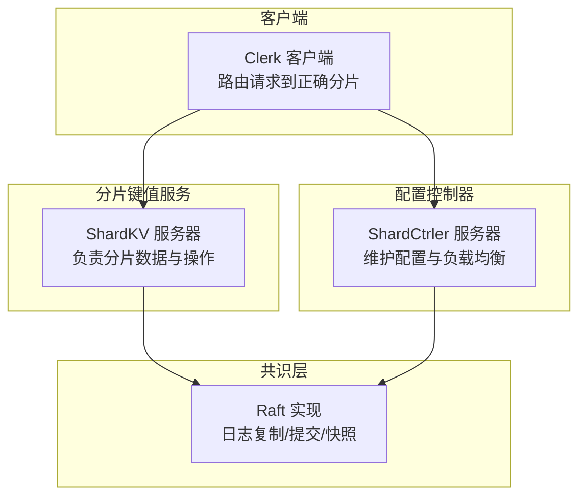
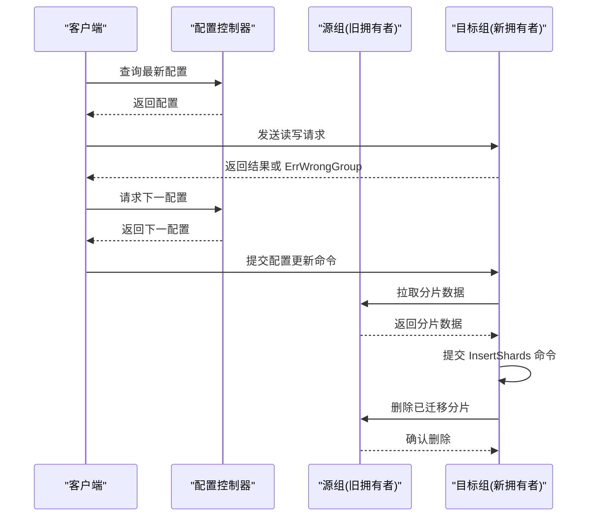
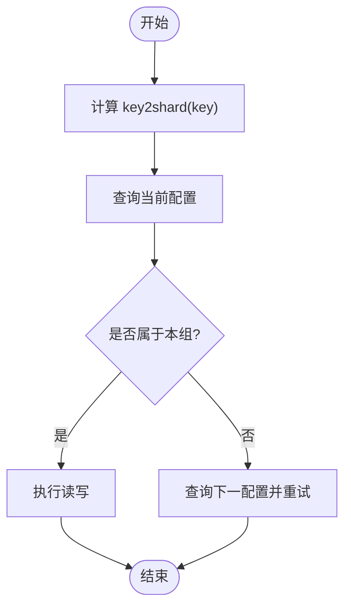
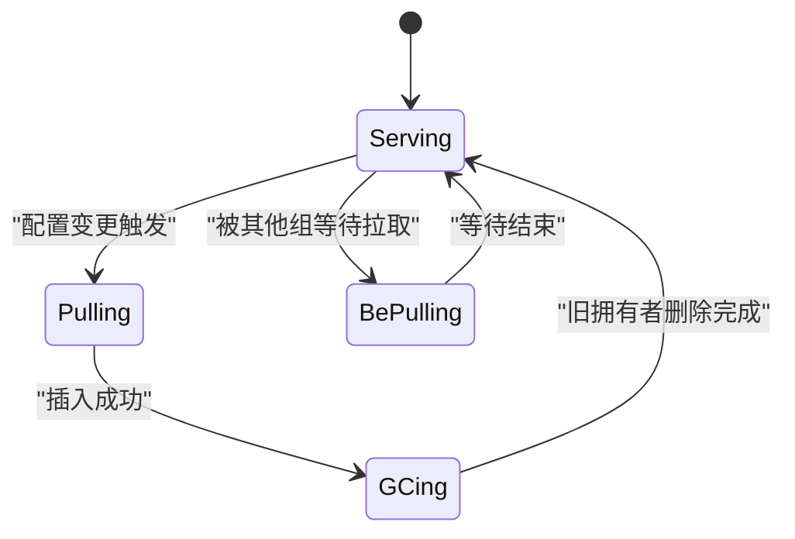
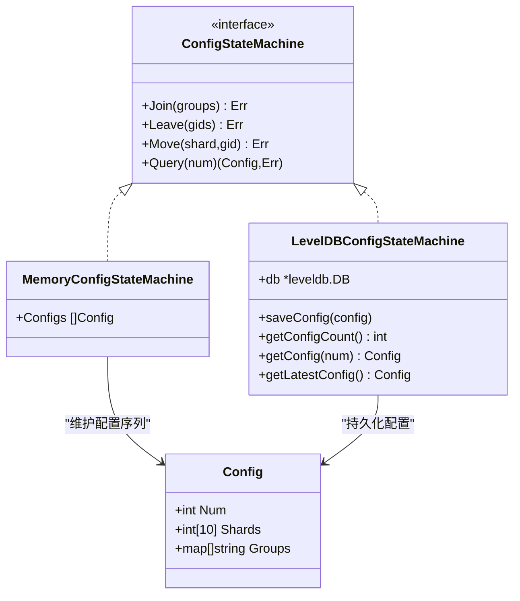
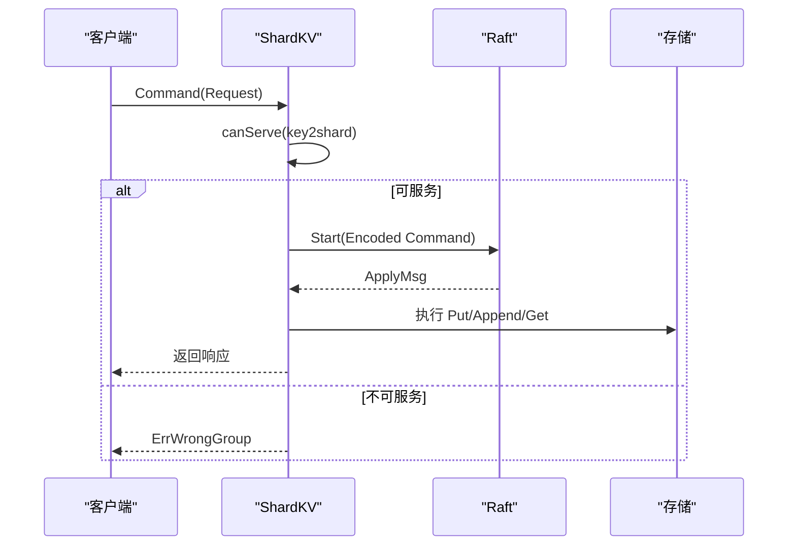
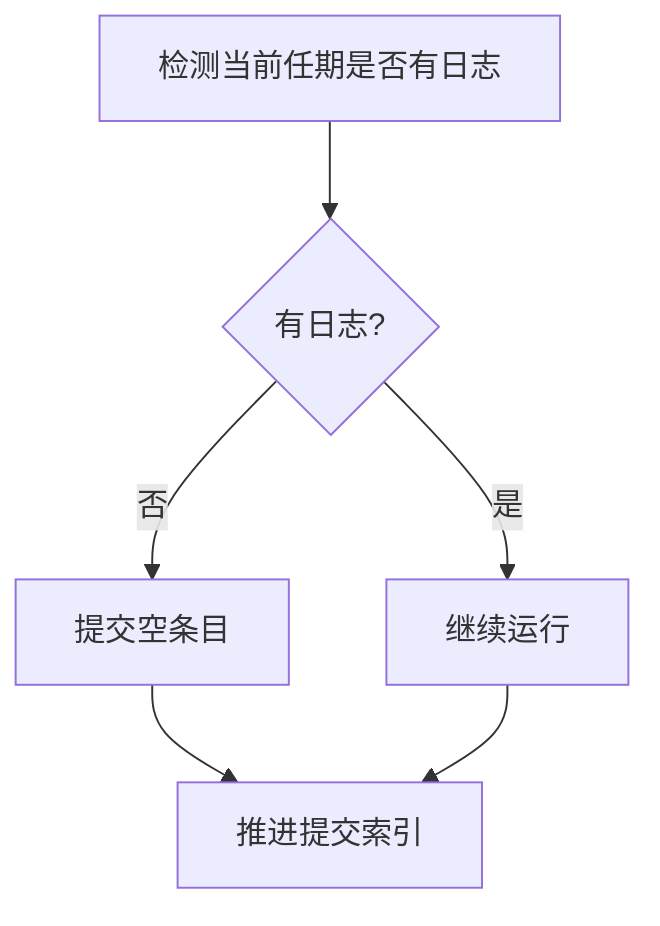
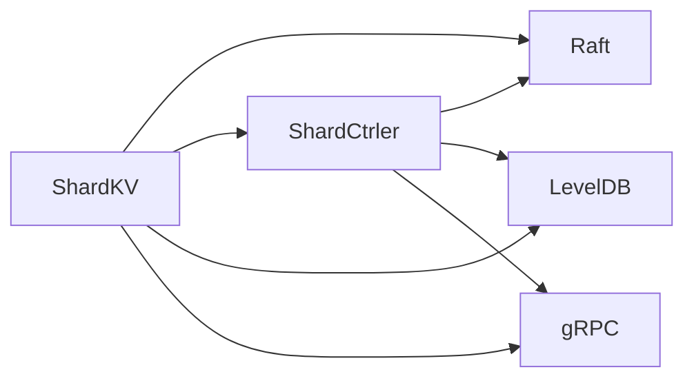

# 分片机制

<cite>
**本文引用的文件**
- [shardkv/server.go](file://shardkv/server.go)
- [shardkv/common.go](file://shardkv/common.go)
- [shardkv/shard.go](file://shardkv/shard.go)
- [shardkv/client.go](file://shardkv/client.go)
- [shardkv/config.go](file://shardkv/config.go)
- [shardctrler/server.go](file://shardctrler/server.go)
- [shardctrler/common.go](file://shardctrler/common.go)
- [shardctrler/configstm.go](file://shardctrler/configstm.go)
- [shardctrler/client.go](file://shardctrler/client.go)
- [raft/raft.go](file://raft/raft.go)
- [wiki/Sharding-Mechanism.md](file://wiki/Sharding-Mechanism.md)
</cite>

## 目录
1. [简介](#简介)
2. [项目结构](#项目结构)
3. [核心组件](#核心组件)
4. [架构总览](#架构总览)
5. [详细组件分析](#详细组件分析)
6. [依赖关系分析](#依赖关系分析)
7. [性能考量](#性能考量)
8. [故障排查指南](#故障排查指南)
9. [结论](#结论)
10. [附录](#附录)

## 简介
本文件系统性阐述 eRaft 的分片机制，围绕水平分片设计、数据路由策略、分片键计算、配置控制器（ShardCtrler）与组管理、分片迁移（拉取、整合、垃圾回收）、状态管理与并发控制、一致性保障、Raft 协作、负载均衡与动态调整、故障恢复，以及运维与排障进行深入说明。文档同时提供架构图、时序图与流程图，帮助读者从高层到代码级全面理解分片实现。

## 项目结构
- shardkv：分片键值服务，每个 Raft 组负责若干分片的数据存储与操作执行。
- shardctrler：配置控制器，维护“分片到组”的映射与配置变更。
- raft：Raft 共识层，提供日志复制、提交、快照与领导者选举。
- shardkvpb/shardctrlerpb：gRPC 接口定义，用于跨进程通信。
- wiki：文档说明，包含分片机制概览。

图表来源
- [shardkv/server.go](file://shardkv/server.go#L76-L99)
- [shardctrler/server.go](file://shardctrler/server.go#L17-L26)
- [raft/raft.go](file://raft/raft.go#L37-L60)

章节来源
- [shardkv/server.go](file://shardkv/server.go#L76-L99)
- [shardctrler/server.go](file://shardctrler/server.go#L17-L26)
- [raft/raft.go](file://raft/raft.go#L37-L60)

## 核心组件
- 分片键值服务（ShardKV）
  - 负责每个分片的数据存储（基于 LevelDB），处理客户端读写请求，执行 Raft 日志命令，维护分片状态机与通知通道。
  - 提供分片拉取与垃圾回收 RPC，支持在配置变更时进行数据迁移。
- 配置控制器（ShardCtrler）
  - 维护配置历史（含 Num、Shards 映射、Groups 列表），提供 Join/Leave/Move/Query 操作，实现负载均衡策略。
- Raft 共识层（raft）
  - 提供日志复制、提交、快照、领导者检测等能力，支撑分片与配置的强一致。
- 客户端（Clerk）
  - 基于分片键计算定位目标分片，向对应组的领导者发起请求；在配置变更时自动重试与切换。

章节来源
- [shardkv/server.go](file://shardkv/server.go#L76-L99)
- [shardctrler/server.go](file://shardctrler/server.go#L17-L26)
- [raft/raft.go](file://raft/raft.go#L37-L60)
- [shardkv/client.go](file://shardkv/client.go#L151-L189)

## 架构总览
分片机制采用“水平分片 + 配置控制器 + Raft 共识”的组合：
- 数据按分片键分布到 10 个逻辑分片。
- ShardCtrler 决定每个分片归属的组（GroupID），并提供查询接口。
- 每个组内部通过 Raft 保证日志复制与提交顺序。
- 当配置变更时，新拥有者先拉取旧拥有者的分片数据，提交后由旧拥有者删除。

图表来源
- [shardkv/server.go](file://shardkv/server.go#L110-L127)
- [shardkv/server.go](file://shardkv/server.go#L159-L193)
- [shardkv/server.go](file://shardkv/server.go#L195-L217)
- [shardkv/server.go](file://shardkv/server.go#L572-L643)
- [shardkv/server.go](file://shardkv/server.go#L645-L696)
- [shardctrler/server.go](file://shardctrler/server.go#L179-L215)

章节来源
- [shardkv/server.go](file://shardkv/server.go#L110-L127)
- [shardkv/server.go](file://shardkv/server.go#L159-L193)
- [shardkv/server.go](file://shardkv/server.go#L195-L217)
- [shardkv/server.go](file://shardkv/server.go#L572-L643)
- [shardkv/server.go](file://shardkv/server.go#L645-L696)
- [shardctrler/server.go](file://shardctrler/server.go#L179-L215)

## 详细组件分析

### 分片键与数据路由
- 分片键计算
  - 使用 key 的首字节作为哈希种子，对分片总数取模，得到 shardID。
  - 该函数确保相同 key 总是落在同一分片上，便于一致性与迁移管理。
- 客户端路由
  - 客户端根据当前配置的 Shards 映射选择目标组与领导者，若返回 ErrWrongGroup，则重新查询配置并重试。

图表来源
- [shardkv/client.go](file://shardkv/client.go#L29-L36)
- [shardkv/client.go](file://shardkv/client.go#L206-L265)

章节来源
- [shardkv/client.go](file://shardkv/client.go#L29-L36)
- [shardkv/client.go](file://shardkv/client.go#L206-L265)

### 分片状态机与迁移流程
- 分片状态
  - Serving：分片正常服务。
  - Pulling：等待从其他组拉取数据。
  - BePulling：等待其他组完成拉取。
  - GCing：等待旧拥有者删除数据。
- 迁移阶段
  - 检测：领导者周期性检查下一配置。
  - 拉取：新拥有者向旧拥有者请求分片数据与最后操作上下文。
  - 整合：将数据作为 InsertShards 命令提交，写入本地存储并更新状态为 GCing。
  - 垃圾回收：向旧拥有者发送 DeleteShards 命令，确认后本地状态回退为 Serving。
- 并发与幂等
  - 通过 lastOperations 记录客户端最大已应用命令 ID，避免重复执行。
  - 通过 shardStatus 严格控制迁移阶段，防止重复拉取或删除。

图表来源
- [shardkv/server.go](file://shardkv/server.go#L430-L445)
- [shardkv/server.go](file://shardkv/server.go#L360-L383)
- [shardkv/server.go](file://shardkv/server.go#L385-L405)

章节来源
- [shardkv/server.go](file://shardkv/server.go#L430-L445)
- [shardkv/server.go](file://shardkv/server.go#L360-L383)
- [shardkv/server.go](file://shardkv/server.go#L385-L405)

### 配置控制器与组管理
- 配置模型
  - Num：配置号，递增。
  - Shards：分片到组的映射。
  - Groups：组到服务器列表的映射。
- 负载均衡策略
  - Join：加入新组，将拥有过多分片的组向拥有较少分片的组转移一个分片，直到平衡。
  - Leave：移除组，将该组的孤儿分片均匀分配给剩余组。
  - Move：直接移动单一分片。
  - Query：查询指定或最新配置。
- 存储与状态机
  - 支持内存与 LevelDB 两种状态机实现，前者用于测试，后者用于持久化。

图表来源
- [shardctrler/common.go](file://shardctrler/common.go#L31-L43)
- [shardctrler/configstm.go](file://shardctrler/configstm.go#L7-L14)
- [shardctrler/configstm.go](file://shardctrler/configstm.go#L16-L24)
- [shardctrler/configstm.go](file://shardctrler/configstm.go#L31-L53)
- [shardctrler/configstm.go](file://shardctrler/configstm.go#L56-L85)
- [shardctrler/configstm.go](file://shardctrler/configstm.go#L88-L94)

章节来源
- [shardctrler/common.go](file://shardctrler/common.go#L31-L43)
- [shardctrler/configstm.go](file://shardctrler/configstm.go#L7-L14)
- [shardctrler/configstm.go](file://shardctrler/configstm.go#L16-L24)
- [shardctrler/configstm.go](file://shardctrler/configstm.go#L31-L53)
- [shardctrler/configstm.go](file://shardctrler/configstm.go#L56-L85)
- [shardctrler/configstm.go](file://shardctrler/configstm.go#L88-L94)

### 分片服务器（ShardKV）核心逻辑
- 存储与状态
  - LevelDB 分片存储，键格式包含分片 ID 与原始键，便于批量扫描与清理。
  - shardStatus 数组跟踪每分片状态；lastOperations 记录客户端最大已应用命令 ID。
- 请求处理
  - Get/PUT/APPEND：先判断是否可服务，再提交 Raft 命令执行。
  - 去重：若客户端最新请求 ID 小于等于记录的最大已应用 ID，则直接返回上次响应。
- 配置与迁移
  - applyConfiguration：当配置号连续递增时更新当前配置与分片状态。
  - applyInsertShards/applyDeleteShards：分别处理拉取数据整合与垃圾回收。
- 快照与恢复
  - takeSnapshot：遍历 LevelDB，编码所有数据与状态，提交给 Raft。
  - restoreSnapshot：从快照重建存储与状态机。

图表来源
- [shardkv/server.go](file://shardkv/server.go#L110-L127)
- [shardkv/server.go](file://shardkv/server.go#L248-L326)
- [shardkv/server.go](file://shardkv/server.go#L328-L345)
- [shardkv/server.go](file://shardkv/server.go#L467-L485)
- [shardkv/server.go](file://shardkv/server.go#L487-L516)

章节来源
- [shardkv/server.go](file://shardkv/server.go#L110-L127)
- [shardkv/server.go](file://shardkv/server.go#L248-L326)
- [shardkv/server.go](file://shardkv/server.go#L328-L345)
- [shardkv/server.go](file://shardkv/server.go#L467-L485)
- [shardkv/server.go](file://shardkv/server.go#L487-L516)

### Raft 协作与一致性
- 日志与提交
  - ShardKV 通过 Raft.Start 提交命令，applier 在 ApplyMsg 到达后执行状态机更新。
- 快照与日志修剪
  - 当 Raft 状态大小超过阈值时触发快照；ShardKV 在恢复时重建存储与状态。
- 空日志保活
  - 若当前任期内无日志，定期提交空条目以推进提交索引，避免活锁。

图表来源
- [shardkv/server.go](file://shardkv/server.go#L718-L722)
- [raft/raft.go](file://raft/raft.go#L150-L164)

章节来源
- [shardkv/server.go](file://shardkv/server.go#L718-L722)
- [raft/raft.go](file://raft/raft.go#L150-L164)

### 负载均衡与动态调整
- Join/Leave/Move
  - Join：加入新组后，将多出的分片逐个迁移到最少分片的组，直至相邻组数量差不超过 1。
  - Leave：移除组后，将孤儿分片均匀分配给剩余组。
  - Move：直接将指定分片移动到目标组。
- 自动迁移
  - 配置控制器生成新配置后，各组领导者周期性检测并执行拉取与删除。

章节来源
- [shardctrler/configstm.go](file://shardctrler/configstm.go#L26-L54)
- [shardctrler/configstm.go](file://shardctrler/configstm.go#L56-L85)
- [shardctrler/configstm.go](file://shardctrler/configstm.go#L88-L94)
- [shardkv/server.go](file://shardkv/server.go#L549-L570)
- [shardkv/server.go](file://shardkv/server.go#L572-L643)
- [shardkv/server.go](file://shardkv/server.go#L645-L696)

### 并发控制与一致性保证
- 去重与幂等
  - lastOperations 记录客户端最大已应用命令 ID，避免重复执行。
- 通知通道
  - 为每个提交索引维护通知通道，仅在当前任期领导者时通知，避免跨任期响应。
- 状态机与快照
  - 快照包含 shardStatus、lastOperations、currentConfig、lastConfig，确保重启后状态一致。

章节来源
- [shardkv/common.go](file://shardkv/common.go#L93-L100)
- [shardkv/server.go](file://shardkv/server.go#L248-L326)
- [shardkv/server.go](file://shardkv/server.go#L467-L485)
- [shardkv/server.go](file://shardkv/server.go#L487-L516)

### 运维指南与故障排除
- 常见问题
  - ErrWrongGroup：客户端收到错误组提示，应重新查询配置并重试。
  - ErrNotReady：目标组尚未准备好接收新配置，稍后重试。
  - ErrTimeout：请求超时，检查网络连通性与领导者状态。
- 排查步骤
  - 检查配置控制器状态与日志大小。
  - 检查分片服务器的分片状态与存储大小。
  - 观察迁移任务是否卡在 Pulling/GCing。
  - 查看 Raft 日志大小与快照状态。
- 建议
  - 合理设置 maxRaftState 以触发快照，避免日志过大。
  - 监控迁移任务的周期性执行，确保配置变更及时生效。

章节来源
- [shardkv/server.go](file://shardkv/server.go#L110-L127)
- [shardkv/server.go](file://shardkv/server.go#L159-L193)
- [shardkv/server.go](file://shardkv/server.go#L195-L217)
- [shardkv/server.go](file://shardkv/server.go#L549-L570)
- [shardkv/server.go](file://shardkv/server.go#L572-L643)
- [shardkv/server.go](file://shardkv/server.go#L645-L696)

## 依赖关系分析
- 组件耦合
  - ShardKV 依赖 Raft 提供的日志复制与提交；依赖 ShardCtrler 提供的配置。
  - ShardCtrler 依赖 Raft 提供的配置命令提交与状态机。
- 外部依赖
  - LevelDB 用于持久化存储。
  - gRPC 用于跨进程通信。
  - labrpc 用于测试环境下的 RPC 适配。

图表来源
- [shardkv/server.go](file://shardkv/server.go#L76-L99)
- [shardctrler/server.go](file://shardctrler/server.go#L17-L26)
- [raft/raft.go](file://raft/raft.go#L37-L60)

章节来源
- [shardkv/server.go](file://shardkv/server.go#L76-L99)
- [shardctrler/server.go](file://shardctrler/server.go#L17-L26)
- [raft/raft.go](file://raft/raft.go#L37-L60)

## 性能考量
- 存储与快照
  - LevelDB 遍历全库进行快照，适合小规模数据；大规模场景建议优化快照策略。
- 迁移开销
  - 拉取与删除为批量操作，需关注网络带宽与磁盘 IO。
- 并发与通知
  - 通知通道异步释放，减少阻塞；但需注意内存占用与过期清理。
- Raft 参数
  - 合理设置 maxRaftState 与心跳间隔，平衡吞吐与稳定性。

## 故障排查指南
- 配置不一致
  - 检查 ShardCtrler 的配置号是否连续递增，确认各组 applyConfiguration 是否成功。
- 迁移停滞
  - 检查分片状态是否停留在 Pulling/GCing；确认 RPC 调用链路与权限。
- 快照异常
  - 检查快照编码/解码过程，确认存储路径与权限。
- 客户端重试
  - 客户端收到 ErrWrongGroup 时会自动重试，若频繁出现，检查配置控制器与网络。

章节来源
- [shardkv/server.go](file://shardkv/server.go#L348-L358)
- [shardkv/server.go](file://shardkv/server.go#L360-L383)
- [shardkv/server.go](file://shardkv/server.go#L385-L405)
- [shardkv/server.go](file://shardkv/server.go#L487-L516)
- [shardkv/client.go](file://shardkv/client.go#L246-L265)

## 结论
eRaft 的分片机制通过 ShardCtrler 的集中式配置管理与 Raft 的强一致复制，实现了水平分片的自动化迁移与负载均衡。ShardKV 在每个组内维护分片状态机与去重机制，结合快照与通知通道，确保高可用与一致性。整体设计清晰、扩展性强，适合在生产环境中进行进一步优化与监控。

## 附录
- 分片机制概述（来自 wiki）
  - 使用水平分片将数据划分为 10 个逻辑分片，配置控制器管理分片到组的映射。
  - 配置变更时进行“在线”迁移：检测—拉取—整合—垃圾回收。
  - 分片状态包括 Serving/Pulling/BePulling/GCing。

章节来源
- [wiki/Sharding-Mechanism.md](file://wiki/Sharding-Mechanism.md#L1-L21)