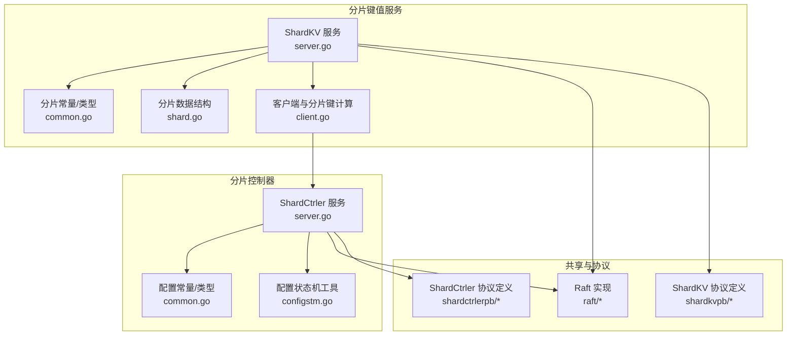
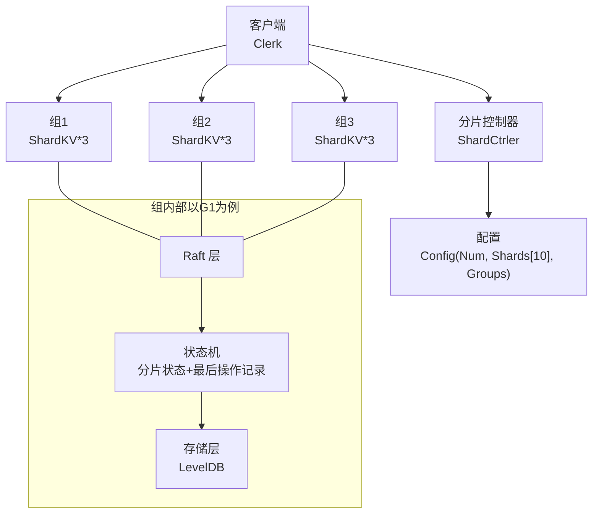
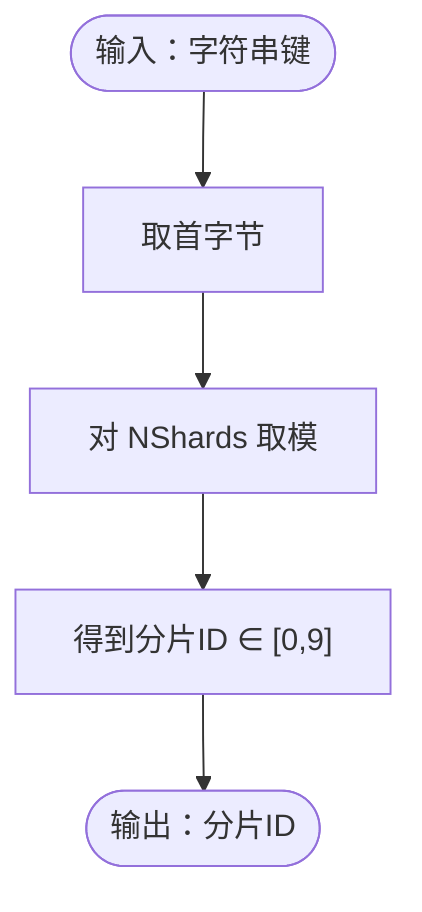
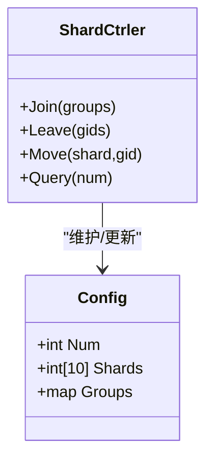
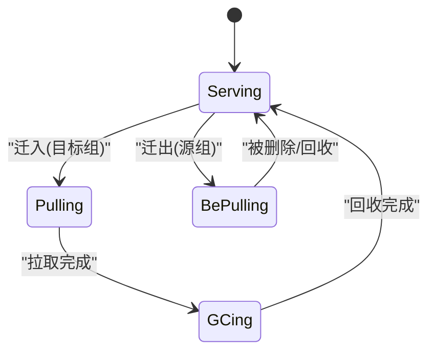
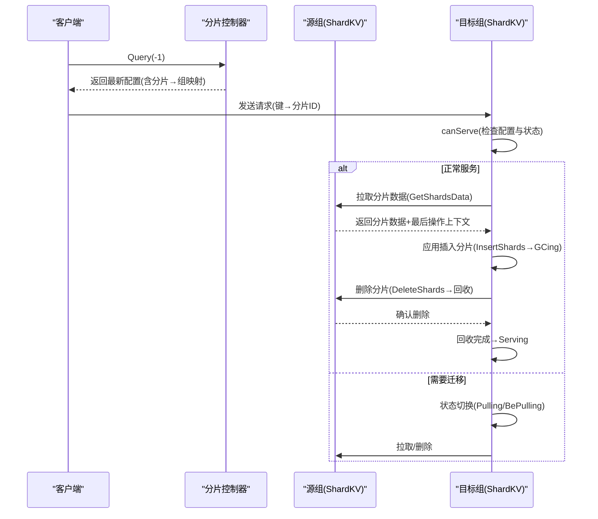
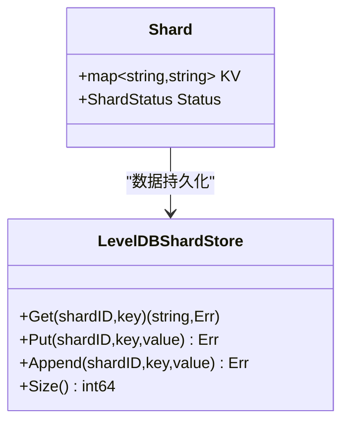
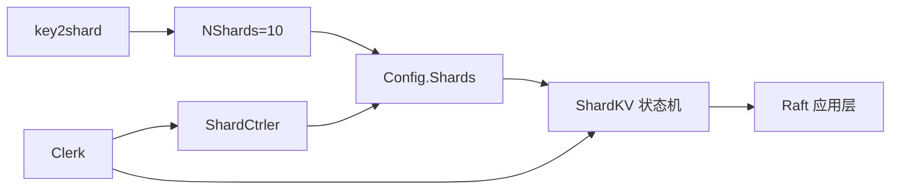

# 分片设计原理

**本文引用的文件**
- [shardkv/server.go](file://shardkv/server.go)
- [shardkv/common.go](file://shardkv/common.go)
- [shardkv/shard.go](file://shardkv/shard.go)
- [shardkv/client.go](file://shardkv/client.go)
- [shardctrler/common.go](file://shardctrler/common.go)
- [shardctrler/configstm.go](file://shardctrler/configstm.go)
- [shardctrler/server.go](file://shardctrler/server.go)
- [shardkvpb/shardkv.pb.go](file://shardkvpb/shardkv.pb.go)
- [shardctrlerpb/shardctrler.pb.go](file://shardctrlerpb/shardctrler.pb.go)

## 目录
1. [引言](#引言)
2. [项目结构](#项目结构)
3. [核心组件](#核心组件)
4. [架构总览](#架构总览)
5. [详细组件分析](#详细组件分析)
6. [依赖关系分析](#依赖关系分析)
7. [性能考量](#性能考量)
8. [故障排查指南](#故障排查指南)
9. [结论](#结论)
10. [附录](#附录)

## 引言
本文件系统性阐述该代码库中的分片设计原理，围绕以下主题展开：水平分片的基本概念、分片数量设定（NShards=10）、分片键计算算法（key2shard）、分片映射表与配置模型、分片状态机与生命周期、分片与 Raft 组的关系、所有权分配策略与负载均衡、分片状态枚举及其转换条件、以及分片大小限制、内存占用与存储分布策略。文档同时提供流程图与时序图帮助理解关键路径。

## 项目结构
该项目采用按功能域划分的模块化组织方式，主要模块包括：
- shardkv：分片键值服务，负责数据分片、状态机、Raft 集成、迁移与回收等
- shardctrler：分片控制器，负责维护配置（分片到组的映射）与负载均衡
- raft：Raft 共享实现（日志复制、快照、RPC）
- kvraft：单分片键值服务（作为对比参考）
- models、porcupine、labrpc、labgob 等支撑库

图表来源
- [shardkv/server.go](file://shardkv/server.go#L76-L99)
- [shardkv/common.go](file://shardkv/common.go#L21-L91)
- [shardkv/shard.go](file://shardkv/shard.go#L3-L10)
- [shardkv/client.go](file://shardkv/client.go#L26-L36)
- [shardctrler/server.go](file://shardctrler/server.go#L17-L26)
- [shardctrler/common.go](file://shardctrler/common.go#L26-L35)
- [shardctrler/configstm.go](file://shardctrler/configstm.go#L109-L156)
- [shardkvpb/shardkv.pb.go](file://shardkvpb/shardkv.pb.go#L472-L500)
- [shardctrlerpb/shardctrler.pb.go](file://shardctrlerpb/shardctrler.pb.go#L75-L110)

章节来源
- [shardkv/server.go](file://shardkv/server.go#L1-L200)
- [shardkv/common.go](file://shardkv/common.go#L1-L229)
- [shardkv/shard.go](file://shardkv/shard.go#L1-L36)
- [shardkv/client.go](file://shardkv/client.go#L25-L224)
- [shardctrler/common.go](file://shardctrler/common.go#L1-L141)
- [shardctrler/configstm.go](file://shardctrler/configstm.go#L103-L166)
- [shardctrler/server.go](file://shardctrler/server.go#L1-L200)
- [shardkvpb/shardkv.pb.go](file://shardkvpb/shardkv.pb.go#L472-L500)
- [shardctrlerpb/shardctrler.pb.go](file://shardctrlerpb/shardctrler.pb.go#L75-L110)

## 核心组件
- 分片键计算：key2shard 将字符串键映射到 [0, NShards-1] 的分片编号，确保同键始终落在同一分片
- 分片状态机：每个分片维护独立状态（Serving/Pulling/BePulling/GCing），用于迁移与回收阶段的状态控制
- 配置模型：ShardCtrler.Config 描述“配置号 + 分片到组映射 + 组到服务器列表”，用于全局一致性
- 迁移与回收：通过插入/删除分片命令在组间传递数据，并配合状态机完成生命周期管理
- 存储层：基于 LevelDB 的分片键空间前缀组织（s_{shardID}_key），支持批量写入与扫描

章节来源
- [shardkv/client.go](file://shardkv/client.go#L26-L36)
- [shardkv/common.go](file://shardkv/common.go#L70-L91)
- [shardctrler/common.go](file://shardctrler/common.go#L26-L35)
- [shardkv/server.go](file://shardkv/server.go#L430-L445)
- [shardkv/server.go](file://shardkv/server.go#L535-L547)

## 架构总览
分片系统由“分片控制器（ShardCtrler）+ 多个分片组（ShardKV）+ Raft 日志复制”构成。客户端通过 ShardCtrler 查询当前配置，再向对应组发送请求；组内以 Raft 为原子提交单元，应用层根据分片状态与配置进行迁移与回收。

图表来源
- [shardctrler/common.go](file://shardctrler/common.go#L26-L35)
- [shardkv/server.go](file://shardkv/server.go#L76-L99)
- [shardkv/server.go](file://shardkv/server.go#L248-L326)

## 详细组件分析

### 分片键计算与分片数量（NShards=10）
- 分片键算法：取键首字节对 NShards 取模，保证相同键名稳定落入同一分片
- 分片数量：固定为 10，便于均衡与测试验证

图表来源
- [shardkv/client.go](file://shardkv/client.go#L26-L36)
- [shardctrler/common.go](file://shardctrler/common.go#L26-L27)

章节来源
- [shardkv/client.go](file://shardkv/client.go#L26-L36)
- [shardctrler/common.go](file://shardctrler/common.go#L26-L27)

### 分片映射表与配置模型
- 配置结构：包含配置号（递增）、长度为 10 的分片数组（分片→组ID）、组到服务器地址映射
- 初始配置：空组，所有分片归属无效组（0）
- 负载均衡：控制器通过“最大最小分片数调整”策略尽量平衡各组分片数量

图表来源
- [shardctrler/common.go](file://shardctrler/common.go#L26-L43)
- [shardctrler/server.go](file://shardctrler/server.go#L84-L151)
- [shardctrler/configstm.go](file://shardctrler/configstm.go#L109-L156)

章节来源
- [shardctrler/common.go](file://shardctrler/common.go#L1-L141)
- [shardctrler/configstm.go](file://shardctrler/configstm.go#L103-L166)
- [shardctrler/server.go](file://shardctrler/server.go#L1-L200)

### 分片状态机与生命周期
- 状态枚举：Serving（服务中）、Pulling（正在从源组拉取）、BePulling（即将被其他组拉取）、GCing（等待回收）
- 初始化：所有分片初始状态为 Serving
- 生命周期转换：
  - 配置变更时，若某分片从当前组迁出，则对应分片进入 BePulling
  - 若某分片迁入当前组，则进入 Pulling；拉取完成后进入 GCing
  - 回收完成后回到 Serving，或在被拉取方被删除后重置为 Serving 并清理数据

图表来源
- [shardkv/common.go](file://shardkv/common.go#L70-L91)
- [shardkv/server.go](file://shardkv/server.go#L430-L445)
- [shardkv/server.go](file://shardkv/server.go#L360-L405)
- [shardkv/server.go](file://shardkv/server.go#L518-L522)

章节来源
- [shardkv/common.go](file://shardkv/common.go#L70-L91)
- [shardkv/server.go](file://shardkv/server.go#L430-L445)
- [shardkv/server.go](file://shardkv/server.go#L360-L405)
- [shardkv/server.go](file://shardkv/server.go#L518-L522)

### 分片与 Raft 组的关系、所有权分配与负载均衡
- 所有权：分片的当前拥有者由当前配置决定；只有当前组负责该分片的读写
- 负载均衡：控制器在 Join/Leave 时通过“最大最小分片数调整”策略，使各组分片数尽可能接近
- 迁移触发：当配置号递增时，目标组进入 Pulling，源组进入 BePulling，随后执行数据迁移与回收

图表来源
- [shardkv/server.go](file://shardkv/server.go#L110-L127)
- [shardkv/server.go](file://shardkv/server.go#L159-L193)
- [shardkv/server.go](file://shardkv/server.go#L195-L217)
- [shardkv/server.go](file://shardkv/server.go#L360-L383)
- [shardkv/server.go](file://shardkv/server.go#L385-L405)
- [shardctrler/server.go](file://shardctrler/server.go#L84-L151)

章节来源
- [shardkv/server.go](file://shardkv/server.go#L110-L127)
- [shardkv/server.go](file://shardkv/server.go#L159-L193)
- [shardkv/server.go](file://shardkv/server.go#L195-L217)
- [shardkv/server.go](file://shardkv/server.go#L360-L405)
- [shardctrler/server.go](file://shardctrler/server.go#L84-L151)

### 分片数据结构与存储分布
- 分片数据结构：每个分片为一个 KV 映射，配合状态字段
- 存储键空间：使用前缀 s_{shardID}_key 组织键，便于按分片扫描与清理
- 批量写入：迁移与恢复时使用 LevelDB Batch 提升吞吐
- 快照：持久化全部数据、分片状态、最后操作上下文与配置信息

图表来源
- [shardkv/shard.go](file://shardkv/shard.go#L3-L10)
- [shardkv/server.go](file://shardkv/server.go#L25-L60)
- [shardkv/server.go](file://shardkv/server.go#L467-L485)

章节来源
- [shardkv/shard.go](file://shardkv/shard.go#L1-L36)
- [shardkv/server.go](file://shardkv/server.go#L25-L60)
- [shardkv/server.go](file://shardkv/server.go#L467-L485)

### 客户端路由与错误处理
- 客户端根据当前配置选择目标组；若键所在分片不在当前组，返回“错误分组”提示客户端重新查询配置
- 去重：基于客户端维度的最后操作上下文避免重复执行
- 超时：执行等待超时返回 ErrTimeout

章节来源
- [shardkv/server.go](file://shardkv/server.go#L110-L127)
- [shardkv/server.go](file://shardkv/server.go#L221-L224)
- [shardkv/common.go](file://shardkv/common.go#L38-L68)

## 依赖关系分析
- 分片键计算依赖 NShards 常量
- 分片状态机依赖配置模型与 Raft 应用层
- 控制器依赖配置状态机与 Raft
- 客户端依赖控制器与目标组 RPC 接口

图表来源
- [shardkv/client.go](file://shardkv/client.go#L26-L36)
- [shardctrler/common.go](file://shardctrler/common.go#L26-L35)
- [shardkv/server.go](file://shardkv/server.go#L430-L445)
- [shardctrler/server.go](file://shardctrler/server.go#L84-L151)

章节来源
- [shardkv/client.go](file://shardkv/client.go#L26-L36)
- [shardctrler/common.go](file://shardctrler/common.go#L26-L35)
- [shardkv/server.go](file://shardkv/server.go#L430-L445)
- [shardctrler/server.go](file://shardctrler/server.go#L84-L151)

## 性能考量
- 分片键计算：O(1)，简单高效
- 存储访问：按分片前缀扫描，适合小规模分片（N=10）
- 迁移成本：涉及跨组 RPC、批量写入与状态切换，需关注网络与磁盘 IO
- 快照策略：当 Raft 状态超过阈值时触发快照，降低日志增长带来的回放开销
- 并发与锁：客户端请求在持有锁之外提交到 Raft，应用层异步通知减少阻塞

章节来源
- [shardkv/server.go](file://shardkv/server.go#L463-L465)
- [shardkv/server.go](file://shardkv/server.go#L129-L157)
- [shardkv/server.go](file://shardkv/server.go#L248-L326)

## 故障排查指南
- 错误类型：包括“错误分组”、“错误领导者”、“过期配置”、“超时”、“未就绪”等
- 常见问题定位：
  - “错误分组”：确认客户端是否使用最新配置；检查 canServe 条件
  - “未就绪”：迁移阶段目标组可能尚未准备好，等待配置推进
  - “超时”：Raft 提交或应用阶段耗时过长，检查日志与快照
  - “过期配置”：应用层拒绝旧配置，需重新查询
- 状态异常：若分片长期处于非 Serving 状态，检查迁移/回收流程与跨组 RPC

章节来源
- [shardkv/common.go](file://shardkv/common.go#L38-L68)
- [shardkv/server.go](file://shardkv/server.go#L226-L230)
- [shardkv/server.go](file://shardkv/server.go#L347-L358)
- [shardkv/server.go](file://shardkv/server.go#L144-L149)

## 结论
该分片设计以 NShards=10 为核心，通过简单的 key2shard 算法实现均匀分布；借助 ShardCtrler 的配置模型与 Raft 的一致性，实现了跨组的数据迁移与回收。分片状态机清晰地刻画了迁移生命周期，配合去重与超时控制提升了可用性。在小规模分片场景下，整体设计简洁可靠，具备良好的可扩展性与可维护性。

## 附录

### 分片状态枚举与转换条件
- Serving：正常服务；当配置推进且分片仍属于当前组时保持
- Pulling：目标组准备接收来自源组的数据；拉取完成后进入 GCing
- BePulling：源组准备移交分片给目标组；移交完成后进入 Serving 或在被删除后清理数据
- GCing：目标组完成数据接收，等待回收；回收完成后回到 Serving

章节来源
- [shardkv/common.go](file://shardkv/common.go#L70-L91)
- [shardkv/server.go](file://shardkv/server.go#L430-L445)
- [shardkv/server.go](file://shardkv/server.go#L360-L405)

### 存储与内存占用
- 存储：LevelDB 文件大小可通过 Size() 统计；快照包含全部数据与状态，有助于快速恢复
- 内存：分片状态数组、最后操作上下文、通知通道等均为易恢复或可清理的数据结构

章节来源
- [shardkv/server.go](file://shardkv/server.go#L62-L74)
- [shardkv/server.go](file://shardkv/server.go#L467-L485)
- [shardkv/server.go](file://shardkv/server.go#L524-L533)