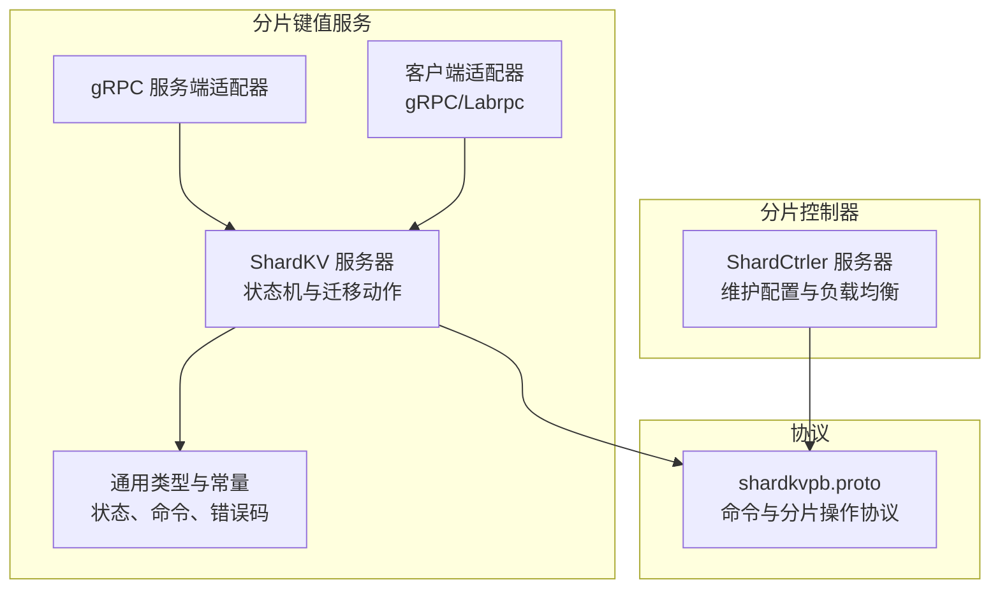
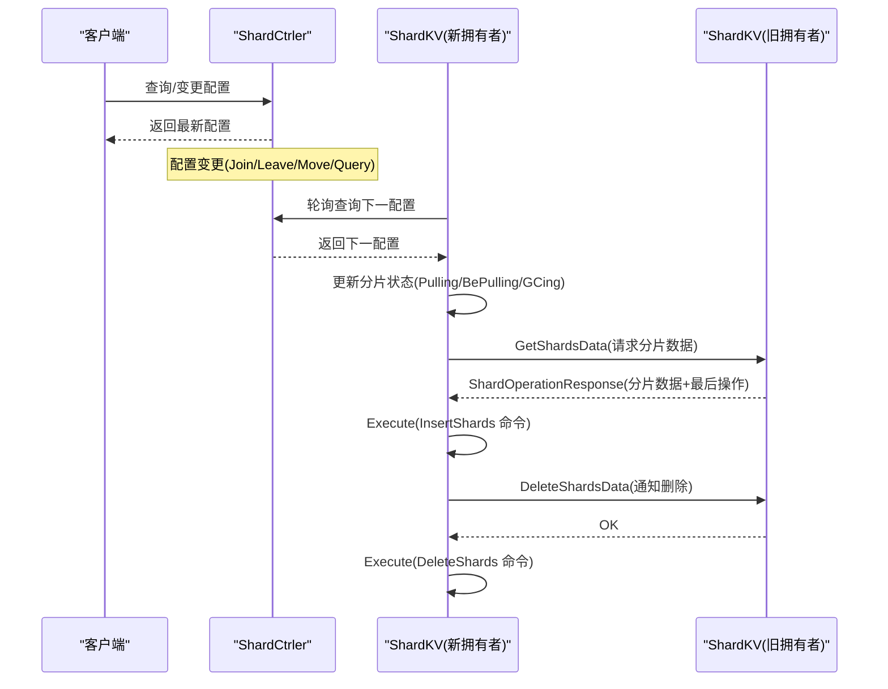
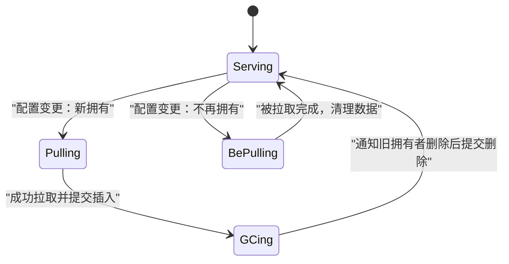
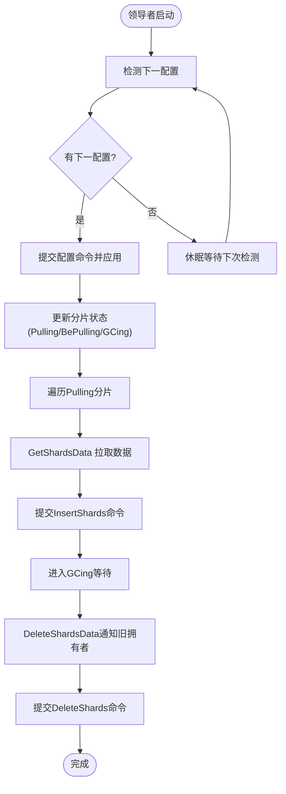
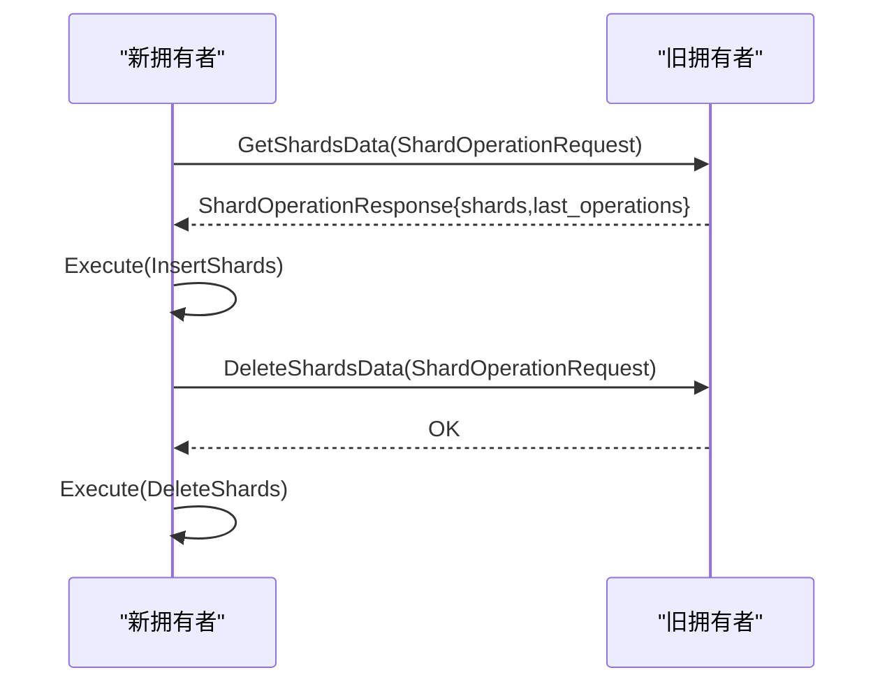
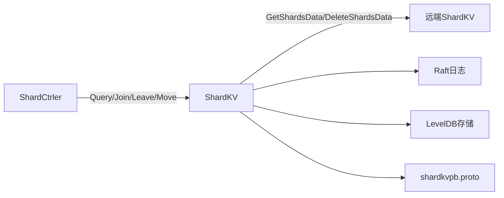

# 分片迁移机制

**本文引用的文件**
- [shardkv/server.go](file://shardkv/server.go)
- [shardkv/common.go](file://shardkv/common.go)
- [shardkv/grpc_server.go](file://shardkv/grpc_server.go)
- [shardkv/client.go](file://shardkv/client.go)
- [shardkv/shard.go](file://shardkv/shard.go)
- [shardctrler/server.go](file://shardctrler/server.go)
- [shardctrler/common.go](file://shardctrler/common.go)
- [shardctrler/configstm.go](file://shardctrler/configstm.go)
- [shardctrler/grpc_server.go](file://shardctrler/grpc_server.go)
- [shardkvpb/shardkv.proto](file://shardkvpb/shardkv.proto)
- [wiki/Sharding-Mechanism.md](file://wiki/Sharding-Mechanism.md)
- [README.md](file://README.md)
- [README_cn.md](file://README_cn.md)

## 目录
1. [引言](#引言)
2. [项目结构](#项目结构)
3. [核心组件](#核心组件)
4. [架构总览](#架构总览)
5. [详细组件分析](#详细组件分析)
6. [依赖分析](#依赖分析)
7. [性能考虑](#性能考虑)
8. [故障排查指南](#故障排查指南)
9. [结论](#结论)
10. [附录](#附录)

## 引言
本文件系统性阐述 eRaft 中的分片迁移机制，覆盖触发条件、状态转换、迁移流程控制、Pulling 与 BePulling 的区别、数据拉取与整合、GetShardsData 与 ShardOperationRequest 的实现细节、数据传输协议与完整性校验、超时与重试、冲突解决、性能监控与质量保障，以及一致性维护与故障恢复。

## 项目结构
- shardkv：分片键值服务，负责分片状态管理、迁移动作、日志应用与快照。
- shardctrler：分片控制器，维护配置（分片到组的映射），提供 Join/Leave/Move/Query。
- shardkvpb：gRPC 协议定义，包括命令、分片操作请求/响应等。
- wiki 与 README：提供高层设计说明与迁移流程概述。

图表来源
- [shardkv/server.go](file://shardkv/server.go#L760-L799)
- [shardctrler/server.go](file://shardctrler/server.go#L324-L343)
- [shardkvpb/shardkv.proto](file://shardkvpb/shardkv.proto#L60-L65)

章节来源
- [shardkv/server.go](file://shardkv/server.go#L760-L799)
- [shardctrler/server.go](file://shardctrler/server.go#L324-L343)
- [shardkvpb/shardkv.proto](file://shardkvpb/shardkv.proto#L1-L66)

## 核心组件
- 分片状态与迁移控制
  - 状态枚举：Serving、Pulling、BePulling、GCing。
  - 状态转换由配置变更驱动，由领导者周期性检测并执行迁移动作。
- 迁移动作
  - Pulling：从旧拥有者拉取分片数据，提交 InsertShards 命令并应用到本地存储。
  - GCing：通知旧拥有者删除已迁移的分片数据，提交 DeleteShards 命令清理本地状态。
  - BePulling：等待其他组完成对该分片的拉取，避免重复迁移。
- 数据传输与协议
  - GetShardsData：返回指定分片的数据与最后操作上下文，供插入到新组的日志。
  - DeleteShardsData：请求旧拥有者删除指定分片，用于 GC。
  - ShardOperationRequest/Response：承载迁移任务的请求与响应。
- 客户端与服务端适配
  - gRPC 与 Labrpc 双栈适配，支持不同运行环境。
- 配置管理
  - ShardCtrler 提供 Join/Leave/Move/Query，维护配置序列，驱动迁移。

章节来源
- [shardkv/common.go](file://shardkv/common.go#L70-L91)
- [shardkv/server.go](file://shardkv/server.go#L572-L643)
- [shardkv/server.go](file://shardkv/server.go#L645-L696)
- [shardkvpb/shardkv.proto](file://shardkvpb/shardkv.proto#L26-L45)
- [shardkv/grpc_server.go](file://shardkv/grpc_server.go#L34-L68)
- [shardkv/grpc_server.go](file://shardkv/grpc_server.go#L70-L84)
- [shardkv/client.go](file://shardkv/client.go#L52-L149)
- [shardctrler/server.go](file://shardctrler/server.go#L179-L215)
- [shardctrler/common.go](file://shardctrler/common.go#L31-L43)

## 架构总览
分片迁移在“配置变更 → 状态转换 → 拉取数据 → 插入日志 → 清理旧数据”的闭环中进行。ShardCtrler 负责产生新的配置，ShardKV 领导者根据配置变化调整本地分片状态并发起迁移。

图表来源
- [shardctrler/server.go](file://shardctrler/server.go#L179-L215)
- [shardkv/server.go](file://shardkv/server.go#L572-L643)
- [shardkv/server.go](file://shardkv/server.go#L645-L696)
- [shardkv/grpc_server.go](file://shardkv/grpc_server.go#L34-L68)
- [shardkv/grpc_server.go](file://shardkv/grpc_server.go#L70-L84)

章节来源
- [shardctrler/server.go](file://shardctrler/server.go#L179-L215)
- [shardkv/server.go](file://shardkv/server.go#L572-L643)
- [shardkv/server.go](file://shardkv/server.go#L645-L696)
- [shardkv/grpc_server.go](file://shardkv/grpc_server.go#L34-L68)
- [shardkv/grpc_server.go](file://shardkv/grpc_server.go#L70-L84)

## 详细组件分析

### 分片状态模型与转换
- 状态定义
  - Serving：当前拥有且可服务。
  - Pulling：新拥有者正在从旧拥有者拉取数据。
  - BePulling：当前组被其他组拉取，处于等待状态。
  - GCing：数据已迁移，等待通知旧拥有者删除。
- 状态转换逻辑
  - 配置更新时，若当前组从非拥有变为拥有，则置为 Pulling；若从拥有变为非拥有，则置为 BePulling；迁移完成后置为 GCing；GC 后置为 Serving。

图表来源
- [shardkv/server.go](file://shardkv/server.go#L430-L445)
- [shardkv/server.go](file://shardkv/server.go#L360-L383)
- [shardkv/server.go](file://shardkv/server.go#L385-L405)

章节来源
- [shardkv/common.go](file://shardkv/common.go#L70-L91)
- [shardkv/server.go](file://shardkv/server.go#L430-L445)
- [shardkv/server.go](file://shardkv/server.go#L360-L383)
- [shardkv/server.go](file://shardkv/server.go#L385-L405)

### 迁移触发与领导者检测
- 领导者周期性检查配置变更，当发现下一配置可用时，提交 Configuration 命令并应用，随后根据新配置更新分片状态。
- 迁移动作由独立监控 goroutine 触发，按间隔扫描处于 Pulling/BePulling/GCing 的分片并执行相应 RPC。

图表来源
- [shardkv/server.go](file://shardkv/server.go#L549-L570)
- [shardkv/server.go](file://shardkv/server.go#L572-L643)
- [shardkv/server.go](file://shardkv/server.go#L645-L696)

章节来源
- [shardkv/server.go](file://shardkv/server.go#L549-L570)
- [shardkv/server.go](file://shardkv/server.go#L572-L643)
- [shardkv/server.go](file://shardkv/server.go#L645-L696)

### Pulling 与 BePulling 的区别
- Pulling：新拥有者主动从旧拥有者拉取数据，期间不可对外提供服务（仅内部状态）。
- BePulling：当前组不再拥有某分片，但需要等待其他组完成对该分片的拉取，避免重复迁移与冲突。
- 实现要点：状态判断与过滤确保只对处于 Pulling 的分片发起拉取，对处于 BePulling 的分片不重复拉取。

章节来源
- [shardkv/server.go](file://shardkv/server.go#L430-L445)
- [shardkv/server.go](file://shardkv/server.go#L572-L643)

### 数据拉取过程与数据整合机制
- 拉取阶段
  - 新拥有者构造 ShardOperationRequest，向旧拥有者调用 GetShardsData。
  - 旧拥有者返回 ShardOperationResponse，包含分片数据与最后操作上下文。
- 整合阶段
  - 新拥有者将响应封装为 InsertShards 命令并通过 Raft 提交，applier 将数据写入本地存储并切换状态为 GCing。
  - 旧拥有者收到 DeleteShardsData 请求后，提交 DeleteShards 命令清理本地状态并切换回 Serving。

图表来源
- [shardkv/server.go](file://shardkv/server.go#L159-L193)
- [shardkv/server.go](file://shardkv/server.go#L195-L217)
- [shardkv/server.go](file://shardkv/server.go#L360-L383)
- [shardkv/server.go](file://shardkv/server.go#L385-L405)
- [shardkv/grpc_server.go](file://shardkv/grpc_server.go#L34-L68)
- [shardkv/grpc_server.go](file://shardkv/grpc_server.go#L70-L84)

章节来源
- [shardkv/server.go](file://shardkv/server.go#L159-L193)
- [shardkv/server.go](file://shardkv/server.go#L195-L217)
- [shardkv/server.go](file://shardkv/server.go#L360-L383)
- [shardkv/server.go](file://shardkv/server.go#L385-L405)
- [shardkv/grpc_server.go](file://shardkv/grpc_server.go#L34-L68)
- [shardkv/grpc_server.go](file://shardkv/grpc_server.go#L70-L84)

### GetShardsData 与 ShardOperationRequest 的实现细节
- GetShardsData
  - 仅领导者可处理，校验配置号，按请求的分片 ID 迭代存储读取数据，打包为 ShardOperationResponse 返回。
  - 同步返回最后操作上下文，确保幂等与去重。
- ShardOperationRequest/Response
  - 请求：包含配置号与分片 ID 列表。
  - 响应：包含分片数据映射与最后操作上下文映射，便于新拥有者在插入时合并状态。

章节来源
- [shardkv/server.go](file://shardkv/server.go#L159-L193)
- [shardkvpb/shardkv.proto](file://shardkvpb/shardkv.proto#L26-L45)
- [shardkv/grpc_server.go](file://shardkv/grpc_server.go#L34-L68)

### 数据传输协议与完整性校验
- 协议层
  - 使用 gRPC 服务 ShardKVService，提供 Command、GetShardsData、DeleteShardsData、GetStatus。
  - 请求/响应消息体严格对应 CommandRequest/Response 与 ShardOperationRequest/Response。
- 完整性与一致性
  - 通过 Raft 日志提交保证顺序与复制，插入与删除均作为独立命令提交，避免部分应用。
  - 最后操作上下文随迁移一起传递，确保新拥有者能正确去重后续重复请求。

章节来源
- [shardkvpb/shardkv.proto](file://shardkvpb/shardkv.proto#L60-L65)
- [shardkv/grpc_server.go](file://shardkv/grpc_server.go#L18-L32)
- [shardkv/grpc_server.go](file://shardkv/grpc_server.go#L34-L68)
- [shardkv/grpc_server.go](file://shardkv/grpc_server.go#L70-L84)

### 超时处理、失败重试与冲突解决
- 超时与重试
  - 客户端侧命令调用设置超时，领导者执行命令也设置超时，避免阻塞。
  - 迁移动作中对旧拥有者 RPC 失败采用遍历服务器列表重试，直至成功或耗尽。
- 冲突与重复
  - 通过分片状态机与配置号校验，拒绝过期配置与重复插入/删除。
  - 最后操作上下文确保幂等，避免重复应用导致的状态不一致。

章节来源
- [shardkv/common.go](file://shardkv/common.go#L21-L27)
- [shardkv/server.go](file://shardkv/server.go#L110-L127)
- [shardkv/server.go](file://shardkv/server.go#L572-L643)
- [shardkv/server.go](file://shardkv/server.go#L360-L383)
- [shardkv/server.go](file://shardkv/server.go#L385-L405)

### 性能监控、进度跟踪与质量保证
- 监控与心跳
  - 领导者周期性执行空日志追加以推进提交，避免活锁。
  - 提供 GetStatus 接口，返回节点 ID、状态、任期、最后应用索引、提交索引与存储大小。
- 进度跟踪
  - 通过分片状态数组与配置号，可统计各分片迁移进度（Pulling/GCing/Serving）。
- 质量保证
  - 快照与日志大小阈值控制，减少磁盘压力。
  - 一致性通过 Raft 与最后操作上下文双重保障。

章节来源
- [shardkv/server.go](file://shardkv/server.go#L718-L722)
- [shardkv/grpc_server.go](file://shardkv/grpc_server.go#L86-L97)
- [shardkv/server.go](file://shardkv/server.go#L463-L485)

### 数据一致性维护与故障恢复
- 一致性
  - 迁移以 Raft 命令形式提交，确保全组一致应用。
  - 最后操作上下文随迁移传递，保证后续请求幂等。
- 故障恢复
  - 快照包含分片状态、最后操作上下文、当前/上一配置，重启后恢复至一致状态。
  - 若迁移过程中发生故障，重启后继续执行未完成的迁移动作（基于状态与配置号）。

章节来源
- [shardkv/server.go](file://shardkv/server.go#L487-L516)
- [shardkv/server.go](file://shardkv/server.go#L248-L326)
- [shardkv/server.go](file://shardkv/server.go#L360-L383)
- [shardkv/server.go](file://shardkv/server.go#L385-L405)

## 依赖分析
- 组件耦合
  - ShardKV 依赖 Raft、ShardCtrler、gRPC/Labrpc、LevelDB。
  - ShardCtrler 依赖 Raft、LevelDB 配置状态机。
- 关键依赖链
  - 配置变更 → ShardKV 配置应用 → 状态更新 → 迁移动作 → 数据传输 → 日志提交 → 状态切换。

图表来源
- [shardctrler/server.go](file://shardctrler/server.go#L179-L215)
- [shardkv/server.go](file://shardkv/server.go#L572-L643)
- [shardkv/server.go](file://shardkv/server.go#L645-L696)
- [shardkvpb/shardkv.proto](file://shardkvpb/shardkv.proto#L60-L65)

章节来源
- [shardctrler/server.go](file://shardctrler/server.go#L179-L215)
- [shardkv/server.go](file://shardkv/server.go#L572-L643)
- [shardkv/server.go](file://shardkv/server.go#L645-L696)
- [shardkvpb/shardkv.proto](file://shardkvpb/shardkv.proto#L60-L65)

## 性能考虑
- 并发与吞吐
  - 执行命令时不持锁，提升吞吐；通知通道异步释放，降低内存占用。
- 存储与快照
  - 快照包含全部数据与状态，定期触发以压缩日志与释放空间。
- 网络与 RPC
  - 迁移 RPC 采用遍历服务器列表重试，提高鲁棒性；gRPC 与 Labrpc 双栈适配，满足不同部署需求。

章节来源
- [shardkv/server.go](file://shardkv/server.go#L129-L157)
- [shardkv/server.go](file://shardkv/server.go#L463-L485)
- [shardkv/client.go](file://shardkv/client.go#L219-L229)

## 故障排查指南
- 常见问题
  - ErrWrongGroup：客户端请求的分片不在当前组，需重新查询配置并重试。
  - ErrNotReady：当前配置号落后于请求，等待配置更新。
  - ErrOutDated：配置或迁移命令过期，忽略或重试。
  - ErrTimeout：命令执行或 RPC 调用超时，检查网络与领导者状态。
- 排查步骤
  - 查看 GetStatus 获取节点状态与存储大小。
  - 检查分片状态数组，定位处于 Pulling/GCing 的分片。
  - 校验配置号与分片映射，确认迁移是否按预期进行。

章节来源
- [shardkv/common.go](file://shardkv/common.go#L40-L68)
- [shardkv/grpc_server.go](file://shardkv/grpc_server.go#L86-L97)
- [shardkv/server.go](file://shardkv/server.go#L110-L127)
- [shardkv/server.go](file://shardkv/server.go#L169-L172)

## 结论
本机制通过配置驱动与领导者自治，实现了“无停服”的在线分片迁移。借助 Raft 保证一致性，通过最后操作上下文与状态机确保幂等与正确性。配合监控与快照，系统在高并发与复杂拓扑变化下仍能保持稳定与可维护性。

## 附录
- 迁移流程概览（来自文档）
  - 配置更新 → 变更检测 → 数据拉取（Pulling） → 数据整合（InsertShards） → 垃圾回收（GCing） → 删除（DeleteShards）

章节来源
- [README.md](file://README.md#L130-L139)
- [README_cn.md](file://README_cn.md#L130-L139)
- [wiki/Sharding-Mechanism.md](file://wiki/Sharding-Mechanism.md#L8-L14)